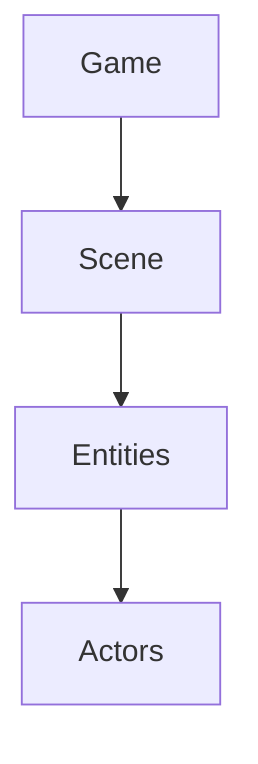

# PixelRoot32 Documentation

Professional-grade documentation for the PixelRoot32 Game Engine.

## Overview

This is a VitePress-powered documentation site for PixelRoot32, designed to match the quality and structure of modern engine documentation (Unity, Godot).

## File Structure

```
PixelRoot32-Docs/
├── .vitepress/
│   └── config.ts          # VitePress configuration
├── index.md               # Landing page
├── package.json           # Dependencies
├── README.md             # This file
├── guide/                # User guides
│   ├── getting-started.md
│   ├── core-concepts.md
│   ├── game-loop.md
│   ├── scenes.md
│   ├── entities-actors.md
│   ├── rendering.md
│   ├── physics.md
│   ├── audio.md
│   ├── input.md
│   ├── ui-system.md
│   └── memory.md
├── architecture/         # Architecture documentation
│   └── overview.md
├── api/                   # API reference
│   └── core/
│       ├── engine.md
│       └── scene.md
└── examples/             # Example projects
    └── basic-usage.md
```

## Quick Start

### Prerequisites

- Node.js 18+
- npm or yarn

### Installation

```bash
cd PixelRoot32-Docs
npm install
```

### Development Server

```bash
npm run docs:dev
```

The site will be available at `http://localhost:5173`

### Build for Production

```bash
npm run docs:build
```

Output will be in `.vitepress/dist/`

### Preview Production Build

```bash
npm run docs:preview
```

## Documentation Style Guide

### Writing Principles

1. **Be Direct**: Avoid "this project does X..." phrasing
2. **Explain Why**: Not just what, but why
3. **Use Examples**: Code snippets for every concept
4. **Stay Consistent**: Follow established patterns

### Code Examples

Use code blocks with language tags:

```cpp
// Good example with context
class Player : public physics::KinematicActor {
public:
    void update(unsigned long deltaTime) override {
        // Frame-rate independent movement
        position.x += velocity * deltaTime / 1000.0f;
    }
};
```

### Mermaid Diagrams

Use Mermaid for architecture diagrams:



## Contributing

When adding new documentation:

1. Update `.vitepress/config.ts` sidebar if adding new pages
2. Follow existing file organization
3. Use Mermaid diagrams for architecture
4. Include code examples
5. Test with `npm run docs:dev`

## Deployment

The documentation can be deployed to:
- GitHub Pages
- Netlify
- Vercel
- Any static hosting

Build command: `npm run docs:build`
Output directory: `.vitepress/dist`

## License

MIT License - See PixelRoot32 main repository

## Credits

- Documentation created following official engine documentation standards
- VitePress theme customized for PixelRoot32
- Mermaid diagrams for architecture visualization
