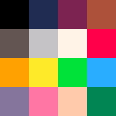
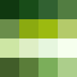
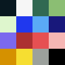
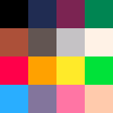

# Color

> **Source:** Ported from the [PixelRoot32 Game Engine](https://github.com/PixelRoot32-Game-Engine/PixelRoot32-Game-Engine) repository. Cross-links were adjusted for this site.

## Color

**Inherits:** None

The `Color` module manages the engine's color palettes and provides the `Color` enumeration for referencing colors within the active palette.

### PaletteType (Enum)

Each built-in palette has a **RGB565 swatch strip** in the site’s `palettes/` folder (same order as in-engine tables).

#### `PR32` (default)

The standard PixelRoot32 palette.

#### `NES`

Nintendo Entertainment System inspired palette.

#### `GB`

Game Boy inspired palette (4 greens).

#### `GBC`

Game Boy Color inspired palette.

#### `PICO8`

PICO-8 fantasy console palette.

### Public Methods

- **`static void setPalette(PaletteType type)`**
    Sets the active color palette for the engine (Single Palette Mode).

- **`static void setCustomPalette(const uint16_t* palette)`**
    Sets a custom color palette defined by the user.

- **`static void enableDualPaletteMode(bool enable)`**
    Enables or disables dual palette mode.

- **`static void setBackgroundPalette(PaletteType palette)`**
    Sets the background palette (for backgrounds, tilemaps, etc.).

- **`static void setSpritePalette(PaletteType palette)`**
    Sets the sprite palette (for sprites, characters, etc.).

- **`static void setDualPalette(PaletteType bgPalette, PaletteType spritePalette)`**
    Convenience function that sets both background and sprite palettes at once.

- **`static uint16_t resolveColor(Color color)`**
    Converts a `Color` enum value to its corresponding RGB565 `uint16_t` representation.

- **`static uint16_t resolveColor(Color color, PaletteContext context)`**
    Converts a `Color` enum value to RGB565 based on the context (dual palette mode).

### Color (Enum)

- `Black`, `White`, `LightGray`, `DarkGray`
- `Red`, `DarkRed`, `Green`, `DarkGreen`, `Blue`, `DarkBlue`
- `Yellow`, `Orange`, `Brown`
- `Purple`, `Pink`, `Cyan`
- `LightBlue`, `LightGreen`, `LightRed`
- `Navy`, `Teal`, `Olive`
- `Gold`, `Silver`
- `Transparent` (special value, not rendered)
- `DebugRed`, `DebugGreen`, `DebugBlue` (debug colors)

---
