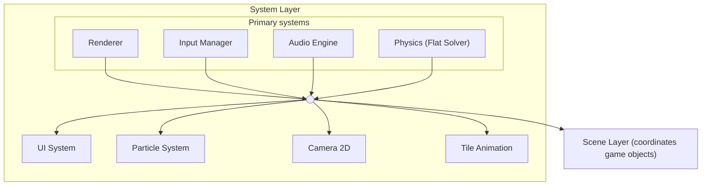
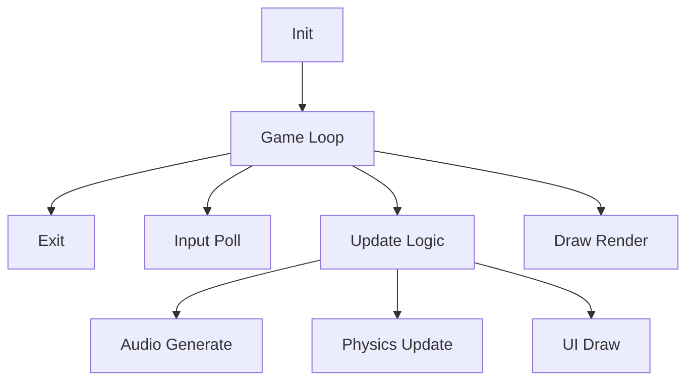
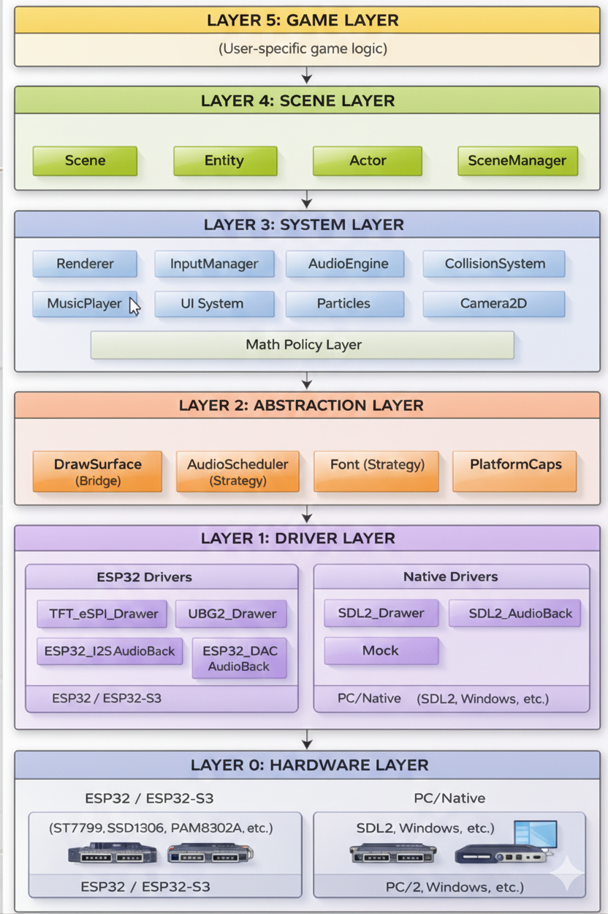
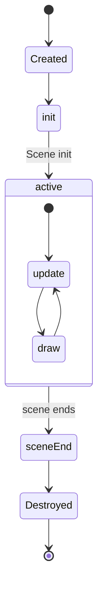

# Layer hierarchy

> **Source:** Ported from the [PixelRoot32 Game Engine](https://github.com/PixelRoot32-Game-Engine/PixelRoot32-Game-Engine) repository. Cross-links were adjusted for this site.

## Responsibility

Underlying physical hardware that the engine runs on.

---

## Components

### Microcontrollers

- **ESP32/ESP32-S3**: Main target microcontrollers
  - Dual-core Xtensa LX6 processors
  - Wi-Fi and Bluetooth connectivity
  - Various memory configurations (520KB SRAM on classic ESP32, 512KB on S3)
  
- **ESP32-C3**: RISC-V variant
  - Single-core RISC-V processor
  - No FPU (uses Fixed16 math)
  - 400KB SRAM

### Displays

| Display | Type | Resolution | Interface | Use Case |
|---------|------|------------|-----------|----------|
| ST7789 | TFT LCD | 240x240, 320x240 | SPI | Color games, high resolution |
| ST7735 | TFT LCD | 128x128, 160x128 | SPI | Smaller color displays |
| SSD1306 | OLED | 128x64, 128x32 | I2C/SPI | Monochrome, low power |
| SH1106 | OLED | 128x64 | I2C/SPI | Alternative monochrome |

### Audio Hardware

| Component | Type | Description |
|-----------|------|-------------|
| Internal DAC | 8-bit | ESP32 GPIO 25/26, PAM8302A amplifier |
| I2S + MAX98357A | Digital | High-quality audio, class D amp |
| I2S + PCM5102 | Digital | DAC for headphones/line out |

### Input

- **Physical Buttons**: Connected to GPIOs
  - Typical configurations: 4-directional + 2 action buttons
  - Direct GPIO polling with debouncing
  
- **Touch Controllers**:
  - XPT2046: Resistive touch (SPI)
  - GT911: Capacitive touch (I2C)

### PC/Native Platform

- **Simulation**: SDL2 on Windows/Linux/macOS
- **Purpose**: Rapid development without hardware
- **Features**: Full API compatibility, faster iteration

---

## Hardware Capabilities Detection

The engine uses `PlatformCapabilities` structure to detect hardware at runtime:

```cpp
struct PlatformCapabilities {
    bool hasDualCore;      // Multi-core support
    int audioCoreId;       // Recommended core for audio
    int mainCoreId;        // Recommended core for game loop
    bool hasFPU;           // Floating-point unit available
    size_t totalSRAM;      // Total SRAM available
};
```

---

## Memory Layout (ESP32)

```
──────────────────────────────────────
         DRAM (520KB)              
├─ .dram0.bss (static data)        
├─ Heap (dynamic allocations)      
└─ Stack                           
──────────────────────────────────────
         IRAM (128KB)              
└─ Instruction RAM (cached code)   
──────────────────────────────────────
         Flash (4MB+)              
└─ Program code and PROGMEM data   
──────────────────────────────────────
```

---

## Related Documentation

- [Driver Layer](/architecture/layers) - Hardware abstraction drivers
- [Abstraction Layer](/architecture/layers) - PlatformMemory and cross-platform abstractions
- [Memory System](/architecture/memory-system) - Memory management strategies
- [Platform Compatibility](/guide/platform-config) - Supported hardware matrix


---

## Responsibility

Platform-specific hardware abstraction that bridges the gap between hardware and the engine's abstract interfaces.

**Design Pattern**: Concrete implementation of abstractions defined in Layer 2.

---

## ESP32 Drivers

| Driver | File | Description |
|--------|------|-------------|
| `TFT_eSPI_Drawer` | `drivers/esp32/TFT_eSPI_Drawer.cpp` | TFT display driver (ST7789, ST7735, ILI9341) |
| `U8G2_Drawer` | `drivers/esp32/U8G2_Drawer.cpp` | Monochrome OLED driver (SSD1306, SH1106) |
| `ESP32_I2S_AudioBackend` | `drivers/esp32/ESP32_I2S_AudioBackend.cpp` | I2S audio backend for external DACs |
| `ESP32_DAC_AudioBackend` | `drivers/esp32/ESP32_DAC_AudioBackend.cpp` | Internal DAC audio backend |
| `ESP32AudioScheduler` | `audio/ESP32AudioScheduler.cpp` | Multi-core audio scheduler (FreeRTOS task) |

### TFT_eSPI Driver

The primary color display driver using the popular TFT_eSPI library.

**Features**:
- Hardware SPI communication
- DMA support for fast transfers
- Resolution scaling (nearest-neighbor)
- Double-buffering for smooth rendering

**Supported Displays**:
- ST7789 (240x240, 320x240)
- ST7735 (128x128, 160x128)
- ILI9341 (320x240)

### U8G2 Driver

Driver for monochrome OLED displays using the U8G2 library.

**Features**:
- I2C and SPI support
- 1MHz I2C bus overclocking for 60 FPS
- Page buffer mode for memory efficiency

**Supported Displays**:
- SSD1306 (128x64, 128x32)
- SH1106 (128x64)

### Audio Drivers

#### ESP32_I2S_AudioBackend

For high-quality audio with external DACs (MAX98357A, PCM5102).

```cpp
ESP32_I2S_AudioBackend audioBackend(26, 25, 22, 22050);
// BCLK=26, LRCK=25, DOUT=22, 22050Hz sample rate
```

**Features**:
- I2S peripheral with DMA
- Standard sample rates (11025, 22050, 44100 Hz)
- Pinned to Core 0 (separate from game loop)

#### ESP32_DAC_AudioBackend

For retro-style audio using the internal 8-bit DAC.

```cpp
ESP32_DAC_AudioBackend audioBackend(25, 11025);
// GPIO 25, 11025Hz for retro feel
```

**Features**:
- 8-bit resolution
- Software-based sample pushing
- 0.7x attenuation to prevent saturation

---

## Native (PC) Drivers

| Driver | File | Description |
|--------|------|-------------|
| `SDL2_Drawer` | `drivers/native/SDL2_Drawer.cpp` | SDL2 graphics simulation |
| `SDL2_AudioBackend` | `drivers/native/SDL2_AudioBackend.cpp` | SDL2 audio backend |
| `NativeAudioScheduler` | `audio/NativeAudioScheduler.cpp` | Native thread-based scheduler |
| `MockArduino` | `platforms/mock/MockArduino.cpp` | Arduino API emulation |

### SDL2_Drawer

Graphics driver for PC development using SDL2.

**Features**:
- Windowed and fullscreen modes
- Hardware acceleration via SDL2
- Mouse-to-touch event conversion (when touch enabled)
- Pixel-perfect scaling options

### SDL2_AudioBackend

Audio driver using SDL2's audio subsystem.

**Features**:
- Standard audio device access
- Callback-based sample generation
- Thread-safe command queue

### NativeAudioScheduler

Thread-based audio scheduling for PC platforms.

**Features**:
- Dedicated high-priority thread
- Sample-accurate timing
- Lock-free command queue

---

## Driver Selection

Drivers are selected at compile-time via build flags:

```ini
# platformio.ini

# Use TFT_eSPI (default)
build_flags = -D PIXELROOT32_USE_TFT_ESPI_DRIVER

# Use U8G2 for OLED
build_flags = -D PIXELROOT32_USE_U8G2

# Custom display
custom_display = new MyCustomDriver()
```

---

## Creating Custom Drivers

See [Extending PixelRoot32](/guide/extending) for detailed instructions on creating custom display and audio drivers.

Quick overview:

```cpp
#include <graphics/BaseDrawSurface.h>

class MyCustomDriver : public pixelroot32::graphics::BaseDrawSurface {
public:
    void init() override;
    void drawPixel(int x, int y, uint16_t color) override;
    void clearBuffer() override;
    void sendBuffer() override;
};
```

---

## Related Documentation

- [Abstraction Layer](/architecture/layers) - Interfaces these drivers implement
- [Hardware Layer](/architecture/layers) - Physical hardware details
- [System Layer](/architecture/layers) - High-level systems that use these drivers
- [Extending PixelRoot32](/guide/extending) - How to create custom drivers


---

## Responsibility

Abstract interfaces that decouple subsystems from concrete implementations, enabling portability and testability.

**Design Patterns**:
- **Bridge Pattern**: `DrawSurface` decouples Renderer from specific drivers
- **Strategy Pattern**: `AudioScheduler` allows different scheduling implementations

---

## Main Components

### PlatformMemory.h (Macro Abstraction)

Provides a unified API for memory operations that differ between ESP32 (Flash/PROGMEM) and Native (RAM) platforms.

| Macro | Description | ESP32 Mapping | Native Mapping |
|-------|-------------|---------------|----------------|
| `PIXELROOT32_FLASH_ATTR` | Store data in Flash | `PROGMEM` | (empty) |
| `PIXELROOT32_STRCMP_P` | Compare with Flash string | `strcmp_P` | `strcmp` |
| `PIXELROOT32_MEMCPY_P` | Copy from Flash | `memcpy_P` | `memcpy` |
| `PIXELROOT32_READ_BYTE_P` | Read 8-bit from Flash | `pgm_read_byte` | direct access |
| `PIXELROOT32_READ_WORD_P` | Read 16-bit from Flash | `pgm_read_word` | direct access |
| `PIXELROOT32_READ_DWORD_P` | Read 32-bit from Flash | `pgm_read_dword` | direct access |
| `PIXELROOT32_READ_FLOAT_P` | Read float from Flash | `pgm_read_float` | direct access |

**Usage Example**:

```cpp
#include "platforms/PlatformMemory.h"

// Store data in Flash
const char message[] PIXELROOT32_FLASH_ATTR = "Hello";

// Compare with Flash string
if (PIXELROOT32_STRCMP_P("lava", type) == 0) {
    // Handle lava tile
}
```

---

### DrawSurface (Bridge Pattern)

Abstract base class that decouples the Renderer from specific display drivers.

```cpp
class DrawSurface {
public:
    virtual void init() = 0;
    virtual void drawPixel(int x, int y, uint16_t color) = 0;
    virtual void drawLine(int x1, int y1, int x2, int y2, uint16_t color) = 0;
    virtual void drawFilledRectangle(int x, int y, int w, int h, uint16_t color) = 0;
    virtual void clearBuffer() = 0;
    virtual void sendBuffer() = 0;
    virtual void setOffset(int x, int y) {}
    virtual void setRotation(uint8_t rotation) {}
};
```

**Implementations**:
- `TFT_eSPI_Drawer` - ESP32 color displays
- `U8G2_Drawer` - ESP32 monochrome displays
- `SDL2_Drawer` - PC simulation

---

### AudioScheduler (Strategy Pattern)

Abstract scheduler for platform-specific audio timing.

```cpp
class AudioScheduler {
public:
    virtual void init() = 0;
    virtual void submitCommand(const AudioCommand& cmd) = 0;
    virtual void generateSamples(int16_t* stream, int length) = 0;
    virtual void start() = 0;
    virtual void stop() = 0;
};
```

**Implementations**:
- `ESP32AudioScheduler` - FreeRTOS task on Core 0
- `NativeAudioScheduler` - POSIX thread (PC)

---

### PlatformCapabilities

Structure that detects and exposes hardware capabilities at runtime.

```cpp
namespace pixelroot32::platforms {
    struct PlatformCapabilities {
        bool hasDualCore;       // Multi-core support (ESP32, ESP32-S3)
        int audioCoreId;        // Recommended core for audio (0 on ESP32)
        int mainCoreId;         // Recommended core for game loop (1 on ESP32)
        bool hasFPU;            // Floating-point unit available
        size_t totalSRAM;       // Total SRAM available
        bool hasPSRAM;          // External SPI RAM available (S3)
    };
}
```

**Usage**:

```cpp
auto caps = pixelroot32::platforms::detectCapabilities();
if (caps.hasDualCore) {
    // Use dual-core audio scheduling
}
```

---

### Math System (Scalar Abstraction)

**Files**: `include/math/Scalar.h`, `include/math/Fixed16.h`, `include/math/MathUtil.h`

Provides deterministic, platform-optimized numerical operations.

**Features**:

- **Hardware Adaptation**: Automatically switches between `float` and `Fixed16` based on FPU presence (ESP32-S3 vs ESP32-C3)
- **16.16 Fixed Point**: Optimized `Fixed16` implementation for RISC-V targets (C3/C6)
- **Generic Math API**: Single API for `sin`, `cos`, `sqrt`, `atan2` that resolves to most efficient implementation per platform
- **Stable Rounding**: Explicit `roundToInt`, `floorToInt`, `ceilToInt` to avoid floating-point truncation artifacts

```cpp
using Scalar = pixelroot32::math::Scalar;  // float or Fixed16

Scalar angle = MathUtil::atan2(dy, dx);
Scalar distance = MathUtil::sqrt(dx*dx + dy*dy);
int pixelX = MathUtil::roundToInt(cameraX + offset);
```

---

### Unified Logging System

**Files**: `include/core/Log.h`, `src/platforms/PlatformLog.cpp`

Cross-platform logging abstraction that eliminates `#ifdef` blocks in user code.

**Features**:
- Unified API for ESP32 (Serial) and Native (stdout)
- Log levels: Info, Profiling, Warning, Error
- printf-style formatting
- Automatic platform routing
- **Zero overhead when disabled**: Double-layer conditional compilation

**Architecture - Double-Layer Conditional Compilation**:

```
PIXELROOT32_DEBUG_MODE defined:
    log() → format with va_list → platformPrint() → Serial/stdout

PIXELROOT32_DEBUG_MODE not defined:
    log() → (void)level; (void)fmt; → no-op
```

**Main API**:

```cpp
namespace pixelroot32::core::logging {
    enum class LogLevel { Info, Profiling, Warning, Error };
    void log(LogLevel level, const char* format, ...);
    void log(const char* format, ...); // Info level shorthand
}

// Enable in platformio.ini:
// build_flags = -DPIXELROOT32_DEBUG_MODE
```

**Platform Output**:
- ESP32: Routes to `Serial.print()`
- Native: Routes to `printf()` with `fflush(stdout)`

---

## Abstraction Benefits

1. **Portability**: Same game code runs on ESP32 and PC
2. **Testability**: Mock implementations for unit testing
3. **Flexibility**: Swap implementations without changing game code
4. **Maintainability**: Changes isolated to specific layers

---

## Related Documentation

- [API Reference - Math Module](/api/math/scalar) - Scalar and math utilities
- [API Reference - Platform](/api/platform/platform-capabilities) - Platform abstractions
- [Memory System](/architecture/memory-system) - Memory management details
- [Hardware Layer](/architecture/layers) - Physical hardware
- [Driver Layer](/architecture/layers) - Concrete implementations


---

## Responsibility

Game engine subsystems that implement high-level functionality. These systems provide the core capabilities that game code builds upon.

---

## Subsystem Overview

The System Layer contains the following major subsystems:

| Subsystem | Responsibility | Detailed Document |
|-----------|--------------|-------------------|
| **Renderer** | Graphics rendering, sprites, tilemaps | See API Reference |
| **InputManager** | Button and touch input handling | [Touch Input](/architecture/ARCH_TOUCH_INPUT) |
| **AudioEngine** | NES-style 4-channel audio | [Audio Subsystem](/architecture/audio-architecture) |
| **CollisionSystem** | Physics simulation, collisions | [Physics Subsystem](/architecture/physics-system) |
| **UI System** | User interface and layouts | See API Reference |
| **Particle System** | Visual effects and particles | See API Reference |
| **Camera2D** | Viewport transformations | See API Reference |
| **Tile Animation** | Animated tilemaps | [Tile Animation](/architecture/ARCH_TILE_ANIMATION) |
| **Resolution Scaling** | Logical vs physical resolution | [Resolution Scaling](/architecture/ARCH_RESOLUTION_SCALING) |

---

## System Architecture Diagram



---

## Renderer

**Files**: `include/graphics/Renderer.h`, `src/graphics/Renderer.cpp`

High-level rendering system that abstracts graphics operations.

### Features

- Logical resolution independent of physical resolution
- Support for 1bpp, 2bpp, 4bpp sprites
- Sprite animation system
- Tilemaps with viewport culling
- Multi-palette tilemaps (2bpp/4bpp)
- Multi-palette sprites (2bpp/4bpp)
- Native bitmap font system
- Render contexts for dual palettes

### Multi-Palette Sprites Architecture

The engine supports multiple palettes for 2bpp/4bpp sprites through a sprite palette slot bank.

**Data Flow**:
```
sprite.paletteSlot → getSpritePaletteSlot() → resolveColorWithPalette() → drawSpriteInternal
```

**API Example**:
```cpp
class Renderer {
    void beginFrame();
    void endFrame();
    void drawSprite(const Sprite& sprite, int x, int y, Color color);
    void drawText(std::string_view text, int x, int y, Color color, uint8_t size);
    void drawTileMap(const TileMap& map, int originX, int originY);
};
```

---

## InputManager

**Files**: `include/input/InputManager.h`, `src/input/InputManager.cpp`

Input management from physical buttons or keyboard (PC), plus optional touch event routing.

### Features

- Debouncing support
- States: Pressed, Released, Down, Clicked
- Configurable via `InputConfig`
- Hardware abstraction through polling
- **Touch event dispatcher** (when `PIXELROOT32_ENABLE_TOUCH=1`)

### Button States

| Method | Description |
|--------|-------------|
| `isButtonPressed()` | UP → DOWN transition |
| `isButtonReleased()` | DOWN → UP transition |
| `isButtonDown()` | Current DOWN state |
| `isButtonClicked()` | Complete click detected |

**Touch input** is covered in detail in [Touch Input Architecture](/architecture/ARCH_TOUCH_INPUT).

---

## AudioEngine

**Files**: `include/audio/AudioEngine.h`, `src/audio/AudioEngine.cpp`

NES-style 4-channel audio system. See [Audio Subsystem Reference](/architecture/audio-architecture) for complete details.

**Quick Overview**:
- 2 PULSE channels (square wave)
- 1 TRIANGLE channel
- 1 NOISE channel
- Sample-accurate timing via AudioScheduler
- Modular compilation: `PIXELROOT32_ENABLE_AUDIO`

---

## CollisionSystem (Flat Solver)

**Files**: `include/physics/CollisionSystem.h`, `src/physics/CollisionSystem.cpp`

High-performance physics solver optimized for ESP32 microcontrollers.

**Simulation Pipeline**:
```
1. Detect Collisions    → Dual-layer spatial grid
2. Solve Velocity       → Impulse-based response
3. Integrate Positions  → p = p + v * dt
4. Solve Penetration  → Baumgarte stabilization
5. Trigger Callbacks    → onCollision notifications
```

See [Physics System Reference](/architecture/physics-system) for complete details.

---

## UI System

**Files**: `include/graphics/ui/*.h`, `src/graphics/ui/*.cpp`

User interface system with automatic layouts.

### Class Hierarchy

```
Entity
├── UIElement
│   ├── UILabel
│   ├── UIButton
│   ├── UICheckbox
│   └── UIPanel
│       └── UILayout
│           ├── UIHorizontalLayout
│           ├── UIVerticalLayout
│           ├── UIGridLayout
│           ├── UIAnchorLayout
│           └── UIPaddingContainer
└── UITouchElement
    ├── UITouchButton
    ├── UITouchSlider
    └── UITouchCheckbox
```

### Touch Widget Architecture

- **UITouchWidget**: Lightweight widget data struct
- **UITouchElement**: Abstract base with widget data
- **UIManager**: Non-owning registry (max 16 elements)

Scene owns widgets; UIManager only routes events.

---

## Particle System

**Files**: `include/graphics/particles/*.h`, `src/graphics/particles/*.cpp`

Visual effects system with configurable emitters.

**Components**:
- `Particle`: Individual particle with position, velocity, life
- `ParticleEmitter`: Configurable emitter with presets
- `ParticleConfig`: Emission configuration

Modular compilation: `PIXELROOT32_ENABLE_PARTICLES`

---

## Camera2D

**Files**: `include/graphics/Camera2D.h`, `src/graphics/Camera2D.cpp`

2D camera with viewport transformations.

**Features**:
- Position and zoom control
- Automatic offset for Renderer
- Support for fixed-position UI elements
- Stable rounding to prevent jitter

---

## Tilemap rendering

**Files**: `include/graphics/Renderer.h`, `src/graphics/Renderer.cpp`, `include/graphics/TileAnimation.h`

`Renderer::drawTileMap` performs **viewport culling** (only tiles that can intersect the logical framebuffer), optional **`TileAnimationManager::resolveFrame`**, optional **runtime tile masks** and **per-cell background palettes** on 2bpp/4bpp maps, then rasterizes each visible tile (ESP32: hot paths use `IRAM_ATTR` where applicable).

For largely static **4bpp** layers when **`DrawSurface::getSpriteBuffer()`** is available, use **`StaticTilemapLayerCache`** and **`PIXELROOT32_ENABLE_STATIC_TILEMAP_FB_CACHE`** (see Graphics API and architecture docs).

See [Tile Animation](/architecture/ARCH_TILE_ANIMATION) for the animation system.

---

## Subsystem Modular Compilation

| Subsystem | Flag | Default |
|-----------|------|---------|
| Audio | `PIXELROOT32_ENABLE_AUDIO` | Enabled |
| Physics | `PIXELROOT32_ENABLE_PHYSICS` | Enabled |
| UI System | `PIXELROOT32_ENABLE_UI_SYSTEM` | Enabled |
| Particles | `PIXELROOT32_ENABLE_PARTICLES` | Enabled |
| Touch Input | `PIXELROOT32_ENABLE_TOUCH` | Disabled |
| Tile Animations | `PIXELROOT32_ENABLE_TILE_ANIMATIONS` | Enabled |
| Static tilemap framebuffer cache (4bpp) | `PIXELROOT32_ENABLE_STATIC_TILEMAP_FB_CACHE` | Enabled (`PlatformDefaults.h`) |

---

## Data Flow

### Game Loop Flow



### Audio Flow

```
Game Code
    │
    ▼ (submitCommand)
AudioCommandQueue (Thread-Safe)
    │
    ▼ (processCommands)
AudioScheduler
    │
    ├──▶ Pulse Channel
    ├──▶ Triangle Channel
    ├──▶ Noise Channel
    └──▶ Music Sequencer
    │
    ▼ (generateSamples)
Mixer (with LUT)
    │
    ▼
AudioBackend
    ├──▶ ESP32_I2S_AudioBackend
    ├──▶ ESP32_DAC_AudioBackend
    └──▶ SDL2_AudioBackend
```

---

## Related Documentation

| Subsystem | Document |
|-----------|----------|
| Audio | [Audio Subsystem](/architecture/audio-architecture) |
| Physics | [Physics Subsystem](/architecture/physics-system) |
| Touch Input | [Touch Input](/architecture/ARCH_TOUCH_INPUT) |
| Tile Animation | [Tile Animation](/architecture/ARCH_TILE_ANIMATION) |
| Resolution Scaling | [Resolution Scaling](/architecture/ARCH_RESOLUTION_SCALING) |
| Memory | [Memory System](/architecture/memory-system) |

**API Reference**: See `docs/api/API_*.md` for class-level documentation.


---

## Responsibility

Game scene and entity management. This layer provides the organizational structure for game objects and their lifecycle.

---

## Components

### Engine

**Files**: `include/core/Engine.h`, `src/core/Engine.cpp`

Central class that orchestrates all subsystems.

**Responsibilities**:
- Manages Renderer, SceneManager, InputManager, AudioEngine, MusicPlayer
- Runs the main game loop
- Provides automatic touch processing (when enabled)

**Game Loop**:

```cpp
void Engine::run() {
    while (true) {
        // 1. Calculate delta time
        deltaTime = currentMillis - previousMillis;
        
        // 2. Update
        update();
        
        // 3. Draw
        draw();
    }
}

void Engine::update() {
    inputManager.update(deltaTime);
    sceneManager.update(deltaTime);
    // Note: AudioEngine runs on separate thread/core
}

void Engine::draw() {
    renderer.beginFrame();
    sceneManager.draw(renderer);
    renderer.endFrame();
}
```

**Touch Integration** (`PIXELROOT32_ENABLE_TOUCH=1`):
- `getTouchDispatcher()`: Access touch event dispatcher
- `hasTouchEvents()`: Check for pending events
- `setTouchManager()`: Register external TouchManager for auto-processing

When `setTouchManager()` is called, Engine automatically:
1. Polls `touchManager->getTouchPoints()` each frame
2. Detects touch releases (count >0 → 0)
3. Processes through `TouchEventDispatcher`
4. Dispatches to `Scene::processTouchEvents()`

See [Touch Input Architecture](/architecture/ARCH_TOUCH_INPUT) for details.

---

### SceneManager

**Files**: `include/core/SceneManager.h`, `src/core/SceneManager.cpp`

Scene stack management (push/pop operations).

**Operations**:

| Method | Description |
|--------|-------------|
| `setCurrentScene()` | Replace current scene |
| `pushScene()` | Push new scene (pauses previous) |
| `popScene()` | Pop scene (resumes previous) |

**Scene Stack**:

```cpp
Scene* sceneStack[MaxScenes];  // Default: 8 scenes
int sceneCount;
```

Useful for:
- Pause menus (push pause scene over game scene)
- Settings screens
- Dialog overlays

---

### Scene

**Files**: `include/core/Scene.h`, `src/core/Scene.cpp`

Entity container representing a level or screen.

**Memory Model**: Non-owning

The Scene follows a **non-owning** model for entities. When you call `addEntity(Entity*)`, the scene stores a reference but **does not take ownership**.

```cpp
// Scene does NOT delete entities
// You are responsible for lifetime (typically std::unique_ptr)

class GameScene : public Scene {
    std::unique_ptr<Player> player;  // You own it
    
public:
    void init() override {
        player = std::make_unique<Player>(100, 100, 16, 16);
        addEntity(player.get());  // Scene gets non-owning pointer
    }
};
```

**Features**:
- Entity array (`MAX_ENTITIES = 32` default)
- Render layer system (`MAX_LAYERS = 3` default)
- Integrated `CollisionSystem`
- Viewport culling
- Optional `SceneArena` for custom allocators

**Lifecycle**:

```cpp
virtual void init();                    // Called when entering scene
virtual void update(unsigned long dt);  // Every frame
virtual void draw(Renderer& r);         // Every frame
virtual void processTouchEvents(const TouchEvent* events, uint8_t count);
virtual void onUnconsumedTouchEvent(const TouchEvent& event);
```

---

### Entity

**Files**: `include/core/Entity.h`

Abstract base class for all game objects.

**Properties**:

| Property | Type | Description |
|----------|------|-------------|
| `x`, `y` | `float` | Position |
| `width`, `height` | `int` | Dimensions |
| `type` | `EntityType` | GENERIC, ACTOR, UI_ELEMENT |
| `renderLayer` | `uint8_t` | Render layer (0-255) |
| `isVisible` | `bool` | Visibility control |
| `isEnabled` | `bool` | Update control |

**Virtual Methods**:

```cpp
virtual void update(unsigned long deltaTime) = 0;
virtual void draw(Renderer& renderer) = 0;
```

---

## Actor / PhysicsActor Hierarchy

Following the Godot Engine philosophy, physical actors are specialized into distinct types based on their movement requirements.

### Hierarchy Diagram

```
Entity
└── Actor
    └── PhysicsActor (Base)
        ├── StaticActor    (Immovable walls/floors)
        │   └── SensorActor (Trigger zones)
        ├── KinematicActor (Player-controlled)
        └── RigidActor     (Physics-simulated props)
```

### Actor Types

| Type | Movement | Collision Layer | Use Case |
|------|----------|-----------------|----------|
| **StaticActor** | None | Static grid | Walls, floors, platforms |
| **SensorActor** | None | Static grid | Collectibles, triggers |
| **KinematicActor** | Code-driven | Dynamic grid | Player, enemies, moving platforms |
| **RigidActor** | Physics-simulated | Dynamic grid | Props, debris, projectiles |

### Common Features

All PhysicsActor types support:

- `setShape(CollisionShape::AABB/CIRCLE)` - Hitbox shape
- `setCollisionLayer(mask)` - Layer membership
- `setCollisionMask(mask)` - Layers to collide with
- `setSensor(true/false)` - Trigger mode (no collision response)
- `setOneWay(true/false)` - One-way platform mode
- `onCollision(Actor* other)` - Notification callback

### Actor Example

```cpp
class Player : public KinematicActor {
public:
    void update(unsigned long dt) override {
        // Movement logic
        if (engine.getInputManager().isButtonPressed(BTN_A)) {
            velocity.y = -jumpForce;
        }
        
        // Move with collision
        moveAndSlide();
    }
    
    void draw(Renderer& r) override {
        r.drawSprite(playerSprite, x, y, Color::White);
    }
    
    void onCollision(Actor* other) override {
        if (other->isInLayer(Layers::kEnemy)) {
            takeDamage();
        }
    }
};
```

---

## Game Layer



**Responsibility**: Game-specific code implemented by the user.

This is where you implement your game logic using the engine's architecture.

### Typical Implementation

```cpp
class GameScene : public Scene {
    std::unique_ptr<Player> player;
    std::vector<std::unique_ptr<Enemy>> enemies;
    std::unique_ptr<TileMap> background;

public:
    void init() override {
        // Create player
        player = std::make_unique<Player>(100, 100, 16, 16);
        addEntity(player.get());
        
        // Create enemies
        for (int i = 0; i < 5; i++) {
            auto enemy = std::make_unique<Enemy>(...);
            enemies.push_back(std::move(enemy));
            addEntity(enemies.back().get());
        }
        
        // Start music
        engine.getMusicPlayer().play(backgroundMusic);
    }
    
    void update(unsigned long dt) override {
        // Scene-level update logic
        Scene::update(dt);  // Updates all entities
    }
    
    void draw(Renderer& r) override {
        // Draw background
        r.drawTileMap(*background, 0, 0);
        
        // Draw entities
        Scene::draw(r);
    }
};
```

---

## Entity Lifecycle



---

## Memory Considerations

| Component | Default Size | Configurable |
|-----------|--------------|--------------|
| Max Entities per Scene | 32 | `MAX_ENTITIES` |
| Max Render Layers | 3 | `MAX_LAYERS` |
| Max Scene Stack | 8 | `MaxScenes` |
| Physics Contacts | 128 | `PHYSICS_MAX_CONTACTS` |

See [Memory System](/architecture/memory-system) for optimization strategies.

---

## Related Documentation

- [Physics Subsystem](/architecture/physics-system) - Actor physics details
- [Touch Input](/architecture/ARCH_TOUCH_INPUT) - Scene touch handling
- [Memory System](/architecture/memory-system) - Entity memory management
- [API Reference - Core](/api/core/engine) - Class-level API
