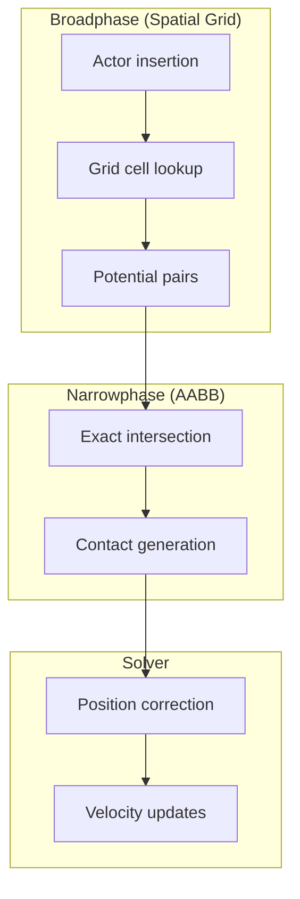
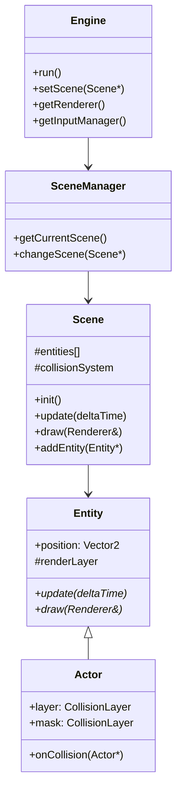
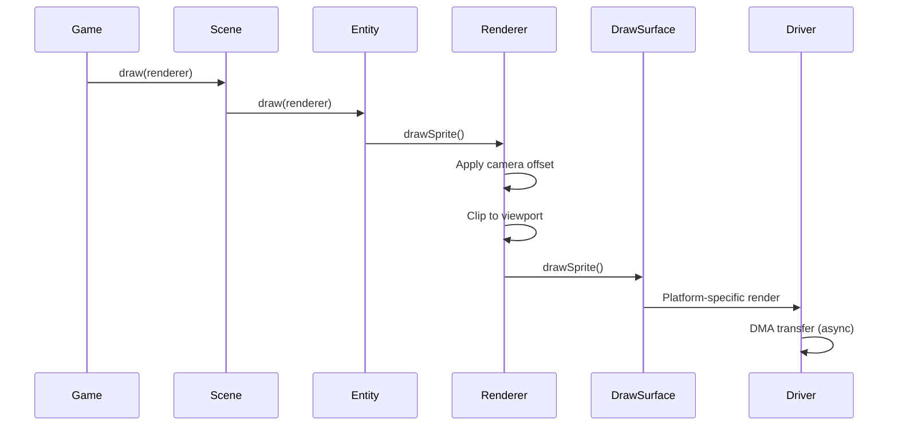
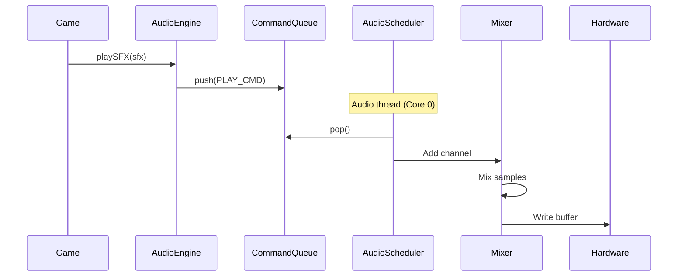

# Architecture Overview

> **See also:** [Layer hierarchy](/architecture/layers), [Modules](/architecture/modules), [Memory system](/architecture/memory-system)

PixelRoot32 is architected as a layered system, abstracting hardware specifics while providing high-level game development patterns. Understanding these layers helps you extend the engine and debug issues effectively.

## Layer Hierarchy

The engine is organized into five distinct layers, from hardware to game code. A visual stack diagram lives in the [Layer hierarchy](/architecture/layers) page and in the Mermaid diagram below.

## Design Philosophy

### Modularity Through Compilation

Unlike monolithic engines, PixelRoot32 uses **compile-time modularity**:

```cpp
// Only include what you need
#define PIXELROOT32_ENABLE_AUDIO 1
#define PIXELROOT32_ENABLE_PHYSICS 1
#define PIXELROOT32_ENABLE_UI_SYSTEM 1
#define PIXELROOT32_ENABLE_TOUCH 0  // Disabled - saves ~200 bytes
```

Unused subsystems are completely excluded from the binary, not just disabled at runtime.

### Abstraction Without Overhead

The engine uses template-based abstraction and the **Bridge Pattern** to eliminate virtual call overhead on hot paths:

```cpp
// DrawSurface is a pure interface
template<typename Implementation>
class DrawSurfaceImpl : public DrawSurface {
    Implementation impl;
public:
    void drawPixel(int x, int y, Color c) override {
        impl.drawPixel(x, y, c);  // Inlined, no vtable lookup
    }
};
```

### Embedded-First Design

Every decision considers ESP32 constraints:

| Resource | Constraint | Solution |
|----------|-----------|----------|
| RAM (520KB) | Limited | Logical/physical resolution decoupling |
| Flash (4MB+) | Slow access | `IRAM_ATTR` for critical code |
| CPU (240MHz) | Single-core game loop | DMA for rendering, multi-core audio |
| No FPU (C3) | Software float slow | Fixed-point `Scalar` abstraction |

## Layer Deep Dive

### Layer 0: Hardware

The foundation—ESP32 variants and peripherals.

| Component | ESP32 | ESP32-S3 | ESP32-C3 | ESP32-C6 |
|-----------|-------|----------|----------|----------|
| CPU | Xtensa LX6 | Xtensa LX7 | RISC-V | RISC-V |
| FPU | Yes | Yes | No | No |
| Recommended Math | float | float | Fixed16 | Fixed16 |
| Audio DAC | ✅ GPIO 25/26 | ❌ | ❌ | ❌ |
| Audio I2S | ✅ | ✅ | ✅ | ✅ |

### Layer 1: Drivers

Hardware-specific implementations:

```cpp
// TFT_eSPI_Drawer for color LCDs
class TFT_eSPI_Drawer : public DrawSurface {
    TFT_eSPI* tft;
    uint8_t* dmaBuffer;
    
    void present() override {
        // DMA-accelerated transfer
        tft->pushImageDMA(...);
    }
};

// U8G2_Drawer for monochrome OLEDs
class U8G2_Drawer : public DrawSurface {
    U8G2* u8g2;
    
    void drawSprite(const Sprite& s, int x, int y, Color c) override {
        // XBM format for zero-copy rendering
        u8g2->drawXBM(x, y, s.width, s.height, 
                      reinterpret_cast<const uint8_t*>(s.data));
    }
};

// SDL2_Drawer for PC simulation
class SDL2_Drawer : public DrawSurface {
    SDL_Renderer* renderer;
    SDL_Texture* frameTexture;
    
    void present() override {
        SDL_UpdateTexture(frameTexture, ...);
        SDL_RenderCopy(renderer, frameTexture, NULL, NULL);
        SDL_RenderPresent(renderer);
    }
};
```

### Layer 2: Abstraction

Platform-agnostic interfaces:

#### DrawSurface (Bridge Pattern)

```cpp
class DrawSurface {
public:
    virtual void drawPixel(int x, int y, Color c) = 0;
    virtual void drawSprite(const Sprite& s, int x, int y, Color c) = 0;
    virtual void present() = 0;
    
    // Resolution scaling support
    virtual void setLogicalSize(int w, int h) = 0;
    virtual void* getSpriteBuffer() = 0;  // For direct buffer access
};
```

#### AudioScheduler (Strategy Pattern)

```cpp
class AudioScheduler {
public:
    virtual void start() = 0;
    virtual void stop() = 0;
    virtual void submitCommand(const AudioCommand& cmd) = 0;
    
    // Platform-specific implementations:
    // - ESP32: FreeRTOS task on Core 0
    // - Native: SDL audio callback thread
};
```

#### Math System (Scalar Abstraction)

```cpp
// Automatically selects float or Fixed16
#if defined(SOC_CPU_HAS_FPU)
    using Scalar = float;
#else
    using Scalar = Fixed16;  // Q16.16 fixed-point
#endif

template<typename T>
T toScalar(T value) { return value; }
```

### Layer 3: Systems

High-level subsystems that form the engine's capabilities.

#### Rendering Pipeline


**Renderer responsibilities:**
- Viewport and camera management
- Coordinate transformation (world → screen)
- Batch drawing primitives
- Resolution scaling (logical → physical)

#### Physics System (Flat Solver)



**CollisionSystem features:**
- Uniform grid broadphase (32px cells)
- AABB narrowphase
- Iterative solver for stability
- Layer/mask filtering

#### Audio System


**Architecture highlights:**
- Lock-free SPSC queue between game and audio threads
- Sample-accurate timing (not frame-based)
- Non-linear mixer with soft clipping
- LUT-based mixing for no-FPU targets

### Layer 4: Scene Layer

The object hierarchy:



### Layer 5: Game Layer

Your code lives here, extending engine classes:

```cpp
// Your scene
class Level1 : public Scene {
    void init() override {
        // Create entities specific to this level
    }
};

// Your actor
class Player : public KinematicActor {
    void update(unsigned long dt) override {
        // Player-specific logic
    }
};
```

## Communication Patterns

### Engine → Subsystems

```cpp
class Engine {
    Renderer renderer;      // Direct ownership
    AudioEngine audio;      // Direct ownership
    InputManager input;     // Direct ownership
    SceneManager scenes;    // Direct ownership
    
public:
    Renderer& getRenderer() { return renderer; }
    AudioEngine& getAudioEngine() { return audio; }
};
```

### Scene → Entities

```cpp
class Scene {
    Entity* entities[MAX_ENTITIES];  // Fixed array, O(1) access
    
    void update(unsigned long dt) {
        for (int i = 0; i < entityCount; ++i) {
            entities[i]->update(dt);  // Virtual dispatch
        }
    }
};
```

### Physics Callbacks

```cpp
class Actor {
    virtual void onCollision(Actor* other) = 0;  // Notification only
};

// System calls this after resolving collision
void CollisionSystem::notifyCollision(Actor* a, Actor* b) {
    a->onCollision(b);
    b->onCollision(a);
}
```

## Data Flow

### Render Frame Data Flow



### Audio Frame Data Flow



## Extension Points

The architecture provides several clean extension points:

### Custom DrawSurface

```cpp
class MyCustomDrawer : public DrawSurface {
    void drawPixel(int x, int y, Color c) override;
    void present() override;
};

// Use it
DisplayConfig config(...);
config.setCustomDrawer(std::make_unique<MyCustomDrawer>());
Engine engine(std::move(config));
```

### Custom Actor Types

```cpp
class Projectile : public KinematicActor {
    void update(unsigned long dt) override {
        // Custom movement
        moveAndSlide(velocity * dt, dt);
        
        // Destroy if out of bounds
        if (position.y < 0) {
            markForDeletion();
        }
    }
};
```

### Custom Scene Types

```cpp
class NetworkedScene : public Scene {
    void update(unsigned long dt) override {
        // Custom networked update
        receiveNetworkUpdates();
        Scene::update(dt);
        sendNetworkUpdates();
    }
};
```

## Performance Considerations

| Layer | Hot Path Optimizations |
|-------|----------------------|
| Driver | DMA, IRAM_ATTR, LUT-based operations |
| Abstraction | Template inlining, no virtuals on hot paths |
| Systems | Spatial partitioning, viewport culling |
| Scene | Fixed arrays, lazy sorting by layer |
| Game | Zero-allocation policy, object pooling |

## Design Patterns Used

| Pattern | Usage | Benefit |
|---------|-------|---------|
| **Bridge** | `DrawSurface` → Drivers | Platform independence |
| **Strategy** | `AudioScheduler` implementations | Platform-specific optimization |
| **Component** | Entity → Actor | Optional physics per object |
| **Observer** | `onCollision` callbacks | Decoupled collision response |
| **Object Pool** | Entity arrays, particle pools | Zero allocation in loop |
| **Command** | Audio command queue | Thread-safe communication |

## Next Steps

- **[Layer Hierarchy](/architecture/layers)** — Detailed layer documentation
- **[Modules](/architecture/modules)** — Subsystem reference
- **[Design Patterns](/architecture/patterns)** — Pattern implementation details
- **[Memory System](/architecture/memory-system)** — Memory management architecture
