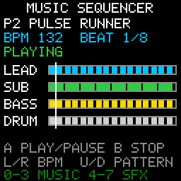

# Music Sequencer

> **Demonstration project** — provided as an example of what the PixelRoot32
> Game Engine can do. It is not a product: parts may be incomplete,
> experimental, or deliberately simplified to keep one idea in focus.

Two four-track patterns — a melodic lead, a sub-voice, a bass and a percussion
track — handed to `MusicPlayer` and driven live from six buttons. **A** toggles
play/pause, **B** stops, **Left/Right** move the tempo, **Up/Down** switch
pattern. The screen is the score: one lane per sequencer track, one block per
note, and a playhead crossing the eight-beat loop, with the pattern name, the
BPM and the transport state on top. The single idea is the multi-track
sequencer itself — how a `MusicTrack` chains three sub-voices, why its notes are
measured in beats rather than seconds, and why every byte of it has to be
`static`.

Language: C++17  
Engine: `gperez88/PixelRoot32-Game-Engine@^1.9.0`  
Environments: `native`, `esp32dev`  
Category: Audio  



## Requirements (build flags)

Set in [`lib/platformio.ini`](lib/platformio.ini) (`base` template, inherited by
every environment).

| Flag | Set to | Why |
|------|--------|-----|
| `PIXELROOT32_ENABLE_AUDIO` | `1` | The topic. Costs roughly **17 KB** of RAM — the mixer's eight voices, the SPSC command queue between the game loop and the audio thread, and the sequencer state. Without it there is no `AudioEngine`, no `MusicPlayer` and no sound, and *nothing else breaks*: the lanes still draw, the playhead still sweeps, the HUD still reads `PLAYING`. That failure mode is silence, not a compile error, so [`src/MusicSequencerScene.h`](src/MusicSequencerScene.h) stops the build with an `#error` naming the flag. |
| `PIXELROOT32_ENABLE_PHYSICS` | `0` | Off on purpose. Frees roughly **9 KB**: `CollisionSystem`'s actor tables and the fixed-timestep `PhysicsScheduler`, both members of every `Scene`. Nothing here moves in space. |
| `PIXELROOT32_ENABLE_UI_SYSTEM` | `0` | Off on purpose. Frees roughly **9 KB**: `UIManager`'s widget and hit-test tables, again a per-`Scene` member. The HUD is `Renderer::drawText` and a handful of rectangles. |
| `PIXELROOT32_ENABLE_PARTICLES` | `0` | Off on purpose. Frees roughly **2 KB** of particle pool. Nothing on screen sparkles. |

Audio is the most expensive subsystem in the engine, which is exactly why the
demo *about* audio is the one that should not also carry the other three.
`CONTRIBUTING.md`'s rule for the category folders is that a demo enables the
minimum set of flags its topic needs; leaving the three defaults on would spend
another **20 KB** on tables this demo never reads, and on an ESP32 that is the
difference between a sequencer that fits and one that does not.

## Platforms

| Environment | Display | Audio backend |
|-------------|---------|---------------|
| **`native`** | SDL2, 128×128 logical size | `SDL2_AudioBackend`, 22050 Hz, 1024-sample buffer — plays out of the default system device |
| **`esp32dev`** | **ST7735** 128×128 (GreenTab3 profile), SPI pins in [`platformio.ini`](platformio.ini): MOSI **23**, SCLK **18**, DC **2**, RST **4**, CS **-1** | `ESP32_I2S_AudioBackend`, 22050 Hz — external I2S DAC (MAX98357A or similar) on BCLK **26**, LRCK **25**, DOUT **22** |

[`src/platforms/esp32_dev.h`](src/platforms/esp32_dev.h) keeps the internal-DAC
alternative (`ESP32_DAC_AudioBackend` on GPIO 25, 11025 Hz, for a PAM8302A)
commented beside the I2S one. Swap the two `#include`s and the two backend
declarations to change route; the `AudioConfig` line reads
`audioBackend.getSampleRate()` rather than a literal, so it follows either way.

## Controls

| Button | `native` | `esp32dev` | Action |
|--------|----------|------------|--------|
| **A** | `Space` | GPIO **13** | Transport toggle. `MusicPlayer::pause()` when playing, `resume()` when paused, `play()` when stopped. |
| **B** | `Enter` | GPIO **12** | `MusicPlayer::stop()`. Silences all voices and drops the sequencer's track pointer. |
| **Left** | `←` | GPIO **33** | `setBPM(bpm - 4)`, floored at 60. |
| **Right** | `→` | GPIO **14** | `setBPM(bpm + 4)`, capped at 200. |
| **Up** | `↑` | GPIO **32** | Previous pattern, then `play()` on it. |
| **Down** | `↓` | GPIO **27** | Next pattern, then `play()` on it. |

The demo starts already playing pattern 1. Tempo changes apply mid-loop and do
not restart the pattern; a pattern change does restart, because `play()` is how
the sequencer is handed a new track.

## What it demonstrates

- **A `MusicTrack` is a chain, not a single melody.** Its last three fields are
  `secondVoice`, `thirdVoice` and `percussion`, each an optional
  `const MusicTrack*`. `MusicPlayer::play()` walks them in exactly that order
  and gives the sequencer up to `MAX_MUSIC_TRACKS` (4) parallel note streams:
  the main track becomes track 0, `secondVoice` track 1, `thirdVoice` track 2,
  `percussion` track 3. The four lanes on screen are those four streams.
  Initialisation is positional —
  `{notes, count, loop, channelType, duty, &second, &third, &percussion}` — so
  a pointer in the wrong slot is a silently different arrangement, not an error.
- **The voice partition, and why melodic tracks never fight.** `ApuCore` owns
  eight voices. Slots **0–3** are the sequencer's melodic tracks and the mapping
  is fixed: track *N* always plays on voice *N*, so the bass can never steal the
  lead's voice however dense the pattern gets. Slots **4–7** are the shared SFX
  pool, chosen by a stealing heuristic — and drum hits land there too, which is
  why a percussion track can stack several hits on one step without costing a
  melodic voice. (When 4–7 are all busy, a drum hit may borrow a melodic slot,
  but only one that is both disabled and not holding a live note, so the rule
  above still stands.) That is the line the status bar's `0-3 MUSIC 4-7 SFX`
  refers to.
- **Durations are beats, not seconds.** `MusicNote::duration` is measured in
  beats — quarter note = `1.0` — and `ApuCore::TICKS_PER_BEAT` is 4, so the
  sequencer resolves quarter-beat steps and anything finer is truncated to a
  tick. Wall-clock length comes from `MusicPlayer::setBPM()` alone, which is why
  Left/Right can re-time the whole arrangement mid-loop without touching a
  single note. Both patterns in
  [`src/assets/SequencerTracks.h`](src/assets/SequencerTracks.h) are exactly 8.0
  beats on all four tracks, which is what makes four independent streams loop in
  step.
- **A drum hit is `Note::Rest` plus a noise preset.** On a track whose
  `channelType` is `WaveType::NOISE`, a `Note::Rest` carrying a percussion
  preset (`duty == 0`) fires a hit; anywhere else the same note is silence and
  releases the voice. Miss either half and a whole drum track goes quiet with no
  diagnostic. `MusicSequencerScene::drawLane()` runs the same test the sequencer
  runs, so a lane that draws no blocks is telling you the sequencer will play
  nothing either.
- **A `duration` of `0.0` is a stacked hit.** It fires on the current step
  without advancing the sequencer, which is how the kick and hi-hat in
  `PULSE RUNNER` share beat one. It is drawn as a 2 px tick because it has no
  length to draw.
- **Static lifetime is not a style choice.** `MusicPlayer::play()` takes a
  reference and stores a bare `const MusicTrack*`; the audio thread then
  dereferences that track, its `MusicNote` array, and every note's
  `InstrumentPreset` pointer for as long as playback lasts. A track built on the
  stack of `init()` is freed memory by the time the first note sounds — the
  symptom is noise or silence, not a crash. Everything in `SequencerTracks.h` is
  `static const` or `constexpr` at namespace scope for that one reason.
- **Transport state belongs to the caller.** `MusicPlayer` exposes `isPlaying()`
  but no `isPaused()`, and `isPlaying()` returns `false` while paused — so
  "paused" and "stopped" are indistinguishable from outside. The scene keeps its
  own three-state `Transport` enum and decides from it which call to make, which
  matters because after `stop()` the player holds no track and `resume()` is a
  no-op: the only way back is a fresh `play()`.
- **Zero allocation in the loop.** No `new`, no `malloc`, no `std::string`. The
  `MusicPlayer` is a function-local `static` created on the first `init()` —
  after the `Engine` global exists, and without a heap — and the three HUD
  strings are fixed `char` members filled by `snprintf` on beat boundaries and
  button presses, not every frame.
- **What the playhead is, honestly.** It is the scene's own estimate, integrated
  from `deltaTime`, the current BPM and `getTempoFactor()`, and re-anchored to
  zero on every `play()`. The authoritative clock lives on the audio thread and
  engine 1.9.0 exposes no beat position to read back, so the line on screen can
  drift from the sound over a long run. It shows the shape of the loop, not a
  sample-accurate cursor.

## Song library

The two patterns this demo plays are hand-written in
[`src/assets/SequencerTracks.h`](src/assets/SequencerTracks.h) — small enough
to read, which is the point of the demo.

Alongside them, [`src/assets/songs/`](src/assets/songs/) carries four complete
pieces exported from the PixelRoot32 Tool Suite. **The demo does not include
them**; they are here as a library to swap in, and as worked examples of what
a full export looks like next to a hand-written pattern.

| Song | BPM | Exported header |
|------|-----|-----------------|
| Blaster Ridge | 168 | [`blaster_ridge.h`](src/assets/songs/blaster_ridge.h) |
| Coinleaf Grove | 152 | [`coinleaf_grove.h`](src/assets/songs/coinleaf_grove.h) |
| Lightworld March | 128 | [`lightworld_march.h`](src/assets/songs/lightworld_march.h) |
| Moonwell Hymn | 104 | [`moonwell_hymn.h`](src/assets/songs/moonwell_hymn.h) |

Each song ships as a pair:

- **`<name>.h`** — the generated header. It declares its own
  `InstrumentPreset`s and tracks as `inline constexpr`, so it costs flash only
  while it is included, and nothing at all while it is not.
- **`<name>.h.pr32music`** — the editable project the header was generated
  from. Keep it. Without it the music is a wall of float literals nobody can
  revise; with it, the Tool Suite can reopen and re-export the piece.

To play one, include its header and hand its track to `MusicPlayer` the way
`MusicSequencerScene` does with `SequencerTracks.h`. Two things to know first:

- The generated namespace is `musicdemo::<song_name>`, which names the project
  these were authored in rather than this demo. Renaming it by hand would
  desynchronise the header from its `.pr32music` source, so it stays.
- A full song is considerably larger than the demo's own patterns —
  `blaster_ridge.h` alone is 528 lines. That size is the reason the demo keeps
  its own patterns for teaching and these for listening.

## Build

From **`audio/music_sequencer`**:

```bash
pio run -e native
pio run -e native --target exec
pio run -e esp32dev
```

The committed `[env:native]` flags target Windows/MSYS2. On Linux drop the
`-IC:/msys64/...`, `-LC:/msys64/...` and `-mconsole` lines; on macOS drop them
and uncomment the two Homebrew lines above them. CI does this itself.

## Upload (ESP32)

```bash
pio run -e esp32dev --target upload
```

## Engine documentation

- [Audio API](https://github.com/PixelRoot32-Game-Engine/PixelRoot32-Game-Engine/blob/main/docs/api/audio.md)
- [Core API](https://github.com/PixelRoot32-Game-Engine/PixelRoot32-Game-Engine/blob/main/docs/api/core.md)
- [Graphics / Renderer](https://github.com/PixelRoot32-Game-Engine/PixelRoot32-Game-Engine/blob/main/docs/api/graphics.md)
- [Input API](https://github.com/PixelRoot32-Game-Engine/PixelRoot32-Game-Engine/blob/main/docs/api/input.md)
- [`audio/MusicPlayer.h`](https://github.com/PixelRoot32-Game-Engine/PixelRoot32-Game-Engine/blob/main/include/audio/MusicPlayer.h)
- [`audio/AudioMusicTypes.h`](https://github.com/PixelRoot32-Game-Engine/PixelRoot32-Game-Engine/blob/main/include/audio/AudioMusicTypes.h) — `MusicTrack`, `MusicNote`, `Note`, the `INSTR_*` presets and the `makeNote()` overloads

## License

Source code: [MIT](../../LICENSE).

This demo ships no art and no generated asset headers. Everything on screen is
drawn with `Renderer` primitives and the engine's built-in 5×7 font against the
built-in PR32 palette, so there is nothing visual to attribute.

The two music patterns in
[`src/assets/SequencerTracks.h`](src/assets/SequencerTracks.h) — `CALM CIRCUIT`
and `PULSE RUNNER` — are original work written for this demo and are covered by
the same MIT licence as the source. They use the engine's own `INSTR_*`
instrument presets; no external sample, tracker module or third-party
composition is included.

---

**Source code:** https://github.com/PixelRoot32-Game-Engine/PixelRoot32-Demo-Projects/tree/main/audio/music_sequencer
