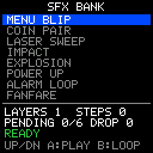

# SFX Bank

> **Demonstration project** — provided as an example of what the PixelRoot32
> Game Engine can do. It is not a product: parts may be incomplete,
> experimental, or deliberately simplified to keep one idea in focus.

Eight sound effects in a bank shaped exactly the way `playSfxBank` expects:
layers that fire together at t=0, plus sequence steps that fire later. Walk the
list with **Up** / **Down**, press **A** to fire the selected effect. The one
thing `playSfxBank` deliberately does not own is the delay — it hands every
timed step to a `SfxDelayScheduler` the game supplies — so this demo writes the
real one: a fixed six-slot scheduler driven by the scene's own `update()`, with
no allocation anywhere. The pending count is on screen, and so is the number of
steps it has had to drop.

Language: C++17  
Engine: `gperez88/PixelRoot32-Game-Engine@^1.9.0`  
Environments: `native`, `esp32dev`  
Category: Audio  



## Requirements (build flags)

Set in [`lib/platformio.ini`](lib/platformio.ini) (`base` template, inherited by
every environment).

| Flag | Set to | Why |
|------|--------|-----|
| `PIXELROOT32_ENABLE_AUDIO` | `1` | The topic. `Engine::getAudioEngine()` and the `AudioEngine` member itself sit behind `#if PIXELROOT32_ENABLE_AUDIO` in `core/Engine.h`, so this is one of the few engine flags whose absence *is* a compile error rather than silence. [`src/SfxBankScene.h`](src/SfxBankScene.h) stops the build with an `#error` naming the flag anyway, so the message says what to do. It is also the most expensive subsystem in the engine: roughly **17 KB** of RAM for the eight mixer voices, the SPSC command queue and the sequencer state. |
| `PIXELROOT32_ENABLE_PHYSICS` | `0` | Off on purpose. Frees roughly **9 KB**: `CollisionSystem`'s actor tables and the fixed-timestep `PhysicsScheduler`, both members of every `Scene`. Nothing here moves. |
| `PIXELROOT32_ENABLE_UI_SYSTEM` | `0` | Off on purpose. Frees roughly **9 KB**: `UIManager`'s widget and hit-test tables, again a per-`Scene` member. The list is `Renderer::drawText` and one filled rectangle. |
| `PIXELROOT32_ENABLE_PARTICLES` | `0` | Off on purpose. Frees roughly **2 KB** of particle pool. Nothing on screen sparkles. |

Those three zeros are the reason the one `1` is affordable. `CONTRIBUTING.md`'s
rule for the category folders is that a demo enables the minimum set of flags
its topic needs, and audio at ~17 KB is the single largest thing a PixelRoot32
demo can switch on — leaving the other default-on subsystems enabled would add
another ~20 KB that nothing on this screen uses.

## Platforms

| Environment | Display | Audio backend |
|-------------|---------|---------------|
| **`native`** | SDL2, 128×128 logical size | `SDL2_AudioBackend(22050, 1024)` — 22.05 kHz, 1024-sample buffer. The buffer length is the floor on how late a scheduled step can be heard: the scheduler's resolution is the frame, the backend's is the block. |
| **`esp32dev`** | **ST7735** 128×128 (GreenTab3 profile), SPI pins in [`platformio.ini`](platformio.ini): MOSI **23**, SCLK **18**, DC **2**, RST **4**, CS **-1** | `ESP32_I2S_AudioBackend(BCLK 26, LRCK 25, DOUT 22, 22050)` — an external I2S DAC such as the MAX98357A. [`src/platforms/esp32_dev.h`](src/platforms/esp32_dev.h) keeps the internal-DAC alternative (`ESP32_DAC_AudioBackend` on GPIO **25**, 11.025 kHz) commented next to it. `AudioConfig` is built from `audioBackend.getSampleRate()` rather than a literal, so switching to the DAC option does not detune every effect. |

## Controls

| Button | `native` | `esp32dev` | Action |
|--------|----------|------------|--------|
| **Up** | `Up` | GPIO **32** | Previous entry in the bank (wraps). |
| **Down** | `Down` | GPIO **27** | Next entry in the bank (wraps). |
| **A** | `Space` | GPIO **13** | `playSfxBank(engine.getAudioEngine(), id, scheduler)`. On `ALARM LOOP` it refuses and says `USE B FOR LOOP`, because A does not track the loop and could not stop it. |
| **B** | `Enter` | GPIO **12** | On `ALARM LOOP`: start it looping. While a loop is running: stop it — see the caveat below. On any other entry with no loop running: nothing, and the status line says `NOT A LOOP`. |

Left and Right are declared in the platform headers because `InputConfig` takes
six buttons, and are otherwise unused.

**The caveat on B.** `AudioEngine::playEvent` returns `void`. Nothing in the
public API ever tells the game which voice an effect landed on, and
`AudioCommandType::STOP_CHANNEL` needs a slot index. So B does not stop *the
looping voice* — it cannot know which one that is. It stops the whole SFX
sub-pool: slots `ApuCore::SFX_VOICE_BASE` (4) through 7, leaving 0–3 alone
because those belong to the music sequencer. That is a real thing games do
("silence all effects"), it is spelled out in `stopAllSfxVoices()`, and it is
the honest ceiling of what `playSfxBank` gives you back. A game that needs
one-loop-at-a-time control has to place its looping voices by hand rather than
through the bank helper.

## What it demonstrates

### The bank contract `playSfxBank` expects

`playSfxBank` is a template over the bank *type*, not a call on a bank object:

```cpp
template <typename Bank, typename SfxId>
inline void playSfxBank(AudioEngine& engine, SfxId id, SfxDelayScheduler& scheduler);
```

`Bank` needs four static functions and one nested struct:

- `static uint8_t layerCount(SfxId)`
- `static AudioEvent layerEvent(SfxId, uint8_t)`
- `static uint8_t sequenceStepCount(SfxId)`
- `static SequenceStep sequenceStep(SfxId, uint8_t)`, where `SequenceStep` has
  `float delaySec` and `AudioEvent event`

That is the same API the PixelRoot32 Tool Suite's SFX editor exports — see
`games/bomberbot/src/assets/audio/SfxBank.h` for a generated one.
[`src/assets/DemoSfxBank.h`](src/assets/DemoSfxBank.h) is the same contract
written by hand so the whole of it is readable. The body of the helper is
eleven lines: every layer goes straight to `playEvent`, every step with
`delaySec <= 0` goes straight to `playEvent`, and every step with
`delaySec > 0` goes to the scheduler. Nothing else.

The eight entries each isolate one thing:

| Entry | Layers | Steps | What it is for |
|-------|--------|-------|----------------|
| `MENU BLIP` | 1 | 0 | The smallest entry a bank can have. |
| `COIN PAIR` | 1 | 1 | The scheduler's hello world: one note now, one 70 ms later. |
| `LASER SWEEP` | 1 | 0 | `sweepEndHz` + `sweepDurationSec`, exponential curve. |
| `IMPACT` | 3 | 0 | Three voices at t=0 — three of the four SFX slots at once. |
| `EXPLOSION` | 1 | 2 | `NOISE` with a downward clock sweep, plus two delayed tail steps. |
| `POWER UP` | 1 | 0 | A four-point `pitchEnvelope` arpeggiating inside one voice. |
| `ALARM LOOP` | 1 | 0 | `loop = true` with a four-entry `dutySteps` table. |
| `FANFARE` | 1 | 3 | Three delayed notes — two presses fill the six-slot scheduler. |

### Why the delay scheduler is the game's job

The engine ships two `SfxDelayScheduler` implementations and neither is what a
game wants. `NullSfxDelayScheduler` drops every delayed step on the floor, so
`FANFARE` becomes one note. `ImmediateSfxDelayScheduler` plays them all at t=0,
so `FANFARE` becomes one chord. Both are honest about being stubs.

Timing belongs to whatever already has a clock, and in a game that is the
scene. `TimedSfxDelayScheduler` in [`src/SfxBankScene.h`](src/SfxBankScene.h)
is a fixed `PendingStep slots_[6]` array with a live count:

- `schedule()` converts `delaySec` to milliseconds and copies the event into
  the next free slot. The event is stored **by value** — the `SequenceStep`
  `playSfxBank` handed over is a temporary. Its `preset`, `dutySteps` and
  `pitchEnvelope` pointers survive that copy because they point at the bank's
  `inline constexpr` tables, which is the whole reason those tables must have
  static storage duration.
- `update(deltaTime)` is called from `Scene::update` with the frame time in
  milliseconds, counts every slot down, and calls `playEvent` on the ones that
  reach zero. A fired slot is reclaimed by swapping the last live entry into
  its place, so nothing shifts and nothing moves; the loop index deliberately
  does not advance after a swap, because the entry that just arrived has not
  been stepped yet this frame.
- The step is clamped to 100 ms, so a long stall — a breakpoint, the first
  frame after `init()` — cannot fire the entire queue at once.
- No `new`, no `malloc`, no container, anywhere. The six slots are part of the
  scene's own `sizeof`.

**When it is full, it drops the newest step and counts it.** The HUD prints
`PENDING n/6 DROP n` and turns the line orange at the ceiling, red once
anything has been dropped. Evicting an already-scheduled step instead would
cut short a sound the player has already begun hearing; refusing the new one is
the smaller lie, and either way the number is on screen rather than swallowed.
Hold **A** on `FANFARE` to watch it happen.

### The four-voice SFX sub-pool

`ApuCore` owns eight voices and partitions them: `MUSIC_VOICE_BASE` 0 through
3 are the music sequencer's, `SFX_VOICE_BASE` 4 through 7 are effects. SFX
steal only within their own four, so an effect can never cut off the music —
and looped voices are reclaimed first when a steal is needed.

Four simultaneous non-looping effects means the fifth steals one of them. This
is easy to hear here: `IMPACT` alone takes three slots, so firing `IMPACT` and
then anything else immediately is already at the edge. That is not a bug in the
mixer, it is the budget; a game with more than four concurrent effects needs a
priority or cooldown policy of its own — the generated Tool Suite banks carry a
`cooldownMs(SfxId)` for exactly that, and `playSfxBank` does not look at it.

### The two `AudioEvent` field-order traps

`AudioEvent` is declared in `<pixelroot32/apu/AudioTypes.h>` in this order:

```
1 type   2 frequency   3 duration   4 volume   5 duty   6 noisePeriod
7 preset 8 sweepEndHz  9 sweepDurationSec  10 loop  11 sweepCurve
12 dutySteps  13 dutyStepCount  14 pitchEnvelope  15 pitchEnvelopeCount
```

**Trap 1 — it is `frequency, duration, volume`, not `frequency, volume,
duration`.** All three are `float`, so swapping them is not a build error. It
is a 0.4-second note played at 30% of the volume you asked for, and you will
look at the mixer before you look at the literal.

**Trap 2 — `preset` is field 7, not the last field.** Writing
`{type, freq, dur, vol, duty, &INSTR_X}` aims the preset pointer at
`noisePeriod`'s slot, which is a `uint8_t`.

C++17 has no designated initialisers, so [`src/assets/DemoSfxBank.h`](src/assets/DemoSfxBank.h)
sets the five positional fields through a `makeEvent()` helper and assigns
everything past `duty` **by name**:

```cpp
AudioEvent event = detail::makeEvent(WaveType::PULSE, 1200.0f, 0.28f, 0.45f, 0.25f);
event.preset = &presets::kPulseSweep;
event.sweepEndHz = 140.0f;
event.sweepDurationSec = 0.26f;
event.sweepCurve = SweepCurve::Exponential;
```

The one place positional initialisation is still used is `InstrumentPreset`,
whose field order `AudioMusicTypes.h` documents as frozen — the deprecated
`noiseShortMode` alias is kept as the last member precisely so existing
positional literals keep meaning what they meant.

### The rest of the mixer's small print, respected

- **Sweep is active only when `sweepDurationSec > 0` **and** `sweepEndHz > 0`.**
  Leave either at zero and the voice just holds `frequency`, with no warning.
- **On `NOISE`, `frequency` is the LFSR clock rate, not a pitch.** `EXPLOSION`
  sweeps 9000 Hz down to 500 Hz of *clock*, which is what turns a hiss into a
  boom.
- **A `pitchEnvelope` with ≥ 2 points replaces the single-segment sweep.** So
  `POWER UP` leaves `sweepEndHz` / `sweepDurationSec` at zero rather than
  setting dead data. Maximum 4 duty steps, maximum 4 pitch points, `timeSec`
  non-decreasing.
- **`preset`, `dutySteps` and `pitchEnvelope` are raw pointers the mixer
  dereferences on the audio side.** Every one of them here is an
  `inline constexpr` at namespace scope, so it outlives any event that names it.
- **`loop = true` never auto-stops.** `duration` is meaningless while it is
  set; the voice stays enabled until `STOP_CHANNEL` names its slot, or until
  another effect steals it.

### Ordering the engine cares about

`init()` and `update()` call their `Scene::` base **first**. `draw()` does
**not**: it paints the background, then calls `Scene::draw(renderer)`, because
the base draws the scene's entities and filling after it would overpaint them.

## Build

From **`audio/sfx_bank`**:

```bash
pio run -e native
pio run -e native --target exec
pio run -e esp32dev
```

The committed `[env:native]` flags target Windows/MSYS2. On Linux drop the
`-IC:/msys64/...`, `-LC:/msys64/...` and `-mconsole` lines; on macOS drop them
and uncomment the two Homebrew lines above them. CI does this itself.

## Upload (ESP32)

```bash
pio run -e esp32dev --target upload
```

## Engine documentation

- [Audio API](https://github.com/PixelRoot32-Game-Engine/PixelRoot32-Game-Engine/blob/main/docs/api/audio.md)
- [Core API](https://github.com/PixelRoot32-Game-Engine/PixelRoot32-Game-Engine/blob/main/docs/api/core.md)
- [Graphics / Renderer](https://github.com/PixelRoot32-Game-Engine/PixelRoot32-Game-Engine/blob/main/docs/api/graphics.md)
- [Input API](https://github.com/PixelRoot32-Game-Engine/PixelRoot32-Game-Engine/blob/main/docs/api/input.md)
- [`include/audio/SfxBankPlayback.h`](https://github.com/PixelRoot32-Game-Engine/PixelRoot32-Game-Engine/blob/main/include/audio/SfxBankPlayback.h) — `playSfxBank`, `SfxDelayScheduler` and the two stub schedulers
- [`include/audio/AudioEngine.h`](https://github.com/PixelRoot32-Game-Engine/PixelRoot32-Game-Engine/blob/main/include/audio/AudioEngine.h) — `playEvent`, `submitCommand`
- [`AudioTypes.h` (PixelRoot32-APU)](https://github.com/PixelRoot32-Game-Engine/PixelRoot32-APU/blob/main/include/pixelroot32/apu/AudioTypes.h) — `AudioEvent`, `SfxBreakpoint`, `AudioCommand`, `WaveType`, `SweepCurve`
- [`AudioMusicTypes.h` (PixelRoot32-APU)](https://github.com/PixelRoot32-Game-Engine/PixelRoot32-APU/blob/main/include/pixelroot32/apu/AudioMusicTypes.h) — `InstrumentPreset` and its frozen field order

## License

Source code: [MIT](../../LICENSE).

This demo ships no art and no audio samples. Every sound is synthesised at run
time by the engine's APU from the `AudioEvent` literals in
[`src/assets/DemoSfxBank.h`](src/assets/DemoSfxBank.h), and everything on
screen is drawn with `Renderer` primitives and the engine's built-in 5×7 font
against the built-in PR32 palette. There is nothing here to attribute.

---

**Source code:** https://github.com/PixelRoot32-Game-Engine/PixelRoot32-Demo-Projects/tree/main/audio/sfx_bank
