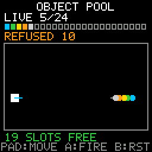

# Object Pool

> **Demonstration project** — provided as an example of what the PixelRoot32
> Game Engine can do. It is not a product: parts may be incomplete,
> experimental, or deliberately simplified to keep one idea in focus.

An emitter you steer with the D-pad, firing projectiles into a field that
recycles them the moment they cross its border. Every spawn is
`ObjectPool<Projectile, 24>::acquire()`, every despawn is `releaseAt()` called
from inside the very `nextLive()` walk that found the projectile, and **B** is
`reset()`. The single idea is the pool's API contract: a `nullptr` you are
supposed to handle, a release that is safe mid-iteration, and a bitmask you
walk with `nextLive()` rather than a raw index loop. The 24 cells under the
counter are that bitmask, one per slot, drawn straight from `isLive(index)`.

Language: C++17  
Engine: `gperez88/PixelRoot32-Game-Engine@^1.9.0`  
Environments: `native`, `esp32dev`  
Category: Gameplay  



## Requirements (build flags)

Set in [`lib/platformio.ini`](lib/platformio.ini) (`base` template, inherited by
every environment).

| Flag | Set to | Why |
|------|--------|-----|
| `PIXELROOT32_ENABLE_GAMEPLAY_OBJECT_POOL` | `1` | The topic. The whole of `<gameplay/ObjectPool.h>` sits inside `#if PIXELROOT32_ENABLE_GAMEPLAY_OBJECT_POOL`, and `include/platforms/PlatformDefaults.h` defines it to **`0`** when nobody else does — so omitting this line does not disable a feature quietly, it makes `pixelroot32::gameplay::ObjectPool` not exist as a type. This is one of the few engine flags whose absence *is* a compile error. [`src/ObjectPoolScene.h`](src/ObjectPoolScene.h) turns that into an `#error` naming the flag, rather than a page of template diagnostics. |
| `PIXELROOT32_ENABLE_AUDIO` | `0` | Off on purpose. Frees roughly **17 KB** of RAM: mixer voices, the SPSC command queue, and the sequencer state. This demo is silent. |
| `PIXELROOT32_ENABLE_PHYSICS` | `0` | Off on purpose. Frees roughly **9 KB**: `CollisionSystem`'s actor tables and the fixed-timestep `PhysicsScheduler`, both members of every `Scene`. Projectiles are released by a bounds test on four constants, not by a collider. |
| `PIXELROOT32_ENABLE_UI_SYSTEM` | `0` | Off on purpose. Frees roughly **9 KB**: `UIManager`'s widget and hit-test tables, again a per-`Scene` member. The HUD is `Renderer::drawText` and 24 small rectangles. |
| `PIXELROOT32_ENABLE_PARTICLES` | `0` | Off on purpose. Frees roughly **2 KB** of particle pool. The projectiles here are the pooled objects; borrowing the engine's particle pool to draw them would hide the very thing the demo is about. |

## Platforms

| Environment | Display | Audio backend |
|-------------|---------|---------------|
| **`native`** | SDL2, 128×128 logical size | none — `PIXELROOT32_ENABLE_AUDIO=0` |
| **`esp32dev`** | **ST7735** 128×128 (GreenTab3 profile), SPI pins in [`platformio.ini`](platformio.ini): MOSI **23**, SCLK **18**, DC **2**, RST **4**, CS **-1** | none — `PIXELROOT32_ENABLE_AUDIO=0` |

## Controls

| Button | `native` | `esp32dev` | Action |
|--------|----------|------------|--------|
| **D-pad** | Arrow keys | GPIO **32** / **27** / **33** / **14** | Moves the emitter and points it. The barrel keeps the last direction after you let go, so the next shot goes where the emitter is looking. |
| **A** | `Space` | GPIO **13** | `pool.acquire(...)` — one projectile. Held, it fires every 45 ms, which outruns the rate at which the field hands slots back: the pool saturates in about a second and `acquire()` starts returning `nullptr`. |
| **B** | `Enter` | GPIO **12** | `pool.reset()` — runs `~Projectile()` over every live slot and clears the bitmask. Also zeroes the refused counter. |

The HUD reads `LIVE n/24`, the 24-cell slot map, `REFUSED n` (how many
`acquire()` calls came back `nullptr`), and a status line that turns red at
`FULL: ACQUIRE=NULL`.

## What it demonstrates

### 1. Iterate with `nextLive()`, never with a raw index loop

The live set is a bitmask, not a prefix. Slot 7 can be free while slots 0 and 20
are taken, so `for (uint16_t i = 0; i < N; ++i)` walks dead slots and gets
`nullptr` back from `at()` for most of them. The supported walk is:

```cpp
for (uint16_t i = pool_.nextLive(0); i != ProjectilePool::kEnd;
     i = pool_.nextLive(static_cast<uint16_t>(i + 1))) {
    Projectile& shot = *pool_.at(i);
    // ...
}
```

The 24-cell slot map exists to make that visible. `acquire()` always takes the
lowest free bit — with `N` ≤ 32 the pool is a single liveness word, so the scan
hint never leaves it — but projectiles leave the field in whatever order their
headings dictate, so a release opens a hole in the *middle* of the map and the
next `acquire()` refills that hole instead of appending. The lit cells are a set,
not a prefix, which is exactly what a proportional fill bar cannot show you. Each
projectile is tinted by the slot it occupies, so a colour vanishing and coming
back *is* a slot being recycled.

### 2. Releasing the current slot mid-walk is safe — and that is the point

[`stepProjectiles()`](src/ObjectPoolScene.cpp) calls `pool_.releaseAt(i)` from
inside the loop that just handed it `i`. That is the pattern people get wrong,
and reading `ObjectPool.h` says why it is fine here:

- `nextLive(from)` takes `wordIndex = from / 32` and starts from
  `liveWords_[wordIndex] & (0xFFFFFFFFu << (from % 32))`, then skips whole zero
  words upward. It therefore **only ever reads bits at or above `from`**.
- `releaseAt(i)` runs `~T()`, calls `clearBit(i)` — which clears exactly bit `i`
  and nothing else — decrements `liveCount_`, and may lower `scanHint_`.
  `scanHint_` is read only by `acquire()`, never by `nextLive()`.

So the next step of the loop asks for `nextLive(i + 1)`, which reads only bits
strictly above `i`, and `releaseAt(i)` touched none of them. Clearing a bit can
never *create* a live index either, so nothing is skipped and nothing is visited
twice.

The mirror-image case is worth knowing: **`acquire()` inside the same walk is
defined but surprising.** A new object landing in a slot below `i` is invisible
for the rest of the pass, while one landing above `i` gets visited — and stepped
— in the frame it was created. This demo fires from `handleFiring()`, outside
the walk, for exactly that reason.

### 3. `acquire()` returning `nullptr` is an outcome, not a failure

A fixed-capacity pool has a ceiling and reaching it is normal. `fireOne()` takes
the `nullptr` branch, increments `refusedCount_`, and returns; nothing asserts,
nothing logs an error, nothing silently drops the count. The HUD prints
`REFUSED n` in orange next to `FULL: ACQUIRE=NULL` in red. Hold **A** for a
second and you will get there on purpose.

### 4. `T` needs no default constructor

`acquire()` forwards its arguments straight into placement new, so a pooled type
only needs the constructor the call site uses. `Projectile` has a five-argument
constructor and no default one, and the header asserts that this stays true:

```cpp
static_assert(!std::is_default_constructible<Projectile>::value, ...);
```

`indexOf()` closes the loop: it maps the returned pointer back to its slot, which
is where the projectile's colour comes from.

### The memory layout, measured

`Projectile` is four `int32_t` (16 bytes), a `uint16_t ageMs` at offset 16, a
`Color` — a `uint8_t` enum — at offset 18, and one padding byte to keep the
4-byte alignment: **20 bytes**.

`ObjectPool<T, N>` is `alignas(T) unsigned char storage_[N * sizeof(T)]`, then
`uint32_t liveWords_[(N + 31) / 32]`, then `uint16_t liveCount_` and
`uint16_t scanHint_`. With `N = 24` that is one liveness word, so:

```text
480  storage_    (24 slots x 20 bytes)
  4  liveWords_  (one uint32_t: 24 slots need 24 bits)
  2  liveCount_
  2  scanHint_
----
488  sizeof(ObjectPool<Projectile, 24>)
```

**488 bytes**, and the same number on both targets — measured on the 64-bit
native build and re-checked with a 32-bit compile, because `Projectile` holds no
pointers for the ABI to resize. `ObjectPoolScene.h` states that relationship as
a `static_assert` rather than as a comment, so it cannot drift:

```cpp
static_assert(sizeof(ProjectilePool) == sizeof(Projectile) * kCapacity + 8, ...);
```

There is no heap anywhere in this: the pool is a plain member of the scene, so
its 488 bytes are part of `sizeof(ObjectPoolScene)`, fixed before `main()` runs.

### Never put an `ObjectPool` in arena memory

`pool_` is a plain scene member. It is not `arenaNew`'d, and its storage is not
carved out of `SceneArena`. This is a corruption bug, not a style preference:

`Scene::resetState()` calls `arena.reset()` unconditionally, and the arena's
reset only rewinds a bump offset — it runs no destructors. A pool living in
arena memory would therefore never run `~ObjectPool()`, so `~T()` would never
run for any slot still live at reset time. Worse, its `liveWords_` bitmask keeps
asserting those slots are live while the arena has already rewound past them and
is about to hand the exact same bytes to the next `arenaNew` caller. Two live
objects then alias one address, and a later `release()` or `reset()` runs `~T()`
over memory that belongs to something else. There is no placement-site check in
C++ that can catch it, which is why `ObjectPool.h` states the restriction in
prose instead of enforcing it.

The supported reset contract follows from the same ordering, and
[`ObjectPoolScene::init()`](src/ObjectPoolScene.cpp) uses it:

```cpp
void ObjectPoolScene::init() {
    Scene::init();   // runs resetState(): clears entities, rewinds the arena
    pool_.reset();   // only now safe — no dangling entity references remain
    // ...
}
```

"After", not "before": if a pooled `T` were also a registered `Entity`,
destructing it before `Scene::init()` ran `clearEntities()` would leave the base
entity list holding dangling pointers for that window.

### Not the same demo as `performance/memory_budget`

[`performance/memory_budget`](../../performance/memory_budget) also holds an
`ObjectPool`, but its subject is the **budget**: a `SceneArena` and a pool drawn
as two proportional occupancy bars, arguing that a RAM ceiling should be a
number on screen. This demo does not draw an occupancy bar at all. Its subject is
the **API contract** — the `nullptr` return, the mid-iteration `releaseAt()`, the
`nextLive()`/`kEnd` walk, and the per-slot bitmask that a bar would smooth away.
Read that one for *how much*; read this one for *how*.

### Zero allocation after `init()`

No `new`, no `malloc`, no `std::vector`, no `std::string` in `update()` or
`draw()`. The three HUD strings are fixed `char` members filled by `snprintf`,
and only on the frames where a printed number actually changed. `init()` does not
allocate either — it just resets members.

## Build

From **`gameplay/object_pool`**:

```bash
pio run -e native
pio run -e native --target exec
pio run -e esp32dev
```

The committed `[env:native]` flags target Windows/MSYS2. On Linux drop the
`-IC:/msys64/...`, `-LC:/msys64/...` and `-mconsole` lines; on macOS drop them
and uncomment the two Homebrew lines above them. CI does this itself.

## Upload (ESP32)

```bash
pio run -e esp32dev --target upload
```

## Engine documentation

- [Core API](https://github.com/PixelRoot32-Game-Engine/PixelRoot32-Game-Engine/blob/main/docs/api/core.md)
- [Graphics / Renderer](https://github.com/PixelRoot32-Game-Engine/PixelRoot32-Game-Engine/blob/main/docs/api/graphics.md)
- [Input API](https://github.com/PixelRoot32-Game-Engine/PixelRoot32-Game-Engine/blob/main/docs/api/input.md)
- [Memory system](https://github.com/PixelRoot32-Game-Engine/PixelRoot32-Game-Engine/blob/main/docs/architecture/memory-system.md)
- [`gameplay/ObjectPool.h`](https://github.com/PixelRoot32-Game-Engine/PixelRoot32-Game-Engine/blob/main/include/gameplay/ObjectPool.h) — the header this demo is about, including the arena warning quoted above
- [`core/Scene.h`](https://github.com/PixelRoot32-Game-Engine/PixelRoot32-Game-Engine/blob/main/include/core/Scene.h) — `Scene::init()`, `resetState()` and `SceneArena` are declared here

## License

Source code: [MIT](../../LICENSE).

This demo ships no art, audio, or generated asset headers. Everything on screen
is drawn with `Renderer` primitives and the engine's built-in 5×7 font against
the built-in PR32 palette, so there is nothing here to attribute.

---

**Source code:** https://github.com/PixelRoot32-Game-Engine/PixelRoot32-Demo-Projects/tree/main/gameplay/object_pool
