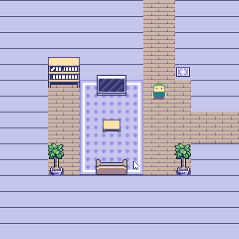

# Room Screen

> **Demonstration project** — provided as an example of what the PixelRoot32
> Game Engine can do. It is not a product: parts may be incomplete,
> experimental, or deliberately simplified to keep one idea in focus.

A 4-room layout exported by the Tilemap Editor: four 15x15 rooms in a 2x2 grid (each 240×240 at 16 px/tile). A 16×16 hero (idle + two-frame walk, up/down/left/right) walks the world freely and collides with the Items layer (the collision layer). Crossing a room boundary follows the room connection — the camera snaps to the target room and the player lands on its entry edge; an unconnected edge acts as a wall.

Language: C++17  
Engine: `gperez88/PixelRoot32-Game-Engine@^1.9.0`  
Environments: `native`, `esp32dev`  
Category: Gameplay



## Where the rooms come from

The graph is not hand-written in C++. `src/assets/roomscreen_main_scene.h` / `.cpp` hold the exported scene — tilemaps, palettes, and the room layer (tile-space rects plus connection slots) — and `Scene::init()` turns the room layer into a `RoomGraph<4>` with one call:

```cpp
gameplay::buildRoomGraph(ROOMSCREEN_MAIN_SCENE_ROOM_LAYER, rooms_);
```

That keeps rects and connections in one place instead of spread across `addRoom`/`connect` calls that can drift out of sync with the map. See [Tilemap Editor — Room Layer](https://github.com/PixelRoot32-Game-Engine/PixelRoot32-Game-Engine/blob/main/docs/tools/tilemap-editor/technical-reference.md#room-layer) for the format.

## Requirements (build flags)

| Flag | Required | Notes |
|------|----------|-------|
| `PIXELROOT32_ENABLE_GAMEPLAY_ROOM=1` | Yes | Enables `RoomGraph<N>` |
| `PIXELROOT32_ENABLE_AUDIO=1` | No | Audio backend for SDL2/ESP32 |

## Platforms

| Environment | Display | Audio |
|-------------|---------|-------|
| `native` | SDL2 window, 240x240 | none — the demo sets no audio flag |
| `esp32dev` | ST7789 240x240 over SPI — MOSI **23**, SCLK **18**, DC **2**, RST **4**, CS **-1** | none |

## Controls

- **Up/Down/Left/Right arrow keys**: move the player. Walking into a wall stops you; walking across an open room boundary transitions to the connected room.

## Collision

The exported **Items** layer is the collision layer: its tiles carry `TILE_SOLID` where the player cannot walk. The player resolves that layer with the engine helper `pixelroot32::physics::isWorldPixelSolid`, which decodes the tile's 4bpp bitmap so a solid tile only blocks where its pixels are actually opaque — a tile whose bitmap has transparent "dead pixels" (palette index 0) lets the player walk through the gaps instead of treating the whole 16×16 cell as a wall.

The strategy is a **compile-time toggle** in `src/GameConstants.h`:

| `kCollisionMode` | Behaviour |
|------------------|-----------|
| `CollisionMode::WholeTile` | Original behaviour: a `TILE_SOLID` tile blocks its entire cell; the bitmap is ignored. |
| `CollisionMode::PerPixel` | Per-pixel test: transparent pixels are walkable, no erosion. |
| `CollisionMode::PerPixelEroded` *(default)* | Per-pixel test with morphological erosion, so thin branches, dangling 1px protrusions and stray opaque pixels on irregular tiles (plants, tree canopies) don't snag the player. |

`PerPixelEroded` uses `kTileSolidErosionPx` (default `1`) as the erosion radius: a pixel counts as solid only if the whole `(2*r+1)²` square around it is opaque.

`Player::canOccupy` branches on `kCollisionMode` with `if constexpr`, so the unselected branches are discarded at compile time (zero runtime cost, and on ESP32 the unused helper is stripped by `--gc-sections`). The helper is stateless — no per-tile masks, no allocations — so RAM cost is 0 in every mode.

## Build

From `gameplay/room_screen`:

```bash
pio run -e native
pio run -e esp32dev
```

## Upload (ESP32)

```bash
pio run -e esp32dev --target upload
```

## License

Source code: [MIT](../../LICENSE).

| Asset | Author | License | Source |
|-------|--------|---------|--------|
| Top-down interior tileset, baked into [`src/assets/roomscreen_main_scene.cpp`](src/assets/roomscreen_main_scene.cpp) by the Tilemap Editor exporter | AxulArt | CC BY 4.0 | [AxulArt's Basic Top-down Interior](https://axulart.itch.io/axularts-basic-top-down-interior) |
| Player sprites, 16x16, idle plus a two-frame walk in four directions, in [`src/assets/PlayerSprites.h`](src/assets/PlayerSprites.h) | Gabriel Perez | CC0 1.0 (public domain) | Original work for this demo |

The interior tiles are by [AxulArt](https://axulart.itch.io/), used under
[CC BY 4.0](https://creativecommons.org/licenses/by/4.0/) and re-encoded to the
engine's 4bpp nibble-packed format. Attribution is required by that license, so
keep this section with the demo if you copy the folder out.

The player sprites are original pixel art drawn for this demo and released into
the public domain, so they carry no requirement of their own.

---

**Source code:** https://github.com/PixelRoot32-Game-Engine/PixelRoot32-Demo-Projects/tree/main/gameplay/room_screen
