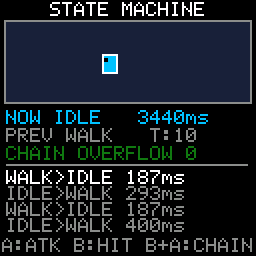

# State Machine

> **Demonstration project** — provided as an example of what the PixelRoot32
> Game Engine can do. It is not a product: parts may be incomplete,
> experimental, or deliberately simplified to keep one idea in focus.

One `pixelroot32::gameplay::StateMachine` driving one actor through four
states — Idle, Walk, Attack, Hurt — declared in a single `const` table, with
every transition put on screen: the current state and how long it has lasted,
the previous state, a running transition count, the chained-transition
overflow counter, and a four-line log of the most recent transitions with the
dwell time of each. The single idea is that a state machine is only as useful
as the transitions you can see, so nothing here is hidden behind an animation.

Language: C++17  
Engine: `gperez88/PixelRoot32-Game-Engine@^1.9.0`  
Environments: `native`, `esp32dev`  
Category: Gameplay  



## Requirements (build flags)

Set in [`lib/platformio.ini`](lib/platformio.ini) (`base` template, inherited by
every environment).

| Flag | Set to | Why |
|------|--------|-----|
| `PIXELROOT32_ENABLE_GAMEPLAY_STATE_MACHINE` | `1` | The topic. The whole of `<gameplay/StateMachine.h>` sits inside `#if PIXELROOT32_ENABLE_GAMEPLAY_STATE_MACHINE`, and `platforms/PlatformDefaults.h` defaults it to `0`. Omitting it is not a silent no-op and not a black screen: the header expands to nothing, `pixelroot32::gameplay::StateMachine` is not a type, and the build stops. [`src/StateMachineScene.h`](src/StateMachineScene.h) tests the flag and raises an `#error` naming it, so you get one line instead of a page of "is not a member of" errors. |
| `PIXELROOT32_ENABLE_AUDIO` | `0` | Off on purpose. Frees roughly **17 KB** of RAM: mixer voices, the SPSC command queue, and the sequencer state. This demo makes no sound. |
| `PIXELROOT32_ENABLE_PHYSICS` | `0` | Off on purpose. Frees roughly **9 KB**: `CollisionSystem`'s actor tables and the fixed-timestep `PhysicsScheduler`, both members of every `Scene`. The actor is clamped against four constants, not against colliders. |
| `PIXELROOT32_ENABLE_UI_SYSTEM` | `0` | Off on purpose. Frees roughly **9 KB**: `UIManager`'s widget and hit-test tables, again a per-`Scene` member. The HUD here is `Renderer::drawText` and a few rectangles. |
| `PIXELROOT32_ENABLE_PARTICLES` | `0` | Off on purpose. Frees roughly **2 KB** of particle pool. Nothing on screen sparkles. |

The four zeros are the second half of `CONTRIBUTING.md`'s rule for the category
folders: a demo enables the minimum set of flags its topic needs. Leaving the
default-on subsystems enabled would spend roughly **37 KB** of RAM that nothing
in this demo touches, and would make the ESP32 figures below meaningless as a
measure of what a state machine costs.

## Platforms

| Environment | Display | Audio backend |
|-------------|---------|---------------|
| **`native`** | SDL2, 128×128 logical size | none — `PIXELROOT32_ENABLE_AUDIO=0` |
| **`esp32dev`** | **ST7735** 128×128 (GreenTab3 profile), SPI pins in [`platformio.ini`](platformio.ini): MOSI **23**, SCLK **18**, DC **2**, RST **4**, CS **-1** | none — `PIXELROOT32_ENABLE_AUDIO=0` |

## Controls

| Button | `native` | `esp32dev` | Action |
|--------|----------|------------|--------|
| **D-pad** | arrow keys | GPIO **32** / **27** / **33** / **14** | Move. Idle → Walk while a direction is held, Walk → Idle when they are all released. Attack and Hurt ignore the pad: the state gates the movement, not an `if` in `update()`. |
| **A** | `Space` | GPIO **13** | Attack — a timed state that returns to Idle on its own after 400 ms. Pressing A *during* Attack calls `restartState()`, and the log line reads `ATTACK>ATTACK`. A is ignored during Hurt. |
| **B** | `Enter` | GPIO **12** | Hurt — 600 ms, and it interrupts Attack. Pressing B during Hurt restarts it. |
| **B held + A** | `Enter` + `Space` | GPIO **12** + **13** | Chain-overflow demonstration. See *Chained transitions* below. |

## What it demonstrates

Five things about `StateMachine` that are each a silent trap, in the sense that
getting them wrong produces working-looking code rather than an error.

### 1. The table is not copied

`configure(owner, table, count)` stores the pointer and nothing else. The table
has to outlive the machine, so it is a class-static `const` array
(`StateMachineScene::kStates`) defined at namespace scope in the `.cpp`, which
lands in `.rodata`/flash and costs no SRAM. The shape that compiles and then
misbehaves is a table declared local to a setup function: `configure()` accepts
it happily, the function returns, and every later transition reads freed stack.

Rows are matched by `State::id`, never by position, so the order in the table is
a readability choice.

The three callbacks are raw function pointers taking `void* owner`
(`void (*)(void*, StateId)` and friends). A capturing lambda does not convert to
that type, and neither does a non-static member function — every callback here
is a `static` member that opens with
`auto* self = static_cast<StateMachineScene*>(owner);`.

### 2. `requestState(getCurrentState())` is a no-op, not a re-entry

It returns `true`, which reads like success, and then does nothing: no `onExit`,
no `onEnter`, and `getTimeInState()` keeps counting from where it was. The verb
for a genuine re-entry is `restartState()`, which fires a real exit/enter pair
against the same state and zeroes the timer.

`enterOrRestart()` in [`src/StateMachineScene.cpp`](src/StateMachineScene.cpp)
picks between the two, which is why pressing A during Attack visibly resets the
timer bar and writes `ATTACK>ATTACK` into the log, instead of doing nothing at
all. `requestState()` returns `false` only for an id that matches no row.

### 3. `reset()` fires no `onExit`

It is teardown, not a transition: it clears current, previous, pending and the
timer, and dispatches nothing — deliberately, because a scene reset may run
after the owner is already gone. Anything an `onExit` would have released has to
be released by the caller. It also leaves the configuration in place, so
`start()` can run again without a fresh `configure()`, and it does **not** clear
the transition-overflow counter, which is monotonic by design. This demo calls
`reset()` at the top of `init()` for exactly that reason: `start()` asserts the
machine is not already running, and `Scene::init()` can be entered more than
once.

### 4. `update()` credits the frame's delta to the state being left

`update()` adds `deltaTime` to time-in-state *before* dispatching `onUpdate`,
and `requestState()` zeroes time-in-state. So a state that transitions from
inside its own `onUpdate` — which is what a timeout is — hands that frame's
milliseconds to the state it is leaving, and the state being entered starts at
`getTimeInState() == 0` having consumed none of it. At most one `onUpdate` runs
per `update()` call: the one that was current on entry.

Measured against this demo's 400 ms attack at 16 ms frames: 25 frames run in
Attack, the 25th sees `timeInStateMs == 400` and requests Idle, and `update()`
returns with the machine in Idle at `0 ms`. Idle's own `onUpdate` does not run
until the following frame.

The accounting is right — the time really was spent in the old state — but it
differs from the usual hand-rolled `switch` plus accumulator, where
`changeState()` zeroes the accumulator and the same frame's delta is then added
to the *new* state. Code ported from that shape loses one frame per transition,
which is a sub-frame phase shift in an animation and therefore easy to ship
unnoticed. If you need "reset, then accumulate this frame", request the
transition before `update()` rather than from inside `onUpdate` — which is what
this demo does for the A and B buttons — or keep your own accumulator and zero
it from `onEnter`.

### 5. Chained transitions cap at 8, and the counter is the only witness

A `requestState()` made from inside an `onEnter` or `onExit` never recurses. The
call that is already transitioning owns the whole chain, and drains it like
this:

- The guards run first. An id matching no row returns `false` and changes
  nothing. An id equal to the current state returns `true` and changes nothing.
  A call made while a transition is in progress stores the id as the machine's
  single `pending` slot and returns `true` immediately — control goes straight
  back to the loop below, which is where the work happens.
- The initiating call then loops at most **8** times. Each iteration first
  clears `pending`, so only a request made during *that* iteration counts; then
  fires the current state's `onExit(owner, target)` — at that moment the machine
  has not moved yet, so `getCurrentState()` is still the state being left and
  `getTimeInState()` is still its dwell, which is how this demo logs every
  transition from one shared `onExit`; then sets previous, sets current, zeroes
  the timer, and fires the target's `onEnter(owner, from)`, which therefore sees
  `getTimeInState() == 0`.
- After each iteration: no `pending` means the chain has settled and the loop
  breaks. A `pending` equal to the state just entered is the rule-2 no-op again
  and also breaks. Otherwise that id becomes the next target and the loop goes
  round.
- If the loop runs all 8 iterations without settling, the request still queued
  is **discarded**, `getTransitionOverflowCount()` increments (saturating at
  255, and not cleared by `reset()`), and the machine simply stays in the eighth
  state it actually entered. Nothing is logged, nothing returns `false`, and
  `requestState()` still returns `true`. The cap constant itself is private, so
  the counter is the only observable trace.

That last point is why the counter is on screen. **Hold B and press A** to see
it: while the combo is held, Attack's `onEnter` requests Hurt and Hurt's
`onEnter` requests Attack, so one `requestState()` call runs 8 exit/enter pairs,
stops, and increments the counter — verified here as exactly 8 enters, 8 exits,
one overflow, machine left in Hurt. The demo recovers only because Hurt has a
timeout; a self-retriggering pair with no way out would sit there for good, with
`update()` still running, `getCurrentState()` still returning something
plausible, and the counter as the single clue.

### And the ordinary rules

- `init()` and `update()` call their `Scene::` base first; `draw()` does not —
  it paints the background, *then* calls `Scene::draw()`, which is what paints
  the scene's entities.
- Nothing allocates after startup. The transition log is a fixed
  `char[4][24]` ring of scene members written by `snprintf` at transition time;
  the three HUD lines are fixed `char` members refreshed once per frame from
  `update()`, so `draw()` is pure drawing. No `new`, no `malloc`, no
  `std::string`, no `std::vector`.
- The actor is drawn with `Renderer` primitives only and colour-coded by state
  (Idle cyan, Walk green, Attack orange, Hurt red), so the colour on screen and
  the `NOW` line can never disagree.

## Build

From **`gameplay/state_machine`**:

```bash
pio run -e native
pio run -e native --target exec
pio run -e esp32dev
```

The committed `[env:native]` flags target Windows/MSYS2. On Linux drop the
`-IC:/msys64/...`, `-LC:/msys64/...` and `-mconsole` lines; on macOS drop them
and uncomment the two Homebrew lines above them. CI does this itself.

## Upload (ESP32)

```bash
pio run -e esp32dev --target upload
```

## Engine documentation

- [Core API](https://github.com/PixelRoot32-Game-Engine/PixelRoot32-Game-Engine/blob/main/docs/api/core.md)
- [Gameplay API](https://github.com/PixelRoot32-Game-Engine/PixelRoot32-Game-Engine/blob/main/docs/api/gameplay.md)
- [Graphics / Renderer](https://github.com/PixelRoot32-Game-Engine/PixelRoot32-Game-Engine/blob/main/docs/api/graphics.md)
- [Input API](https://github.com/PixelRoot32-Game-Engine/PixelRoot32-Game-Engine/blob/main/docs/api/input.md)
- [`gameplay/StateMachine.h`](https://github.com/PixelRoot32-Game-Engine/PixelRoot32-Game-Engine/blob/main/include/gameplay/StateMachine.h) — the header documents every rule quoted above
- [`src/gameplay/StateMachine.cpp`](https://github.com/PixelRoot32-Game-Engine/PixelRoot32-Game-Engine/blob/main/src/gameplay/StateMachine.cpp) — the drain loop, in about thirty lines

## License

Source code: [MIT](../../LICENSE).

This demo ships no art, audio, or generated asset headers. Everything on screen
is drawn with `Renderer` primitives and the engine's built-in 5×7 font against
the built-in PR32 palette, so there is nothing here to attribute.

---

**Source code:** https://github.com/PixelRoot32-Game-Engine/PixelRoot32-Demo-Projects/tree/main/gameplay/state_machine
