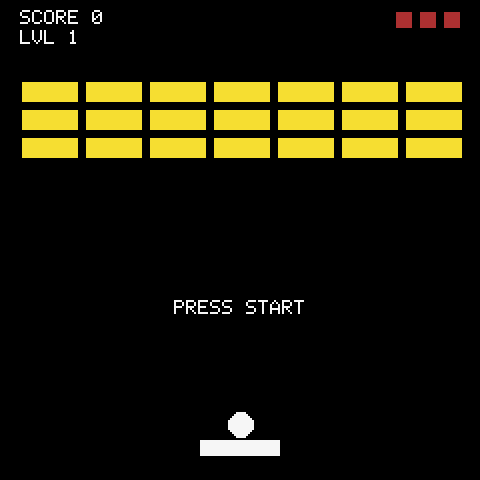

# Brick Breaker

> **Demonstration project** — provided as an example of what the PixelRoot32
> Game Engine can do. It is not a product: parts may be incomplete,
> experimental, or deliberately simplified to keep one idea in focus.

Classic **Breakout**: a paddle, a ball, and a wall of bricks. The ball bounces
off walls and the paddle, bricks take multiple hits and change colour before
they break, and every hit throws an `Explosion` burst off the impact point.
Three lives, a score counter, and a level ladder that adds rows, carves gaps
and raises hit points as you climb.

What this demo is really about is **how physics, particles and audio sit on
top of the scene without leaking into each other**. `BallActor` is a
`RigidActor` whose wall bounce is handled by the physics system and whose
paddle english is applied in the collision callback; `BrickActor` is a
`StaticActor` that disables its own collision layers the moment `hp` reaches
zero; `BrickBreakerScene` owns the brick pool, the lives/score/level state and
the single `ParticleEmitter`, and tells `MusicPlayer` *what happened* rather
than how to sound.

Language: C++17  
Engine: `gperez88/PixelRoot32-Game-Engine@^1.9.0`  
Environments: `native`, `esp32dev`  
Category: Games



## Requirements (build flags)
Set in [`lib/platformio.ini`](lib/platformio.ini) (`base` template, inherited by every environment) and [`platformio.ini`](platformio.ini) (per-environment):

| Flag | Set to | Why |
|------|--------|-----|
| `PIXELROOT32_ENABLE_PHYSICS` | `1` | `BallActor` (`RigidActor`), `PaddleActor` (`KinematicActor`), walls and bricks (`StaticActor`). Without it nothing collides or bounces. |
| `PIXELROOT32_ENABLE_AUDIO` | `1` | Five `AudioEvent`s plus a looping `MusicPlayer` track. The most expensive gate: ~17 KB RAM for the scheduler's buffers. |
| `PIXELROOT32_ENABLE_PARTICLES` | `1` | The single `Explosion` emitter on brick destruction. One emitter, fixed 50-particle pool, ~1.3 KB RAM. |
| `PIXELROOT32_ENABLE_UI_SYSTEM` | `1` | Two `UILabel`s — `GAME OVER` and `PRESS START` — owned by the scene. |
| `PIXELROOT32_ENABLE_DIRTY_REGIONS` | `1` | Only changed regions are redrawn. No visual difference, less fill work on ESP32. |
| `PIXELROOT32_ENABLE_SCENE_ARENA` | `1` | Scene entities are arena-allocated (set per-env in `platformio.ini`). |
| `PIXELROOT32_VELOCITY_DAMPING` | `0.999` | Global velocity damping override for the physics step. |
| `PIXELROOT32_MAX_VELOCITY` | `500` | Velocity clamp for the physics step. |

Engine features are compile-time modular, and a missing flag is usually **not** a
compile error — it is a black screen or silence. Turning `_PHYSICS` off here
gives you a paddle that moves and a ball that falls through everything. Turning
`_AUDIO` or `_PARTICLES` off still compiles and simply drops that feedback
channel — no call site changes, just no sound or no debris.

> **The sprite-depth flags are `#ifdef`-tested, not `#if`-tested.**
> `PIXELROOT32_ENABLE_2BPP_SPRITES` and `_4BPP_SPRITES` are checked with `#ifdef`
> (`include/platforms/EngineConfig.h:399`), so **any** value turns them on.
> Writing `-D PIXELROOT32_ENABLE_2BPP_SPRITES=0` links the 2bpp blitter *in*.
> Define the depths you want and omit the rest. The same trap applies to
> `_SCENE_ARENA`, `_TILE_ANIMATIONS`, `_PROFILING` and `_ENABLE_DEBUG_OVERLAY`.

## Platforms

| Environment | Display | Audio |
|-------------|---------|-------|
| `native` | SDL2 window, 240×240 | `SDL2_AudioBackend`, 22050 Hz, 1024-sample buffer — in [`src/platforms/native.h`](src/platforms/native.h) |
| `esp32dev` | ST7789 240×240 (TFT_MOSI 23, SCLK 18, DC 2, RST 4, SPI 40 MHz) | Default: `ESP32_I2S_AudioBackend` on BCLK 26 / LRCK 25 / DOUT 22, 22050 Hz — in [`src/platforms/esp32_dev.h`](src/platforms/esp32_dev.h). Comment documents the optional internal **DAC** backend on GPIO 25 instead. |

Display size is 240×240 in both `platformio.ini` environments (`PHYSICAL_DISPLAY_*`).
`LOGICAL_*` defaults to the physical size — lowering it is the engine's main
RAM lever on ESP32. Pin choices for I2S / DAC and the six-button `InputConfig`
(SDL scancodes on native, GPIOs on ESP32) live in the same two platform
headers.

## Screen layout
```text
 0  ┌────────────────────────┐
    │ SCORE 0          ■ ■ ■ │  HUD: score/level + lives (top bar, 20 px)
20  ├────────────────────────┤
    │                        │
    │   brick grid           │  7 cols × up to 7 rows, 30×12 px each
    │   32 px × 14 px pitch  │  offset centred, rows added/carved per level
    │                        │
    ├────────────────────────┤
    │         ●              │  ball (6 px, RigidActor)
    │      ▬▬▬▬▬▬            │  paddle (40×8 px, KinematicActor)
240 └────────────────────────┘
```

`BORDER_TOP` is 20 px — the HUD strip where `draw()` writes `SCORE` / `LVL`
and draws the three life rectangles. Walls are three invisible `StaticActor`s
(top + left + right, 10 px thick, `setBounce(true)`); the bottom is open and
costs a life.

## Controls

| Action | How |
|--------|-----|
| Move paddle | Left / Right (arrow keys on native, GPIO pad on ESP32 — see `InputConfig` in the platform header) |
| Launch ball | Start / Enter — ball is attached to the paddle until the first press, then `launch({120, -120})` hands it to physics |
| Restart after game over | Start / Enter again — `init()` rebuilds the pool, resets score/lives/level and re-attaches the ball |

The paddle uses `KinematicActor::moveAndSlide()` with frame-rate-independent
`deltaTime` scaling and screen-width clamping. The ball's pre-launch stick is
not physics at all — `attachTo(paddle)` just follows the paddle position until
`launch()` sets `isLaunched = true`.

## Gameplay

### Ball and paddle

`BallActor` (`RigidActor`, radius 6 px) and `PaddleActor` (`KinematicActor`,
40×8 px) demonstrate the hybrid collision model this engine encourages:

1. **Wall** — fully automatic. `StaticActor` walls with `setBounce(true)` and
   `CollisionShape::AABB`; physics reflects the velocity, `onWorldCollision()`
   only plays `WALL_HIT`.
2. **Paddle** — gameplay-modified. `onCollision()` reads the hit offset across
   the paddle width and applies english to `velocity` before physics integrates
   the next step.
3. **Brick** — gameplay-driven. `onCollision()` calls `brick->hit()`, awards
   score through `BrickBreakerScene::addScore()`, and fires the emitter.

Collision filtering is four layers in [`src/GameLayers.h`](src/GameLayers.h):
`BALL`, `BRICK`, `PADDLE`, `WALL`. Bricks mask only `BALL`; the ball masks all
three others.

### Bricks and levels

`BrickActor` (`StaticActor`, 30×12 px, `AABB`, `setBounce(true)`) carries `hp`
and `active`. `getColor()` maps hit points to a palette slot — 4 HP dark gray,
3 HP red, 2 HP orange, 1 HP yellow — with a black 1 px outline. `hit()`
decrements `hp` and, at zero, clears both collision layer and mask so the dead
brick costs no further checks.

Levels are built in `loadLevel()`:

* Grid is 7 columns, spacing 32×14 px, centred via `offsetX`.
* Rows start at 3 and grow as `3 + level/2`, capped at 7.
* Even levels carve a checkerboard (`(row+col)%2==0` skipped); level ≥ 3 carves
  a 3-wide gap in row 1. The result is a recognisable pattern per level without
  storing any level data.
* HP scales with depth and level: level 1 is all 1 HP; later levels use
  `baseHP = rows - row` plus `level/2`, clamped to 1–4, so the back rows are
  always tougher.

Level clear is "no active brick left in the pool"; the scene then bumps
`currentLevel`, rebuilds the grid and re-attaches the ball.

### Object pool

Bricks are **pooled, not allocated per level**. `init()` pre-allocates
`MAX_BRICK_POOL = 64` (`7×7 = 49` worst case, rounded to a power of two) as
`unique_ptr<BrickActor>` and a `bitset<64>` tracks which slots are live.
`loadLevel()` reuses slots, `activeBrickCount` avoids scanning the whole pool
when it can. No `new`/`malloc` runs inside the game loop — the same discipline
the engine's own demos teach.

### Lives and score

Three lives, drawn as `8×8` red rectangles top-right. Falling below the bottom
edge (`position.y > logicalHeight`) costs one life, plays `LIFE_LOST`, and
re-attaches the ball; at zero lives `gameOver = true` stops the level check
and shows `GAME OVER` / `PRESS START TO RETRY`. `MusicPlayer` is stopped on
game over and restarted on the next launch.

## Particles

One `ParticleEmitter` using `ParticlePresets::Explosion`, owned by the scene
and exposed via `getParticleEmiter()` so `BallActor` can trigger it on
`BRICK_CRACK`. Same pool size as the chess demo — 50 slots, ~1.3 KB — and the
same engine detail: `update()` ages by one step per call, so stepping at a
fixed rate decouples burst lifetime from frame rate. The preset is correct here
because the background is `GBC` palette and the burst does not fade toward
`Color::Black` (`0x0000`, transparent in the 8bpp ESP32 framebuffer).

## Sound

Five one-shot cues in [`src/GameConstants.h`](src/GameConstants.h) (`sfx::`):

| Cue | Wave | What it is |
|-----|------|------------|
| `PADDLE_HIT` | Pulse 520 Hz, 95 ms, duty 0.125 | Narrow pulse — the ball leaving the paddle. |
| `WALL_HIT` | Pulse 205 Hz, 120 ms, duty 0.5 | Thicker duty than the paddle, lower pitch — a wall thud. |
| `BRICK_CRACK` | Noise 900 Hz, 50 ms + `INSTR_SNARE` | Noise crumble overlay for the brick hit. |
| `LIFE_LOST` | Pulse 290→95 Hz sweep, 400 ms | Falling sweep for losing a life. |
| `START_GAME` | Pulse 1500→420 Hz sweep, 180 ms + `INSTR_PULSE_LEAD` | Rising sweep for launch / level clear / restart. |

All cues are `AudioEvent` aggregates assigned by named fields, played with
`engine.getAudioEngine().playEvent(sfx::...)`. Build with
`-D PIXELROOT32_ENABLE_AUDIO=0` for a silent build — call sites still compile,
they just do nothing.

BGM is a looping `MusicPlayer` track in [`src/assets/BrickAudioTracks.h`](src/assets/BrickAudioTracks.h):

* **Triangle bass** — root–fifth walk (Am / G / F / G) in eighth notes.
* **Pulse lead** — arpeggiated C–E–G / G–B–D / F–A–C / G–B–D pattern.
* **Drums** — kick / hihat / snare grid (`INSTR_KICK` / `HIHAT` / `SNARE`).
* Loop is 16 beats (32 eighths); durations are in beats where quarter = 1.0.
* `BGM_STAGE` is a `MusicTrack` with `WaveType::TRIANGLE`; tempo is
  `1.18 + (level-1) * 0.032` via `tempoForLevel()` and refreshed on every
  `loadLevel()` and `setupMusic()` so later levels push slightly faster.

`MusicPlayer` is created in the scene constructor with master volume `0.6` and
stopped explicitly on game over.

## Build

```bash
pio run -e native                    # SDL2 simulator
pio run -e native --target exec      # build and run it
pio run -e esp32dev                  # ESP32 firmware
pio run -t clean -e native
```

PlatformIO fetches the engine itself — `gperez88/PixelRoot32-Game-Engine@^1.9.0`,
which in turn pulls `gperez88/PixelRoot32-APU@^2.0.0` for the audio core — so no
local engine checkout is needed. Native builds also need SDL2: from MSYS2/MinGW
on Windows, `libsdl2-dev` on Linux, `brew install sdl2` on macOS. The
[`platformio.ini`](platformio.ini) here ships with the Windows/MSYS2 include and
library paths; remove the `-IC:/msys64/...`, `-LC:/msys64/...` and `-mconsole`
flags on the other two, and on macOS uncomment the Homebrew lines next to them.

## Upload (ESP32)

```bash
pio run -e esp32dev --target upload
pio device monitor                   # 115200 baud
```

## Project layout

```text
brick_breaker/
├── platformio.ini            # native + esp32dev
├── lib/platformio.ini        # shared base flags and engine feature switches
└── src/
    ├── main.cpp              # platform selector only
    ├── BrickBreakerScene.h/.cpp # scene, level gen, lives/score, music control, brick pool
    ├── GameConstants.h       # dimensions, BTN_* ids, sfx:: AudioEvents
    ├── GameLayers.h          # BALL / BRICK / PADDLE / WALL collision layers
    ├── actors/
    │   ├── BallActor.h/.cpp    # RigidActor, attach/launch/reset, english + brick hit
    │   ├── PaddleActor.h/.cpp  # KinematicActor, horizontal input + clamping
    │   └── BrickActor.h/.cpp   # StaticActor, hp/active, colour by hp, hit()
    ├── assets/
    │   └── BrickAudioTracks.h  # BGM_STAGE MusicTrack + tempoForLevel()
    └── platforms/
        ├── native.h          # SDL2, provides main()
        └── esp32_dev.h       # ST7789 + I2S (or DAC), provides setup()/loop()
```

## Memory

Nothing allocates in the loop. Bricks are pooled at `init()` time, walls and
paddle/ball are fixed `unique_ptr`s, and the emitter's 50-particle pool is a
single fixed allocation. `MAX_BRICK_POOL = 64` is sized for the worst-case
`7×7` grid.

The demo's own RAM is dominated by that pool and the emitter (~1.3 KB for
particles plus ~64 × `BrickActor`); the two large costs are the engine's, not
the game's: the 8bpp logical framebuffer is 240×240 = 57,600 bytes and the
audio scheduler is about 17 KB.

## Not in this version

* **Power-ups / multi-ball** — would need a ball pool and a drop table that
  dwarf the current scene.
* **Saved high score** — the ESP32 build has no filesystem configured.
* **Touch / mouse aiming** — input is the six-button `InputConfig`; the paddle
  is digital left/right by design.
* **Sprite art for bricks** — bricks are filled rectangles tinted by `hp` so the
  demo stays focused on physics and pooling rather than asset generation.

## Engine documentation

- [PixelRoot32 Game Engine](https://github.com/PixelRoot32-Game-Engine/PixelRoot32-Game-Engine)
- [Audio](https://github.com/PixelRoot32-Game-Engine/PixelRoot32-Game-Engine/blob/main/docs/audio.md)
- [Physics & collision](https://github.com/PixelRoot32-Game-Engine/PixelRoot32-Game-Engine/blob/main/docs/physics.md)
- [Particles](https://github.com/PixelRoot32-Game-Engine/PixelRoot32-Game-Engine/blob/main/docs/particles.md)
- [Scene manager](https://github.com/PixelRoot32-Game-Engine/PixelRoot32-Game-Engine/blob/main/docs/scene-manager.md)
- [Sprite renderer](https://github.com/PixelRoot32-Game-Engine/PixelRoot32-Game-Engine/blob/main/docs/sprite-renderer.md)

---

**Source code:** https://github.com/PixelRoot32-Game-Engine/PixelRoot32-Demo-Projects/tree/main/games/brick_breaker
