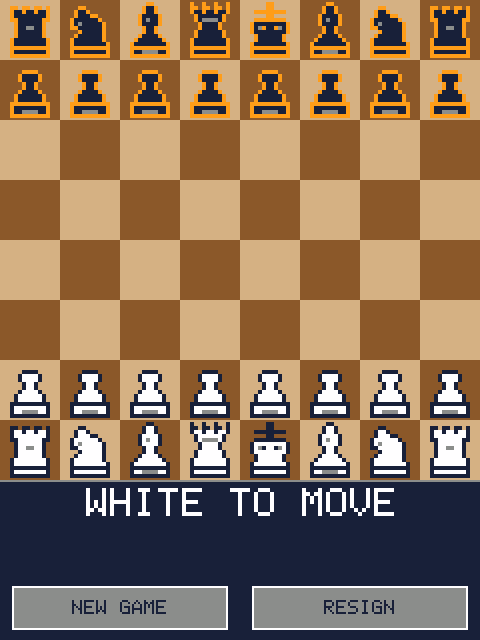

# Chess

> **Demonstration project** — provided as an example of what the PixelRoot32
> Game Engine can do. It is not a product: parts may be incomplete,
> experimental, or deliberately simplified to keep one idea in focus.

Two players share one device and take turns dragging pieces across the board.
Every traditional rule is implemented: castling, en passant, promotion, check,
checkmate, stalemate, the fifty-move rule, threefold repetition and insufficient
material.

What this demo is really about is the **separation between rules and
presentation**. Everything in [`src/chess/`](src/chess/) is pure data and pure
functions with no engine dependency at all, which is what makes it testable on
the host: the suite in [`test/`](test/) verifies move generation with
[perft](https://www.chessprogramming.org/Perft_Results) against five published
reference positions. The scene layer owns no rules; it turns touch gestures into
calls and draws what it is told.

The same split runs one level further out. [`ChessSfx`](src/assets/audio/ChessSfx.h)
and [`ChessEffects`](src/effects/ChessEffects.h) are told *what happened* — a
knight was taken on this square — and decide for themselves what that sounds and
looks like. That is what keeps the engine's audio and particle headers, and their
feature guards, out of `ChessScene` entirely.

Language: C++17  
Engine: `gperez88/PixelRoot32-Game-Engine@^1.9.0`  
Environments: `native`, `esp32cyd`, `host_test`  
Category: Games



## Requirements (build flags)
Set in [`lib/platformio.ini`](lib/platformio.ini):

| Flag | Set to | Why |
|------|--------|-----|
| `PIXELROOT32_ENABLE_TOUCH` | `1` | Touch is the only input this demo has. Its default is `0`, and with it off the game compiles, runs, and never receives a single event. |
| `PIXELROOT32_ENABLE_4BPP_SPRITES` | *defined* | Pieces are 4bpp sprites, the same format the other engine demos use. |
| `PIXELROOT32_ENABLE_UI_SYSTEM` | `0` | The HUD is two buttons hit-tested with a rectangle test in the scene. `UIManager` would only add flash. |
| `PIXELROOT32_ENABLE_AUDIO` | `1` | Move, capture, check and checkmate cues. This is the most expensive gate in the demo: roughly 17 KB of RAM, nearly all of it the scheduler's own buffers. |
| `PIXELROOT32_ENABLE_PARTICLES` | `1` | Debris thrown off a captured square. One emitter, fixed 50-particle pool, ~1.3 KB RAM. |
| `PIXELROOT32_ENABLE_CAMERA_EFFECTS` | `1` | The screen shake on a capture. The board never scrolls, so this flag is the only reason a camera exists in the demo at all. |
| `PIXELROOT32_ENABLE_PHYSICS` | `0` | Nothing collides; legality is decided by the rules core, not by geometry. |
| `PIXELROOT32_ENABLE_SCENE_TRANSITIONS` | `0` | Default `1`. There is exactly one scene. |
| `PIXELROOT32_ENABLE_STATIC_TILEMAP_FB_CACHE` | `0` | Default `1`. Nothing here draws a tilemap. |

Palette selection has its own three flags — see [Palettes](#palettes).

Engine features are compile-time modular, and a missing flag is usually **not** a
compile error — it is a black screen or a dead panel. Turning `_TOUCH` off here
gives you a board that renders and never responds.

The three optional ones degrade cleanly instead: `-D PIXELROOT32_ENABLE_AUDIO=0`,
`-D PIXELROOT32_ENABLE_PARTICLES=0` and `-D PIXELROOT32_ENABLE_CAMERA_EFFECTS=0`
each still compile and simply drop that feedback channel. No call site changes.

> **The sprite-depth flags are `#ifdef`-tested, not `#if`-tested.**
> `PIXELROOT32_ENABLE_2BPP_SPRITES` and `_4BPP_SPRITES` are checked with `#ifdef`
> (`include/platforms/EngineConfig.h:399`), so **any** value turns them on.
> Writing `-D PIXELROOT32_ENABLE_2BPP_SPRITES=0` links the 2bpp blitter *in*.
> Define the depths you want and omit the rest — which is why the 2bpp flag does
> not appear in `lib/platformio.ini` at all. The same trap applies to
> `_SCENE_ARENA`, `_TILE_ANIMATIONS`, `_PROFILING` and `_ENABLE_DEBUG_OVERLAY`.

## Palettes

A `Color` is an **index**, not a colour. `Color::Magenta` is `#CECECE` under
PR32 and something else entirely under GB. So the palette the engine has loaded
decides what every colour in this demo actually looks like, and the demo now
says which one that is instead of riding the default.

Set in [`lib/platformio.ini`](lib/platformio.ini), applied by
[`applyPalettes()`](src/ChessPalettes.cpp):

| Flag | Default | Effect |
|------|---------|--------|
| `CHESS_BACKGROUND_PALETTE` | `PR32` | The board squares. Any `PaletteType`: `PR32`, `NES`, `GB`, `GBC`, `PICO8`. |
| `CHESS_SPRITE_PALETTE` | `PR32` | The pieces, highlights, HUD and debris. |
| `CHESS_CUSTOM_BACKGROUND` | `0` | `1` draws the board through the generated 16-slot table instead. |

The board and the pieces run on **separate palettes** — dual palette mode — so
either reskins without touching the other.

### Changing them

There are three different things a developer usually means by "change the
colours", and they are edited in three different places.

**1. Swap in one of the engine's palettes.** One flag, nothing to regenerate:

```ini
-D CHESS_BACKGROUND_PALETTE=GB      ; Game Boy board, PR32 pieces
```

**2. Stay on PR32, use different slots.** If the board should be blue instead of
green, that is not a palette change — it is a change of *which index* the board
asks for. Board squares, highlights and HUD live in
[`src/ChessConstants.h`](src/ChessConstants.h); the piece outline, body and
accent live in `WHITE_PALETTE` / `BLACK_PALETTE` in
[`tools/generate_pieces.py`](tools/generate_pieces.py). Editing the piece side
means re-running the generator.

**3. Ship your own 16-colour table.** Add it to `PALETTES` in the generator,
point `CUSTOM_PALETTE` at it, regenerate, and turn the flag on:

```python
# tools/generate_pieces.py — RGB888, one entry per slot
SLATE = dict(PR32)
SLATE[14] = (0xC4, 0xCE, 0xDA)   # light square
SLATE[5]  = (0x3A, 0x4A, 0x5C)   # dark square

PALETTES = {"PR32": PR32, "Wood": WOOD, "Slate": SLATE}
CUSTOM_PALETTE = "Slate"
```

```bash
python tools/preview_board.py slate.png Slate   # look at it first
python tools/generate_pieces.py                 # emits ChessCustomPalette.h
```

```ini
-D CHESS_CUSTOM_BACKGROUND=1
```

The table is **generated, never hand-written**, so `check_contrast()` can
validate it like any other. `rgb565()` rounds rather than truncates, and
`check_packing()` holds it to the engine's own `PALETTE_PR32` slot for slot —
`>> 3` and `>> 2` reproduce only about half that table, so a hand-packed palette
would quietly shift every slot it meant to leave alone.

> **What the guard does and does not cover.** `check_contrast()` walks the
> entries in `PALETTES` — PR32 and Wood as shipped, plus anything you add. It
> knows nothing about `NES`, `GB`, `GBC` or `PICO8`: those live inside the
> engine, and selecting one with `CHESS_BACKGROUND_PALETTE` is **not** checked.
> `preview_board.py` cannot render them either. Switching to a built-in is a
> whole-board recolour you will see immediately on screen — just do not read the
> guard's silence as approval of it.

### Two things that are easy to get wrong

**Dual mode alone does not split anything.** Only primitives — rectangles,
lines, circles, text — consult the render context, and they fall back to
`PaletteContext::Sprite` when none is set. `Sprite4bpp` ignores the context
entirely and always resolves through the sprite palette slot. So the board
squares reach the background palette only because `drawBoard()` opens a
`PaletteScope`; without it the background palette would be configured and never
read. `PaletteScope` restores the previous context on the way out rather than
clearing it, which is what makes nesting safe — and the renderer stores a
**pointer** to the context, so the value has to outlive the drawing.

**`setDualPalette()` does not move `currentPalette`.** The engine keeps three
pointers, and the single-argument `resolveColor(Color)` reads `currentPalette`
while ignoring dual mode completely. `ParticleEmitter` resolves through exactly
that overload. Call only the dual setter and the capture debris keeps the old
palette while everything else moves — no error, no obvious cause. `setPalette()`
is therefore called **first**, because it is the one call that points all three
at once.

Whatever you pick, re-run `python tools/generate_pieces.py`. Its
`check_contrast()` runs once per registered palette and fails the run rather
than shipping a piece outline nobody can see — a colour that reads under PR32
can still vanish under a custom table, because a `Color` is a slot number and
what it looks like is whatever table is loaded. That is not hypothetical: the
dark pieces were rimmed in `Color::Magenta` — the light square's own `#CECECE` —
until the guard existed to catch it.

## Platforms

| Environment | Display | Touch | Audio |
|-------------|---------|-------|-------|
| `native` | SDL2 window, 240×320 | mouse, forwarded to the touch dispatcher by `SDL2_Drawer` | `SDL2_AudioBackend`, 22050 Hz |
| `esp32cyd` | ILI9341 240×320 (ESP32-2432S028 "Cheap Yellow Display") | XPT2046 resistive, on its own GPIO bus (32/39/25/33, IRQ 36) | onboard speaker on the internal DAC, GPIO 26 |

There is no `esp32dev` *environment*: the generic ST7789 board this demo started
from has no touch panel, and touch is the whole interaction model. (`esp32cyd`
does set `board = esp32dev` — that names the MCU module the CYD is built on, not
a second target.)

### Touch calibration

The XPT2046 flags in [`platformio.ini`](platformio.ini) match the 2432S028: the
ADC axes are swapped relative to the display and X is mirrored after the swap.
If taps land offset on your unit, touch the four corners with the serial monitor
open and retune `XPT2046_RAW_X_LO` / `_HI` and `XPT2046_RAW_Y_LO` / `_HI`.

## Screen layout
```text
 0   ┌────────────────────────┐
     │                        │
     │   board, 8 × 30 px     │  240 × 240
     │   white at the bottom  │
240  ├────────────────────────┤
     │ WHITE TO MOVE          │  status
     │ captured pieces        │  two trays
     │ [NEW GAME]  [RESIGN]   │  buttons
320  └────────────────────────┘
```

30 px per square is the largest cell size that divides the 240 px panel evenly.
Pieces are 28×28 `Sprite4bpp`s stored at their final size, leaving a 1 px margin
inside the cell. They are *stored* rather than scaled because the renderer has no
scaled draw for `Sprite4bpp` — only the 1bpp `Sprite` and `MultiSprite` paths take
a scale factor — so the generator emits the board size and the 14 px tray size as
two separate bitmaps.

## Controls

Touch only.

| Action | How |
|--------|-----|
| Move a piece | Press it and drag. Legal destinations appear as dots, captures as rings, and the square under your finger is outlined. Release on it. |
| Cancel | Release off the board, or on any square the piece cannot reach. Pressing and releasing without moving also puts the piece straight back down. Nothing moves. |
| Promote | The picker opens over the board; tap queen, rook, bishop or knight. Tapping outside cancels the move. |
| New game | Tap `NEW GAME`. |
| Resign | Tap `RESIGN`. The other player wins. |

Pieces move by dragging, not by tapping twice. The engine's touch state machine
makes the two impossible to confuse: a release that followed a drag emits only
`DragEnd`, with no `TouchUp` and no `Click`, so a piece dropped near the bottom
of the board can never also press a HUD button.

A carried piece is drawn half a square above the finger so it stays visible.
Aiming goes by the outlined square under the finger, not by the piece.

The board also shows the previous move (cyan outline on both squares) and a red
double outline on a king that is in check.

## Capture feedback

Taking a piece jolts the board and throws debris off the square, sized by what
was taken — see [`src/effects/ChessEffects.cpp`](src/effects/ChessEffects.cpp):

| Captured | Shake | Debris |
|----------|-------|--------|
| Pawn | 2 px, 110 ms | 16 particles |
| Knight, bishop | 3 px, 160 ms | 26 |
| Rook | 4 px, 200 ms | 36 |
| Queen | 5 px, 260 ms | 46 |

Trading pawns happens constantly and must not become annoying; losing a queen
should be felt.

The counts sit just under `MAX_PARTICLES_PER_EMITTER`, which is **50** and is a
hard engine boundary. Filling that pool is close to free: the emitter's update
and draw loops run over all 50 slots every frame no matter how many particles
are alive, so a bigger burst adds **no iteration at all** — only a colour
interpolation and one 2×2 blit per particle that is actually live, and only
while it is live. Going past 50 means a second emitter, which costs about 1.3 KB
of RAM *and* a second permanent 50-slot loop every frame even when the board is
still. That is the trade worth weighing, not the count.

### The debris runs on its own clock

`ParticleEmitter::update()` ignores the delta it is handed and ages every
particle by exactly **one step per call** — a lifetime is counted in calls, not
in seconds. Stepping it once per frame would therefore tie a burst to the frame
rate, and the two targets here are nowhere near each other: the native loop has
no cap beyond `SDL_Delay(1)` and runs several hundred frames a second, which
burns a 28-step life in well under a tenth of a second, while the CYD's ~25 fps
stretches the same burst past a second. That is what made the first version of
this effect nearly invisible on the simulator.

`ChessEffects` accumulates milliseconds and steps the emitter at a fixed **25 Hz**
instead, capped at two steps per frame so a stalled frame cannot spend a whole
burst at once. A burst lasts the same 0.5–1.1 s of wall-clock time on both
targets, and on native it is strictly *less* work than stepping every frame.

Particles are drawn as fixed 2×2 rectangles — the size is not configurable — so
count, spread and lifetime are the only levers on how visible a burst is.

The shake is a renderer offset applied for one drawing pass, so it moves the
board, the pieces and the debris — **and nothing else**. The HUD and the
promotion picker are drawn outside that pass on purpose: a jolt that moved the
buttons would make them harder to hit, which is the opposite of feedback. While
the board is offset, one or two screen edges expose whatever `beginFrame()` left
there; with dirty regions off, as this demo builds, that is a full clear, so the
gap reads as a clean black border.

En passant is the one capture whose victim is not standing on the destination
square, so the burst is placed on the captured pawn rather than on the square the
capturing pawn landed on.

Three engine details shape this code:

- **The two gates are not symmetric.** `CameraEffects.h` ships a
  same-signature stub when `PIXELROOT32_ENABLE_CAMERA_EFFECTS` is `0`, so shake
  calls compile either way. `ParticleEmitter.h` has no stub — the entire header
  sits inside its `#if` — so every particle member and call needs a guard. That
  is why the emitter lives in [`ChessEffects`](src/effects/ChessEffects.h) and
  not in `ChessScene`.
- **Debris must never fade to `Color::Black`.** Particles interpolate from their
  start colour to their end colour over their life, and `Color::Black` is RGB565
  `0x0000` — the byte the 8bpp framebuffer reads as transparent. A fade to black
  is a fade to nothing on the ESP32 while looking correct under SDL2. This rules
  out `ParticlePresets::Explosion` and `::Smoke`, which both end on
  `Color::Black`.
- **Both ends of the fade are high-luminance.** Half the board is DarkGreen
  `#0E7A0D`, so a bright-to-dark fade reads on the light squares and sinks into
  the dark ones. The demo goes Yellow `#FFD500` → Orange `#FF9F1C` and lets the
  staggered lifetimes thin the burst out instead of dimming it.

`CameraEffectsSystem::getOffset()` also draws fresh random numbers on **every**
call, so the whole pass is built from a single sample — two calls in one frame
would tear the board against its own pieces.

## Sound

Four cues, defined in [`src/assets/audio/ChessSfx.cpp`](src/assets/audio/ChessSfx.cpp):

| Cue | What it is |
|-----|------------|
| Move | A 55 ms triangle blip falling G4→D4 — a piece being set down. Deliberately quiet: you hear it forty times a game. |
| Capture | Two layers at once: a noise transient for the impact, and a pulse falling 260→90 Hz on an exponential curve for the weight under it. |
| Check | A two-step rise D5→A5 on a 25% duty pulse. Narrow duty keeps it audible *over* the move cue, which plays underneath it. |
| Checkmate | A four-step descent C5→G#4→F4→C4 with a low triangle pedal. It plays alone — no capture thud under it. |

Check and checkmate are pitch **envelopes**, not sweeps: a pitch envelope holds
between breakpoints instead of gliding, so the points read as separate notes.
Four is the ceiling (`kMaxSfxPitchPoints`).

There are no `InstrumentPreset`s here on purpose. A preset is a 17-field
aggregate and `AudioEvent::preset` is field **7**, not the last one, so a
positional brace-init that looks correct silently produces the wrong sound
rather than failing to build. Every field is assigned by name instead.

Effects share the four-slot SFX voice subpool (voices 4–7) and can only steal
from each other, so the busiest moment — a capture that also gives check, three
voices — still fits.

[`ChessSfx.h`](src/assets/audio/ChessSfx.h) exposes nothing but an enum and
`playSfx()`. The scene reports *what happened*; choosing a waveform is the audio
module's job, and keeping the audio headers out of the scene is what lets the
whole thing be driven under test without the APU library.

> **Speaker pin.** GPIO 26 is DAC2 and is where the speaker sits on the common
> ESP32-2432S028. Board revisions vary; DAC1 is GPIO 25, and the internal DAC
> does not exist at all on the S3 or C3.

Build with `-D PIXELROOT32_ENABLE_AUDIO=0` for a silent build — `playSfx()`
becomes an empty function and no call site changes.

## Build

```bash
pio run -e native                    # SDL2 simulator
pio run -e native --target exec      # build and run it
pio run -e esp32cyd                  # ESP32-2432S028 firmware
pio run -t clean -e native
```

PlatformIO fetches the engine itself — `gperez88/PixelRoot32-Game-Engine@^1.9.0`,
which in turn pulls `gperez88/PixelRoot32-APU@^2.0.0` for the audio core — so no
local engine checkout is needed. Native builds also need SDL2: from MSYS2/MinGW
on Windows, `libsdl2-dev` on Linux, `brew install sdl2` on macOS. The
[`platformio.ini`](platformio.ini) here ships with the Windows/MSYS2 include and
library paths; remove the `-IC:/msys64/...`, `-LC:/msys64/...` and `-mconsole`
flags on the other two, and on macOS uncomment the Homebrew lines next to them.

## Upload (ESP32)
```bash
pio run -e esp32cyd --target upload
pio device monitor                   # 115200 baud
```

## Tests

```bash
pio test -e host_test
```

`host_test` builds only [`src/chess/`](src/chess/) and needs no display, no SDL2
and no board. It runs two suites, 37 tests in total:

- `test/test_rules` (18) — move generation, including perft counts for the
  starting position and four standard trap positions (Kiwipete, en passant
  discovered check, promotions, castling rights).
- `test/test_game` (19) — turn order, terminal states, captures, the fifty-move
  rule and threefold repetition.

`build_src_filter = +<chess/>` is what keeps this suite buildable on a bare host:
it excludes the scene, the effects and the audio module, all of which link
against the engine. **They are therefore not covered here** — the rules are
verified, the presentation is not. Perft is the strong guarantee in this demo;
everything above `src/chess/` is checked by building it.

> `-D UNITY_SUPPORT_64` is not optional. Perft counts past depth 4 exceed 32
> bits, and without it Unity fails those assertions with "64-bit Support
> Disabled" rather than comparing them.

## Project layout

```text
chess/
├── platformio.ini            # native + esp32cyd + host_test
├── lib/platformio.ini        # shared base flags and engine feature switches
├── tools/
│   ├── generate_pieces.py    # regenerates src/assets/*.h
│   └── preview_board.py      # renders the board to a PNG, no build needed
├── test/
│   ├── test_rules/           # perft and move-generation tests
│   └── test_game/            # match state tests
└── src/
    ├── main.cpp              # platform selector only
    ├── ChessConstants.h      # layout and the Color slots the demo picks
    ├── ChessPalettes.h/.cpp  # which engine palettes load, and where each applies
    ├── ChessScene.h/.cpp     # touch interaction and rendering
    ├── assets/
    │   ├── audio/
    │   │   ├── ChessSfx.h    # enum + playSfx(), no audio includes
    │   │   └── ChessSfx.cpp  # the four AudioEvents
    │   ├── README.md         # regeneration guide, packing format, palette traps
    │   ├── ChessPalette.h        # GENERATED — nibble -> Color, per side
    │   ├── ChessCustomPalette.h  # GENERATED — a full 16-slot RGB565 table
    │   └── ChessPieces.h         # GENERATED — do not edit by hand
    ├── chess/
    │   ├── ChessRules.h/.cpp # board, move generation, legality (no engine deps)
    │   └── ChessGame.h/.cpp  # match state, history, terminal detection
    ├── effects/
    │   └── ChessEffects.h/.cpp # capture shake and debris
    └── platforms/
        ├── native.h          # SDL2, provides main()
        └── esp32_cyd.h       # CYD, provides setup()/loop()
```

## Memory

Nothing allocates — there is no `new`, no `malloc` and no growing container
anywhere in the demo. Everything is a fixed-size array sized at compile time.

Measured on a 32-bit build, which is what the ESP32 is:

| | Bytes |
|---|---|
| `chess::Position` | 70 |
| `chess::Move` | 4 |
| `chess::MoveList` | 1,021 |
| `chess::ChessGame` | 4,744 |
| `ChessEffects` | ~1,380 |

`ChessGame` is almost entirely history: 300 plies of moves plus 300 Zobrist keys,
which is what the threefold-repetition rule needs to look back through. The
Zobrist table itself is `constexpr`, so its 8 KB lives in flash rather than RAM.
`ChessEffects` is dominated by the emitter's 50-particle pool; the camera effects
are four fixed slots and the camera is a handful of scalars.

That puts everything the chess demo itself owns at roughly **6.3 KB**. The two
large costs are the engine's, not the game's: the 8bpp logical framebuffer is
240 × 320 = 76,800 bytes, and the audio scheduler is about 17 KB — more than
twice everything else in the demo combined.

The sprites are flash, not RAM; [`src/assets/README.md`](src/assets/README.md)
documents the two sizes each piece is stored at and why.

## License
The piece sprites are **original work for this demo**, drawn as 14×14 character
grids inside [`tools/generate_pieces.py`](tools/generate_pieces.py) against the
16-colour PR32 palette, and the board squares are drawn from those palette slots
directly. Regenerate the headers with:

```bash
python tools/generate_pieces.py
```

To review the art without building anything — handy when the toolchain is not
cooperating — render it straight from the same grids:

```bash
python tools/preview_board.py board.png
```

The two sides share every bitmap and differ only by the palette passed at draw
time: white is a `White` body with a `Navy` outline, black a `Navy` body with an
`Orange` rim. The warm rim is what separates a dark piece from the light grey
square **by hue** rather than by brightness — a light rim reads on the dark
squares and disappears on the light ones, which is exactly what happened while
that rim was `Color::Magenta`, the light square's own colour.

`check_contrast()` in the generator now refuses to emit art with that problem:
every drawn colour is measured against both board squares and against its own
palette, and anything closer than an RGB distance of 60 fails the run. Nothing
downstream can catch it — the header compiles and the sprite draws, the outline
is simply not there.

[`src/assets/README.md`](src/assets/README.md) documents the packing format and
the two palette traps worth knowing before drawing anything for this engine:
`Color::Black` resolves to RGB565 `0x0000`, which packs to the byte the 8bpp
framebuffer reads as **transparent** — so a black pixel draws on the SDL2 build
and vanishes on the ESP32 — and `Color::Magenta` is `#CECECE`, a light grey, not
magenta at all.

## Not in this version

v1 is scoped to a complete two-player game. Left out deliberately, and why:

- **Computer opponent** — a search needs a time budget and an evaluation
  function that would dwarf the rest of this demo.
- **Move history, undo/redo, saved games** — the ESP32 build has no filesystem
  configured, and a scrollable history panel needs the 80 px the HUD already
  spends on the status line, capture trays and buttons.
- **Runtime theme switching, clocks, and a sound on/off toggle** — there is
  no settings screen to hang any of them on. Palettes themselves *are*
  configurable, just at build time rather than from a menu; see
  [Palettes](#palettes). Sound is implemented.

## Engine documentation

- [PixelRoot32 Game Engine](https://github.com/PixelRoot32-Game-Engine/PixelRoot32-Game-Engine)
- [Touch input](https://github.com/PixelRoot32-Game-Engine/PixelRoot32-Game-Engine/blob/main/docs/touch-input.md)
- [Sprite renderer](https://github.com/PixelRoot32-Game-Engine/PixelRoot32-Game-Engine/blob/main/docs/sprite-renderer.md)

---

**Source code:** https://github.com/PixelRoot32-Game-Engine/PixelRoot32-Demo-Projects/tree/main/games/chess
