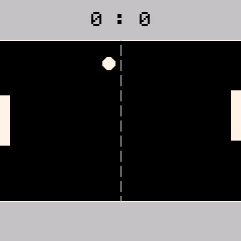

# Pong

> **Demonstration project** — provided as an example of what the PixelRoot32
> Game Engine can do. It is not a product: parts may be incomplete,
> experimental, or deliberately simplified to keep one idea in focus.

Player versus CPU Pong inside a 160-pixel-tall court. The single idea it is
about is the **physics solver's elastic response**: the ball is a `RigidActor`
with restitution 1.0 and the paddles and walls are Kinematic/Static actors, so
wall bounces are produced by the solver — there is no `velocity.y *= -1`
anywhere in this demo. A built-in validator measures whether that claim holds
while you play.

Language: C++17  
Engine: `gperez88/PixelRoot32-Game-Engine@^1.9.0`  
Environments: `native`, `esp32dev`  
Category: Games



## Requirements (build flags)

Set in [`lib/platformio.ini`](lib/platformio.ini)'s `[base]` template, so
every environment inherits them:

- **`PIXELROOT32_ENABLE_PHYSICS=1`** — required, not optional. `RigidActor`,
  `KinematicActor`, and `StaticActor` all live behind this flag, so the demo
  does not compile without it. It is the whole point of the example.
- **`PIXELROOT32_VELOCITY_DAMPING=0.999`** and
  **`PIXELROOT32_MAX_VELOCITY=500`** — the solver's per-step damping and
  velocity ceiling (`physics/CollisionSystem.h`). The default damping bleeds
  energy out of a rally, which is exactly what a Pong ball must not do; 0.999
  keeps the ball's speed where the collision response put it.
- **`PIXELROOT32_ENABLE_PARTICLES=1`** — required to compile, since
  `PongScene` owns a `ParticleEmitter`. In normal play it never bursts: the
  only call site is `StressBall::onCollision`, which exists only under
  `STRESS_TEST_MODE` (see below).
- **`PIXELROOT32_ENABLE_AUDIO=1`** — needed for the paddle, wall, score, win,
  and lose cues. Building without it is not a compile error — it is silence.
- **`PIXELROOT32_ENABLE_UI_SYSTEM=0`** — the score and the game-over lines are
  `Renderer::drawTextCentered` calls, not UI widgets.

Display size is **240×240** in the project `platformio.ini` (see
`PHYSICAL_DISPLAY_*`). The court is derived from the logical size at runtime —
`PONG_PLAY_AREA_HEIGHT` (160) centred vertically — so a different resolution
re-centres it rather than clipping it.

## Platforms

| Environment | Display | Audio backend |
|-------------|---------|----------------|
| **`native`** | SDL2, 240×240 | `SDL2_AudioBackend` in [`src/platforms/native.h`](src/platforms/native.h) |
| **`esp32dev`** | **ST7789** 240×240 | `ESP32_I2S_AudioBackend` in [`src/platforms/esp32_dev.h`](src/platforms/esp32_dev.h) |

Pin choices (ST7789 SPI, I2S audio, D-pad + two buttons) are in
`src/platforms/esp32_dev.h` — edit there if your wiring differs.

## Controls

| Action | `native` (keyboard) | `esp32dev` (GPIO) |
|--------|----------------------|--------------------|
| Move left paddle | Up / Down arrows | D-pad Up / Down |
| Restart (from Game Over) | Space | Button A |

The right paddle is the CPU. First to `SCORE_TO_WIN` (5) ends the game.

## What it demonstrates
- **Three actor kinds, one scene.** The ball is a `RigidActor` (the solver
  integrates it), the paddles are `KinematicActor`s (the game writes their
  position directly and the solver only reports contacts), and the court's top
  and bottom edges are `StaticActor`s (never integrated at all). Choosing the
  right one per object is most of what the physics API asks of a game.
- **Elastic bounce with no manual reflection.** The ball sets
  `setRestitution(1.0)`, `setFriction(0)`, `setGravityScale(0)`,
  `setShape(CIRCLE)` with a matching `setRadius`, and `setBounce(true)`.
  `BallActor::onCollision` plays a sound on a wall hit and nothing else — the
  reflection has already happened.
- **"English" on the paddles.** A paddle hit is the one bounce the game *does*
  compute: the impact offset from the paddle's centre becomes the bounce angle
  (up to 75° from horizontal), and each rally hit adds 5 % speed, capped at 3×
  the serve speed. That is what makes paddle placement a control and not just
  a wall.
- **Layer/mask filtering instead of type checks.** `GameLayers.h` declares
  `BALL`, `PADDLE`, `WALL`; the ball's mask is `PADDLE | WALL`, each paddle's
  is `BALL`. `onCollision` then asks `other->isInLayer(Layers::PADDLE)` rather
  than downcasting.
- **A proportional-control CPU that can lose.** The AI paddle tracks the ball
  with a P-controller (`speed = error * 1.5`, clamped to `AI_MAX_SPEED`) plus a
  deterministic-but-noisy offset, and moves through a sub-pixel accumulator so
  slow corrections are not lost to integer truncation. Remove
  `AI_TARGET_OFFSET` and it becomes unbeatable.
- **A validator for the physics claim.**
  [`PongPhysicsValidator`](src/PongPhysicsValidator.h) samples the ball every
  frame and tracks speed drift, stuck frames, and bounce count. On restart it
  prints a PASS/FAIL report to stdout (serial on ESP32) — energy conservation
  within 2 %, no sticking. It is a worked example of checking a physics
  assumption instead of asserting it in a comment.

## Test modes

Two compile-time switches in [`src/GameConstants.h`](src/GameConstants.h),
both `false` in the committed source:

- **`STRESS_TEST_MODE`** — spawns up to `STRESS_BASE_BALL_COUNT` extra
  `RigidActor` balls, scaled down to the court area and clamped to the scene's
  remaining entity slots. This is the only path that makes the particle
  emitter burst.
- **`CCD_TEST_MODE`** — serves the ball at `CCD_TEST_BALL_SPEED` (600 px/s, 5×
  normal) to exercise the solver's continuous collision detection against the
  thin paddles.

## Project layout

```
src/
├── GameConstants.h             paddle/ball sizes, speeds, court height, test switches
├── GameLayers.h                BALL / PADDLE / WALL collision layers
├── BallActor.h/.cpp            RigidActor ball: elastic setup, english, audio
├── PaddleActor.h/.cpp          KinematicActor paddle: player input and CPU controller
├── PongPhysicsValidator.h/.cpp energy/stability metrics and the PASS/FAIL report
├── PongScene.h/.cpp            court, static walls, scoring, background, stress mode
├── main.cpp                    platform selector
└── platforms/                  native.h, esp32_dev.h — backend wiring per target
```

## Engine documentation
- [Physics API](https://github.com/PixelRoot32-Game-Engine/PixelRoot32-Game-Engine/blob/main/docs/api/physics.md)
- [Core API](https://github.com/PixelRoot32-Game-Engine/PixelRoot32-Game-Engine/blob/main/docs/api/core.md)
- [Audio API](https://github.com/PixelRoot32-Game-Engine/PixelRoot32-Game-Engine/blob/main/docs/api/audio.md)
- [Graphics / Renderer](https://github.com/PixelRoot32-Game-Engine/PixelRoot32-Game-Engine/blob/main/docs/api/graphics.md)

## Build

From **`games/pong`**:

```bash
pio run -e native
pio run -e esp32dev
```

## Upload (ESP32)

```bash
pio run -e esp32dev --target upload
```

## License

Source code: [MIT](../../LICENSE).

| Asset | Author | License | Source |
|-------|--------|---------|--------|
| All audio cues | This repository | CC0 1.0 (public domain) | Original work, synthesised at runtime from `AudioEvent` definitions in `src/` |

This demo ships no art and no generated asset headers — the court, paddles,
ball, and centre line are `Renderer` primitives resolved through the engine's
built-in PICO-8 palette, so there is nothing else here to attribute.

---

**Source code:** https://github.com/PixelRoot32-Game-Engine/PixelRoot32-Demo-Projects/tree/main/games/pong
