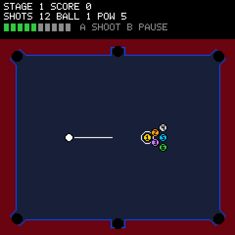
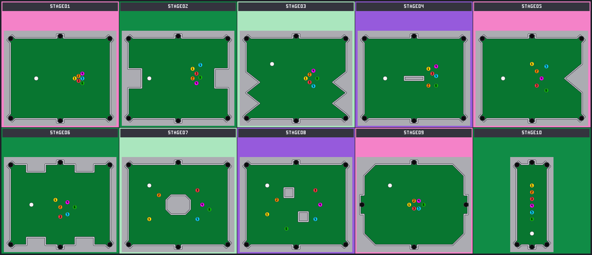

# Pool

> **Demonstration project** — provided as an example of what the PixelRoot32
> Game Engine can do. It is not a product: parts may be incomplete,
> experimental, or deliberately simplified to keep one idea in focus.

Fixed-point pool: aim the cue ball,
sink the 6 numbered targets **in ascending order**, and clear all **10 tables**
on 12 shots each. The single idea it is about is the **engine-free integer
core**: ball movement, collisions, cushions, pockets, friction, and the
turn/shot rules all run on plain integers in `src/pool/` — no engine headers,
no `float`/`double`, no heap — so the same recorded input sequence replays
bit-identically on native and on the ESP32.

Language: C++17  
Engine: `gperez88/PixelRoot32-Game-Engine@^1.10.0`  
Environments: `native`, `esp32dev`  
Category: Games



## Requirements (build flags)

Set in [`lib/platformio.ini`](lib/platformio.ini)'s `[base]` template, so
every environment inherits them. Everything the game does not use is off on
purpose — the demo is one scene, silent, with hand-drawn HUD and its own
physics core:

- **`PIXELROOT32_ENABLE_PHYSICS=0`** — deliberate. Balls integrate on the
  demo's own fixed-point core (`src/pool/`), not the engine's float-based
  `Scalar` solver. Costs ~9 KB when on.
- **`PIXELROOT32_ENABLE_AUDIO=1`** — required. One looping stage track per
  table plus win/lose jingles through `MusicPlayer`, and cue/pocket/foul
  effects through `AudioEngine` (`src/audio/PoolAudio.*`). ~17 KB, nearly
  all of it the scheduler's own buffers. The scene still compiles silent
  with the flag at 0 — every engine call in the director is fenced.
- **`PIXELROOT32_ENABLE_UI_SYSTEM=1`** — the title scene is engine widgets:
  a `UIButton` START GAME row plus two `UICheckBox` rows (MUSIC, SFX) and
  `UILabel` title/hint, all drawn by the menu scene. The HUD itself stays
  hand-drawn `drawText`. ~9 KB.
- **`PIXELROOT32_ENABLE_PARTICLES=0`** — no particle effects in v1. ~2 KB.
- **`PIXELROOT32_ENABLE_SCENE_TRANSITIONS=0`** — a single scene for the whole
  game, nothing to transition between.
- **`PIXELROOT32_ENABLE_STATIC_TILEMAP_FB_CACHE=0`** — no tilemaps; the felt
  is filled from border row spans, not a static cache.

Display size is **240×240** in the project `platformio.ini` (see
`PHYSICAL_DISPLAY_*`). The top **40 px** are a reserved HUD band; the table
area starts below it.

## Platforms

| Environment | Display | Audio backend |
|-------------|---------|----------------|
| **`native`** | SDL2, 240×240 | (–) in [`src/platforms/native.h`](src/platforms/native.h) |
| **`esp32dev`** | **ST7789** 240×240 | (–) in [`src/platforms/esp32_dev.h`](src/platforms/esp32_dev.h) |

Pin choices (ST7789 SPI, D-pad + two buttons) are in
`src/platforms/esp32_dev.h` — edit there if your wiring differs.

## Controls

| Action | `native` (keyboard) | `esp32dev` (GPIO) |
|--------|----------------------|--------------------|
| Menu: move cursor | Arrow keys Up/Down | D-pad Up/Down (32/27) |
| Menu: start / toggle | Space | Button A (13) |
| Aim: tap nudges 0.35°, hold sweeps | Arrow keys Left/Right | D-pad Left/Right (33/14) |
| Power level (tap) | Arrow keys Up/Down | D-pad Up/Down (32/27) |
| Shoot / confirm | Space | Button A (13) |
| Pause (gameplay + music) | Return | Button B (12) |

The menu is its own black-background scene (`PoolMenuScene`, bomberbot
title-screen pattern): START GAME plus two independent checks — MUSIC and
SFX, both on by default. Muting music stops the sequencer (unmuting
replays the current stage track); muting SFX silences every effect.
Choices persist for the whole session. START deals a fresh run from
stage 1; there is no trip back once the run begins.

Aim tracks the held level for smooth sweeps; power steps on the press edge so
one tap is exactly one meter level. Input is only read in `Aiming` (plus
confirm in `Menu`/`GameOver` and pause mid-shot) — live shots run hands-off
until every ball rests. On `GameOver`, A retries the stage after a loss and
restarts the run from stage 1 after clearing stage 10.

## Rules (v1)

- Each stage grants `targets × 2` shots (12); every shot costs 1, foul or not.
- Correct pocket: **+100**. Foul (scratched cue or out-of-order ball): **−50**,
  floored at 0; pocketed balls stay down and the cue respots at its start (or
  the topmost-leftmost free pixel when blocked).
- Clearing the table advances with the score carried over; clearing stage 10
  wins the run. Difficulty comes from the table, like the original — every
  stage plays the same 6 balls.

## The 10 tables



| Stage | Table | NES reference |
|-------|-------|---------------|
| 1 | Classic rectangle | STAGE01 |
| 2 | Side bites | STAGE08/10 |
| 3 | Angled teeth | STAGE04 |
| 4 | Center bar | STAGE15 |
| 5 | Inward chevron | STAGE13 |
| 6 | Fortress (bites on all four runs, 40 cushions) | STAGE03 |
| 7 | Central island, split rack | STAGE09 |
| 8 | Twin islands | STAGE25 |
| 9 | Octagon, only 4 pockets | STAGE06 |
| 10 | Narrow corridor, single ball column | STAGE20 |

Each step adds one harder element without taking any away: open table, side
dents, angled teeth, a first obstacle, an angled wall, bites everywhere, a
full island, two islands, fewer pockets, no banking angles.

## Audio

One looping track per stage, all original chiptune compositions informed by
the 1985 original's stage loop — a soft, airy, non-invasive backdrop rather
than a dense bouncer — but with their own melodies throughout (no
transcriptions): a square-wave lead over a triangle bass walking the chord
roots, a shared noise groove, a pulse harmony entering from stage 6, and a
tempo that climbs the difficulty curve (×1.00 → ×1.34). Every loop runs 16
beats in two 8-beat halves — statement, then answer — so the repetition
breathes; stage 1 is the sparsest of the set. Clearing stage 10 plays
a major fanfare, losing a descending line; both are one-shot jingles, then
silence until retry.

| Stage | Feel | Tempo |
|-------|------|-------|
| 1 | C major, airy 16-beat ambient loop | ×1.00 |
| 2 | Jaunty | ×1.04 |
| 3 | Wide leaps | ×1.08 |
| 4 | March | ×1.10 |
| 5 | Turn to minor | ×1.14 |
| 6 | Driving minor (+ harmony) | ×1.18 |
| 7 | Half-time, mysterious | ×1.16 |
| 8 | Call and response | ×1.22 |
| 9 | Tense | ×1.28 |
| 10 | Urgent | ×1.34 |

Effects (same NES vocabulary — pulse blips, noise ticks, sweeps): cue
strike, ball click, cushion thud, pocket drop, scratch wah, order-foul
buzz, a 6-note stage-clear arpeggio, an aim-step tick in the spirit of the
original's cursor chirp, confirm and pause blips. Clicks and
thuds come from deterministic contact flags in `World` (set only on a real
reflection/impulse, so resting contact never machine-guns); pockets and
fouls are read off the active-ball mask and the score each tick — the
scene never writes the sim to make a sound. Backends: SDL2 audio on
native, I2S (BCLK 26 / LRCK 25 / DOUT 22, clear of the display and button
pins) on ESP32.

## What it demonstrates

- **Determinism as a build property.** `src/pool/` includes no engine header
  and uses no floating point: positions are 1/256-px integers
  ([`src/pool/Fixed.h`](src/pool/Fixed.h)), every rounded division goes through
  `divRound` (half away from zero), roots through the integer `isqrt64`, and
  aim through a Q14 cosine table ([`src/pool/Trig.h`](src/pool/Trig.h)). The
  host suites replay the same shots the device runs.
- **Rules without the engine FSM.** `pool::Game`
  ([`src/pool/Game.h`](src/pool/Game.h)) is a hand-rolled `switch` over
  `Menu → Aiming → Shooting → BallsMoving → EvaluateShot → NextTurn`, plus
  `GameOver`. It owns the `Table` + `World` and never draws or reads input —
  the scene keeps pacing, buttons, and pixels.
- **Tables as validated data.** The 10 `TableDef`s in
  [`src/pool/Tables.cpp`](src/pool/Tables.cpp) are `constexpr` (flash, zero
  RAM). `loadTable()` ([`src/pool/Table.cpp`](src/pool/Table.cpp)) rejects bad
  winding, narrow pocket mouths, overlapping balls, and balls starting inside
  cushions, pockets, or obstacles *before* the first frame — so a broken table
  is a load error, never a mid-game glitch.
- **Exact 60 Hz pacing in integers.** The scene piles up `ms × 60` units and
  steps one `Game::stepFrame()` per 1000, capped at 4 catch-up steps per tick:
  under heavy lag the game slows down instead of spiralling, and every step
  stays deterministic (`PoolScene::stepSimulation()`).
- **One rendering lesson, kept.** Ball numbers use a hand-authored 3×5
  micro-font of 1bpp `Sprite`s — but `drawSprite()` walks bits MSB-first
  (bit `width-1` = left pixel), opposite to the `Sprite` doc comment, so every
  asymmetric glyph is stored pre-mirrored. Symmetric digits (0, 1, 8) hid the
  bug until 2–7 and 9 exposed it.
- **Sound as observation, never as input.** The scene hears the game three
  ways — `World` contact flags (set only on a real bounce, drained per
  tick), the active-ball mask (a 1→0 edge is a pocket), and the score (a
  drop is a foul) — and none of them can feed back into the simulation, so
  the soundtrack is deterministic by construction
  (`PoolScene::pollAudio()`).
- **A fixed shot budget as difficulty.** No lives, no timer: 12 shots per
  stage, −50 per foul, and geometry doing the rest.

## Project layout

```
src/
├── PoolScene.h/.cpp   input map, 60 Hz pacing, table/balls/aim/HUD draw, audio triggers
├── PoolMenuScene.h/.cpp   black-bg title: START GAME + MUSIC/SFX checks (engine UI widgets)
├── main.cpp                platform selector
├── platforms/              native.h, esp32_dev.h — backend wiring per target
├── assets/audio/           PoolMusic.h (10 stage loops + jingles), PoolSfx.h (effect bank)
├── audio/                  PoolAudio.h/.cpp — music/SFX director (silent at AUDIO=0)
└── pool/                   engine-free integer core (no floats, no heap)
    ├── Fixed.h/.cpp        units, divRound, isqrt64, toPixel
    ├── Trig.h/.cpp         Q14 angle table (1024 steps/revolution)
    ├── Geometry.h/.cpp     segment/vertex contact, point-in-polygon, rowSpans
    ├── TableDef.h          authoring-time table structs
    ├── Tables.h/.cpp       the 10 shipped tables (constexpr, flash)
    ├── Table.h/.cpp        runtime table + load-time validation
    ├── World.h/.cpp        ball integration, cushions, ball-ball, pockets
    └── Game.h/.cpp         turn/shot state machine, scoring, progression
test/
├── test_fixed/ test_trig/ test_tables/
└── test_world_balls/ test_collisions/ test_game/   # host suites, Unity
tools/                   # rules reference + phased plan (working docs)
```

Run the suites with `pio test -e host_test` — they build only `src/pool/`, no
display needed.

## Engine documentation

- [Core API](https://github.com/PixelRoot32-Game-Engine/PixelRoot32-Game-Engine/blob/main/docs/api/core.md)
- [Graphics / Renderer](https://github.com/PixelRoot32-Game-Engine/PixelRoot32-Game-Engine/blob/main/docs/api/graphics.md)
- [Input](https://github.com/PixelRoot32-Game-Engine/PixelRoot32-Game-Engine/blob/main/docs/api/input.md)
- [Memory system — flags and byte budgets](https://github.com/PixelRoot32-Game-Engine/PixelRoot32-Game-Engine/blob/main/docs/architecture/memory-system.md)

## Memory

Measured `sizeof` on the host (identical layout for these PODs on ESP32):

| | RAM | Flash |
|---|-----|-------|
| `pool::Game` (owns `Table` 964 B + `World` 252 B) | 1,256 B | — |
| Scene (`Game` + accumulator + flags) | ~1.3 KB | — |
| 10 `TableDef`s (`constexpr`) | 0 | ~2 KB |
| 13 music tracks + drum grooves (`static const`, ~260 notes) | 0 | ~5 KB |
| SFX bank (9 effects + 6-step arpeggio) | 0 | ~1 KB |
| 3×5 digit font (10 glyphs) | 0 | ~200 B |

No per-frame allocation: ball starts, segments, pockets, and the pocket log
are fixed-size arrays; the HUD formats into a 32-byte stack buffer.

## Build

From **`games/pool**`:

```bash
pio test -e host_test   # engine-free unit suites (no display needed)
pio run -e native       # SDL2 desktop
pio run -e esp32dev     # firmware (adds -Os, -fno-rtti, no exceptions)
```

## Upload (ESP32)

```bash
pio run -e esp32dev --target upload
```

## License

Source code: [MIT](../../LICENSE).

| Asset | Author | License | Source |
|-------|--------|---------|--------|
| 3×5 digit font | This repository | CC0 1.0 (public domain) | Original work, hand-authored rows in `PoolScene.cpp` |

This demo ships no art and no generated asset headers — felt, rails, pockets,
balls, aim guide, and HUD are renderer primitives, and the digits above are
the only font data, so there is nothing else here to attribute.

## Not in this iteration

- No aim ricochet preview — the guide is a straight 44 px line, no bounce
  simulation.
- No per-stage par, high-score persistence, or versus modes.

---

**Source code:** https://github.com/PixelRoot32-Game-Engine/PixelRoot32-Demo-Projects/tree/main/games/pool
