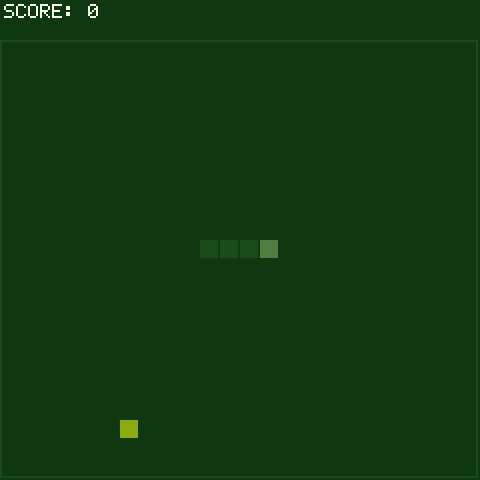

# Snake

> **Demonstration project** — provided as an example of what the PixelRoot32
> Game Engine can do. It is not a product: parts may be incomplete,
> experimental, or deliberately simplified to keep one idea in focus.

Classic Snake on a **24×24** cell grid, with the top two rows reserved for the
score band. The single idea it is about is the **fixed segment pool**: every
body segment the snake can ever have is constructed once, up front, and
growing the snake claims one from that pool instead of allocating — the
pattern this engine expects from anything that runs on a microcontroller.

Language: C++17  
Engine: `gperez88/PixelRoot32-Game-Engine@^1.9.0`  
Environments: `native`, `esp32dev`  
Category: Games



## Requirements (build flags)

Set in [`lib/platformio.ini`](lib/platformio.ini)'s `[base]` template, so
every environment inherits them:

- **`PIXELROOT32_ENABLE_AUDIO=1`** — required for the three `AudioEvent` cues
  (step, eat, crash). Building without it is not a compile error — it is
  silence.
- **`PIXELROOT32_ENABLE_PHYSICS=0`** — deliberate. Movement is discrete, one
  whole cell per tick, and both collision rules are integer cell comparisons.
  There is no continuous motion for a solver to resolve.
- **`PIXELROOT32_ENABLE_PARTICLES=0`** — not used.
- **`PIXELROOT32_ENABLE_UI_SYSTEM=0`** — the score and the game-over lines are
  `Renderer::drawText` / `drawTextCentered` calls, not UI widgets.

Display size is **240×240** in the project `platformio.ini` (see
`PHYSICAL_DISPLAY_*`), which is exactly `GRID_WIDTH × CELL_SIZE`. Changing
either constant in [`src/GameConstants.h`](src/GameConstants.h) without
changing the other leaves the playfield smaller or larger than the screen.

## Platforms

| Environment | Display | Audio backend |
|-------------|---------|----------------|
| **`native`** | SDL2, 240×240 | `SDL2_AudioBackend` in [`src/platforms/native.h`](src/platforms/native.h) |
| **`esp32dev`** | **ST7789** 240×240 | `ESP32_I2S_AudioBackend` in [`src/platforms/esp32_dev.h`](src/platforms/esp32_dev.h) |

Pin choices (ST7789 SPI, I2S audio, D-pad + two buttons) are in
`src/platforms/esp32_dev.h` — edit there if your wiring differs.

## Controls

| Action | `native` (keyboard) | `esp32dev` (GPIO) |
|--------|----------------------|--------------------|
| Turn | Arrow keys | D-pad |
| Restart (from Game Over) | Space | Button A |

A turn is stored in `nextDir` and only applied on the next movement tick, and
a reversal into the current direction is rejected outright — so no sequence of
presses inside one tick can fold the snake back into its own neck.

## What it demonstrates
- **A pool sized to the worst case.** `segmentPool` holds
  `GRID_WIDTH * GRID_HEIGHT` `SnakeSegmentActor`s — the longest snake the board
  can physically hold — built once on the first `resetGame()` and reused for
  every game after. The active `snakeSegments` vector is `reserve`d to the same
  size, so neither growing nor restarting allocates. This is the shape the
  engine's own `gameplay::ObjectPool` formalises; here it is written out by
  hand so the mechanism is visible.
- **Move without copying the body.** A non-growing step does not shift the
  segments along. It pops the tail, moves it to the new head cell, and pushes
  it to the front — one segment touched per tick regardless of length.
- **Grid state, not physics state.** A segment's logical position is
  `cellX`/`cellY`; `position` is derived from it for drawing. The two collision
  rules (wall, self) compare cells directly. `SnakeSegmentActor` still sets a
  `CollisionLayer`/mask pair — head collides with body, body with nothing — to
  show the `Actor` layer API, but the game's own rules never consult it.
- **Difficulty as one number.** Each food shortens `moveInterval` by
  `MOVE_INTERVAL_STEP_MS` down to `MIN_MOVE_INTERVAL_MS`. There are no
  difficulty levels and no speed table: the whole ramp is those three
  constants.
- **A reserved HUD band inside the grid.** `TOP_UI_GRID_ROWS` takes the top two
  cell rows out of play. The wall check and the food spawner both start at that
  row, so the score line can never be overwritten and food can never spawn
  under it.
- **Built-in palette selection.** `setPalette(PaletteType::GB)` switches the
  whole game to the Game Boy palette; the draw code keeps naming
  `Color::LightGreen` / `Color::DarkGreen` and gets the right greens.

## Project layout

```
src/
├── GameConstants.h            grid size, cell size, button IDs, timing
├── SnakeSegmentActor.h/.cpp   one body cell: grid position, layer, draw
├── SnakeScene.h/.cpp          pool, movement tick, food, score, audio
├── main.cpp                   platform selector
└── platforms/                 native.h, esp32_dev.h — backend wiring per target
```

## Engine documentation
- [Audio API](https://github.com/PixelRoot32-Game-Engine/PixelRoot32-Game-Engine/blob/main/docs/api/audio.md)
- [Core API](https://github.com/PixelRoot32-Game-Engine/PixelRoot32-Game-Engine/blob/main/docs/api/core.md)
- [Graphics / Renderer](https://github.com/PixelRoot32-Game-Engine/PixelRoot32-Game-Engine/blob/main/docs/api/graphics.md)
- [Memory system — flags and byte budgets](https://github.com/PixelRoot32-Game-Engine/PixelRoot32-Game-Engine/blob/main/docs/architecture/memory-system.md)
- [`gameplay/ObjectPool.h`](https://github.com/PixelRoot32-Game-Engine/PixelRoot32-Game-Engine/blob/main/include/gameplay/ObjectPool.h) — the engine's own pooling primitive

## Build

From **`games/snake`**:

```bash
pio run -e native
pio run -e esp32dev
```

## Upload (ESP32)

```bash
pio run -e esp32dev --target upload
```

## License

Source code: [MIT](../../LICENSE).

| Asset | Author | License | Source |
|-------|--------|---------|--------|
| All audio cues | This repository | CC0 1.0 (public domain) | Original work, synthesised at runtime from `AudioEvent` definitions in `src/` |

This demo ships no art and no generated asset headers — every cell is a filled
rectangle resolved through the engine's built-in Game Boy palette, so there is
nothing else here to attribute.

---

**Source code:** https://github.com/PixelRoot32-Game-Engine/PixelRoot32-Demo-Projects/tree/main/games/snake
