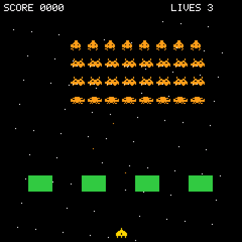

# Space Invaders

> **Demonstration project** — provided as an example of what the PixelRoot32
> Game Engine can do. It is not a product: parts may be incomplete,
> experimental, or deliberately simplified to keep one idea in focus.

> **⚠️ UNOFFICIAL CLONE — DEMONSTRATION ONLY**
>
> This is a **clone of the original 1978 arcade game**, written from scratch
> and shipped **for demonstration purposes only**: its job is to show how the
> PixelRoot32 engine's APIs fit together in a complete game, not to
> redistribute or replace anyone's product.
>
> *Space Invaders* is a trademark of **Taito Corporation**. This demo is
> **not affiliated with, endorsed by, or licensed by Taito**, and reproduces
> none of the original's code, data, or artwork — only the rules of a genre
> that has been reimplemented as a teaching exercise for four decades. The
> name is used descriptively, to say what the demo clones.

> **✅ ORIGINAL CC0 ARTWORK**
>
> Every bitmap in this demo — the ship, the three alien types, the explosion
> frames, and the starfield tables — is **original pixel data written from
> scratch** for this repository, in the source itself
> ([`src/assets/`](src/assets)). Nothing is ripped from, or traced over, any
> commercial game.

A clone of the classic fixed-shooter, rebuilt on this engine as a teaching
demo: four rows of aliens marching down toward four degradable bunkers, one
bullet on screen at a time, three lives, and a bass line that speeds up as the
formation gets closer. The single idea it is about is **a fixed memory
budget**: the scene arena, the projectile pool, and the explosion slots are
all sized once at compile time, so a full game runs without a single runtime
allocation.

Language: C++17  
Engine: `gperez88/PixelRoot32-Game-Engine@^1.9.0`  
Environments: `native`, `esp32dev`  
Category: Games



## Requirements (build flags)

Set in [`lib/platformio.ini`](lib/platformio.ini)'s `[base]` template, so
every environment inherits them:

- **`PIXELROOT32_ENABLE_SCENE_ARENA`** — selects the arena path. With the flag
  set, every entity is placed with `arenaNew` into the scene's
  `SPACE_INVADERS_SCENE_ARENA_BUFFER` (4 KB, a file-scope array); without it
  the same code compiles to `std::unique_ptr` and the heap. Both branches are
  in [`src/SpaceInvadersScene.cpp`](src/SpaceInvadersScene.cpp), guarded by
  `#ifdef`, so the demo is also a side-by-side of the two ownership models.
  If the buffer runs out, `arenaNew` returns `nullptr` and the scene skips
  that entity rather than crashing.
- **`PIXELROOT32_ENABLE_PHYSICS=1`** — required, not optional. `RigidActor`
  (projectiles), `KinematicActor` (the ship), `StaticActor` (bunkers) and the
  swept-collision helpers in `physics/CollisionSystem.h` all live behind this
  flag, so the demo does not compile without it.
- **`PIXELROOT32_ENABLE_AUDIO=1`** — needed for the three-speed bass loop, the
  win/lose fanfares, and the shot/hit cues. Building without it is not a
  compile error — it is silence, and the tempo ramp that carries most of the
  tension disappears with it.
- **`PIXELROOT32_ENABLE_PARTICLES=0`** — not used. Enemy hits are four
  one-pixel-wide bars drawn straight by the scene, and the player death is a
  three-frame sprite animation.
- **`PIXELROOT32_ENABLE_UI_SYSTEM=0`** — the score and lives readouts are
  `Renderer::drawText` calls, not UI widgets.

Display size is **240×240** in the project `platformio.ini` (see
`PHYSICAL_DISPLAY_*`). Formation width, bunker spacing, and the ship's start
position are all derived from `DISPLAY_WIDTH` / `DISPLAY_HEIGHT` in
[`src/GameConstants.h`](src/GameConstants.h), so a different resolution
re-lays-out the screen instead of clipping it.

## Platforms

| Environment | Display | Audio backend |
|-------------|---------|----------------|
| **`native`** | SDL2, 240×240 | `SDL2_AudioBackend` in [`src/platforms/native.h`](src/platforms/native.h) |
| **`esp32dev`** | **ST7789** 240×240 | `ESP32_I2S_AudioBackend` in [`src/platforms/esp32_dev.h`](src/platforms/esp32_dev.h) |

Pin choices (ST7789 SPI, I2S audio, D-pad + two buttons) are in
`src/platforms/esp32_dev.h` — edit there if your wiring differs.

## Controls

| Action | `native` (keyboard) | `esp32dev` (GPIO) |
|--------|----------------------|--------------------|
| Move ship | Left / Right arrows | D-pad Left / Right |
| Fire | Space | Button A |
| Restart (from Game Over) | Space | Button A |

The ship moves between **nine discrete lanes**, not freely: a tap steps one
lane, holding for 300 ms starts an arcade-style auto-repeat every 150 ms, and
each step is interpolated over 100 ms with an ease-out-cubic curve. Only one
player bullet may be in flight at a time, which is what makes aiming a
decision.

## What it demonstrates
- **Everything allocated once.** Twelve `ProjectileActor`s are constructed
  deactivated at reset and recycled by `reset()` for the rest of the game;
  enemy hit effects use eight fixed `EnemyExplosion` slots; the shooter
  candidate list in `enemyShoot()` is a stack array sized by `ALIEN_COLS`.
  Combined with the arena, nothing in `update()` reaches the allocator.
- **Swept-circle collision for fast, small targets.** A projectile at 80 px/s
  can pass through an 8-pixel alien between two frames. `ProjectileActor`
  keeps its `previousPosition`, and `handleCollisions()` runs
  `sweepCircleVsRect` from the previous position to the current one, falling
  back to a plain overlap test. Discrete tests alone would drop hits.
- **Animation driven by the game clock, not a frame timer.** Aliens never
  animate themselves: `AlienActor::update()` is empty, and the scene calls
  `move()` on every alien on each formation step, which advances position and
  `SpriteAnimation::step()` together. The whole formation therefore flips
  frames in perfect lockstep, which is the effect the original arcade cabinets
  got for free by redrawing one alien per step.
- **The music is the difficulty readout.** `updateMusicTempo()` maps the
  lowest living alien's Y to a tempo factor between 1.0 and 1.9, eased toward
  the target at 5 % per frame, and that same factor scales the formation's
  step timer. Sound and speed cannot drift apart because they read one number.
- **Two sprite paths from one animation type.** Squid and Octopus use
  single-colour `Sprite` frames; the Crab uses a `MultiSprite` — two 1bpp
  layers, body in orange and an eye highlight in white. `SpriteAnimationFrame`
  holds either, so `AlienActor::draw()` asks the animation which one it has
  and calls `drawSprite` or `drawMultiSprite` accordingly.
- **Damage as geometry.** A bunker's remaining health is drawn as remaining
  height, shrinking from the bottom up and shifting green to yellow to red.
  The hitbox shrinks with it, so a chewed-up bunker really does cover less.
- **A death that pauses the world.** A player hit starts a three-frame
  explosion and sets `isPaused`, which short-circuits `Scene::update()`
  entirely — aliens stop marching while the animation plays — then respawns
  the ship centred under the first surviving bunker.

## Project layout

```
src/
├── GameConstants.h              layout, sprite scale, timing, button IDs
├── PlayerActor.h/.cpp           nine-lane ship: auto-repeat input, eased motion
├── AlienActor.h/.cpp            one alien: type, score value, stepped animation
├── ProjectileActor.h/.cpp       pooled bullet with previous-position tracking
├── BunkerActor.h/.cpp           StaticActor barrier with health-as-height
├── SpaceInvadersScene.h/.cpp    arena, formation march, collisions, music tempo
├── assets/
│   ├── AlienSprites.h           squid/crab/octopus bitmaps + the crab MultiSprite
│   ├── PlayerSprites.h          ship bitmap
│   ├── PlayerExplosionSprites.h three explosion frames
│   └── Background.h/.cpp        starfield coordinate tables
├── main.cpp                     platform selector
└── platforms/                   native.h, esp32_dev.h — backend wiring per target
```

## Engine documentation
- [Physics API](https://github.com/PixelRoot32-Game-Engine/PixelRoot32-Game-Engine/blob/main/docs/api/physics.md)
- [Graphics / Renderer](https://github.com/PixelRoot32-Game-Engine/PixelRoot32-Game-Engine/blob/main/docs/api/graphics.md)
- [Audio API](https://github.com/PixelRoot32-Game-Engine/PixelRoot32-Game-Engine/blob/main/docs/api/audio.md)
- [Core API](https://github.com/PixelRoot32-Game-Engine/PixelRoot32-Game-Engine/blob/main/docs/api/core.md)
- [Memory system — flags and byte budgets](https://github.com/PixelRoot32-Game-Engine/PixelRoot32-Game-Engine/blob/main/docs/architecture/memory-system.md)

## Build

From **`games/space_invaders`**:

```bash
pio run -e native
pio run -e esp32dev
```

## Upload (ESP32)

```bash
pio run -e esp32dev --target upload
```

## License

Source code: [MIT](../../LICENSE).

| Asset | Author | License | Source |
|-------|--------|---------|--------|
| Ship, squid, crab, octopus and explosion bitmaps | This repository | CC0 1.0 (public domain) | Original work, written as `uint16_t` row data in [`src/assets/`](src/assets) |
| Starfield coordinate tables | This repository | CC0 1.0 (public domain) | Original work, [`src/assets/Background.cpp`](src/assets/Background.cpp) |
| All audio cues and music tracks | This repository | CC0 1.0 (public domain) | Original work, synthesised at runtime from `AudioEvent` / `MusicTrack` definitions in `src/` |

Nothing here is derived from third-party game artwork, so the demo carries no
attribution requirement of its own.

**Trademark.** *Space Invaders* is a trademark of Taito Corporation. This
demo is an unofficial clone published for demonstration purposes only, is not
affiliated with or endorsed by Taito, and contains none of the original
game's code, data, or assets. The name appears here descriptively — to say
which game the demo clones — and no claim to it is made.

---

**Source code:** https://github.com/PixelRoot32-Game-Engine/PixelRoot32-Demo-Projects/tree/main/games/space_invaders
