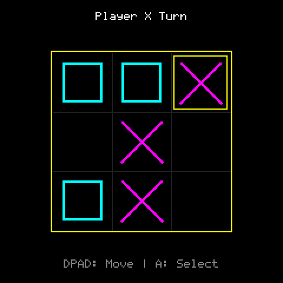

# Tic Tac Toe

> **Demonstration project** — provided as an example of what the PixelRoot32
> Game Engine can do. It is not a product: parts may be incomplete,
> experimental, or deliberately simplified to keep one idea in focus.

Three-in-a-row against a heuristic AI on a 3×3 board, drawn entirely with
`Renderer` primitives — no sprites, no tilemap, no asset headers. The single
idea it is about is the **custom 16-colour palette**: the whole neon look
comes from one `setCustomPalette()` call remapping the engine's named colours,
so the game code keeps saying `Color::LightRed` and gets neon pink.

Language: C++17  
Engine: `gperez88/PixelRoot32-Game-Engine@^1.9.0`  
Environments: `native`, `esp32dev`  
Category: Games



## Requirements (build flags)

Set in [`lib/platformio.ini`](lib/platformio.ini)'s `[base]` template, so
every environment inherits them:

- **`PIXELROOT32_ENABLE_AUDIO=1`** — required. The background loop, the win
  jingle, and the four `AudioEvent` cues all go through `MusicPlayer` /
  `AudioEngine`. Building without it is not a compile error — it is silence.
- **`PIXELROOT32_ENABLE_PHYSICS=0`** — the board is a `Player[3][3]` array and
  every rule is an array lookup. There is nothing to simulate.
- **`PIXELROOT32_ENABLE_PARTICLES=0`** — not used.
- **`PIXELROOT32_ENABLE_UI_SYSTEM=0`** — the status line and the instructions
  line are `Renderer::drawTextCentered` calls, not UI widgets.

Display size is **240×240** in the project `platformio.ini` (see
`PHYSICAL_DISPLAY_*`). The board is `BOARD_SIZE * CELL_SIZE` = 150 px and is
centred from `DISPLAY_WIDTH` / `DISPLAY_HEIGHT` at reset, so a different
resolution re-centres it instead of clipping it.

## Platforms

| Environment | Display | Audio backend |
|-------------|---------|----------------|
| **`native`** | SDL2, 240×240 | `SDL2_AudioBackend` in [`src/platforms/native.h`](src/platforms/native.h) |
| **`esp32dev`** | **ST7789** 240×240 | `ESP32_I2S_AudioBackend` in [`src/platforms/esp32_dev.h`](src/platforms/esp32_dev.h) |

Pin choices (ST7789 SPI, I2S audio, D-pad + two buttons) are in
`src/platforms/esp32_dev.h` — edit there if your wiring differs.

## Controls

| Action | `native` (keyboard) | `esp32dev` (GPIO) |
|--------|----------------------|--------------------|
| Move cursor | Arrow keys | D-pad |
| Place mark | Space | Button A |
| Restart (from Game Over) | Space | Button A |

The cursor wraps at the board edges in both axes, so nine cells are always
two presses apart at most. After a game ends the input is ignored for 500 ms
so the press that ended the game cannot immediately restart it.

## What it demonstrates
- **Custom palette remapping.** `CUSTOM_NEON_PALETTE` is a plain
  `uint16_t[16]` of RGB565 values handed to
  `graphics::setCustomPalette()` in `init()`. Nothing else in the scene knows
  about it: `drawX` still asks for `Color::LightRed`, and the palette decides
  that means neon pink. Swapping the look is one array, not a sweep through
  the draw code.
- **Two-layer audio.** A looping `MusicTrack` built from `makeNote` /
  `makeRest` with the `INSTR_TRIANGLE_PAD` preset runs as background music,
  while placement, loss, and draw are one-shot `AudioEvent`s played straight
  on the `AudioEngine`. Win stops the loop and plays a non-looping
  `MusicTrack` instead — the two paths never fight over the same voice.
- **Heuristic AI with a tunable error rate.** `computeAIMove()` is the classic
  four-step ladder: win if you can, block if you must, take the centre, take a
  corner. `DEFAULT_AI_ERROR_CHANCE` (0.25) then rerolls that choice a quarter
  of the time, which is what keeps a perfect-information 3×3 game losable.
- **Edge-detected input without an input queue.** Cursor movement compares the
  current `isButtonDown` against last frame's, so a held direction moves one
  cell rather than nine. The `inputReady` latch additionally swallows the
  button that was still down when the scene started.
- **Zero assets, zero allocation.** Everything on screen is a line, a
  rectangle, or text. The two status strings are fixed `char` buffers filled
  with `snprintf`; nothing in `update()` or `draw()` allocates.

## Project layout

```
src/
├── GameConstants.h      board size, cell size, button IDs, AI error chance
├── TicTacToeScene.h/.cpp  the whole game: state, AI, audio, drawing
├── main.cpp             platform selector
└── platforms/           native.h, esp32_dev.h — backend wiring per target
```

## Engine documentation
- [Audio API](https://github.com/PixelRoot32-Game-Engine/PixelRoot32-Game-Engine/blob/main/docs/api/audio.md)
- [Core API](https://github.com/PixelRoot32-Game-Engine/PixelRoot32-Game-Engine/blob/main/docs/api/core.md)
- [Graphics / Renderer](https://github.com/PixelRoot32-Game-Engine/PixelRoot32-Game-Engine/blob/main/docs/api/graphics.md)
- [Input API](https://github.com/PixelRoot32-Game-Engine/PixelRoot32-Game-Engine/blob/main/docs/api/input.md)

## Build

From **`games/tic_tac_toe`**:

```bash
pio run -e native
pio run -e esp32dev
```

## Upload (ESP32)

```bash
pio run -e esp32dev --target upload
```

## License

Source code: [MIT](../../LICENSE).

| Asset | Author | License | Source |
|-------|--------|---------|--------|
| All audio cues | This repository | CC0 1.0 (public domain) | Original work, synthesised at runtime from `AudioEvent` / `MusicTrack` definitions in `src/` |

This demo ships no art and no generated asset headers — the board, the marks,
and the cursor are `Renderer` primitives resolved through the custom palette,
so there is nothing else here to attribute.

---

**Source code:** https://github.com/PixelRoot32-Game-Engine/PixelRoot32-Demo-Projects/tree/main/games/tic_tac_toe
