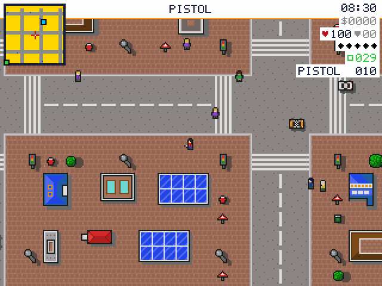
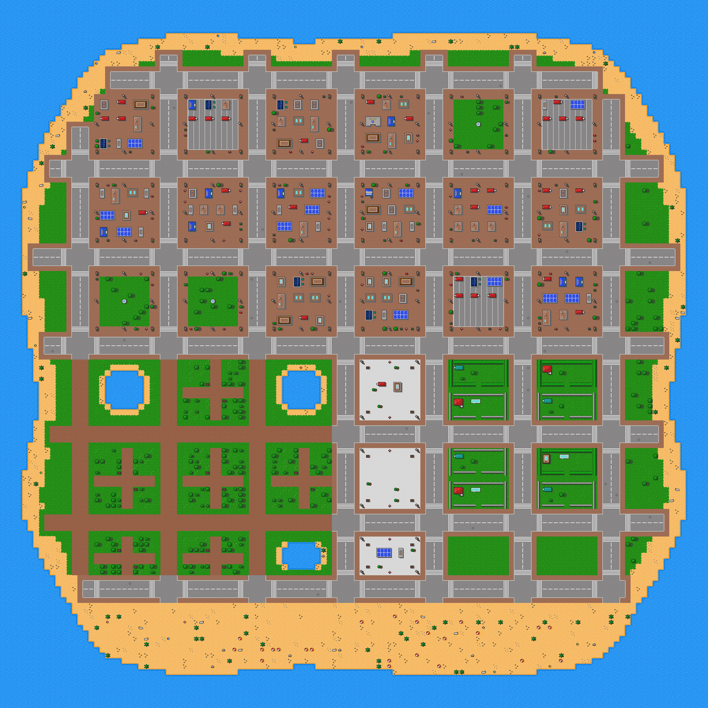

# Top-Down City

> **Demonstration project** — provided as an example of what the PixelRoot32
> Game Engine can do. It is not a product: parts may be incomplete,
> experimental, or deliberately simplified to keep one idea in focus.

> **✅ ORIGINAL CC0 ARTWORK**
>
> Every tile, sprite, map and sound in this demo is **original work authored
> for it** — hand-drawn as character grids in `tools/art_*.py`, laid out by a
> seeded generator, and synthesised at runtime from `constexpr` data. The
> handheld Grand Theft Auto games are named below as a **design reference**,
> the way one names a genre: nothing here is derived from them. No sprite, no
> map, no note, no name and no line of code. Colour, technique and layout are
> not copyrightable; the pixels are, and these are ours.

**A top-down GTA, the way the Game Boy Advance did one — running on a
microcontroller.** Not a port and not a subset: the whole loop, on an ESP32
with a 240×240 panel, 320 KB of RAM and a 40 MHz display bus.

Steal a car out of moving traffic, take a courier run, buy a gun with what it
paid, shoot up the police station, climb the five stars, get chased on foot and
then by patrol cars, and wake up on the station steps broke and unarmed. One
island of **128×128 tiles** across five districts, thirty drivable cars, a
streamed crowd with police mixed into it, two enterable interiors, three story
chapters, and a day that turns to night for the price of a palette and twenty
tiles.

It fits in **8.8 % of the ESP32's RAM and 44.5 % of its flash**, which is the
part worth reading this file for: everything below is how an open world that
size is made to cost that little.

> **It has never run on real hardware.** Everything here has been played in the
> SDL2 simulator and the `esp32dev` build fits, but nobody has yet seen what
> 25 fps over a 40 MHz bus does to the traffic or to four radio stations
> sharing a core. Every measurement below is from the build, not from a board.

**What you can do in it — the city, the missions, the economy — is in
[`ROADMAP.md`](ROADMAP.md).** This file is the build: the flags, the targets,
the budgets, and the engine decisions worth reading before borrowing any of it.

Language: C++17  
Engine: `gperez88/PixelRoot32-Game-Engine@^1.9.0`  
Environments: `native`, `esp32dev`, `host_test`  
Category: Games

## Screenshots



The `native` window at 2×. Its logical size is **320×240**, not the panel's
square: the simulator shows more street to either side than the hardware does,
which is worth remembering when judging how much of the city is on screen.



All 128×128 tiles at once, composited the way the engine draws them — three
layers in order, every cell through its own palette slot. The panel shows
roughly a seventieth of this, which is the only reason the map is worth a
picture of its own. Rendered by
[`tools/render_map.py`](tools/render_map.py), which runs the same generator the
build runs and writes nothing but a PNG.

## Its one idea: a procedural world that still speaks the editor's format

The city is generated, not drawn — nobody is hand-placing 16,384 cells. But the
generator emits **exactly what the PixelRoot32 Tilemap Editor exports**
(`gameplay/room_screen/src/assets/` is an editor-produced example of the same
format), and that is what buys the engine features a bespoke one-layer map
cannot have: three layers, per-cell palette slots (eight 16-colour palettes
selected through `paletteIndices`, so 120 usable colours where one palette
gives 15), and `TILE_SOLID` behaviour layers read through the engine's own
`physics::getTileFlags` and `isWorldPixelSolid`.

The layers are not decoration. `isWorldPixelSolid` decodes a tile's 4bpp bitmap
and blocks only where a pixel is opaque — useless if the prop tile has terrain
baked into it, because then the whole 16×16 cell is solid and per-pixel
collision is indistinguishable from whole-tile. **Separating the layers is what
makes walking between tree canopies and past lamp posts possible at all.** The
generator asserts every prop tile has a cut-out, so that cannot silently
regress.

Cost on `esp32dev`: **8.8 % RAM (28,932 B) and 44.5 % flash (582,721 B)**, of
which 173,696 B is map data — all `static const` in flash — and roughly 39.8 KB
is audio. RAM holds three 40-byte `TileMap4bpp` descriptors, the dirty grid, 24
vehicle actors, the 12-slot pedestrian pool, the 6-slot traffic pool and the
audio director's fixed-size state, and nothing else.

## Requirements (build flags)

Set in [`lib/platformio.ini`](lib/platformio.ini):

| Flag | Value | Why |
|------|-------|-----|
| `PIXELROOT32_ENABLE_4BPP_SPRITES` | on | Every tile, car, pedestrian and the player is a 16-colour 4bpp sprite. Everything on screen goes through this one path. |
| `PIXELROOT32_ENABLE_AUDIO` | `1` | Gates both `getAudioEngine()` and `getMusicPlayer()` (`Engine.h`), so it covers the twenty-two one-shot cues, the four radio stations and the siren at once. Measured: +244 B RAM and +40,724 B flash against the same build at `0`. |
| `PIXELROOT32_ENABLE_PHYSICS` | `0` | The collision helpers used here — `TileAttributes`, `TilePixelCollision` — are standalone. The flag gates the collider/solver graph, which a 10,000-obstacle city could never fit (`PHYSICS_MAX_ENTITIES` is 64). This is also why the player, cars and pedestrians derive from `core::Entity` and tag `EntityType::GENERIC`: `core::Actor` is the *CollisionSystem participant*, and `EntityType::ACTOR` is what `Scene::addEntity` downcasts on. Nothing registers with that system, so claiming to be one would be a lie with a `static_cast` behind it. |
| `PIXELROOT32_ENABLE_GAMEPLAY_GRID_SPACE` | `0` | Movement is free eight-way at sub-pixel resolution, so `GridSpec`/`GridMotion` would only get in the way. |
| `PIXELROOT32_ENABLE_GAMEPLAY_OBJECT_POOL` | `1` | The crowd is a fixed slab of 12 pedestrian slots streamed around the camera. `ObjectPool` is placement-new over aligned storage, so acquiring one inside the game loop still allocates nothing. |
| `PIXELROOT32_ENABLE_DEPTH_SORT` | `0` | Traffic stacks in a fixed order — bodies, cars, people, player — written out as four loops. A per-frame sort would cost more than the ordering is worth, and `MAX_LAYERS` is 4 with layer 0 reserved. |
| `PIXELROOT32_ENABLE_PARTICLES` | `0` | No effects in this demo. |
| `PIXELROOT32_ENABLE_UI_SYSTEM` | `0` | The HUD is a handful of `Renderer` calls; a layout tree would be dead weight. |
| `PIXELROOT32_ENABLE_DIRTY_REGIONS` | `1` | All three layers draw as `LayerType::Static`, which suppresses per-cell dirty marking, so only the cells the player and HUD touched are marked. `beginFrame()` clears those instead of the whole 57,600-byte framebuffer. |
| `PIXELROOT32_TFT_12BIT_COLOR` | `1` (`esp32dev`) | 12 bits per pixel over the SPI bus instead of 16. See [Where the frame goes](#where-the-frame-goes). |

`esp32dev` deliberately does **not** set `PIXELROOT32_ENABLE_DEBUG_OVERLAY`
though `native` does: `Engine.cpp` forces `redraw = true` whenever it is set,
so the FPS counter would cost the very frame it is measuring.

Neither the interiors nor the day/night cycle adds a flag. The rooms share
palette slot 4, freed when cars became actors; the cycle rewrites palettes the
renderer already reads and repoints a tileset it already draws from.

## Platforms

| Environment | Display | Driver | Input | Audio |
|-------------|---------|--------|-------|-------|
| `native` | 320×240 logical | SDL2 (`DisplayType::NONE`) | Keyboard (SDL scancodes) | SDL2, 22050 Hz |
| `esp32dev` | 240×240 ST7789 | TFT_eSPI | 6 GPIO buttons | I2S — MAX98357A-class DAC on BCLK 26 / LRCK 25 / DOUT 22 |

ESP32 button pins: Up 32, Down 27, Left 33, Right 14, A 13, B 12.

## Controls

| Action | Native | ESP32 |
|--------|--------|-------|
| Walk (8 directions) | Arrow keys | D-pad |
| Run | Space (hold) | A (hold) |
| Get in / out of a car | Space (tap, beside a car) | A (tap) |
| Drive: accelerate, brake / reverse, steer | Arrow keys | D-pad |
| Enter / leave a building | Space (tap, in the doorway) | A (tap) |
| Answer the payphone | Space (tap, in the cyan ring) | A (tap) |
| Open / close the shop picker | Space (tap, at the counter) | A (tap) |
| Shop picker: move up and down the list | Up / Down | D-pad up / down |
| Shop picker: buy the highlighted line | S | B |
| Fire (once armed) | S | B |

**Six buttons is the whole pad and every one is spoken for**, which is the
constraint the interaction model is built around. RUN is contextual — held it
sprints, tapped beside a car it drives, tapped in a doorway it enters, tapped
on a payphone it takes the job — and doors are tested before cars, because the
station entrance is on a pavement where a car may well be parked in reach.

The shop picker is the same trick from the other end: the shop is empty by
design, so while the picker is up it can **own the pad** the way the chess
demo's promotion picker owns the touchscreen. Close it and every button is the
sprint, the door and the trigger again.

Walking is 62.5 px/s — one whole pixel per 16 ms logic step, the pace 8- and
16-bit top-down games move at. Running is 1.75× that. Not double: double the
walk is also double ordinary traffic, which made the man on foot the fastest
thing in the city. Diagonals are scaled by 1/√2. A car tops out at 156 px/s.

## Where the frame goes

Worth measuring before optimising, because the answer is not the blitter:

| Per frame on `esp32dev` | Cost |
|-------------------------|------|
| Panel transfer, 240×240 RGB565 over a 40 MHz bus | **~23.0 ms** |
| Background blit — 256 opaque 16×16 cells, 65,536 px | ~1 ms |
| Items + Details blit — ~36 non-empty cells | ~0.1 ms |

The bus is a **43 FPS ceiling before any game code runs**, and it dwarfs
everything else by twenty to one. That ranking rules out most of the usual
tilemap optimisations here:

- **`StaticTilemapLayerCache` would be a net loss.** It re-keys on the sampled
  camera position, so a camera centred on a walking player invalidates it
  almost every frame — a full rebuild plus 57,600 B of heap, for nothing. It
  fits a room-per-screen game (`gameplay/room_screen`), not an open world.
- **Span tables** (`computeSpanTable`) do not exist in engine 1.9.0, and would
  save little here anyway: the layer that dominates is the fully opaque one.
- **Dirty regions do not shorten the transfer.** `Renderer::endFrame()` calls
  `sendBuffer()` unconditionally. They save the framebuffer clear, which is
  worth one flag, but it is not where the frame goes.

Two levers are left, and both are about the bus rather than the drawing.

**Not sending the frame at all.** `Engine::draw()` is skipped outright when
`Scene::shouldRedrawFramebuffer()` returns false, and a pedestrian game spends
a lot of its time standing still.
[`BaseCityScene`](src/game/scenes/BaseCityScene.cpp) implements it by comparing
what the last *drawn* frame contained: the focus `visualKey()`, a fold of the
whole crowd's keys, the district id, the banner and prompt states, and a
fingerprint of every bullet in the air. The bullets have to be in there — they
are the only thing that moves while the player stands still. Sub-pixel movement
is deliberately outside the key, and so is the camera, which is a pure function
of what it follows.

**Sending a smaller frame.** With the panel capped at 40 MHz, that leaves the
pixel format: `PIXELROOT32_TFT_12BIT_COLOR` sends RGB444 and takes the frame to
**17.3 ms, about 58 FPS**. Two preconditions, both checked rather than assumed
— the driver silently keeps RGB565 unless the physical width is a multiple of 4
(240 is), and RGB444 keeps only the top 4 bits per channel, so palette entries
can collapse into each other. `tools/check_rgb444.py` counts those collisions
under every light; none of them crosses an outline or a cut-out. Set the flag
to `0` if your panel does not accept MIPI DCS COLMOD 0x03.

## A `Color` is an index, not a colour

**A primitive and a sprite do not read the same palette**, and this demo spent
five stages believing they did.

A sprite blit resolves through the sprite palette **slot** the draw call names
— which is how the cars, the street recolours and the police uniform each get
their own sixteen colours. Every drawing **primitive** — rectangle, line,
pixel, glyph — resolves through the *background* palette, which this demo never
replaces. So the HUD and the radar, which are made entirely of primitives, were
reading engine palette indices while believing they read the demo's own:
`ink::kSand` was the number 13, which the engine's table calls **Purple**, and
the radar's ground drew purple.

It hid for five stages because the old radar nearest-matched its swatches
across the whole 0–15 range, and **any** spread of sixteen colours over a city
map still looks like a city map. A wrong mapping that produces plausible output
is not caught by looking at the output.

HUD and radar colours are now engine `Color` enumerators, named once in `hud::`
in [`CityConstants.h`](src/game/CityConstants.h), and the generator's radar
inks are `static_assert`ed against them so the two ends cannot drift apart
quietly again.

## Collision

Two layers, two strategies, chosen because they are exact rather than as a
compromise:

| Layer | Test | Why |
|-------|------|-----|
| `background` | whole-tile `getTileFlags` | Only water is solid, and water tiles are opaque edge to edge, so per-pixel would give the same answer for more work. |
| `items` | `isWorldPixelSolid`, erosion 1 | Props are cut-outs. Erosion is applied to the prop, not the player, so the box slides past thin silhouettes instead of catching on a single opaque pixel. |

Three things move, and they do not need the same precision — hence
[`CityCollision.{h,cpp}`](src/game/systems/CityCollision.h):

| Mover | Test | Why |
|-------|------|-----|
| Player | per-pixel, eroded | The expensive one, for the thing the player is looking at. |
| Cars, pedestrians | whole-tile | A car is nearly as wide as its cell; a dozen pedestrians running the per-pixel loop every 16 ms would not fit the frame budget. |
| All three | dynamic blocker | Cars are actors, so nothing in the exported scene knows where they are. The scene lends its vehicle list to the movers through one function pointer — neither actor has to learn what a vehicle is. |

The mode is a compile-time switch resolved with `if constexpr`, so the unused
branches cost nothing. Only the player's feet collide: a 10×6 box at the bottom
of the 16×16 sprite, because a top-down character whose whole sprite collides
cannot stand next to a wall its head visually overlaps.

## The rules are engine-free, and that is what makes them testable

`build_src_filter = +<game/rules/>` is the whole of `[env:host_test]`. Nothing
in [`src/game/rules/`](src/game/rules/) includes an engine header, so the
fifteen suites in [`test/`](test/) — **359 cases** — build on a bare host with
no display, no SDL2 and no board.

Naming the directory rather than the files means a new rule is covered by
putting it there, and a rule that quietly grows an engine dependency breaks the
test build. That is the point of the line.

What lives behind it is everything that can be wrong *without looking wrong*:
the day/night curve, the wanted ladder, the courier allowance, line of sight,
the lane grammar, the shop's catalogue, the radar's run decomposition, the
weapon table's tunnelling check, and the audio cue budget. A ray that always
says "clear" is a wanted level with no exit, and nothing on screen is drawn
wrong; a projectile sampled only where it lands passes straight through a
six-pixel target if it steps far enough. Both are tests, not comments.

## Sound

Twenty-two one-shot cues and four original radio stations, all `constexpr` data
in [`src/audio/`](src/audio/) — nothing sampled, nothing transcribed.

**The 4+4 voice split cannot be rebalanced**, and it is the most likely place a
reader tries to "fix" something. The engine partitions its eight voices into
four music and four SFX slots at compile time (`MAX_MUSIC_TRACKS`, no `#ifndef`
guard), and `ApuCore::findVoiceForSfxEvent` never scans slots 0–3: a two-voice
station leaves a music slot idle, it does not lend it to SFX. That is why the
siren rides a *music* voice — `AudioEngine::playEvent` returns `void`, so a
looping SFX event could be started but never provably stopped — and why the
traffic layer is five throttled one-shots rather than an engine hum.

On top of the engine's blind voice-stealing,
[`game/rules/AudioCues.h`](src/game/rules/AudioCues.h) adds the policy: every
cue the player caused or that is about to hurt them is `Essential` and never
refused; everything droppable is `Ambient`, capped at one live voice, and
silenced for 224 ms after any Essential cue. A street that kept chattering
under gunfire would be the actual bug.

## Day and night

An in-game day lasts four real minutes. **No tile index, sprite or behaviour
flag changes** — the tint is the fifteen palettes being rewritten, which is why
a 128×128 city can afford it. After dark two of the three tileset pools are
swapped as well, for lit windows and street lamps: twenty of 128 tiles differ,
and every other entry points straight back into the daylight pool.

| | |
|---|---|
| RAM | 480 bytes — 15 palettes × 16 entries × 2 bytes |
| Flash | 2,560 bytes: the tiles whose after-dark form differs, and nothing else |
| Per frame | nothing |
| Per tint change | 240 colour conversions and two pointer writes, once every 5 s |

The RAM is not optional, and it is the one thing worth knowing about the
engine's palette API: **`setBackgroundCustomPaletteSlot` stores the pointer you
hand it, it does not copy.** The generated palettes are `const` and live in
flash, so a runtime tint has to own buffers of its own.

Three more decisions fall out of the same design:

- **The tint is quantised to 48 steps of 30 in-game minutes**, recomputed every
  five seconds rather than every frame — not for the 240 conversions, but
  because a palette rewritten every frame is a city repainted every frame, and
  the frame skip above is the whole reason this demo fits its budget.
- **No colour is ever tinted to `0x0000`.** The framebuffer treats a colour
  that packs to zero as *skip*, not as black, so a dim entry rounded down would
  punch holes through the buildings. Entries are floored to `0x0001`.
- **Adjacent steps never differ by more than 40/255 on a channel.** There are
  no in-between frames to soften a palette change, so a larger jump reads as a
  flash rather than a fade.

## Two doors, three scenes

The police station and one corner shop can be walked into, and each is a
separate 15×15 tilemap **and a separate `core::Scene`** — its own namespace,
palette, tileset pools, indices, behaviour layers and `init()`. In the
generator a room is an `Interior` object and the emitters take one as an
argument, so adding a third room is an entry in `INTERIORS` and a door in the
city; there is no third branch anywhere. Measured cost of the second room:
**1,052 B of RAM and 7,508 B of flash** — the expensive part was building the
first one.

**No door tile was added, for either.** The building stamps have always been
drawn with an entrance notch cut out of the bottom edge, and the player's
collision is per-pixel against the Items bitmap, so the notch has always been
somewhere you could stand. The generator reproduces `PlayerActor`'s own tile
arithmetic, enumerates every sprite position that would report the door cell,
and fails the build if none of them is free. The art means it, and the code
reads the art.

Both rooms took a post-pass rather than a smaller candidate list, and that is a
generator constraint worth knowing before editing `tools/`: **the lot packer
shares one RNG stream with every pass after it.** The layout drew six police
stations; dropping POLICE from `DOWNTOWN_LOTS` would not have removed five
buildings, it would have regenerated the whole island. The five surplus ones
are rewritten in place instead, and the open shopfront is a `SWAP_ONLY` stamp
placed over a shop the packer had already put down.

## Build

From this folder:

```bash
pio run -e native                    # SDL2 simulator
pio run -e native --target exec      # build and run it
pio run -e esp32dev                  # ESP32 firmware
pio run -t clean -e native
```

`platformio.ini` ships configured for Windows/MSYS2. On Linux and macOS remove
the `-IC:/msys64/...`, `-LC:/msys64/...` and `-mconsole` flags from
`[env:native]`; on macOS also uncomment the two Homebrew lines.

## Upload (ESP32)

```bash
pio run -e esp32dev --target upload
pio device monitor                   # 115200 baud
```

## Tests

```bash
pio test -e host_test
```

Fifteen suites, 359 cases, no display and no board. Only `src/game/rules/` is
built — the scenes, the entities and the audio director link against the engine
and are checked by compiling them.

## Regenerating the art and the map

Everything under `src/generated/` comes from one script:

```bash
python tools/generate_city_assets.py
```

It assembles the art modules through `tools/city_art.py` — daylight and after
dark — lays the city out, runs the layout self-checks and **refuses to write**
if any fails; [`src/generated/README.md`](src/generated/README.md) says what
each one catches. Edit a tile in `tools/art_*.py`, change `MAP_W`/`MAP_H`, the
street pitch or a district bound and re-run: no C++ needs editing, because
[`CityConstants.h`](src/game/CityConstants.h) derives the world geometry from
the generated `city_scene.h`.

To review art without building anything, from `tools/`:

```bash
python -c "import art_dsl, art_urban; art_dsl.preview(art_urban, 'urban.png')"
```

`art_cars` and `art_player` are sprite modules with no tiles, so they preview
through `city_art.vehicle_frames()` and `art_player.preview_frames()` instead.

To re-render the island picture above after a layout or art change:

```bash
python tools/render_map.py screenshots/city_map.png
```

## Source layout

```text
src/
├── main.cpp                    the platform selector, and nothing else
├── platforms/                  DisplayConfig, InputConfig, Engine, entry point
├── audio/                      the two data files and the director that plays them
├── generated/                  emitted by tools/ — never edited by hand
│   ├── sprites/
│   └── tilemaps/
└── game/
    ├── CityConstants.h         world geometry, timing, palette slots, HUD
    ├── rules/                  NO engine dependency; host-tested
    ├── entities/               things with a position that draw themselves
    ├── systems/                things that own a rule and no position
    └── scenes/                 the run, the router, and one file pair per space
```

Two conventional directories are deliberately absent. There is no
`Game.{h,cpp}` — the engine owns the loop and `platforms/*.h` owns the wiring,
so the class would have nothing in it. There is no `data/` — the level *is* a
seeded generator, and empty folders are a diagram, not a structure. It is
`generated/` rather than `assets/` because there is no hand-authored asset file
here at all: the sources are the Python modules in `tools/`.

All local includes are written relative to `src/`
(`#include "game/systems/CityCollision.h"`), never relative to the including
file, so moving a file is a `git mv` and one line.

## Engine documentation

- [PixelRoot32 Game Engine](https://github.com/PixelRoot32-Game-Engine/PixelRoot32-Game-Engine)
- [Sprite renderer](https://github.com/PixelRoot32-Game-Engine/PixelRoot32-Game-Engine/blob/main/docs/sprite-renderer.md)
- [Audio API](https://github.com/PixelRoot32-Game-Engine/PixelRoot32-Game-Engine/blob/main/docs/api/audio.md)
- [Core API](https://github.com/PixelRoot32-Game-Engine/PixelRoot32-Game-Engine/blob/main/docs/api/core.md)
- [Memory system — gameplay flags and byte budgets](https://github.com/PixelRoot32-Game-Engine/PixelRoot32-Game-Engine/blob/main/docs/architecture/memory-system.md)

## License

Source code: [MIT](../../LICENSE).

| Asset | Source | Licence |
|-------|--------|---------|
| `src/generated/tilemaps/*` | 8 palettes, 205 × 16×16 4bpp tiles (77 terrain, 94 items, 34 details) plus the 20 that differ after dark, 128×128 × 3 layers, and the three exported scenes | CC0 1.0 — original, emitted by [`tools/generate_city_assets.py`](tools/generate_city_assets.py) |
| `src/generated/sprites/PlayerSprites.h` | 3 facings × 3 walk frames, armed and unarmed, 16×16 4bpp | CC0 1.0 — original |
| `src/generated/sprites/VehicleSprites.h` | 7 car colours × 4 headings, 16×16 4bpp, shadow baked in | CC0 1.0 — original |
| `src/generated/sprites/PedestrianSprites.h` | 4 recolour palettes over the player's frames, plus the squashed pose | CC0 1.0 — original |
| `src/audio/CitySfx.h`, `src/audio/CityRadio.h` | Twenty-two one-shot SFX events, four original radio stations and the siren, hand-typed `constexpr` frequency, envelope and note data. GTA Advance (GBA) was a design reference for the car-bound model, loop length and instrumentation; no note is transcribed from it or any other title | CC0 1.0 — original, synthesised at runtime, no sample file of any kind |

Engine code is MIT — see the
[PixelRoot32 Game Engine](https://github.com/PixelRoot32-Game-Engine/PixelRoot32-Game-Engine)
repository.

---

**Source code:** https://github.com/PixelRoot32-Game-Engine/PixelRoot32-Demo-Projects/tree/main/games/top_down_city
