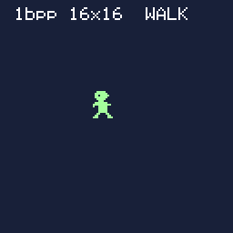

# First Sprite

> **Demonstration project** — provided as an example of what the PixelRoot32
> Game Engine can do. It is not a product: parts may be incomplete,
> experimental, or deliberately simplified to keep one idea in focus.

Your first sprite on screen. A 16×16 character, hand-written as `constexpr` bit
rows, drawn with **`Renderer::drawSprite`**, moved with the D-pad, **mirrored**
when it turns around, and stepped through a **two-frame walk cycle**. One idea:
how a sprite goes from bits in flash to pixels on a panel. If you have run
[`getting_started/hello_world`](../hello_world) — engine boots, scene draws,
buttons respond — this is the next step.

Language: C++17  
Engine: `gperez88/PixelRoot32-Game-Engine@^1.9.0`  
Environments: `native`, `esp32dev`  
Category: Getting started



## Requirements (build flags)

This demo uses the engine's **1bpp** sprite format, which needs **no sprite
feature flag at all** — the 1bpp path is always compiled in. The flags in
`lib/platformio.ini` are all *subtractions*: they switch off engine subsystems
the lesson does not use, so the binary contains only what you are reading about.

| Flag | Value | Why |
|------|-------|-----|
| `PIXELROOT32_ENABLE_AUDIO` | `0` | No sound in this demo. Leaving it on links the APU, the mixer and the command queue into a project that never plays a note. |
| `PIXELROOT32_ENABLE_PHYSICS` | `0` | The sprite is moved by adding to an `int`. No collision system, no bodies, no scheduler. |
| `PIXELROOT32_ENABLE_PARTICLES` | `0` | No effects. |
| `PIXELROOT32_ENABLE_UI_SYSTEM` | `0` | The one line of text goes through `Renderer::drawText`, not `UILabel`. Note that this differs from `hello_world`, which uses `UILabel` and therefore leaves the UI system on. |
| `PIXELROOT32_ENABLE_2BPP_SPRITES` | *(absent)* | Not needed — see below. |
| `PIXELROOT32_ENABLE_4BPP_SPRITES` | *(absent)* | Not needed — see below. |

**The two families of flag are tested differently, and it matters.**

The four subsystem flags above are read with a *value* test in the engine —
`#if PIXELROOT32_ENABLE_AUDIO` — so `=0` genuinely turns them off, and leaving
them out turns them **on** (`platforms/PlatformDefaults.h` defaults every one of
them to `1`).

The sprite bit-depth flags are the opposite. They are read with an *existence*
test — `#ifdef PIXELROOT32_ENABLE_4BPP_SPRITES` in
`platforms/EngineConfig.h` — and nothing defaults them. So:

- `-D PIXELROOT32_ENABLE_4BPP_SPRITES` → **on**
- `-D PIXELROOT32_ENABLE_4BPP_SPRITES=0` → **also on**. `=0` still counts as
  "defined". This is the mistake to know about before you make it.
- flag absent → **off**, and `Renderer::drawSprite(const Sprite4bpp&, …)`
  compiles to an empty function body (it is wrapped in
  `if constexpr (config::Enable4BppSprites)`).

That last line is worth sitting with, because it is how most PixelRoot32 feature
flags fail. Forgetting a flag is **not a compile error**. Your call still
compiles, still links, still runs — and draws nothing. A missing flag looks like
a black screen, not like a bug.

Resolution comes from `PHYSICAL_DISPLAY_WIDTH` / `PHYSICAL_DISPLAY_HEIGHT`
(**128×128**) in `platformio.ini`, exactly as in `hello_world`.

## Platforms

| Environment | Display | Audio backend |
|-------------|---------|---------------|
| **`native`** | SDL2 window, 128×128 logical (drawn at 2× so it is visible on a desktop) | none — `PIXELROOT32_ENABLE_AUDIO=0` |
| **`esp32dev`** | **ST7735** 128×128 (GreenTab3 profile), SPI pins in `platformio.ini`: MOSI **23**, SCLK **18**, DC **2**, RST **4**, CS **-1** | none — `PIXELROOT32_ENABLE_AUDIO=0` |

Button GPIOs for `esp32dev` are at the top of `src/platforms/esp32_dev.h`
(Up **32**, Down **27**, Left **33**, Right **14**, A **13**, B **12**). On
`native` the same six slots are SDL scancodes.

## Controls

| Native key | ESP32 button | Action |
|------------|--------------|--------|
| **Arrow keys** | D-pad | Move the sprite. **Left** and **Right** also set which way it faces; **Up** and **Down** do not, so walking upward does not make the character turn. |
| **Space** | A | Toggle the walk animation on and off. The label switches between `WALK` and `IDLE`. |
| **Enter** | B | Unused. |

Stopping the animation parks the sprite on frame 0 so you can compare the two
frames deliberately instead of catching them in motion.

## What it demonstrates

### The 1bpp sprite format, in full

`pixelroot32::graphics::Sprite` (in the engine's `graphics/Renderer.h`) is three
fields and nothing else:

```cpp
struct Sprite {
    const uint16_t* data;   // one entry per row, `height` entries long
    uint8_t         width;  // pixels, at most 16
    uint8_t         height; // pixels
};
```

One `uint16_t` is one row of the image. One bit is one pixel. A `1` bit is drawn
in the colour you hand to `drawSprite`; a `0` bit draws **nothing** — it is
transparent, not black, so whatever was already on the screen shows through. The
width cap of 16 is not arbitrary: a row is a single `uint16_t`.

That is the whole format. There is no palette, no header, no stride, no
alignment rule. A 16×16 sprite is 32 bytes.

### Which bit is the leftmost pixel — worked example

**Bit `(width - 1)` is the leftmost pixel and bit 0 is the rightmost.** For a
16-wide sprite that means bit 15 is on the left, so a row written out in binary
reads left-to-right in the same direction as the picture.

Take row 8 of `kPlayerWalkFrame0Bits` in
[`src/assets/PlayerSprite.h`](src/assets/PlayerSprite.h) — the character's
outstretched arm:

```
0x3FF0  =  0011 1111 1111 0000
```

Number the bits from the left, starting at bit 15:

| bit | 15 | 14 | 13 | 12 | 11 | 10 | 9 | 8 | 7 | 6 | 5 | 4 | 3 | 2 | 1 | 0 |
|-----|----|----|----|----|----|----|---|---|---|---|---|---|---|---|---|---|
| value | 0 | 0 | 1 | 1 | 1 | 1 | 1 | 1 | 1 | 1 | 1 | 1 | 0 | 0 | 0 | 0 |
| column | 0 | 1 | 2 | 3 | 4 | 5 | 6 | 7 | 8 | 9 | 10 | 11 | 12 | 13 | 14 | 15 |

Column = `15 - bit`. Columns 0–1 are off, columns 2–11 are on, columns 12–15 are
off, which is exactly the ASCII picture in the comment beside that row:

```
0x3FF0,  // ..XXXXXXXXXX....
```

> ⚠️ The Doxygen comment on `struct Sprite` in the engine's `Renderer.h` says
> *"Bit 0 represents the leftmost pixel"*. That comment is stale.
> `Renderer::drawSprite` builds its column mask as `1 << (width - 1)` and shifts
> it right, and the inline comment in the blit loop says so too. The arm above
> renders on the **right** of the character on a real screen, which settles it.
> If you ever need to check this yourself, draw an asymmetric shape — symmetric
> art will not tell you.

### Why the data is `constexpr`

`Sprite` holds a `const uint16_t*`. `Renderer::drawSprite` takes the sprite by
const reference and reads straight through that pointer while it blits — **it
never copies your rows anywhere**. The pixel data therefore has to stay alive,
at a stable address, for as long as anything can draw it.

`inline constexpr` at namespace scope gives exactly that: the arrays live in
flash / `.rodata` for the whole run, cost **zero RAM** on the ESP32, and have one
address across every translation unit that includes the header.

Build a `uint16_t rows[16]` inside `init()` instead and the sprite points at a
dead stack frame the first time `draw()` runs. That shows up as garbage pixels,
not as a crash — which is why it is called out here rather than left implicit.

### Flipping

Both walk frames are drawn facing **right** only. Turning left is not a second
set of art:

```cpp
renderer.drawSprite(frame, spriteX, spriteY, SPRITE_COLOR, /*flipX=*/facingLeft);
```

`flipX` makes the renderer walk each row's bits in the opposite direction as it
blits — it mirrors at draw time and stores nothing. On a microcontroller this is
the normal way to halve the flash cost of a character, and it is why the artwork
above has an arm and a visor lip on one side: an asymmetric shape is the only
way to *see* that a flip happened.

### Animation

Two frames, alternating on a timer:

```cpp
animationElapsedMs += deltaTime;
while (animationElapsedMs >= FRAME_DURATION_MS) {
    animationElapsedMs -= FRAME_DURATION_MS;
    frameIndex = (frameIndex + 1) % kPlayerFrameCount;
}
```

Driven by accumulated **milliseconds**, not by a frame counter, so the walk runs
at the same speed whether the native build hits 60 fps or the ESP32 hits 25.
Rows 0–12 of the two frames are identical; only the legs (rows 13–15) change.
That is the cheapest walk cycle that still reads as walking.

### Draw order

`init()` and `update()` call their `Scene::` base **first**. `draw()` calls it
**last**, and the asymmetry is deliberate:

```cpp
void FirstSpriteScene::draw(Renderer& renderer) {
    renderer.drawFilledRectangle(...);  // 1. background — this fill IS the clear
    renderer.drawSprite(...);           // 2. the sprite, on top of it
    renderer.drawText(...);             // 3. the label
    Scene::draw(renderer);              // 4. base class paints scene entities
}
```

Painter's algorithm: background first, everything that sits on top of it after.
`Scene::draw()` is what paints the scene's entities, so a full-screen fill placed
after it would paint straight over them. Copying the `Scene::`-first order from
`update()` into `draw()` out of symmetry gives you a blank screen and no error
message.

### Moving to 2bpp or 4bpp

When one colour stops being enough, the two colour formats are the same idea with
a palette bolted on. From the engine source, as of `1.9.0`:

```cpp
struct Sprite4bpp {           // Sprite2bpp is identical, with 4 colours instead of 16
    const uint8_t* data;        // packed nibbles, NOT uint16_t rows
    const Color*   palette;     // palette *indices*, max 16
    uint8_t        width;
    uint8_t        height;
    uint8_t        paletteSize;
};
```

What actually changes:

1. **Add the flag**, with no value: `-D PIXELROOT32_ENABLE_4BPP_SPRITES` in
   `lib/platformio.ini`'s `[base]`. Never `=0`. Without it the draw call is
   compiled away and you get nothing on screen.
2. **Repack the art.** Rows become `uint8_t`, two pixels per byte, `ceil(width *
   4 / 8)` bytes per row. The **low nibble is the left pixel** of each pair and
   the high nibble the right one — note that this is the opposite convention to
   1bpp's bit order, so you cannot reuse the mental model, only the workflow.
3. **Index 0 becomes transparency.** The 4bpp blitter skips any pixel whose value
   is 0, so palette entry 0 is unusable as a colour. In 1bpp a `0` bit already
   means transparent, so nothing was lost; in 4bpp you spend one of your sixteen
   slots on it.
4. **Supply a palette.** `Sprite4bpp::palette` is an array of `Color`, which are
   themselves indices into the active 16-colour engine palette — the sprite
   palette is a second level of indirection, not RGB values.
5. **Pass a palette slot** rather than a colour:
   `drawSprite(sprite, x, y, paletteSlot, flipX)`, where the slot is 0–7 (or set
   it once for a batch with `Renderer::setSpritePaletteSlotContext`). The tint
   argument is gone; colour now comes entirely from the data.

For a first sprite, none of that pays for itself. 1bpp gets you a shape on screen
with three fields, zero build configuration and no way to get the palette wrong,
and a single tint colour is still a colour. Reach for 4bpp when the character
needs internal detail — skin against clothing against an outline — not before.

## Build

From `getting_started/first_sprite`:

```bash
pio run -e native
pio run -e native --target exec
pio run -e esp32dev
```

## Upload (ESP32)

```bash
pio run -e esp32dev --target upload
```

## Engine documentation

- [Graphics / Renderer API](https://github.com/PixelRoot32-Game-Engine/PixelRoot32-Game-Engine/blob/main/docs/api/graphics.md)
- [Core API (`Scene`, `Engine`)](https://github.com/PixelRoot32-Game-Engine/PixelRoot32-Game-Engine/blob/main/docs/api/core.md)
- [Input API](https://github.com/PixelRoot32-Game-Engine/PixelRoot32-Game-Engine/blob/main/docs/api/input.md)
- [Engine repository](https://github.com/PixelRoot32-Game-Engine/PixelRoot32-Game-Engine)

## License

Source code: [MIT](../../LICENSE).

**Art:** the two 16×16 walk frames in
[`src/assets/PlayerSprite.h`](src/assets/PlayerSprite.h) are **original work**,
drawn by hand for this demo and released under the same [MIT](../../LICENSE)
licence as the code. There is no generator script to commit: the art *is* the
header. Each row's ASCII picture in the comments is the authored source and the
hex literal beside it is the same picture transcribed — edit one and you must
edit the other.

The demo ships no audio and no third-party assets, so there is nothing else to
attribute.

---

**Source code:** https://github.com/PixelRoot32-Game-Engine/PixelRoot32-Demo-Projects/tree/main/getting_started/first_sprite
