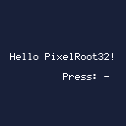

# Hello World

> **Demonstration project** — provided as an example of what the PixelRoot32
> Game Engine can do. It is not a product: parts may be incomplete,
> experimental, or deliberately simplified to keep one idea in focus.

Minimal PixelRoot32 project: **`UILabel`** text, **button polling** through **`InputManager`**, and a **background color** that cycles every few frames. Intended as the smallest “engine boots → scene draws → input works” check.

Language: C++17  
Engine: `gperez88/PixelRoot32-Game-Engine@^1.9.0`  
Environments: `native`, `esp32dev`, `esp32s3`  
Category: Getting started



## Requirements (build flags)

No special `PIXELROOT32_ENABLE_*` flags beyond what **`lib/platformio.ini`** / defaults pull in. Resolution is set with **`PHYSICAL_DISPLAY_WIDTH`**, **`PHYSICAL_DISPLAY_HEIGHT`** (**128×128**) in **`platformio.ini`**.

The scene uses **`extern pixelroot32::core::Engine engine`** from your platform file (`src/platforms/native.h` or `esp32_dev.h`) — same pattern as other examples.

## Platforms

| Environment | Display |
|-------------|---------|
| **`native`** | SDL2, 128×128 logical size |
| **`esp32dev`** | **ST7735** 128×128 (GreenTab3 profile), SPI pins in **`platformio.ini`**: MOSI **23**, SCLK **18**, DC **2**, RST **4**, CS **-1** |
| **`esp32s3`** | **ST7735** 128×128 (GreenTab3 profile), SPI pins in **`platformio.ini`**: MOSI **12**, MISO **14**, SCLK **13**, DC **10**, RST **11**, CS **9** |

> ⚠️ **Note for ESP32-S3**: The `env:esp32s3` uses Arduino Core **2.0.14** as a workaround for DMA freeze issues (see [espressif/arduino-esp32#9618](https://github.com/espressif/arduino-esp32/issues/9618)). This is configured in `platformio.ini` via `platform_packages`.


## Controls

- **D-pad / face buttons** — any press is shown in the second label (`checkButtonPress()` in [`HelloWorldScene.cpp`](src/HelloWorldScene.cpp)).
- Background advances on a fixed frame interval (`COLOR_CHANGE_INTERVAL`).

## What it demonstrates
- **`Scene`** lifecycle (`init` / `update` / `draw`)
- **`UILabel`** and `Renderer` text/color APIs
- **InputManager** button bitmask

## Engine documentation
- [Core API](https://github.com/PixelRoot32-Game-Engine/PixelRoot32-Game-Engine/blob/main/docs/api/core.md)
- [UI API](https://github.com/PixelRoot32-Game-Engine/PixelRoot32-Game-Engine/blob/main/docs/api/ui.md)
- [Graphics / Renderer](https://github.com/PixelRoot32-Game-Engine/PixelRoot32-Game-Engine/blob/main/docs/api/graphics.md)

## Build

From **`getting_started/hello_world`**:

```bash
pio run -e native
pio run -e esp32dev
pio run -e esp32_s3
```

## Upload (ESP32)

```bash
pio run -e esp32dev --target upload
```

## License

Source code: [MIT](../../LICENSE).

This demo ships no art, audio, or generated asset headers. Everything it draws
is text and solid colours resolved through the engine's built-in palette, so
there is nothing here to attribute.

---

**Source code:** https://github.com/PixelRoot32-Game-Engine/PixelRoot32-Demo-Projects/tree/main/getting_started/hello_world
