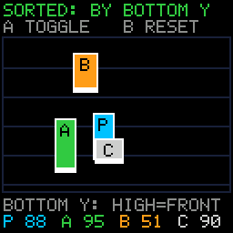

# Depth Sort

> **Demonstration project** — provided as an example of what the PixelRoot32
> Game Engine can do. It is not a product: parts may be incomplete,
> experimental, or deliberately simplified to keep one idea in focus.

Four boxes of four different heights share one render layer and walk over each
other in a top-down field. With `Scene::depthComparator` assigned, whoever is
standing lower on screen is painted last and therefore in front. Press **A** and
the comparator is cleared: the same four actors are drawn in the order they were
added, which looks almost right and is wrong. The four bottom-edge values under
the field are the entire sort key, printed live, so the rule can be checked
against the picture instead of taken on trust.

Language: C++17  
Engine: `gperez88/PixelRoot32-Game-Engine@^1.9.0`  
Environments: `native`, `esp32dev`  
Category: Graphics  



## Requirements (build flags)

Set in [`lib/platformio.ini`](lib/platformio.ini) (`base` template, inherited by
every environment).

| Flag | Set to | Why |
|------|--------|-----|
| `PIXELROOT32_ENABLE_DEPTH_SORT` | `1` | The topic. The engine default is `0` (`include/platforms/PlatformDefaults.h`) and it is `#if`-tested, so the `=1` is required — but read the next paragraph, because this flag does **not** work the way most engine flags do. |
| `PIXELROOT32_ENABLE_AUDIO` | `0` | Off on purpose. Frees roughly **17 KB** of RAM: mixer voices, the SPSC command queue, and the sequencer state. This demo makes no sound. |
| `PIXELROOT32_ENABLE_PHYSICS` | `0` | Off on purpose. Frees roughly **9 KB**: `CollisionSystem`'s actor tables and the fixed-timestep `PhysicsScheduler`, both members of every `Scene`. The actors here overlap; they never collide. |
| `PIXELROOT32_ENABLE_UI_SYSTEM` | `0` | Off on purpose. Frees roughly **9 KB**: `UIManager`'s widget and hit-test tables, again a per-`Scene` member. The HUD here is four `Renderer::drawText` calls. |
| `PIXELROOT32_ENABLE_PARTICLES` | `0` | Off on purpose. Frees roughly **2 KB** of particle pool. Nothing on screen sparkles. |

**`PIXELROOT32_ENABLE_DEPTH_SORT` gates your code, not the engine's.**
`Scene::depthComparator`, `Scene::depthSortEnabled` and `Scene::shouldPrecede()`
are plain unguarded members of `core/Scene.h`; `gameplay/DepthCompare.h` has no
`#if` around it either. The capability is compiled in whether or not you set the
flag. What the flag buys you is `platforms::config::EnableDepthSort`, a
`constexpr bool` your own scene can branch on — which is exactly how
[`games/bomberbot`](../../games/bomberbot) uses it, and how this demo uses it.

So building **without** the flag is not a compile error and not a black screen.
It is worse than either: everything still runs, `applyMode()` simply never
assigns the comparator, and the four actors overlap in add order forever. This
demo refuses to lie about that — the banner reads `DEPTH_SORT FLAG OFF` in red
and **A** does nothing, because a toggle wired to a disabled branch is a toggle
that should not move.

The other four zeros are the category rule from `CONTRIBUTING.md`: a demo
enables the minimum set of flags its topic needs. Leaving those subsystems on
would spend roughly **37 KB** of ESP32 RAM on machinery nothing here touches.

## Platforms

| Environment | Display | Audio backend |
|-------------|---------|---------------|
| **`native`** | SDL2, 128×128 logical size | none — `PIXELROOT32_ENABLE_AUDIO=0` |
| **`esp32dev`** | **ST7735** 128×128 (GreenTab3 profile), SPI pins in [`platformio.ini`](platformio.ini): MOSI **23**, SCLK **18**, DC **2**, RST **4**, CS **-1** | none — `PIXELROOT32_ENABLE_AUDIO=0` |

## Controls

| Button | `native` | `esp32dev` | Action |
|--------|----------|------------|--------|
| **D-pad** | Arrow keys | GPIO **32** / **27** / **33** / **14** | Walk **P**, the cyan actor, anywhere in the field. Cross the other three to see the overlap decided. |
| **A** | `Space` | GPIO **13** | Assign or clear `depthComparator`. The banner switches between `SORTED: BY BOTTOM Y` and `UNSORTED: ADD ORDER`. |
| **B** | `Enter` | GPIO **12** | Every actor back to its starting row and patrol direction. |

**A**, **B**, **C** pace up and down on their own at 16, 23 and 31 px/s, so the
order keeps changing even with your hands off the D-pad.

## What it demonstrates

### The comparator's return-value contract

This is the one thing worth getting right, and it is easy to get backwards
because a reversed comparator still produces a demo that looks busy.

`Scene::sortEntities()` is an insertion sort over `entities[]`, and
`Scene::draw()` walks that same array from index `0` upward. **Array order is
draw order, and drawing first means being painted under.** The predicate is
`Scene::shouldPrecede(key, at)` — "must `key` be placed *before* `at`?" — which
consults your comparator only when the two entities share a `renderLayer`:

```cpp
if (la != lk) return la > lk;                 // different layers: layer wins
if (depthComparator == nullptr) return false; // no comparator: stable, no-op
return depthComparator(key, at);
```

So `comparator(a, b) == true` means **"`a` is drawn before `b`", which means
"`a` is behind `b`"**. Returning `true` for the actor you want in *front* puts it
at the back. The engine's `compareByBottomY` returns `true` when `a`'s bottom
edge is higher up the screen than `b`'s, so the actor standing further back is
painted first and the one standing lower covers it. That is the top-down rule.

Note the `nullptr` line: with no comparator, `shouldPrecede` is always `false`
for same-layer entities, the insertion sort is a stable no-op, and the array
keeps whatever order it already had. Which is why **A** does not merely clear
the pointer — `applyMode()` also calls `clearEntities()` and re-adds the four
actors in a fixed order. Without that, turning sorting off would freeze the
scene in whatever order the last sorted frame happened to leave behind, rather
than showing the add order the reader can predict.

### What "bottom Y" means

`Entity::position` is the **top-left** corner. `position.y` on its own says
nothing about where an actor is standing: a 30 px actor and a 14 px actor at the
same `position.y` have their feet 16 px apart. The sort key is
`position.y + height`, the bottom edge — the contact point with the floor. The
four heights here are 26, 30, 22 and 14 px precisely so that sorting by
`position.y` and sorting by the bottom edge give *different* answers; with four
equal-height actors the demo would prove nothing.

Each actor paints a bright bar across its own bottom three rows, and the row
under the field prints `P nnn A nnn B nnn C nnn` in each actor's colour. In
`SORTED` mode those four numbers, read against the draw order, are always
ascending back-to-front.

### The engine ships this comparator

`gameplay/DepthCompare.h` provides:

```cpp
inline bool compareByBottomY(core::Entity* a, core::Entity* b);
```

It is a free function, not a lambda and not a member, so it is already a
`bool (*)(Entity*, Entity*)` and drops straight into `Scene::depthComparator`.
Worth knowing, because [`games/bomberbot`](../../games/bomberbot) — the other
depth-sorted project here — hand-rolls a `static bool drawLowerLast(...)` that
computes the same thing:

| | bomberbot's `drawLowerLast` | engine's `compareByBottomY` |
|---|---|---|
| Key | `(int)position.y + height` | `position.y + toScalar(height)` |
| Returns | `footA < footB` | `bottomA < bottomB` |

Same ordering. The only difference is arithmetic width: bomberbot truncates
`position.y` to `int` first, the engine compares in `Scalar` (`float` on native,
`Fixed16` on ESP32), so the shipped helper also orders two actors whose feet
differ by less than a pixel. Nothing in this repository used the ready-made
helper before this demo; a game that wants plain Y-ordering does not need to
write the predicate at all.

### `depthSortEnabled` is the other half

Assigning the comparator is not enough. `Scene::draw()` re-sorts only
`if (needsSorting || depthSortEnabled)`, and `needsSorting` is set by
`addEntity()` / `removeEntity()`. Actors that move every frame need the order
recomputed every frame, so `depthSortEnabled = true` goes with the assignment.
Set the comparator and forget this flag and the ordering is correct exactly once
— at the moment the last actor was added — and then silently rots.

### Viewport culling does not bite here

`Scene::draw()` skips entities that fail `isVisibleInViewport()`, which derives
the viewport from the renderer's offset: `viewX = -renderer.getXOffset()`, and
similarly for Y. This demo never scrolls and never calls `setDisplayOffset()`,
so both offsets stay at the `X_OFF_SET` / `Y_OFF_SET` default of `0` and the
viewport is the full 128×128 logical screen. Every actor is clamped inside the
playfield border, so nothing is ever culled. Worth checking rather than
assuming: in a scrolling game the cull runs *after* the sort and removes
entities from the draw pass without touching the order.

### Zero allocation

The four actors are plain members of the scene, added with `addEntity()`.
Positions are `int32_t` Q8 fixed point (256 units = 1 pixel) so the ESP32 path
never touches a float, mirrored into `Entity::position` on every move because
that is what the comparator reads. The four HUD strings are fixed `char` members
filled by `snprintf`. There is no `new`, no `malloc`, no `std::string` anywhere
in `update()` or `draw()`, and the mode toggle re-uses the same four objects.

## Build

From **`graphics/depth_sort`**:

```bash
pio run -e native
pio run -e native --target exec
pio run -e esp32dev
```

The committed `[env:native]` flags target Windows/MSYS2. On Linux drop the
`-IC:/msys64/...`, `-LC:/msys64/...` and `-mconsole` lines; on macOS drop them
and uncomment the two Homebrew lines above them. CI does this itself.

## Upload (ESP32)

```bash
pio run -e esp32dev --target upload
```

## Engine documentation

- [Core API](https://github.com/PixelRoot32-Game-Engine/PixelRoot32-Game-Engine/blob/main/docs/api/core.md)
- [Graphics / Renderer](https://github.com/PixelRoot32-Game-Engine/PixelRoot32-Game-Engine/blob/main/docs/api/graphics.md)
- [Input API](https://github.com/PixelRoot32-Game-Engine/PixelRoot32-Game-Engine/blob/main/docs/api/input.md)
- [Scene manager](https://github.com/PixelRoot32-Game-Engine/PixelRoot32-Game-Engine/blob/main/docs/scene-manager.md)
- [`core/Scene.h`](https://github.com/PixelRoot32-Game-Engine/PixelRoot32-Game-Engine/blob/main/include/core/Scene.h) — `DepthComparator`, `depthSortEnabled` and `shouldPrecede()`
- [`gameplay/DepthCompare.h`](https://github.com/PixelRoot32-Game-Engine/PixelRoot32-Game-Engine/blob/main/include/gameplay/DepthCompare.h) — `compareByBottomY`

## License

Source code: [MIT](../../LICENSE).

This demo ships no art, audio, or generated asset headers. Every actor is a pair
of `Renderer` rectangles and one character of the engine's built-in 5×7 font,
drawn against the built-in PR32 palette, so there is nothing here to attribute.

---

**Source code:** https://github.com/PixelRoot32-Game-Engine/PixelRoot32-Demo-Projects/tree/main/graphics/depth_sort
