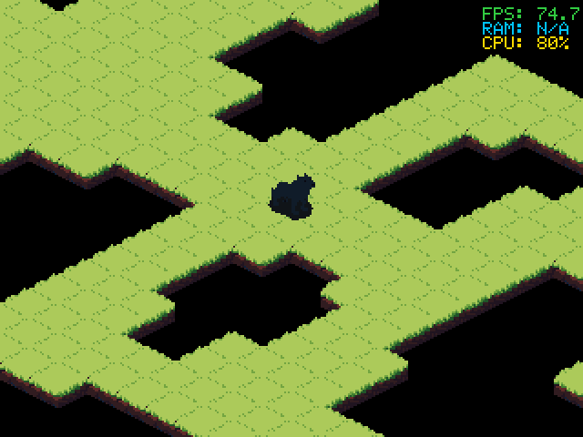

# Isometric Tilemap Export

> **Demonstration project** — provided as an example of what the PixelRoot32
> Game Engine can do. It is not a product: parts may be incomplete,
> experimental, or deliberately simplified to keep one idea in focus.

> **Temporary dependency pin.** This demo depends on the projection API
> (`ProjectionSpec`, the projected `drawTileMap` overload,
> `expandProjectedMapBounds`, `cameraRangeFor`, `computeSpanTable`), which is
> not in the published `1.9.0` package yet. Until it merges and ships,
> `platformio.ini` pins `lib_deps` to the engine repository's
> `feature/isometric-support` branch. Switch it to
> `gperez88/PixelRoot32-Game-Engine@^1.10.0` when that release exists —
> together with [`iso_dungeon`](../iso_dungeon), which carries the same pin
> for the same reason.

A minimal PixelRoot32 game whose entire scene comes out of the Tilemap Editor's
exporter: **isometric projection, 36x29 cells, a 32x16 cell stride, one ground
layer, one palette slot**. Nothing in `src/assets/` is hand-written, and
nothing in `src/` corrects it.

The project exists to answer one question — *does the engine paint what the
editor showed?* — and it is also the check that keeps the answer true.

> **Two isometric demos, two questions.** This is the **pipeline** demo — an
> editor export reaching the screen unaltered. For what happens *after* the
> tiles are drawn — actors moving tile by tile, projection-aware depth
> sorting, rooms connected by a `RoomGraph` — see
> [`iso_dungeon`](../iso_dungeon). It carries the same temporary branch pin as
> this demo, and the two should be switched to `@^1.10.0` together.

Language: C++17  
Engine: `PixelRoot32-Game-Engine#feature/isometric-support` (temporary branch pin)  
Environments: `native`, `esp32dev`  
Category: Graphics



## Requirements (build flags)

Set in [`lib/platformio.ini`](lib/platformio.ini)'s `[base]` template, so both
environments inherit them:

| Flag | Value | Why |
|------|-------|-----|
| `PIXELROOT32_ENABLE_PROJECTION` | `1` | The cell-to-screen basis `ISO_PROJECTION` is expressed in. Without it `math/Projection.h` compiles to nothing. |
| `PIXELROOT32_ENABLE_TILEMAP_PROJECTION` | `1` | The projected `drawTileMap` overload — the whole point of the demo. Without it the only overload left is the orthogonal one, which steps by `tileWidth`/`tileHeight` and cannot place a diamond. |
| `PIXELROOT32_ENABLE_GAMEPLAY_GRID_SPACE` | `1` | `gameplay/GridMotion.h`, which the player uses to walk cell to cell. It shares this flag with `GridSpace`, so an isometric game that never declares a `GridSpec` still has to enable it. |
| `PIXELROOT32_ENABLE_GAMEPLAY_ROOM` | `1` | The export references `gameplay::RoomData` behind this flag. |
| `PIXELROOT32_ENABLE_4BPP_SPRITES` | `1` | The exported tileset and the player sheets are 4bpp. Building without it is not an error — it is a black screen. |
| `PIXELROOT32_ENABLE_DIRTY_REGIONS` | `1` | Per-tile dirty-skip on the ground layer (see *Performance optimisations*). ESP32 only; the native SDL2 driver ignores the dirty grid. |
| `PIXELROOT32_ENABLE_AUDIO` | `0` | Not used. |
| `PIXELROOT32_ENABLE_PHYSICS` | `0` | Not used — movement is grid motion, not a physics query. |
| `PIXELROOT32_ENABLE_PARTICLES` | `0` | Not used. |
| `PIXELROOT32_ENABLE_UI_SYSTEM` | `0` | Not used — the debug overlay draws through the renderer directly. |
| `PIXELROOT32_ENABLE_2BPP_SPRITES` | `0` | No 2bpp art in this scene. |

## Platforms

| Environment | Display | Audio |
|-------------|---------|-------|
| `native` | SDL2 window, 320x240 | none — `PIXELROOT32_ENABLE_AUDIO=0` |
| `esp32dev` | ST7789 240x240 over SPI — MOSI **23**, SCLK **18**, DC **2**, RST **4**, CS **-1** | none |

The two window sizes differ on purpose: the map is larger than either, so the
view scrolls (see *Scrolling*) rather than showing the whole scene at once.

## What it verifies

Painting the scene is one call:

```cpp
renderer.drawTileMap(ground, 0, 0, LayerType::Dynamic, ISO_PROJECTION);
```

Everything else — geometry, tile indices, tileset, tile count, per-tile foot
anchor — is set by the export's own `init()`. If any of that stops arriving,
this project stops building or starts drawing wrong, which is the point of
keeping it around.

## Scrolling: the engine's camera, not a local one

The map is larger than the window, so the view follows the player as it walks
the cells. None of that is hand-rolled any more, and none of it touches the
export:

```cpp
// once, in init()
expandProjectedMapBounds(world_, ground, ISO_PROJECTION);

// every frame, in this order
camera_.setViewportSize(viewW, viewH);
const auto range = cameraRangeFor(world_, viewW, viewH);
camera_.setBounds(...); camera_.setVerticalBounds(...);   // before the position
camera_.setPosition(...);                                  // setPosition clamps
camera_.apply(renderer);                                   // → display offset
```

Three things in that flow are easy to get wrong and worth naming:

- **`expandProjectedMapBounds` is what knows how big the drawn map is.** It is
  not `MAP_WIDTH * TILE_WIDTH`: under an isometric basis a step along either
  cell axis moves *both* screen axes, and 32×32 art anchored at foot row 24
  overhangs its 32×16 cell. For this export the answer is 1040×536 px, derived
  rather than written down.
- **Bounds before position.** `Camera2D::setPosition` clamps against the bounds
  the camera already holds, so setting the position first clamps it against the
  previous frame's range — or, on frame one, against `{0, 0}`.
- **`apply()` makes the origin zero.** It writes the negated camera position
  into the renderer's display offset, which every later primitive honours — the
  tilemap above and the player's sprite alike. That is why the `drawTileMap`
  call passes `0, 0`, and why the player takes no camera argument. Passing the
  camera at a call site as well would count it twice.

## What the export carries

```cpp
inline constexpr uint8_t TILE_WIDTH  = 32;   // the CELL stride
inline constexpr uint8_t TILE_HEIGHT = 16;   // not the bitmap size
inline constexpr uint8_t MAP_WIDTH   = 36;
inline constexpr uint8_t MAP_HEIGHT  = 29;

inline constexpr pixelroot32::math::ProjectionSpec ISO_PROJECTION{
    464, 24,
     16,  8,
    -16,  8};

inline constexpr uint16_t TILESET_TILE_COUNT = 2;
extern const uint8_t TILESET_FOOT_Y[TILESET_TILE_COUNT];
```

Both origin components are derived rather than guessed. `originX = 464` is the
map's own western inset, `rows * cellW / 2 = 29 * 32 / 2`. `originY = 24` is
`max(foot)`, which is what keeps the tallest sprite's top edge from crossing
`y = 0` — and 24 is `derivedFootY(32, 16, Isometric)`, i.e.
`tileHeight - cellHeight / 2`.

The foot table is parallel to the layer's `tiles[]` — `tileFootY` is indexed
by the same tile slot `tiles[]` uses, so the export emits it right alongside
the tileset. Two tiles here: index 0 is the exporter's empty sentinel (foot 0),
index 1 the 32×32 ground tile anchored at foot row 24.

## The defect this project found

Built against the first export of this scene, it did not link:

```
undefined reference to `isometric_scene::main_scene::TILESET_FOOT_Y'
```

Three separate gaps in the Tool Suite's `cpp_code_generator.cpp`, since fixed:

1. **`init()` never assigned `tileFootY`** — on either palette path. That one
   was silent: it compiled, it linked, it rendered, and every tile anchored at
   its top-left corner instead of its foot, so the whole map drew a
   foot-height too low.
2. **Multi-palette exports never defined the table.** The definition was
   emitted from the single-palette tileset helper, while the header declared
   the `extern` unconditionally.
3. **The table was sized from the raw tilesheet, not the deduped pool.** Dedup
   collapses identical tiles, so the two arrays have different lengths and a
   different order, and `footYFor()` bounds-checks against the pool's
   `tileCount`.

A fourth is latent rather than fixed: both sprite emitters hardcode
`ctx.tileSize` for width *and* height, so a 32x40 wall sheet would export as
32x32. This project's art is 32x32, so it does not bite — but the reference
contract at [`iso_dungeon`](https://github.com/PixelRoot32-Game-Engine/PixelRoot32-Game-Engine/tree/feature/isometric-support/examples/iso_dungeon) mixes 32x16 floors with 32x40 walls, which
is the normal isometric case.

## Performance optimisations

Two opt-in engine optimisations for isometric ground layers are enabled here
(see `platformio.ini` and `IsoTilemapExportScene::init`):

- **Per-tile dirty-skip** (`PIXELROOT32_ENABLE_DIRTY_REGIONS=1`). When the
  camera is stationary and the layer is `Dynamic`, the projected tilemap loop
  blits only the tiles whose screen rect intersects a dirty cell — a few tiles
  instead of the ~200 the camera window covers. It takes effect only on an 8bpp
  framebuffer (ESP32/TFT_eSPI); the native SDL2 driver skips the dirty grid
  entirely, so the effect is invisible under `pio run -e native`.
- **Span-limited blit** (`computeSpanTable`). The 32×32 ground tile is a diamond
  with transparent padding top and bottom, yet the blit decodes all 1024
  nibbles. `init()` copies the two `Sprite4bpp` descriptors into RAM, computes
  the per-row opaque span, and repoints `ground.tiles` at the copies. The pixel
  data stays in flash; only the 16-byte descriptors move. Copying to RAM rather
  than `const_cast`-writing the exported `static const` descriptors matters on
  ESP32, where they may live in flash and a write would be a LoadStoreError.

`computeSpanTable` reads pixel data through `PIXELROOT32_READ_BYTE_P`
(`pgm_read_byte` on ESP32, a plain dereference on native), so flash-resident
art is read safely on every target.

## Build
```bash
pio run -e native
.pio/build/native/program.exe
```

The window is **320x240** on native and **240x240** on `esp32dev` (`platformio.ini`). The map is wider and taller than
that — see the camera section above — which is the reason the view scrolls
instead of showing the whole scene at once.

PlatformIO fetches the engine itself from the branch pinned in `platformio.ini`;
no local engine checkout is needed. Native builds also need SDL2 — from
MSYS2/MinGW on Windows, `libsdl2-dev` on Linux, `brew install sdl2` on macOS.
The `platformio.ini` here ships with the Windows/MSYS2 include and library
paths; remove the `-IC:/msys64/...`, `-LC:/msys64/...` and `-mconsole` flags on
the other two.

## Upload (ESP32)

```bash
pio run -e esp32dev --target upload
```

## Project layout
```
platformio.ini                 native and esp32dev environments
lib/platformio.ini             shared build templates
src/main.cpp
src/platforms/                 native (SDL2) and esp32dev entry points
src/IsoTilemapExportScene.*    the projected drawTileMap call and the camera
src/actors/PlayerActor.*       the player actor that walks the exported cells
src/assets/                    exporter output, untouched
```

## Re-exporting

Overwrite `src/assets/` from the editor and rebuild. If it still links and the
tiles still sit in their diamonds, the export contract held.

## License

Source code: [MIT](../../LICENSE).

| Asset | Author | License | Source |
|-------|--------|---------|--------|
| Isometric ground tileset, baked into [`src/assets/tilemap/`](src/assets/tilemap/) by the Tilemap Editor exporter | scrabling | CC BY 4.0 | [Pixel Isometric Tiles](https://scrabling.itch.io/pixel-isometric-tiles) |
| Player idle and run sheets, 64x64, in [`src/assets/sprites/`](src/assets/sprites/) | scrabling | CC BY 4.0 | same pack |

Art by [scrabling](https://scrabling.itch.io/), used under
[CC BY 4.0](https://creativecommons.org/licenses/by/4.0/) and re-encoded to the
engine's 4bpp nibble-packed format. The pack ships here as generated content
files of this demo, not as a redistributable copy of the pack: the author's own
terms permit exactly that use and prohibit redistributing the assets on their
own or as part of a collection. If you want the tiles themselves, get them from
the link above.

---

**Source code:** https://github.com/PixelRoot32-Game-Engine/PixelRoot32-Demo-Projects/tree/main/graphics/iso_tilemap_export
