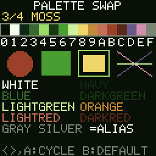

# Palette Swap

> **Demonstration project** — provided as an example of what the PixelRoot32
> Game Engine can do. It is not a product: parts may be incomplete,
> experimental, or deliberately simplified to keep one idea in focus.

One scene, drawn exactly once, repainted four different ways. Every primitive in
`draw()` names a `Color` enumerator, and a `Color` enumerator is a palette index
rather than an RGB value — so a single `setCustomPalette()` call changes all
sixteen colours on screen without the drawing code changing at all.

Language: C++17  
Engine: `gperez88/PixelRoot32-Game-Engine@^1.9.0`  
Environments: `native`, `esp32dev`  
Category: Graphics  



## Requirements (build flags)

**Nothing needs enabling.** Palette handling is core renderer behaviour, not an
opt-in subsystem: `setPalette()`, `setCustomPalette()` and `resolveColor()` are
always compiled in, and the `Color` enum is part of `graphics/Color.h` with no
feature guard around it. There is no `PIXELROOT32_ENABLE_PALETTE`, and the
absence is the point — you do not pay to adopt this, and you cannot turn it off.

What the demo does set are four *disables*, so the flag list stays honest about
what a palette-only demo costs:

| Flag | Value | Why | Cost if left on |
| ---- | ----- | --- | --------------- |
| `PIXELROOT32_ENABLE_AUDIO` | `0` | The demo is silent. | ~17 KB RAM: mixer voices + command queue |
| `PIXELROOT32_ENABLE_PHYSICS` | `0` | Nothing moves, so nothing collides. | ~9 KB RAM: `CollisionSystem` + scheduler |
| `PIXELROOT32_ENABLE_UI_SYSTEM` | `0` | The HUD is four `drawText()` calls. | ~9 KB RAM: `UIManager` widget/hit-test tables |
| `PIXELROOT32_ENABLE_PARTICLES` | `0` | No emitters. | ~2 KB RAM: particle pool |

Together those four release roughly 37 KB of RAM on ESP32. They live in
[`lib/platformio.ini`](lib/platformio.ini) under `[base]`, alongside the
language flags (`-std=gnu++17`, `-fno-exceptions`, and `-fno-rtti` on ESP32).

Turning any of them back on is not an error — it is silent RAM you are not using.

## Platforms

| Environment | Display | Driver | Audio backend |
| ----------- | ------- | ------ | ------------- |
| `native` | 128x128 logical, SDL2 window | `DisplayType::NONE` (SDL2_Drawer) | none — `PIXELROOT32_ENABLE_AUDIO=0` |
| `esp32dev` | 128x128 ST7735 (GREENTAB3), SPI @ 40 MHz | `DisplayType::ST7735` (TFT_eSPI_Drawer) | none — `PIXELROOT32_ENABLE_AUDIO=0` |

Both targets render the same 128x128 logical frame. Pin assignments for
`esp32dev` are in [`platformio.ini`](platformio.ini); the display and input
wiring lives in [`src/platforms/`](src/platforms/).

## Controls

| Button | Native key | ESP32 pin | Action |
| ------ | ---------- | --------- | ------ |
| Left | Left arrow | GPIO 33 | Previous palette |
| Right | Right arrow | GPIO 14 | Next palette |
| A | Space | GPIO 13 | Next palette (cycles, wraps 4 → 1) |
| B | Enter | GPIO 12 | Return to the engine's built-in PR32 palette |

Pressing A, Left or Right after B resumes the cycle from where it left off — B
changes the palette, not the position in the list.

## What it demonstrates

### The Color enum is an index, not a colour

`pixelroot32::graphics::Color` enumerators *are* the palette indices 0-15. Entry
`n` of a custom palette is what `Color::<name>` resolves to:

| Index | Enumerator | Index | Enumerator |
| ----- | ---------- | ----- | ---------- |
| 0 | `Black` | 8 | `Yellow` |
| 1 | `White` | 9 | `Orange` |
| 2 | `Navy` | 10 | `LightRed` |
| 3 | `Blue` | 11 | `Red` |
| 4 | `Cyan` | 12 | `DarkRed` |
| 5 | `DarkGreen` | 13 | `Purple` |
| 6 | `Green` | 14 | `Magenta` |
| 7 | `LightGreen` | 15 | `Gray` |

The names are historical labels for the *default* PR32 table. Under this demo's
EMBER palette, `Color::Blue` is a brown; under MONO it is a dark grey. Nothing in
`draw()` knows or cares — the swatch strip on screen is drawn by casting a loop
counter straight to `Color`, which is legal precisely because the enumerator is
the index.

### Several names are aliases of the same slot

Editing one entry moves every name that collapses onto it. These are the aliases
the engine header declares:

| Slot | Canonical | Aliases |
| ---- | --------- | ------- |
| 2 | `Navy` | `DarkBlue` |
| 3 | `Blue` | `LightBlue`, `DebugBlue` |
| 4 | `Cyan` | `Teal` |
| 5 | `DarkGreen` | `Olive` |
| 6 | `Green` | `DebugGreen` |
| 8 | `Yellow` | `Gold` |
| 11 | `Red` | `DebugRed` |
| 12 | `DarkRed` | `Brown`, `Maroon` |
| 14 | `Magenta` | `Pink`, `LightPurple` |
| 15 | `Gray` | `MidGray`, `LightGray`, `DarkGray`, `Silver` |

`Color::Silver == Color::Gray` compares true. There is no separate silver to
tune: a palette author who "fixes" `Silver` has just moved `DarkGray`,
`LightGray`, `MidGray` and `Gray` too. The demo draws the words `GRAY` and
`SILVER` side by side, in `Color::Gray` and `Color::Silver`, so the collapse is
visible rather than merely documented.

`Color::Transparent` (255) is the odd one out: it is a sentinel intercepted by
the renderer, never resolved against a palette, and passing it to a drawing
primitive is a no-op.

### Single Palette Mode is what this demo runs in

`graphics/Color.h` documents two modes:

- **Single Palette Mode (default)** — one global palette resolves every draw,
  background and sprite alike.
- **Dual Palette Mode** — enabled by `enableDualPaletteMode(true)`; backgrounds
  resolve against `backgroundPalette` and sprites against `spritePalette`, and
  `resolveColor(color, context)` picks between them.

This demo stays in Single Palette Mode and never calls
`enableDualPaletteMode()`. `setCustomPalette()` and `setPalette()` are documented
as the *legacy* (single) entry points, and reading their implementations shows
what that means in practice: each one assigns the same pointer to
`currentPalette`, `backgroundPalette`, `spritePalette`, **and** to slot 0 of both
the 8-entry background and sprite slot banks, while deliberately leaving
`dualPaletteMode` false. So one call really does repaint everything — that
breadth is a property of the single-palette entry point, not of palettes in
general.

The practical implication: because slot 0 of each bank is also rewritten, a demo
that later adopts multi-palette tilemaps or sprites (`setBackgroundPaletteSlot`,
`setSpritePaletteSlot`, slots 0-7) will find its slot 0 already pointing at
whatever `setCustomPalette()` last handed over. Slots 1-7 are untouched.

### The engine keeps your pointer — it does not copy the entries

`setCustomPalette(const uint16_t*)` stores the pointer and nothing else. This is
stated in the header and confirmed in the engine's `src/graphics/Color.cpp`,
where the function assigns the argument to `currentPalette` (and the bank slots)
with no copy loop, and `resolveColor()` dereferences that same pointer on every
single draw call for the rest of the run.

So a palette handed to the engine must outlive every frame that uses it. The four
tables in [`src/assets/Palettes.h`](src/assets/Palettes.h) are `inline constexpr`
at namespace scope, which gives them static storage duration and puts them in
flash/rodata. A palette built as a local in `init()` would compile and run, and
then resolve colours out of a dead stack frame.

The header also nullptr-guards: `setCustomPalette(nullptr)` is a no-op that
leaves the previous palette active, rather than crashing on the next draw.

### The greyscale palette is the proof

Cycle to `4/4 MONO`. Every shape keeps its shape, its size and its position, and
loses its hue. That is only possible because the draw code stored slot numbers
the whole time.

## Project layout

```text
graphics/palette_swap/
├── platformio.ini            # envs, board, display size, TFT pins
├── lib/platformio.ini        # [base] language flags + the four disables
└── src/
    ├── main.cpp              # platform selector, nothing else
    ├── PaletteSwapScene.h    # layout constants, button indices, state
    ├── PaletteSwapScene.cpp  # one draw path; the swap is one line
    ├── assets/Palettes.h     # the four palettes + the index/alias tables
    └── platforms/
        ├── native.h          # SDL2 DisplayConfig, InputConfig, Engine, main()
        └── esp32_dev.h       # ST7735 DisplayConfig, GPIO InputConfig, setup/loop
```

`update()` and `draw()` allocate nothing: the HUD line is `snprintf`'d into a
fixed member buffer, and only on the frames where the palette actually changed.

## Build

```bash
cd graphics/palette_swap

pio run -e native                # build the SDL2 simulator
pio run -e native --target exec  # build and run it
pio run -e esp32dev              # build the ESP32 firmware
pio run -t clean -e native
```

The committed `[env:native]` `build_flags` target Windows/MSYS2. On Linux or
macOS remove the `-IC:/msys64/...`, `-LC:/msys64/...` and `-mconsole` lines;
on macOS also uncomment the two Homebrew lines above them.

## Upload (ESP32)

```bash
cd graphics/palette_swap

pio run -e esp32dev --target upload
pio device monitor -b 115200
```

## Engine documentation

- [PixelRoot32 Game Engine](https://github.com/PixelRoot32-Game-Engine/PixelRoot32-Game-Engine)
- [`include/graphics/Color.h`](https://github.com/PixelRoot32-Game-Engine/PixelRoot32-Game-Engine/blob/main/include/graphics/Color.h) — the `Color` enum, the alias list, and both palette modes
- [`include/graphics/PaletteDefs.h`](https://github.com/PixelRoot32-Game-Engine/PixelRoot32-Game-Engine/blob/main/include/graphics/PaletteDefs.h) — the built-in NES / GB / GBC / PICO8 / PR32 tables
- [`include/graphics/Renderer.h`](https://github.com/PixelRoot32-Game-Engine/PixelRoot32-Game-Engine/blob/main/include/graphics/Renderer.h) — the drawing primitives used here
- [`include/core/Scene.h`](https://github.com/PixelRoot32-Game-Engine/PixelRoot32-Game-Engine/blob/main/include/core/Scene.h) — the `init` / `update` / `draw` contract

## License

This demo ships **no art assets** — no sprites, no tilesets, no fonts, no audio.
Everything on screen is drawn from renderer primitives and the engine's built-in
5x7 font.

The four palettes in `src/assets/Palettes.h` (EMBER, SIGNAL, MOSS, MONO) are
original work created for this demo, released under the same MIT license as the
rest of the repository. They are hand-authored RGB565 constants, not derived from
any existing palette collection.

The source code is licensed under the MIT License.

---

**Source code:** https://github.com/PixelRoot32-Game-Engine/PixelRoot32-Demo-Projects/tree/main/graphics/palette_swap
