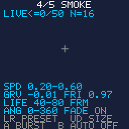

# Particles

> **Demonstration project** — provided as an example of what the PixelRoot32
> Game Engine can do. It is not a product: parts may be incomplete,
> experimental, or deliberately simplified to keep one idea in focus.

The engine ships five particle presets — Fire, Explosion, Sparks, Smoke, Dust —
and this demo walks them one at a time through a single `ParticleEmitter`.
Left/Right change preset, **A** fires a burst, **B** turns on continuous
emission, Up/Down resize the burst against the emitter's own 50-particle
ceiling. Under the effect the demo prints the config it was built from: speed
range, gravity, friction, life range, angle cone, fade flag. Those figures are
read back off the live `ParticleConfig` every time the preset changes, so the
numbers on screen are the header's numbers and cannot drift from them. That is
the single idea here: see the look and the parameters that produce it at once.

Language: C++17  
Engine: `gperez88/PixelRoot32-Game-Engine@^1.9.0`  
Environments: `native`, `esp32dev`  
Category: Graphics  



## Requirements (build flags)

Set in [`lib/platformio.ini`](lib/platformio.ini) (`base` template, inherited by
every environment).

| Flag | Set to | Why |
|------|--------|-----|
| `PIXELROOT32_ENABLE_PARTICLES` | `1` | The topic. Every header under `include/graphics/particles/` — `Particle.h`, `ParticleConfig.h`, `ParticleEmitter.h`, `ParticlePresets.h` — is wrapped in `#if PIXELROOT32_ENABLE_PARTICLES` and collapses to nothing without it, so `ParticleEmitter` is not a type and `MAX_PARTICLES_PER_EMITTER` is not defined. [`src/ParticlesScene.h`](src/ParticlesScene.h) stops the build with an `#error` naming the flag rather than letting you read a page of "unknown type name". Costs roughly **2 KB** of RAM and **5 KB** of flash. |
| `PIXELROOT32_ENABLE_AUDIO` | `0` | Off on purpose. Frees roughly **17 KB** of RAM: mixer voices, the SPSC command queue, and the sequencer state. This demo makes no sound, and the platform headers build the two-argument `Engine(config, inputConfig)` with no `AudioConfig` at all. |
| `PIXELROOT32_ENABLE_PHYSICS` | `0` | Off on purpose. Frees roughly **9 KB**: `CollisionSystem`'s actor tables and the fixed-timestep `PhysicsScheduler`, both members of every `Scene`. Particles carry their own gravity and friction inside `ParticleEmitter::update()`; they are not physics bodies and never touch a collider. |
| `PIXELROOT32_ENABLE_UI_SYSTEM` | `0` | Off on purpose. Frees roughly **9 KB**: `UIManager`'s widget and hit-test tables, again a per-`Scene` member. The HUD here is eight `Renderer` text calls and a two-line cross. |

That one-on, three-off list is the clearest example in the catalogue of why the
flag list is part of a demo's design. Particles are the cheapest of the four
toggles by an order of magnitude: the roughly 2 KB this demo spends buys
everything on screen, while the three zeros hold back roughly **35 KB** that
nothing here would have used. A demo that left all four on would spend roughly
eighteen times the RAM its own subject needs.

The measured cost is small and checkable. On the 64-bit `native` build
`sizeof(Particle)` is **24 bytes** and `sizeof(ParticleEmitter)` is **1272** —
50 × 24 for the fixed particle array, plus the 32-byte `ParticleConfig` copy and
the `Entity` base. It is a little smaller on the 32-bit ESP32. The emitter is a
plain member of the scene, so that figure is part of the scene's own `sizeof`
and there is no heap to go and measure.

## Platforms

| Environment | Display | Audio backend |
|-------------|---------|---------------|
| **`native`** | SDL2, 128×128 logical size | none — `PIXELROOT32_ENABLE_AUDIO=0` |
| **`esp32dev`** | **ST7735** 128×128 (GreenTab3 profile), SPI pins in [`platformio.ini`](platformio.ini): MOSI **23**, SCLK **18**, DC **2**, RST **4**, CS **-1** | none — `PIXELROOT32_ENABLE_AUDIO=0` |

## Controls

| Button | `native` | `esp32dev` | Action |
|--------|----------|------------|--------|
| **Left** | `Left` | GPIO **33** | Previous preset. The emitter is rebuilt, so anything still in the air is cleared. |
| **Right** | `Right` | GPIO **14** | Next preset. Wraps around after Dust. |
| **A** | `Space` | GPIO **13** | `burst(position, N)` once, with N the current burst size. |
| **B** | `Enter` | GPIO **12** | Toggle continuous emission: four particles every four frames, so the pool refills about as fast as it drains. |
| **Up** | `Up` | GPIO **32** | Burst size **+1**, clamped at `MAX_PARTICLES_PER_EMITTER` (50). |
| **Down** | `Down` | GPIO **27** | Burst size **-1**, clamped at 1. |

The HUD line under the title reads `LIVE<=n/50 N=b`: `n` is an upper bound on the
particles alive, `50` the emitter's ceiling, `b` the burst size Up/Down control.
See below for why that bound is an inequality.

## What it demonstrates

### The five presets, with the values from the header

Read from
[`include/graphics/particles/ParticlePresets.h`](https://github.com/PixelRoot32-Game-Engine/PixelRoot32-Game-Engine/blob/main/include/graphics/particles/ParticlePresets.h)
at engine 1.9.0. The demo prints the same fields off the live `ParticleConfig`
rather than from a copy of this table.

| Preset | Colour | Speed | Gravity | Friction | Life (frames) | Angle | `fadeColor` |
|--------|--------|-------|---------|----------|---------------|-------|-------------|
| **Fire** | `Red` → `DarkRed` | 0.50 – 1.50 | **-0.02** | 0.98 | 20 – 40 | 0 – 360 | `true` |
| **Explosion** | `Yellow` → `Black` | 2.00 – 4.00 | 0.10 | 0.90 | 10 – 20 | 0 – 360 | `true` |
| **Sparks** | `White` → `Yellow` | 1.50 – 3.00 | 0.15 | 0.85 | 8 – 15 | 0 – 360 | `true` |
| **Smoke** | `DarkGray` → `Black` | 0.20 – 0.60 | **-0.01** | 0.97 | 40 – 80 | 0 – 360 | `true` |
| **Dust** | `LightGray` → `DarkGray` | 0.30 – 1.00 | 0.08 | 0.90 | 12 – 25 | 0 – 360 | `true` |

Reading the table sideways is most of the lesson. Speed sets how far the effect
throws: Explosion at 2.00–4.00 clears the screen in a handful of frames while
Smoke at 0.20–0.60 barely leaves the emitter. Gravity is **positive down**, so
Fire and Smoke — the two with a negative value — are the two that rise. Friction
is a multiplier applied to velocity every frame, not a force: Sparks at 0.85
have shed 80 % of their speed after ten frames, Fire at 0.98 keep 82 % of it.
Life is what separates a puff from a plume: Sparks live 8–15 frames, Smoke 40–80.

Two things the shipped presets do **not** vary: every one of them emits over the
full `0 – 360` circle, and every one of them sets `fadeColor = true`. The angle
cone is a real parameter — `0` is right, `90` is down, `180` is left — but no
preset narrows it, so a directional jet is something you write a `ParticleConfig`
for yourself.

### Six of the ten config fields are `Scalar`, not `float`

`ParticleConfig` mixes types on purpose. `minSpeed`, `maxSpeed`, `gravity`,
`friction`, `minAngleDeg` and `maxAngleDeg` are `pixelroot32::math::Scalar`,
which is `float` where the target has an FPU and `Fixed16` where it does not;
assign them through `math::toScalar(...)` rather than writing a bare literal.
`minLife` and `maxLife` are plain `uint8_t`, `fadeColor` a plain `bool`, and
`startColor` / `endColor` plain `Color` values. The presets get away with brace
initialisation from float literals because both `float` and `Fixed16` are
constructible from one at compile time.

The demo's HUD has to print a `Scalar` on both paths, which it does by casting
to `float` once and formatting hundredths as integers — in `refreshPresetText()`,
called when the preset changes, never inside the frame loop.

### Life is measured in frames, and nothing is measured in time

`ParticleEmitter::update(unsigned long deltaTime)` opens with `(void)deltaTime;`
and never looks at it again. Life counts down by one per call, gravity is added
to velocity once per call, friction multiplies velocity once per call. So
`maxLife = 40` is 0.67 s at 60 fps and 1.6 s at 25 fps, and the same preset that
reads as a quick spark on the SDL2 build reads as a slow lob on hardware — not
because the numbers changed, but because they were never in seconds. Tune a
preset on the target you ship it on.

This demo counts its own continuous-emission cadence in frames too, for the same
reason: both sides of the effect then move on one clock.

### `burst()` takes the position explicitly

```cpp
void burst(pixelroot32::math::Vector2 position, int count);
```

The origin is an argument, not the emitter's `Entity` position — the emitter
never reads its own transform when spawning. One emitter can therefore serve
every effect on a screen: pass the enemy's position when it dies, the tyre's
position when the car turns. This demo passes one fixed point, drawn as a small
grey cross, so the shape of each preset is comparable between presses.

### `fadeColor = false` ignores `endColor` completely

The colour interpolation lives inside `if (config.fadeColor)`. With the flag off
`p.color` keeps the value it was given at spawn — `resolveColor(startColor)` —
for the particle's whole life, and `endColor` is dead weight in the struct. All
five shipped presets set it to `true`, so this is a trap you meet when writing
your own config, not when using theirs.

Two related edges, both visible in the table above and both about the palette
rather than the particle system. `Explosion` and `Smoke` end on `Color::Black`;
against a black background their tails fade to invisible, which is why this demo
paints navy. And in the PR32 `Color` enum `LightGray`, `DarkGray` and `Gray` are
the *same* enumerator — so `Dust`, which fades `LightGray → DarkGray`, has
`fadeColor = true` and no colour change at all.

### 50 particles, fixed at compile time, recycled not allocated

`MAX_PARTICLES_PER_EMITTER` is a `#define` in
[`ParticleEmitter.h`](https://github.com/PixelRoot32-Game-Engine/PixelRoot32-Game-Engine/blob/main/include/graphics/particles/ParticleEmitter.h)
— not a field of `ParticleConfig`, not a constant in `Particle.h` — and it sizes
a plain `Particle particles[50]` member. `burst()` walks that array looking for
slots with `active == false` and stops when it has filled `count` of them or run
out, so asking for 40 particles when 30 are alive gives you 20 and no complaint.
Nothing is allocated at any point, which is also why redefining the macro in a
demo would be worse than useless: the engine's own translation units were
already compiled against 50.

The emitter also kills any particle that leaves the logical screen, before its
life runs out, in both `update()`'s early-cull and its post-move bounds check.
An effect fired near an edge is a shorter effect.

### There is no live-particle accessor, so the HUD says `<=`

`ParticleEmitter` keeps `particles[]`, `maxParticles` and `config` all private
and exposes exactly three public methods: `update()`, `draw()` and `burst()`.
There is no `getActiveCount()`, no size query, no way to read the config back
out. Rather than invent one, this demo tracks what it can from the outside: each
burst is recorded as a *cohort* — how many particles it asked for, and
`config.maxLife` frames as the longest they could possibly last — and the HUD
sums the cohorts still inside their window, clamped to 50.

That is an upper bound and is labelled `LIVE<=n/50` for it. The real number is
lower whenever a particle drew a life shorter than `maxLife`, left the screen
early, or was never spawned because the pool was already full. It is the tightest
honest figure available from outside the class, and saying so is more useful than
a number that looks exact and is not.

### Switching preset without a setter, and without the heap

There is no `setConfig()`: `ParticleConfig` is a constructor argument the emitter
copies into a private member. Changing preset therefore means a different
emitter. This demo keeps one `alignas(ParticleEmitter) unsigned char` buffer as a
scene member and constructs into it with placement `new`, destroying the previous
occupant by hand first. Nothing is allocated, the RAM cost stays at one emitter
rather than five, and — because the address never changes — the pointer the base
`Scene` is holding in its entity list stays valid across the switch. Clearing the
old preset's particles is a side effect of the rebuild, and the right one.

The emitter is registered with `addEntity()` once in `init()`, so `Scene::update()`
and `Scene::draw()` drive it; the demo never calls the emitter's `update()` or
`draw()` itself.

### Zero allocation in the frame loop

No `new`, no `malloc`, no `std::string` in `update()` or `draw()`. The seven HUD
strings are fixed `char` members filled by `snprintf`: the five preset lines only
when the preset changes, the mode line only on a **B** press, and the stats line
only on the frames where the bound or the burst size actually moved.

## Build

From **`graphics/particles`**:

```bash
pio run -e native
pio run -e native --target exec
pio run -e esp32dev
```

The committed `[env:native]` flags target Windows/MSYS2. On Linux drop the
`-IC:/msys64/...`, `-LC:/msys64/...` and `-mconsole` lines; on macOS drop them
and uncomment the two Homebrew lines above them. CI does this itself.

## Upload (ESP32)

```bash
pio run -e esp32dev --target upload
```

## Engine documentation

- [Graphics / Renderer](https://github.com/PixelRoot32-Game-Engine/PixelRoot32-Game-Engine/blob/main/docs/api/graphics.md)
- [Core API](https://github.com/PixelRoot32-Game-Engine/PixelRoot32-Game-Engine/blob/main/docs/api/core.md)
- [Input API](https://github.com/PixelRoot32-Game-Engine/PixelRoot32-Game-Engine/blob/main/docs/api/input.md)
- [Memory system](https://github.com/PixelRoot32-Game-Engine/PixelRoot32-Game-Engine/blob/main/docs/architecture/memory-system.md)
- [`graphics/particles/ParticleEmitter.h`](https://github.com/PixelRoot32-Game-Engine/PixelRoot32-Game-Engine/blob/main/include/graphics/particles/ParticleEmitter.h) — the class, and the `MAX_PARTICLES_PER_EMITTER` macro
- [`graphics/particles/ParticleConfig.h`](https://github.com/PixelRoot32-Game-Engine/PixelRoot32-Game-Engine/blob/main/include/graphics/particles/ParticleConfig.h)
- [`graphics/particles/ParticlePresets.h`](https://github.com/PixelRoot32-Game-Engine/PixelRoot32-Game-Engine/blob/main/include/graphics/particles/ParticlePresets.h)
- [`math/Scalar.h`](https://github.com/PixelRoot32-Game-Engine/PixelRoot32-Game-Engine/blob/main/include/math/Scalar.h) — `Scalar` and `toScalar()`

## License

Source code: [MIT](../../LICENSE).

This demo ships no art, audio, or generated asset headers. Every particle is a
2×2 rectangle the engine draws itself, and the HUD uses the built-in 5×7 font
against the built-in PR32 palette, so there is nothing here to attribute.

---

**Source code:** https://github.com/PixelRoot32-Game-Engine/PixelRoot32-Demo-Projects/tree/main/graphics/particles
