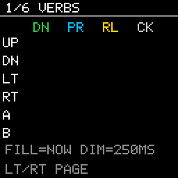

# Digital Buttons

> **Demonstration project** — provided as an example of what the PixelRoot32
> Game Engine can do. It is not a product: parts may be incomplete,
> experimental, or deliberately simplified to keep one idea in focus.

Six pages that put the digital-button half of `InputManager` on screen. A 6x4
matrix shows all four button queries firing live, a second page calls one of
them twice in a single frame to show that it consumes what it reports, and the
remaining four measure the debounce ceiling and layer key repeat, input
buffering and combo detection over the raw verbs. The single idea is that
`isButtonDown`, `isButtonPressed`, `isButtonReleased` and `isButtonClicked` are
four genuinely different questions — one is a level, two are single-frame
edges, and one is a consuming query — and that the difference is invisible
until you watch them side by side.

Language: C++17  
Engine: `gperez88/PixelRoot32-Game-Engine@^1.9.0`  
Environments: `native`, `esp32dev`  
Category: Input  



## Requirements (build flags)

Set in [`lib/platformio.ini`](lib/platformio.ini) (`base` template, inherited by
every environment).

| Flag | Set to | Why |
|------|--------|-----|
| *(none for the topic)* | — | **The subsystem this demo is about has no flag.** Every other demo in this repository opens its table with the switch that turns its topic on; this one cannot, because the digital-button pipeline is compiled unconditionally. `InputManager.h` has no `#if` around `buttonState[]`, `stateChanged[]`, `waitTime[]`, `clickFlag[]` or any of the four queries, and `Engine::update()` polls the buttons on every platform whatever the feature flags say. There is no build of this engine in which the four verbs are absent, and no flag that makes them cheaper. |
| `PIXELROOT32_ENABLE_AUDIO` | `0` | Defaults to `1`. This demo is silent, and audio is the engine's most expensive default: roughly **17 KB of RAM** for voice state and mixing buffers nothing here would write to. |
| `PIXELROOT32_ENABLE_PHYSICS` | `0` | Defaults to `1`. The scene owns no `Actor` and no entity at all; every page is `Renderer` primitives. Roughly **9 KB of RAM** for `CollisionSystem` and `SpatialGrid` that would sit reserved and unused. |
| `PIXELROOT32_ENABLE_PARTICLES` | `0` | Defaults to `1`. No effects. Roughly **2 KB of RAM** for the emitter pool. |
| `PIXELROOT32_ENABLE_UI_SYSTEM` | `0` | Defaults to `1`. `UIButton::handleInput()` and friends read `isButtonPressed()` for you — which is exactly what this demo refuses to do, because the point is to watch the query rather than the widget built on it. Turning the module off also removes roughly **9 KB of RAM** of `UIManager` widget and hit-test tables. See [`ui/menu_navigation`](../../ui/menu_navigation) for the same buttons consumed through widgets instead. |

`PIXELROOT32_ENABLE_TOUCH` is deliberately absent, and its absence is the point:
this demo is the physical-button counterpart to
[`input/touch_controls`](../touch_controls). Six GPIOs, no panel, no gesture
state machine. Between them the two demos cover both halves of `InputManager` —
and only the touch half has a flag.

## Platforms

| Environment | Display | Driver | Buttons | Audio backend |
|-------------|---------|--------|---------|---------------|
| `native` | 128x128 logical, SDL2 window | `SDL2_Drawer` (`DisplayType::NONE`) | Keyboard, six SDL scancodes read out of SDL's keyboard state array | none (`PIXELROOT32_ENABLE_AUDIO=0`) |
| `esp32dev` | 128x128 ST7735 (`GREENTAB3`) | `TFT_eSPI_Drawer` (`DisplayType::ST7735`) | Six GPIOs — 32, 27, 33, 14, 13, 12 — wired `INPUT_PULLUP` and read active-low | none (`PIXELROOT32_ENABLE_AUDIO=0`) |

Wire each button between its GPIO and ground, with nothing else.
`InputManager::init()` calls `pinMode(pin, INPUT_PULLUP)` on every configured
pin, and its ESP32 `update()` reads `digitalRead(pin) == LOW`. Active-low is
therefore a contract, not a convention: a button wired to 3V3 reads permanently
pressed and never produces an edge, and the matrix on page 1 shows exactly that
— a `DOWN` cell stuck on with the other three columns dark forever.

## Controls

| Input | Native | `esp32dev` | Used for |
|-------|--------|------------|----------|
| Up | Arrow Up | GPIO 32 | Held on the REPEAT page |
| Down | Arrow Down | GPIO 27 | Row 2 of the matrix |
| Left | Arrow Left | GPIO 33 | Previous page (wraps) |
| Right | Arrow Right | GPIO 14 | Next page (wraps) |
| A | Space | GPIO 13 | Clicked, mashed, buffered, half of the combo |
| B | Enter | GPIO 12 | The other half of the combo |

Left and Right are ordinary buttons like any other. On the matrix page they
light their own `LT` and `RT` rows on the same frame that flips the page — that
is not a glitch, it is the demo showing you an edge it is also acting on.

Changing page clears that page's counters, so the numbers always describe the
visit you are looking at.

## What it demonstrates

### 1. VERBS — the four queries, side by side

A 6x4 matrix: one row per button, one column per query — `DN` (down), `PR`
(pressed), `RL` (released), `CK` (clicked). A cell is filled bright while its
query is true on this very frame, and drawn as a dim grey outline for 250 ms
afterwards, purely so a human can see it. The latch is a display aid and
nothing else; the engine has no such thing.

The bright-versus-dim distinction is the whole lesson:

- **`DN` stays filled** for as long as the button is held. `isButtonDown()`
  returns `buttonState[i]` — a level, not an event.
- **`PR`, `RL` and `CK` can only ever flash.** All three depend on
  `stateChanged[i]`, and `InputManager::update()` sets `stateChanged[i] = false`
  at the top of every frame, *before* the debounce `continue`, then sets it true
  again only on the frame a reading actually differs from the stored state. One
  frame is the entire lifetime of an edge — 16 ms at 60 fps, which is why they
  are impossible to see without the latch.

This page is also the well-behaved usage of `isButtonClicked()`: exactly one
call per button per frame, every frame. Page 2 is what happens when that is not
true.

Nothing else in this repository does any of it. Twenty-nine files across the
other demos call `isButtonDown()` or `isButtonPressed()`; **none** calls
`isButtonReleased()` or `isButtonClicked()`. This demo is their first coverage.

### 2. CLICK TRAP — a `const` query that consumes what it reports

The page calls `isButtonClicked(A)` **twice in the same frame** and keeps a
separate counter for each call. The first counter climbs. The second stays at
zero, forever.

```cpp
bool InputManager::isButtonClicked(uint8_t buttonIndex) const {
    if (buttonIndex >= config.count) return false;

    if (clickFlag[buttonIndex] && isButtonReleased(buttonIndex)) {
        clickFlag[buttonIndex] = false;   // <-- the query mutates
        return true;
    }

    if (isButtonPressed(buttonIndex)) {
        clickFlag[buttonIndex] = true;    // <-- and arms itself here
    }
    return false;
}
```

`clickFlag[]` is declared `mutable bool clickFlag[MAX_BUTTONS]`, so the method
keeps its `const` signature while writing to the object. Two consequences a
caller has to know about:

- **Call it once per frame per button.** A second call in the same frame finds
  the flag already cleared and reports `false`, so two subsystems that both
  "just check whether A was clicked" will not both see the click — one of them
  silently loses it.
- **Call it *every* frame.** The flag is armed by the press edge, and that edge
  exists for one frame only. A page that stops calling it — every page in this
  demo except 1 and 2 — misses the arming press entirely, and the click that
  follows never fires. This is a poll, not a queue.

`isButtonDown`, `isButtonPressed` and `isButtonReleased` are all genuinely
read-only; `isButtonClicked` is the one that is not.

### 3. RATE — the debounce ceiling

Mash A. The page shows live edges per second, the peak it has ever seen, and a
bar that empties over 100 ms after every edge.

`InputManager::update()` contains this, in both the native and the ESP32
overload:

```cpp
if (reading != buttonState[i]) {
    waitTime[i] = 100;  // Debounce delay
    buttonState[i] = reading;
    stateChanged[i] = true;
}
```

The constant is a literal, `waitTime[]` is private, and there is no accessor —
so the bar on this page is **this demo's own model of that timer running
alongside it**, not a reading of it. If the engine's constant ever changes, the
bar drifts and this README is wrong. It is defined as
`kDebounceMirrorMs` in `DigitalButtonsScene.h`, with that caveat next to it.

Two facts fall out of those five lines:

- The debounce applies to **both** edges — press and release alike arm the same
  timer — so each button is rate-limited to roughly one edge per 100 ms. The
  peak saturates near **10 edges per second**, which is five complete
  press-release cycles. No amount of mashing gets past it.
- The window is **per button**. `waitTime` is an array, indexed by button, and
  every button ages its own timer independently. That is what makes page 6
  necessary.

### 4. REPEAT — why a level query needs a timer

Hold Up. Two counters run side by side: `RAW` increments once per frame that
`isButtonDown(UP)` is true, and `REPEAT` increments once per fire of a
`RepeatTimer` set to a 400 ms initial delay and an 80 ms interval.

`RAW` runs away at the frame rate, and it is not even the *same* frame rate on
both targets — the SDL2 build and the ESP32 build advance a cursor at different
speeds from identical code. `REPEAT` fires once immediately (so the first press
feels instant), waits out the initial delay (so a deliberate single press does
not repeat), then ticks at a fixed interval. That is what makes a menu usable,
and it is a game-side pattern: the engine does not provide it.

### 5. BUFFER — the press that arrived one frame early

A square falls and lands on the floor once a second. Press A as it lands. Two
counters, one input:

- **NAIVE** counts only if the press edge happens on the exact landing frame.
  At 60 fps that is a 16 ms target, and the 100 ms debounce means the edge is
  not necessarily delivered on the frame your thumb moved. It almost never
  scores.
- **BUFFERED** counts if a press landed within the last 150 ms —
  `InputBuffer::consume()`. It scores routinely.

This is the difference between a jump that lands on the frame you touched the
ground and one the game "did not hear". Nothing about the input changed; only
where it is read.

### 6. COMBO — two edges that never share a frame

Press A and B together. The page shows the measured gap between the two press
edges and a count of the combos a `ComboDetector` accepted at a 100 ms
tolerance.

The gap is rarely zero. Debounce is per button, the two GPIOs are polled in the
same loop but with independent timers, and a human cannot close two switches on
the same millisecond anyway. "Both at once" has to be a window, and this page
shows you how wide it needs to be.

### Zero allocation

`update()` and `draw()` never touch the heap. Every counter is an integer
member, the matrix latches are a fixed `uint16_t[6][4]`, `EdgeRateMeter` is a
fixed ring of 32 timestamps, and every string on screen is `snprintf`'d into one
of two 24-byte member buffers at draw time. The whole firmware fits in **7.3% of
the ESP32's RAM (23,764 bytes)** and **23.9% of its flash (313,049 bytes)**.

### The layer that is not the engine's

`src/patterns/` holds `RepeatTimer`, `InputBuffer`, `ComboDetector` and
`EdgeRateMeter`. None of them includes an engine header; all of them take plain
booleans and millisecond counts. That is deliberate — it is where the boundary
between "what the engine reports" and "what the game does with it" actually
falls, and it is what lets the whole layer be tested on a host with no display,
no SDL2 and no board:

```bash
pio test -e host_test
```

Thirty-three cases, concentrated on boundaries: a value landing exactly on a
window edge, a release in the middle of a repeat train, a combo whose second
edge arrives one millisecond too late, a 32-slot ring wrapping, and a peak that
has to survive the activity that produced it.

### One struct, two meanings

`InputConfig` is a single type whose contents depend on the platform. Under
`PLATFORM_NATIVE` it stores `std::array<uint8_t, 16> buttonNames` — SDL
scancodes, used to index SDL's keyboard state array. Everywhere else it stores
`std::array<int, 16> inputPins` — GPIO numbers, passed to `pinMode()` and
`digitalRead()`. The variadic constructor deduces the count from its arguments,
and both `InputConfig::MAX_INPUT_COUNT` and `InputManager::MAX_BUTTONS` are 16.
Every demo in this repository, this one included, configures six.

Compare [`src/platforms/native.h`](src/platforms/native.h) with
[`src/platforms/esp32_dev.h`](src/platforms/esp32_dev.h): the two
`InputConfig` lines look identical and mean entirely different things. The
button indices the scene works with — 0 Up, 1 Down, 2 Left, 3 Right, 4 A, 5 B —
are the same either way, which is the only reason one scene can drive both.

## Project layout

```text
input/digital_buttons/
├── .gitignore
├── README.md
├── platformio.ini          # native + esp32dev + host_test environments
├── lib/platformio.ini      # [base] / [base_native] / [base_esp32] templates
├── src/
│   ├── main.cpp            # platform selector, nothing else
│   ├── DigitalButtonsScene.h
│   ├── DigitalButtonsScene.cpp
│   ├── patterns/
│   │   ├── InputPatterns.h    # RepeatTimer, InputBuffer, ComboDetector, EdgeRateMeter
│   │   └── InputPatterns.cpp  # no engine include — that is the point
│   └── platforms/
│       ├── native.h        # DisplayConfig, InputConfig (SDL scancodes), Engine, main()
│       └── esp32_dev.h     # DisplayConfig, InputConfig (GPIOs), Engine, setup()/loop()
└── test/
    └── test_input_patterns/
        └── test_input_patterns.cpp
```

## Build

```bash
cd input/digital_buttons

pio run -e native                # build the SDL2 simulator
pio run -e native --target exec  # build and run it
pio run -e esp32dev              # build for the ESP32 + ST7735
pio test -e host_test            # run the pattern unit tests, no display needed
pio run -t clean -e native
```

On Linux and macOS, remove the `-IC:/msys64/...`, `-LC:/msys64/...` and
`-mconsole` lines from `[env:native]`; on macOS also uncomment the two Homebrew
lines above them. CI does the same with
`sed -i -e '/msys64/d' -e '/-mconsole/d'`.

## Upload (ESP32)

```bash
cd input/digital_buttons

pio run -e esp32dev --target upload
pio device monitor -e esp32dev     # 115200 baud
```

## Engine documentation

- [Input system](https://github.com/PixelRoot32-Game-Engine/PixelRoot32-Game-Engine/blob/main/include/input/InputManager.h)
- [InputConfig](https://github.com/PixelRoot32-Game-Engine/PixelRoot32-Game-Engine/blob/main/include/input/InputConfig.h)
- [Touch Input System](https://github.com/PixelRoot32-Game-Engine/PixelRoot32-Game-Engine/blob/main/docs/TOUCH_INPUT.md) — the other half of `InputManager`
- [Engine configuration flags](https://github.com/PixelRoot32-Game-Engine/PixelRoot32-Game-Engine/blob/main/include/platforms/EngineConfig.h)
- [Scene API](https://github.com/PixelRoot32-Game-Engine/PixelRoot32-Game-Engine/blob/main/include/core/Scene.h)
- [Engine repository](https://github.com/PixelRoot32-Game-Engine/PixelRoot32-Game-Engine)

## License

This demo ships **no art and no audio assets**. Every pixel on screen is a
`Renderer` primitive or a glyph from the engine's built-in 5x7 font, so there is
nothing to attribute.

The demo source is licensed under the same terms as this repository — see
[`LICENSE`](../../LICENSE).

---

**Source code:** https://github.com/PixelRoot32-Game-Engine/PixelRoot32-Demo-Projects/tree/main/input/digital_buttons
