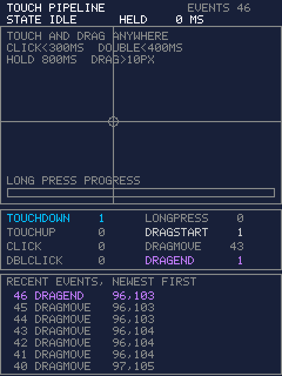

# Touch Controls

> **Demonstration project** — provided as an example of what the PixelRoot32
> Game Engine can do. It is not a product: parts may be incomplete,
> experimental, or deliberately simplified to keep one idea in focus.

One screen that reports every gesture the engine's touch pipeline produces, at
the moment it produces it. A crosshair follows the live touch point, the current
`TouchState` is printed at the top, a counter per gesture type proves the rare
ones are reachable, and a rolling log shows the last seven events with their
type and coordinates. The single idea is that the game never sees a raw touch:
hardware goes through an adapter, into a state machine, into a queue, and only
then into one virtual method — and this demo makes each of those stages'
output visible instead of describing it.

Language: C++17  
Engine: `gperez88/PixelRoot32-Game-Engine@^1.9.0`  
Environments: `native`, `esp32cyd`  
Category: Input  



## Requirements (build flags)

Set in [`lib/platformio.ini`](lib/platformio.ini) (`base` template, inherited by
every environment).

| Flag | Set to | Why |
|------|--------|-----|
| `PIXELROOT32_ENABLE_TOUCH` | `1` | The topic — and it defaults to **`0`**, so a demo about touch that forgets it is a demo about nothing. It gates `Engine` and only `Engine`: at `0` the Engine's `touchDispatcher` and `touchManager` members, its `getTouchDispatcher()` / `hasTouchEvents()` / `setTouchManager()` accessors, and the per-frame block in `Engine::update()` that drains the queue into `Scene::processTouchEvents()` are all compiled out. **Building at `0` is not an error.** Everything still compiles and links, the window still opens, the readout still draws — the queue is simply never filled and never drained, so the log stays empty forever. The failure mode is silence, not a diagnostic. |
| `PIXELROOT32_ENABLE_AUDIO` | `0` | Defaults to `1`. This demo is silent, and audio is the engine's most expensive default: roughly **17 KB of RAM** for voice state and mixing buffers nothing here would write to. |
| `PIXELROOT32_ENABLE_PHYSICS` | `0` | Defaults to `1`. The scene owns no `Actor` and in fact no entity at all; it draws `Renderer` primitives. Roughly **9 KB of RAM** for `CollisionSystem` and `SpatialGrid` that would sit reserved and unused. |
| `PIXELROOT32_ENABLE_PARTICLES` | `0` | Defaults to `1`. No effects. Roughly **2 KB of RAM** for the emitter pool. |
| `PIXELROOT32_ENABLE_UI_SYSTEM` | `0` | Defaults to `1`, and turning it off here is the point rather than a saving. `Scene::processTouchEvents()` runs `UIManager::processEvents()` **first** and lets it mark events consumed; only what survives reaches `onUnconsumedTouchEvent()`. This demo is about the layer *below* the UI, so it registers no widgets and draws its readout with `Renderer` primitives — which is what guarantees every gesture the state machine emits reaches the scene unconsumed and gets logged. |

What the flag does **not** gate is worth as much as what it does:

- `InputManager` embeds a `TouchEventDispatcher` **unconditionally** and exposes
  `getTouchEvents()` / `hasTouchEvents()` / `getTouchState()` at every setting.
  `TouchEventDispatcher.h` contains no `#if` at all, and neither do
  `TouchEvent.h`, `TouchEventTypes.h` or `TouchStateMachine.h`.
- `TouchManager`'s conditionals select a *driver* — `PLATFORM_NATIVE`,
  `TOUCH_DRIVER_XPT2046`, `TOUCH_DRIVER_GT911` — and never test this flag.

So the only `#if PIXELROOT32_ENABLE_TOUCH` in this demo's own source guards
`Engine::getTouchDispatcher()` in `TouchControlsScene::update()` and
`Engine::setTouchManager()` in the ESP32 platform header. Wrapping the
dispatcher, the manager or `InputManager::getTouchEvents()` in that flag would
be guarding code the flag has no opinion about.

And setting the flag is not sufficient on hardware: without a `TOUCH_DRIVER_*`
define, `TouchManager` selects no adapter and the panel is never read. Driver
choice is a separate axis — see `esp32cyd`'s `-D TOUCH_DRIVER_XPT2046` in
[`platformio.ini`](platformio.ini).

## Platforms

| Environment | Display | Driver | Touch | Audio backend |
|-------------|---------|--------|-------|---------------|
| `native` | 240x320 logical, SDL2 window | `SDL2_Drawer` (`DisplayType::NONE`) | Mouse, forwarded into the dispatcher by the drawer | none (`PIXELROOT32_ENABLE_AUDIO=0`) |
| `esp32cyd` | 240x320 ILI9341 | `TFT_eSPI_Drawer` (`DisplayType::ILI9341_2`) | XPT2046 resistive panel via `TouchManager`, `TOUCH_CS=33` on its own GPIO bus | none (`PIXELROOT32_ENABLE_AUDIO=0`) |

**Why `esp32cyd` and not `esp32dev`.** `CONTRIBUTING.md` makes `esp32dev` the
default hardware target *unless the demo needs something that board does not
have*, and names `games/chess` as the exception that shows the rule: touch is
its whole interaction model and the generic ST7789 board has no panel. This demo
is exactly that case, only more so — a build of it on a panel-less board would
draw a permanently empty log. So it ships the ESP32-2432S028 "Cheap Yellow
Display" instead, whose XPT2046 panel is the hardware the demo is about. CI reads
the build matrix from each demo's own `[env:*]` sections, so shipping a
non-default board needs no workflow change.

The touch wiring and calibration in the `esp32cyd` environment are copied from
`games/chess`, which follows the engine's own 2048 example. Resistive panels
vary: retune `XPT2046_RAW_*_LO` / `_HI` by touching the corners if the crosshair
does not reach the edges.

## Controls

| Input | Native | `esp32cyd` |
|-------|--------|------------|
| Touch down / up | Left mouse button | Finger on the panel |
| Move | Mouse motion with the button held | Finger drag |

There are no buttons. On native the mouse *is* the finger: `SDL2_Drawer::processEvents()`
converts `SDL_MOUSEBUTTONDOWN`, `SDL_MOUSEBUTTONUP` and `SDL_MOUSEMOTION` into
`TouchEventDispatcher::processTouch(0, pressed, x, y, SDL_GetTicks())` — the
same call the XPT2046 path reaches through `TouchManager`. Window coordinates
are scaled and offset into framebuffer coordinates and clamped to the logical
bounds before they enter the pipeline, so the two targets behave identically.

To provoke each gesture:

| Gesture | How |
|---------|-----|
| `TouchDown` | Press. Always the first event. |
| `TouchUp` | Release any press that did **not** become a drag. It fires on its own if the press lasted longer than 300 ms. |
| `Click` | Press and release within 300 ms, without leaving the 10 px ring. Arrives right after that release's `TouchUp`, never instead of it. |
| `DoubleClick` | A second click within 400 ms of the first. The second release emits `TouchUp` + `DoubleClick` — the `Click` is replaced, not added to. |
| `LongPress` | Hold still for 800 ms — the progress bar fills as you wait. It fires while your finger is still down; the later release still emits `TouchUp`. |
| `DragStart` | Move more than 10 px from where you pressed, while still held. |
| `DragMove` | Keep moving. |
| `DragEnd` | Release while dragging. A drag release emits `DragEnd` **only** — no `TouchUp` and no `Click`, which is what stops a piece dropped on a button from also pressing it. |

The log makes those orderings visible: a quick tap logs two lines, a
double-click's second tap logs `DoubleClick` above `TouchUp`, and a drag release
logs exactly one.

The cyan ring drawn around the press point is the `DRAG_THRESHOLD` radius:
leaving it is the exact frame the state machine stops calling the gesture a
press and starts calling it a drag.

## What it demonstrates

**The four stages, and where each one's output shows up on screen.**

1. **Adapter.** Hardware becomes a normalized `TouchPoint`. On `esp32cyd`,
   `TouchManager` owns the XPT2046 adapter selected by `-D TOUCH_DRIVER_XPT2046`
   and applies the `TouchCalibration` preset set in `src/platforms/esp32_cyd.h`.
   On `native`, `SDL2_Drawer` plays the same role for the mouse. Output: the
   coordinates the crosshair sits at.
2. **State machine.** `TouchStateMachine` consumes points and tracks one
   `TouchState` per touch id — `Idle`, `Pressed`, `LongPress`, `Dragging` —
   emitting a semantic `TouchEvent` on each transition. Output: the `STATE` line
   in the header, read every frame from
   `Engine::getTouchDispatcher().getTouchState(0)`.
3. **Queue.** `TouchEventQueue` holds up to `TOUCH_EVENT_QUEUE_SIZE` (16) events
   of 12 bytes each — 192 bytes total — and `Engine::update()` drains it once per
   frame with `getEvents()`. It is a pull model: nothing calls the game back.
   Output: several events can land in one frame, which the log shows as a burst
   of consecutive sequence numbers.
4. **Scene.** `Scene::processTouchEvents()` offers the drained buffer to
   `UIManager` first (compiled out here), then hands each still-unconsumed event
   to `onUnconsumedTouchEvent()`. Output: everything in the log and the counters.
   That one virtual method is the entire touch API a scene needs.

**The gesture timing constants**, from `input/TouchEventTypes.h`. The demo
prints them from the constants themselves rather than from literals, so the
screen cannot drift from the state machine that enforces them:

| Constant | Value | Meaning |
|----------|-------|---------|
| `TouchTiming::CLICK_MAX_DURATION` | 300 ms | Press-to-release longer than this is a `TouchUp`, not a `Click`. |
| `TouchTiming::DOUBLE_CLICK_INTERVAL` | 400 ms | Two clicks closer together than this become a `DoubleClick`. |
| `TouchTiming::LONG_PRESS_THRESHOLD` | 800 ms | Held longer than this without moving fires `LongPress`. |
| `TouchTiming::DRAG_THRESHOLD` | 10 px | Movement past this promotes a press to a drag. |

**The consumed flag.** Every touch handler starts with

```cpp
if (event.isConsumed()) return;
```

`TouchEvent` carries `TouchEventFlags::Consumed` in a byte of its 12, and
`Scene::processTouchEvents()` passes a *mutable* buffer so earlier consumers can
set it in place. Nothing marks events in this demo — the UI system is off — but
the check is not decoration: the moment a `UIManager` is added, a button press
that also reached the scene behind it would fire twice.

**Zero allocation.** The log is a fixed seven-slot ring buffer of 8-byte members
(56 bytes), the counters are eight `uint16_t`, and every string is formatted with
`snprintf` into one 40-byte member buffer at draw time. Nothing in `update()` or
`draw()` touches the heap.

## Project layout

```text
input/touch_controls/
├── .gitignore
├── README.md
├── platformio.ini          # native + esp32cyd environments
├── lib/platformio.ini      # [base] / [base_native] / [base_esp32] templates
└── src/
    ├── main.cpp            # platform selector, nothing else
    ├── TouchControlsScene.h
    ├── TouchControlsScene.cpp
    └── platforms/
        ├── native.h        # DisplayConfig, InputConfig, Engine, main()
        └── esp32_cyd.h     # DisplayConfig, InputConfig, Engine, TouchManager, setup()/loop()
```

## Build

```bash
cd input/touch_controls

pio run -e native                # build the SDL2 simulator
pio run -e native --target exec  # build and run it
pio run -e esp32cyd              # build for the Cheap Yellow Display
pio run -t clean -e native
```

On Linux and macOS, remove the `-IC:/msys64/...`, `-LC:/msys64/...` and
`-mconsole` lines from `[env:native]`; on macOS also uncomment the two Homebrew
lines above them. CI does the same with
`sed -i -e '/msys64/d' -e '/-mconsole/d'`.

## Upload (ESP32)

```bash
cd input/touch_controls

pio run -e esp32cyd --target upload
pio device monitor -e esp32cyd     # 115200 baud
```

## Engine documentation

- [Touch Input System](https://github.com/PixelRoot32-Game-Engine/PixelRoot32-Game-Engine/blob/main/docs/TOUCH_INPUT.md)
- [Engine configuration flags](https://github.com/PixelRoot32-Game-Engine/PixelRoot32-Game-Engine/blob/main/include/platforms/EngineConfig.h)
- [Scene API](https://github.com/PixelRoot32-Game-Engine/PixelRoot32-Game-Engine/blob/main/include/core/Scene.h)
- [Engine repository](https://github.com/PixelRoot32-Game-Engine/PixelRoot32-Game-Engine)

## License

This demo ships **no art and no audio assets**. Every pixel on screen is a
`Renderer` primitive or a glyph from the engine's built-in 5x7 font, so there is
nothing to attribute.

The demo source is licensed under the same terms as this repository — see
[`LICENSE`](../../LICENSE).

---

**Source code:** https://github.com/PixelRoot32-Game-Engine/PixelRoot32-Demo-Projects/tree/main/input/touch_controls
