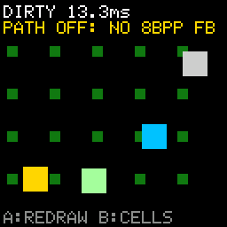

# Dirty Regions

> **Demonstration project** — provided as an example of what the PixelRoot32
> Game Engine can do. It is not a product: parts may be incomplete,
> experimental, or deliberately simplified to keep one idea in focus.

A mostly-static screen — a lattice of small blocks — with four boxes bouncing
across it. That is the whole scene, and the whole point: with
`PIXELROOT32_ENABLE_DIRTY_REGIONS` on, `Renderer::beginFrame()` clears only the
8x8 cells something was drawn into last frame instead of wiping the entire
logical framebuffer. Press **A** to make the scene ask for a full clear every
frame instead, press **B** to outline the cells the engine considers dirty, and
watch the rolling frame-time average in the corner.

Language: C++17  
Engine: `gperez88/PixelRoot32-Game-Engine@^1.9.0`  
Environments: `native`, `esp32dev`  
Category: Performance  



## Requirements (build flags)

Set in [`lib/platformio.ini`](lib/platformio.ini) (`base` template, inherited by
every environment).

| Flag | Set to | Why |
|------|--------|-----|
| `PIXELROOT32_ENABLE_DIRTY_REGIONS` | `1` | The topic. Allocates the `DirtyGrid` in `Renderer::init()` and turns `beginFrame()`'s full `clearBuffer()` into a per-cell clear of whatever the previous frame marked. At `0` (the engine default) `beginFrame()` always clears everything and `Renderer::forceFullRedraw()` becomes a documented no-op — so at `0` the A button in this demo does nothing at all. |
| `PIXELROOT32_ENABLE_DIRTY_REGION_PROFILING` | `1` | Makes `beginFrame()` emit one `dirty_ratio=%.4f (marked/total)` line per frame. Its `#if` ANDs this flag with `PIXELROOT32_DEBUG_MODE`, so both are needed. Without it you still get the overlay, you just lose the number. |
| `PIXELROOT32_DEBUG_MODE` | defined, no value | Two things need it. It gates the `dirty_ratio` log above, and it is what compiles `Renderer::drawDebugDirtyCellOverlay()` into something other than an empty function — so without it **B does nothing**. It is tested with `defined()`, never with `#if`, which is why it carries no `=1`. |
| `PIXELROOT32_ENABLE_AUDIO` | `0` | Defaults to `1`. This demo is silent, and the audio subsystem is the most expensive default in the engine: roughly **17 KB of RAM** for its voice state and mixing buffers. Turning it off is not an optimization here, it is the honest flag list for a demo that never calls `getAudioEngine()`. |
| `PIXELROOT32_ENABLE_PHYSICS` | `0` | Defaults to `1`. The boxes are four integer positions integrated by hand; there is no collider graph, no `Actor`, no solver. Roughly **9 KB of RAM** for `CollisionSystem` and `SpatialGrid` that would otherwise be reserved for nothing. |
| `PIXELROOT32_ENABLE_UI_SYSTEM` | `0` | Defaults to `1`. Both text lines are single `Renderer::drawText()` calls; a layout tree and its widget storage — roughly **9 KB of RAM** — would be dead weight. |
| `PIXELROOT32_ENABLE_PARTICLES` | `0` | Defaults to `1`. No effects in this demo. Roughly **2 KB of RAM** for the emitter pool. |

The four zeroes are half the lesson. A performance demo that leaves the engine's
defaults on cannot tell you what its own topic costs, because ~36 KB of ESP32
RAM is already gone before the first frame. The rule for the `performance/`
category is that a demo's flag list *is* its topic; here that list is one
feature plus the two switches that let you see it.

The RAM figures above are the engine's documented per-subsystem budgets, not
measurements taken from this project.

## Platforms

| Environment | Display | Driver | Audio backend |
|-------------|---------|--------|---------------|
| `native` | 128x128 logical, SDL2 window | `SDL2_Drawer` | none (`PIXELROOT32_ENABLE_AUDIO=0`) |
| `esp32dev` | 128x128 ST7735 (GREENTAB3), SPI at 40 MHz | `TFT_eSPI_Drawer` | none (`PIXELROOT32_ENABLE_AUDIO=0`) |

**The dirty-region path only runs on `esp32dev`.** `Renderer::beginFrame()`
starts by asking the draw surface for its 8bpp framebuffer, and
`SDL2_Drawer::getSpriteBuffer()` returns `nullptr` — SDL2 renders into an
RGB565 buffer instead. With no 8bpp framebuffer there is nothing to clear
selectively, so `beginFrame()` returns early: full `clearBuffer()`, dirty grid
never sized, no `dirty_ratio` log, and `getCols() == 0` makes the overlay draw
nothing. On `native` this demo still runs and still animates, but **A and B are
inert and the frame-time readout will not move between modes**. Read it on
hardware.

Rather than leave that to the README, the scene runs the same test the engine
runs and prints the answer under the mode line: `PATH ON` in green when the
draw surface has an 8bpp framebuffer, `PATH OFF: NO 8BPP FB` in yellow when it
does not.

```cpp
dirtyPathLive = engine.getRenderer().getDrawSurface().getSpriteBuffer() != nullptr;
```

It is read every frame, not cached in `init()`, so the answer never depends on
when a driver allocates its buffer relative to scene construction.

**That precondition is the part worth taking away.** Setting
`PIXELROOT32_ENABLE_DIRTY_REGIONS=1` is necessary and not sufficient: the
driver has to hand the renderer an 8bpp framebuffer, and the SDL2 one does not.
Any demo in this repository that enables the flag — `games/brick_breaker` and
`games/top_down_city` both do — gets the same early return on `native`. Measure
the feature on the simulator and the honest reading is that it changes nothing,
because on the simulator it is not running.

## Controls

| Button | Native key | Action |
|--------|-----------|--------|
| A | `Space` | Toggle *force full redraw every frame*. The header switches between `DIRTY` and `FULL`, and the frame-time average resets so the two modes are not averaged together. |
| B | `Enter` | Toggle the engine's debug dirty-cell overlay — magenta outlines around the cells marked this frame. |

The D-pad is wired in the platform headers because `InputConfig` takes six
buttons, but this demo does not read it.

## What it demonstrates

**Dirty regions do not let a scene skip drawing. They let the engine skip
clearing.** Every frame this scene redraws the whole lattice and all four
boxes; nothing is retained. What changes is what `beginFrame()` does first —
either a `memset` of the entire logical framebuffer, or a clear of just the
cells that were marked on the previous frame.

Marking is not something the scene opts into. Every `Renderer` primitive calls
into the grid: `drawFilledRectangle`, `drawRectangle`, `drawLine`, `drawPixel`,
`drawSprite`, and `drawText` (which is a `drawSprite` per glyph). That has one
blunt consequence, and it is why this scene looks the way it does: **a
full-screen background fill would mark all 256 cells, all 256 cells would be
cleared next frame, and the selective clear would cost exactly as much as the
full one.** The lattice is sparse and the field is black on purpose. Note also
that `drawRectangle` marks its whole bounding box rather than its outline — a
screen-sized border rectangle marks the screen.

**The dirty-cell counts are not reachable from game code.** `DirtyGrid` does
expose `countPrevMarkedCells()`, `countCurrMarkedCells()` and
`totalCellCount()`, but the `Renderer` holds its grid as a private member with
no public accessor, so a scene cannot read them and this demo does not pretend
to. Two honest measurements are left:

- **On screen:** the mode (`DIRTY` / `FULL`) and a rolling average of the last
  32 frame times, in milliseconds and tenths. The demo computes it itself from
  the `deltaTime` the engine already hands `update()`; single frames above
  50 ms are clamped so one stall does not poison the average.
- **On the console:** `dirty_ratio=0.NNNN (marked/total)`, one line per frame
  from `Renderer::beginFrame()`. This is a serial/stdout log, never an
  on-screen value. On `esp32dev` read it with `pio device monitor` at 115200.
  The log itself costs serial time, so treat the ratio and the frame-time
  readout as two separate experiments rather than one.

`FULL` mode is a simulation, not a rebuild. `Renderer::forceFullRedraw()` sets
the grid's full-dirty bit, which `beginFrame()` consumes by clearing the whole
buffer — the same work a `PIXELROOT32_ENABLE_DIRTY_REGIONS=0` build does every
frame. It is the closest comparison available at runtime, but the flag-off
build also drops the grid allocation and the per-primitive marking, which this
toggle keeps paying for. For the true cost of the feature, build it both ways.

**Where the call goes matters.** `Engine::run()` calls `update()` and only then
`draw()`, and `draw()` opens with `beginFrame()`. `forceFullRedraw()` is
therefore called from `update()`: from `draw()` it would land after
`beginFrame()` had already decided how to clear, and the effect would show up
one frame late.

## Build

```bash
cd performance/dirty_regions

pio run -e native                # build the SDL2 simulator
pio run -e native --target exec  # build and run it
pio run -e esp32dev              # build for ESP32
```

On Linux and macOS, remove the two MSYS2 lines and `-mconsole` from
`[env:native]` in [`platformio.ini`](platformio.ini); on macOS also uncomment
the two Homebrew lines above them. CI does this automatically.

## Upload (ESP32)

```bash
cd performance/dirty_regions

pio run -e esp32dev --target upload
pio device monitor -e esp32dev    # 115200 baud — where dirty_ratio appears
```

## Engine documentation

- [PixelRoot32 Game Engine](https://github.com/PixelRoot32-Game-Engine/PixelRoot32-Game-Engine)
- [Sprite renderer — dirty regions, framebuffer and blit paths](https://github.com/PixelRoot32-Game-Engine/PixelRoot32-Game-Engine/blob/main/docs/sprite-renderer.md)
- [Memory system — feature flags and byte budgets](https://github.com/PixelRoot32-Game-Engine/PixelRoot32-Game-Engine/blob/main/docs/architecture/memory-system.md)
- [Core API — Engine, Scene, Renderer](https://github.com/PixelRoot32-Game-Engine/PixelRoot32-Game-Engine/blob/main/docs/api/core.md)

## License

This demo ships no art. There are no sprite sheets, no fonts of its own, no
audio and no generated asset headers: every pixel on screen comes from
`Renderer` primitives and the engine's built-in font, so there is nothing here
to attribute. The source code follows the repository's license.

---

**Source code:** https://github.com/PixelRoot32-Game-Engine/PixelRoot32-Demo-Projects/tree/main/performance/dirty_regions
