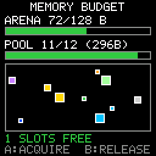

# Memory Budget

> **Demonstration project** — provided as an example of what the PixelRoot32
> Game Engine can do. It is not a product: parts may be incomplete,
> experimental, or deliberately simplified to keep one idea in focus.

A `SceneArena` and an `ObjectPool<Box, 12>` sized at compile time, with their
live occupancy drawn on screen as a number and a bar. Press **A** to acquire one
pooled object — a bouncing box — and **B** to release the most recent one. When
the twelfth slot is taken `acquire()` returns `nullptr`, and the demo says so in
red instead of quietly doing nothing. That is the single idea here: the ceiling
is a compile-time constant you can watch, and nothing allocates after `init()`.

Language: C++17  
Engine: `gperez88/PixelRoot32-Game-Engine@^1.9.0`  
Environments: `native`, `esp32dev`  
Category: Performance  



## Requirements (build flags)

Set in [`lib/platformio.ini`](lib/platformio.ini) (`base` template, inherited by
every environment).

| Flag | Set to | Why |
|------|--------|-----|
| `PIXELROOT32_ENABLE_SCENE_ARENA` | *defined, no value* | Half the topic. The engine tests this one with `#ifdef`, not `#if`, so `=0` would still switch it **on** — it takes no value at all. The engine defines it nowhere itself, so a demo that wants the arena must pass it. Without it `SceneArena::allocate()` returns `nullptr` for every request and `arenaNew()` with it. That is not a compile error: this demo keeps a fallback style and still runs, it just draws `ARENA 0/0 B` and an empty bar. |
| `PIXELROOT32_ENABLE_GAMEPLAY_OBJECT_POOL` | `1` | The other half. The whole of `<gameplay/ObjectPool.h>` sits inside an `#if` on this flag, and the engine default is `0`, so without it `ObjectPool<T, N>` does not exist as a type. [`src/MemoryBudgetScene.h`](src/MemoryBudgetScene.h) stops the build with an `#error` naming the flag rather than letting you read a page of template errors. |
| `PIXELROOT32_ENABLE_AUDIO` | `0` | Off on purpose. Frees roughly **17 KB** of RAM: mixer voices, the SPSC command queue, and the sequencer state. This demo makes no sound. |
| `PIXELROOT32_ENABLE_PHYSICS` | `0` | Off on purpose. Frees roughly **9 KB**: `CollisionSystem`'s actor tables and the fixed-timestep `PhysicsScheduler`, both members of every `Scene`. The boxes bounce off four constants, not off colliders. |
| `PIXELROOT32_ENABLE_UI_SYSTEM` | `0` | Off on purpose. Frees roughly **9 KB**: `UIManager`'s widget and hit-test tables, again a per-`Scene` member. The HUD here is `Renderer::drawText` and two rectangles. |
| `PIXELROOT32_ENABLE_PARTICLES` | `0` | Off on purpose. Frees roughly **2 KB** of particle pool. Nothing on screen sparkles. |

Those four zeros are not tidying-up, they are the argument. `CONTRIBUTING.md`'s
rule for the category folders is that a demo enables the minimum set of flags
its topic needs, and this demo's topic *is* the RAM ceiling: leaving the four
default-on subsystems enabled would spend roughly **36 KB** that neither bar on
screen accounts for, which is exactly the mistake the demo exists to argue
against. Every byte the bars do not show is a byte you did not budget.

## Platforms

| Environment | Display | Audio backend |
|-------------|---------|---------------|
| **`native`** | SDL2, 128×128 logical size | none — `PIXELROOT32_ENABLE_AUDIO=0` |
| **`esp32dev`** | **ST7735** 128×128 (GreenTab3 profile), SPI pins in [`platformio.ini`](platformio.ini): MOSI **23**, SCLK **18**, DC **2**, RST **4**, CS **-1** | none — `PIXELROOT32_ENABLE_AUDIO=0` |

## Controls

| Button | `native` | `esp32dev` | Action |
|--------|----------|------------|--------|
| **A** | `Space` | GPIO **13** | `pool.acquire(...)` — one box, one slot. At capacity it returns `nullptr` and the status line turns red. |
| **B** | `Enter` | GPIO **12** | `pool.release(...)` on the most recently acquired box (LIFO). |

Nothing else is wired: the D-pad is declared in the platform headers because
`InputConfig` takes six buttons, and is otherwise unused.

## What it demonstrates

- **A budget fixed before `main()` runs.** `kArenaBytes` and `kPoolCapacity` are
  `static constexpr` members, the arena's backing buffer is a plain
  `unsigned char[]` member, and `ObjectPool`'s storage is inline
  (`alignas(T) unsigned char storage_[N * sizeof(T)]`). Both ceilings are part of
  the scene's own `sizeof` — there is no heap to go and measure.
- **Occupancy you can read off the screen.** `SceneArena::offset` is the bytes
  used and `SceneArena::capacity` the ceiling; `ObjectPool::size()` and
  `capacity()` are the same pair for slots. Both are drawn as `used/capacity`
  plus a proportional bar, and the bar turns red at the ceiling.
- **The real numbers.** 12 `BoxStyle` records at 6 bytes each occupy 72 of the
  arena's 128 bytes. `sizeof(ObjectPool<Box, 12>)` is 296 bytes on the 64-bit
  native build — 12 × 24-byte `Box` plus a `uint32_t` liveness word and two
  counters — and is smaller on a 32-bit ESP32, where `Box`'s style pointer costs
  4 bytes rather than 8. The demo prints that `sizeof` itself, so the figure on
  screen is always the one the compiler produced.
- **A full pool is a visible state, not a swallowed one.** `acquire()` returning
  `nullptr` sets a flag the HUD prints as `FULL: GOT NULLPTR`. Pooled APIs fail
  by returning nothing; a demo that hid that would be teaching the failure mode
  wrong.
- **The arena's two sharp edges, respected.** `SceneArena::reset()` only rewinds
  a bump offset and never runs a destructor, so only trivially destructible
  types go in it — here, `BoxStyle`. And the pool is *not* arena-backed:
  `ObjectPool.h` states plainly that arena-backed pool storage is unsupported,
  because `Scene::resetState()` rewinds the arena unconditionally while the
  pool's liveness bitmask still claims those bytes.
- **Zero allocation after `init()`.** No `new`, no `malloc`, no `std::vector`,
  no `std::string` anywhere in `update()` or `draw()`. The three HUD strings are
  fixed `char` members filled by `snprintf`, and only on the frames where the
  occupancy actually changed.
- **Ordering the engine cares about.** `init()` calls `Scene::init()` first —
  which runs `resetState()` and rewinds the arena — and only then
  `pool_.reset()`, the order `ObjectPool.h` documents so no released object can
  leave a dangling pointer in the scene's entity list.

## Build

From **`performance/memory_budget`**:

```bash
pio run -e native
pio run -e native --target exec
pio run -e esp32dev
```

The committed `[env:native]` flags target Windows/MSYS2. On Linux drop the
`-IC:/msys64/...`, `-LC:/msys64/...` and `-mconsole` lines; on macOS drop them
and uncomment the two Homebrew lines above them. CI does this itself.

## Upload (ESP32)

```bash
pio run -e esp32dev --target upload
```

## Engine documentation

- [Core API](https://github.com/PixelRoot32-Game-Engine/PixelRoot32-Game-Engine/blob/main/docs/api/core.md)
- [Graphics / Renderer](https://github.com/PixelRoot32-Game-Engine/PixelRoot32-Game-Engine/blob/main/docs/api/graphics.md)
- [Input API](https://github.com/PixelRoot32-Game-Engine/PixelRoot32-Game-Engine/blob/main/docs/api/input.md)
- [Memory system](https://github.com/PixelRoot32-Game-Engine/PixelRoot32-Game-Engine/blob/main/docs/architecture/memory-system.md)
- [`core/Scene.h`](https://github.com/PixelRoot32-Game-Engine/PixelRoot32-Game-Engine/blob/main/include/core/Scene.h) — `SceneArena` and `arenaNew()` are declared here, not in a header of their own
- [`gameplay/ObjectPool.h`](https://github.com/PixelRoot32-Game-Engine/PixelRoot32-Game-Engine/blob/main/include/gameplay/ObjectPool.h)

## License

Source code: [MIT](../../LICENSE).

This demo ships no art, audio, or generated asset headers. Everything on screen
is drawn with `Renderer` primitives and the engine's built-in 5×7 font against
the built-in PR32 palette, so there is nothing here to attribute.

---

**Source code:** https://github.com/PixelRoot32-Game-Engine/PixelRoot32-Demo-Projects/tree/main/performance/memory_budget
