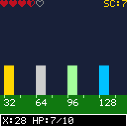

# HUD Widgets

> **Demonstration project** — provided as an example of what the PixelRoot32
> Game Engine can do. It is not a product: parts may be incomplete,
> experimental, or deliberately simplified to keep one idea in focus.

A health row, a score label and a status bar anchored to the corners of a
128×128 screen, over a world four screens wide that you scroll left and right
underneath them. The single idea is `setFixedPosition(true)`: it is one bool on
`UIElement` that makes a widget paint at literal screen coordinates instead of
world coordinates. A HUD is not a second render pass and not a separate widget
family — it is ordinary elements that opted out of the camera.

Language: C++17  
Engine: `gperez88/PixelRoot32-Game-Engine@^1.9.0`  
Environments: `native`, `esp32dev`  
Category: UI  



## Requirements (build flags)

Set in [`lib/platformio.ini`](lib/platformio.ini) (`base` template, inherited by
every environment).

| Flag | Set to | Why |
|------|--------|-----|
| `PIXELROOT32_ENABLE_UI_SYSTEM` | `1` | The topic. Every header under `graphics/ui/` is wrapped in `#if` on this flag, so without it `UIAnchorLayout`, `UILabel`, `UIPanel`, `UIPaddingContainer` and `UISpriteRow` do not exist as types. [`src/HudWidgetsScene.h`](src/HudWidgetsScene.h) stops the build with an `#error` naming the flag rather than letting you read a page of "unknown type" errors. Costs roughly **9 KB** of RAM, most of it `UIManager`'s widget and hit-test tables — which this demo never touches, but which are a member of every `Scene` once the module is on. |
| `PIXELROOT32_ENABLE_AUDIO` | `0` | Off on purpose. Frees roughly **17 KB** of RAM: mixer voices, the SPSC command queue, and the sequencer state. This demo makes no sound. |
| `PIXELROOT32_ENABLE_PHYSICS` | `0` | Off on purpose. Frees roughly **9 KB**: `CollisionSystem`'s actor tables and the fixed-timestep `PhysicsScheduler`, both members of every `Scene`. Nothing here collides — the world is rectangles and the camera is an integer. |
| `PIXELROOT32_ENABLE_PARTICLES` | `0` | Off on purpose. Frees roughly **2 KB** of particle pool. Nothing on screen sparkles. |
| *(no sprite bit-depth flag)* | — | The heart icons are 1bpp `Sprite`, which the renderer always supports, so neither `PIXELROOT32_ENABLE_2BPP_SPRITES` nor `_4BPP_SPRITES` is set. Both are `#ifdef`-tested rather than `#if`-tested: writing `=0` would still define them and still switch the decoder on. A flag you do not need is a flag you do not write, in either form. |

`CONTRIBUTING.md`'s rule for a category folder is that a demo enables the
minimum set of flags its topic needs. The topic here is one bool on one base
class, so the flag list is one flag on and three off.

## Platforms

| Environment | Display | Audio backend |
|-------------|---------|---------------|
| **`native`** | SDL2, 128×128 logical size | none — `PIXELROOT32_ENABLE_AUDIO=0` |
| **`esp32dev`** | **ST7735** 128×128 (GreenTab3 profile), SPI pins in [`platformio.ini`](platformio.ini): MOSI **23**, SCLK **18**, DC **2**, RST **4**, CS **-1** | none — `PIXELROOT32_ENABLE_AUDIO=0` |

## Controls

| Button | `native` | `esp32dev` | Action |
|--------|----------|------------|--------|
| **Left** | `←` | GPIO **33** | Scroll the world left, at 72 px/s. The HUD does not move. |
| **Right** | `→` | GPIO **14** | Scroll the world right. The score climbs with the furthest X reached, so the HUD's *content* is live while its *position* is frozen. |
| **A** | `Space` | GPIO **13** | Take one unit of damage. Two units fill a heart, so every other press leaves a half heart. |
| **B** | `Enter` | GPIO **12** | Heal one unit, up to full. |

`Up` and `Down` are declared in the platform headers because `InputConfig`
takes six buttons, and are otherwise unused.

## What it demonstrates

- **Fixed position is a property of the element, not a feature of the HUD.**
  `setFixedPosition(true)` sets one protected bool on
  [`UIElement`](https://github.com/PixelRoot32-Game-Engine/PixelRoot32-Game-Engine/blob/main/include/graphics/ui/UIElement.h),
  the base every widget derives from. Each widget's own `draw()` reads it and,
  when it is set, brackets its drawing with `Renderer::setOffsetBypass(true)`
  / `false`. Bypass makes the renderer ignore the display offset that
  `Camera2D::apply()` just wrote, so the widget lands at logical screen
  coordinates while the scenery two calls earlier landed in world space. There
  is no HUD layer, no second pass, and no ordering rule to remember: take the
  flag away and the same widgets scroll off the left edge with the posts.
  <br>Note for readers coming from the engine's own wording: this is a
  `UIElement` member in 1.9.0, **not** an `Entity` member. The mechanism it
  reaches for — the renderer's offset bypass — is available to any entity, and
  [`drawSky()`](src/HudWidgetsScene.cpp) calls it by hand for exactly the same
  reason, but the `setFixedPosition()` / `isFixedPosition()` pair itself lives
  on `UIElement`.
- **`UIManager` is not involved, and should not be.** Its `update()` and
  `draw()` are marked `@deprecated` in 1.9.0 and their bodies do nothing but
  `(void)` the argument. What remains of the class routes touch events to
  `UITouchWidget`s. None of the four widgets here is touch-interactive, so the
  scene drives them itself: `hud_.update(deltaTime)` from `update()` and
  `hud_.draw(renderer)` from `draw()`. A demo that instantiated `UIManager`
  would be teaching a no-op.
- **The three `UISpriteRow` traps, respected in code.**
  1. `setStateSprite()` with a `stateIndex` outside `[0, kMaxStates)` is
     **silently ignored, not clamped** — deliberately, so an off-by-one cannot
     overwrite a neighbouring state. It also means a typo'd index is a heart
     that never appears rather than a compile error.
  2. `setValue()` is **unclamped in both directions**. A value of −3 or 99 is
     not an error to the row; it renders as fully empty or fully full, because
     games routinely overshoot on the frame damage lands. Clamping is the
     caller's job, and [`readInput()`](src/HudWidgetsScene.cpp) does it.
  3. `setIconsPerRow(0)` means **one unwrapped row**, not "no icons". Five 8 px
     hearts plus four 1 px gaps span 44 px, which fits 128 without wrapping.
  <br>And the unit that is not an icon: `setValue()` counts **units**, not
  hearts. With `setUnitsPerIcon(2)` and five hearts, full health is 10.
- **Layouts allocate, so the tree is built once.** `UILayout` keeps its
  children in a `std::vector<UIElement*>` and `UIAnchorLayout` keeps a second
  `std::vector<std::pair<UIElement*, Anchor>>`. Every `addElement()` and
  `setChild()` call in this demo is in `init()`; `update()` and `draw()` do
  arithmetic and nothing else. `addElement()` is also idempotent — a second add
  of the same pointer is dropped — which is what keeps a re-entered scene from
  growing a second HUD.
- **A HUD must not be a scene entity.** `Scene::draw()` culls every entity
  against the world-space viewport rectangle it derives from the renderer
  offset (`isVisibleInViewport()` in `core/Scene.cpp`). A fixed element's
  position is in *screen* coordinates and never changes, so the moment the
  camera scrolls past 128 that test decides the whole HUD is off-screen and
  stops drawing it. Handing the layout to `addEntity()` looks right and fails
  one screen later; the scene draws it directly instead.
- **`UIPanel` puts its child on the border.** `UIPanel::setChild()` plants the
  child at the panel's own top-left corner, and `setPosition()` re-plants it
  there on every relayout, so a label parked inside a bordered panel sits on
  the border. `UIPaddingContainer` between the two is the piece that fixes it.
- **`UIAnchorLayout` positions on `updateLayout()`, not on draw.** A `TOP_RIGHT`
  anchor is computed from the element's width at layout time, and `"SC:9"` is
  narrower than `"SC:96"`. Without a call to `updateLayout()` when the text
  changes, the score label creeps away from the right edge as the score grows.
  `updateLayout()` walks the anchored vector and assigns positions — it
  allocates nothing, so calling it from `update()` on the frames the text
  actually changed is safe.
- **`UILabel` holds a `std::string`.** `setText()` on a string longer than the
  small-string buffer allocates, inside `update()`, on a microcontroller. Both
  formats here are capped under 15 characters (`"X:384 HP:10/10"` is the
  longest at 14) and are rebuilt only when the value behind them changed.

## Build

From **`ui/hud_widgets`**:

```bash
pio run -e native
pio run -e native --target exec
pio run -e esp32dev
```

The committed `[env:native]` flags target Windows/MSYS2. On Linux drop the
`-IC:/msys64/...`, `-LC:/msys64/...` and `-mconsole` lines; on macOS drop them
and uncomment the two Homebrew lines above them. CI does this itself.

## Upload (ESP32)

```bash
pio run -e esp32dev --target upload
```

## Engine documentation

- [Core API](https://github.com/PixelRoot32-Game-Engine/PixelRoot32-Game-Engine/blob/main/docs/api/core.md)
- [Graphics / Renderer](https://github.com/PixelRoot32-Game-Engine/PixelRoot32-Game-Engine/blob/main/docs/api/graphics.md)
- [Input API](https://github.com/PixelRoot32-Game-Engine/PixelRoot32-Game-Engine/blob/main/docs/api/input.md)
- [`graphics/ui/UIElement.h`](https://github.com/PixelRoot32-Game-Engine/PixelRoot32-Game-Engine/blob/main/include/graphics/ui/UIElement.h) — `setFixedPosition()` lives here, on the base class
- [`graphics/ui/UIAnchorLayout.h`](https://github.com/PixelRoot32-Game-Engine/PixelRoot32-Game-Engine/blob/main/include/graphics/ui/UIAnchorLayout.h)
- [`graphics/ui/UISpriteRow.h`](https://github.com/PixelRoot32-Game-Engine/PixelRoot32-Game-Engine/blob/main/include/graphics/ui/UISpriteRow.h) — the header states each of the three traps above
- [`graphics/ui/UIPanel.h`](https://github.com/PixelRoot32-Game-Engine/PixelRoot32-Game-Engine/blob/main/include/graphics/ui/UIPanel.h)
- [`graphics/Camera2D.h`](https://github.com/PixelRoot32-Game-Engine/PixelRoot32-Game-Engine/blob/main/include/graphics/Camera2D.h) — `apply()` is what writes the offset the HUD bypasses

## License

Source code: [MIT](../../LICENSE).

| Asset | What it is | Author | License | Source |
|-------|-----------|--------|---------|--------|
| `src/assets/HudSprites.h` | Three 8×8 heart icons — empty, half, full | Written for this demo | [CC0 1.0](https://creativecommons.org/publicdomain/zero/1.0/) | Original work |

The hearts have no generator script under `tools/` because there is nothing to
generate: they were authored directly as the `uint16_t` row literals in
[`src/assets/HudSprites.h`](src/assets/HudSprites.h), each row commented with
the ASCII picture it encodes. That header is the source, not an export of one.

Everything else on screen — the posts, the ground, the distance markers and the
panel — is drawn with `Renderer` primitives and the engine's built-in 5×7 font
against the built-in PR32 palette, so there is nothing further to attribute.

---

**Source code:** https://github.com/PixelRoot32-Game-Engine/PixelRoot32-Demo-Projects/tree/main/ui/hud_widgets
