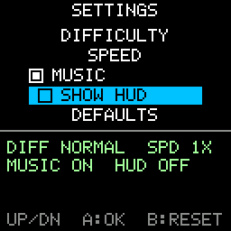

# Menu Navigation

> **Demonstration project** — provided as an example of what the PixelRoot32
> Game Engine can do. It is not a product: parts may be incomplete,
> experimental, or deliberately simplified to keep one idea in focus.

A settings menu built from the engine's own UI widgets and driven entirely by a
D-pad: `UIButton` and `UICheckBox` rows stacked in a `UIVerticalLayout`, moved
through with **Up**/**Down**, activated with **A**, and reset with **B**. There
is no touch anywhere in this demo — no `PIXELROOT32_ENABLE_TOUCH`, no
`UITouchButton`, and nothing registered with `UIManager`. That is the single
idea here: the UI system is not touch-only, and the physical-input half of it
is one layout call away.

Language: C++17  
Engine: `gperez88/PixelRoot32-Game-Engine@^1.9.0`  
Environments: `native`, `esp32dev`  
Category: UI  



## Requirements (build flags)

Set in [`lib/platformio.ini`](lib/platformio.ini) (`base` template, inherited by
every environment).

| Flag | Set to | Why |
|------|--------|-----|
| `PIXELROOT32_ENABLE_UI_SYSTEM` | `1` | The topic. Every header under `include/graphics/ui/` is wrapped in `#if PIXELROOT32_ENABLE_UI_SYSTEM`, so without it `UIButton`, `UICheckBox` and `UIVerticalLayout` do not exist as types at all. That is a compile error rather than a black screen, and [`src/MenuNavigationScene.h`](src/MenuNavigationScene.h) makes it a readable one with an `#error` naming the flag. Costs roughly **9 KB** of RAM, most of it `UIManager`'s widget and hit-test tables — which this demo never touches, but which the module brings along. |
| `PIXELROOT32_ENABLE_AUDIO` | `0` | Off on purpose. Frees roughly **17 KB** of RAM: mixer voices, the SPSC command queue, and the sequencer state. This demo makes no sound. |
| `PIXELROOT32_ENABLE_PHYSICS` | `0` | Off on purpose. Frees roughly **9 KB**: `CollisionSystem`'s actor tables and the fixed-timestep `PhysicsScheduler`, both members of every `Scene`. Nothing here moves, let alone collides. |
| `PIXELROOT32_ENABLE_PARTICLES` | `0` | Off on purpose. Frees roughly **2 KB** of particle pool. Nothing on screen sparkles. |

`PIXELROOT32_ENABLE_TOUCH` is **not** set, and its absence is part of the point.
A menu built from `UIButton` and `UICheckBox` needs no touch stack, no
calibration, and no `UIManager` — only the `InputManager` that every demo
already has. `CONTRIBUTING.md`'s rule for the category folders is that a demo
enables the minimum set of flags its topic needs; for a D-pad menu that set is
one flag.

## Platforms

| Environment | Display | Audio backend |
|-------------|---------|---------------|
| **`native`** | SDL2, 128×128 logical size | none — `PIXELROOT32_ENABLE_AUDIO=0` |
| **`esp32dev`** | **ST7735** 128×128 (GreenTab3 profile), SPI pins in [`platformio.ini`](platformio.ini): MOSI **23**, SCLK **18**, DC **2**, RST **4**, CS **-1** | none — `PIXELROOT32_ENABLE_AUDIO=0` |

## Controls

| Button | `native` | `esp32dev` | Action |
|--------|----------|------------|--------|
| **Up** | `Up arrow` | GPIO **32** | Move the selection one row up. |
| **Down** | `Down arrow` | GPIO **27** | Move the selection one row down. |
| **A** | `Space` | GPIO **13** | Activate the selected row: a `UIButton` fires its callback, a `UICheckBox` toggles. |
| **B** | `Enter` | GPIO **12** | Restore every row to its default. |

Left and Right are declared in the platform headers because `InputConfig` takes
six buttons, and are deliberately unbound — see the `index` trap below for why
that matters more than it looks.

The five rows are `DIFFICULTY` (cycles EASY / NORMAL / HARD), `SPEED` (cycles
1X / 2X / 3X), `MUSIC` and `SHOW HUD` (checkboxes), and `DEFAULTS` (a button
that does what **B** does). The band under the separator prints the current
value of every setting plus the row that last fired, so an activation is always
visible even when the new value looks like the old one.

## What it demonstrates

### The UI system is not touch-only

Read from the outside, `pixelroot32::graphics::ui` looks like a touch module:
`UIManager` is the touch router, and most of what is written about the module
is about `UITouchButton`, `UITouchCheckbox` and hit testing. That is half the
module. The other half is physical-input widgets:

- [`UIButton`](https://github.com/PixelRoot32-Game-Engine/PixelRoot32-Game-Engine/blob/main/include/graphics/ui/UIButton.h)
  and [`UICheckBox`](https://github.com/PixelRoot32-Game-Engine/PixelRoot32-Game-Engine/blob/main/include/graphics/ui/UICheckbox.h)
  each take a `const InputManager&` in `handleInput()`. No touch, no hit test.
- [`UIVerticalLayout`](https://github.com/PixelRoot32-Game-Engine/PixelRoot32-Game-Engine/blob/main/include/graphics/ui/UIVerticalLayout.h)
  stacks them, tracks the selected index, and already implements D-pad
  navigation: its own `handleInput()` moves the selection on the buttons given
  to `setNavigationButtons()` and then forwards the same `InputManager` to the
  selected child.

So the whole menu is one call per frame:

```cpp
menu_.handleInput(engine.getInputManager());
```

Everything else in [`MenuNavigationScene.cpp`](src/MenuNavigationScene.cpp) is
the settings the menu edits, not the menu.

### The `index` parameter is a trap

`UIButton`'s second constructor argument is documented as a *navigation index*,
which reads like "this is row 2". It is not. Here is the whole of
`UIButton::handleInput`:

```cpp
void UIButton::handleInput(const InputManager& input) {
    if (!isEnabled || !isVisible) return;

    if (isSelected && input.isButtonPressed(index)) {
        this->press();
    }
}
```

`index` is the **physical button index that activates this widget**.
`UICheckBox::handleInput` is the same three lines with `toggle()` in place of
`press()`. The row's position in the menu is `UIVerticalLayout`'s business, not
the widget's — `setSelectedIndex()` decides which row has `isSelected`.

Numbering the rows 0, 1, 2, 3, 4 in that argument therefore compiles, draws
correctly, navigates correctly, and then binds row 0 to **Up**, row 1 to
**Down**, row 2 to **Left**, row 3 to **Right** and row 4 to **A**. Two rows
fire while you are still navigating, one row answers a button nothing else
uses, and there is no warning of any kind.

Every row in this demo is constructed with the same value:

```cpp
static constexpr uint8_t kButtonA = 4;   // InputConfig order: Up, Down, Left, Right, A, B
```

### `UIManager` is deliberately unused

Nothing in this scene is registered with `UIManager`, and that is not an
oversight. `UIManager` is the touch router — it owns hit testing and touch
event dispatch for `UITouchElement`s. Its lifecycle methods are deprecated
no-ops; both bodies are, in full:

```cpp
void UIManager::update(unsigned long deltaTime) { (void)deltaTime; }
void UIManager::draw(pixelroot32::graphics::Renderer& renderer) { (void)renderer; }
```

Widgets are updated and drawn by the scene that owns them. Here the scene calls
`menu_.update(deltaTime)` and `menu_.draw(renderer)`, and the layout walks its
children. Routing that through `UIManager` would draw nothing.

### Layouts allocate — so build the tree in `init()`

`UILayout` keeps its children in a `std::vector<UIElement*>`, and
`addElement()` push_backs into it. That is the documented exception to this
repository's no-allocation-in-the-game-loop rule, and it survives only because
it is bounded: the five `addElement()` calls happen once, in `init()`, and
`update()` and `draw()` add nothing. Adding or removing a row per frame would
turn a one-off allocation into a per-frame one.

The layout holds non-owning pointers, so the widgets are plain scene members
that outlive it — never locals, never anything the scene can drop.

### Callbacks are raw function pointers

`UIElement` uses `void(*)()` for buttons and `void(*)(bool)` for checkboxes
rather than `std::function`, which keeps the widgets allocation-free and costs
one pointer each. The consequence is that **a lambda with a capture list does
not convert**. The callbacks in this demo are captureless free functions in an
anonymous namespace that reach the scene through a file-scope pointer set in
`init()`.

## Build

```bash
cd ui/menu_navigation

pio run -e native                 # build the PC/SDL2 simulator
pio run -e native --target exec   # build and run it
pio run -e esp32dev               # build for ESP32
```

The committed `[env:native]` `build_flags` are configured for **Windows/MSYS2**.
On Linux/macOS remove the `-IC:/msys64/...`, `-LC:/msys64/...` and `-mconsole`
lines; on macOS also uncomment the two Homebrew lines above them.

## Upload (ESP32)

```bash
pio run -e esp32dev --target upload
pio device monitor -b 115200
```

## Engine documentation

- [PixelRoot32 Game Engine](https://github.com/PixelRoot32-Game-Engine/PixelRoot32-Game-Engine)
- [UI API](https://github.com/PixelRoot32-Game-Engine/PixelRoot32-Game-Engine/blob/main/docs/api/ui.md)
- [Input API](https://github.com/PixelRoot32-Game-Engine/PixelRoot32-Game-Engine/blob/main/docs/api/input.md)
- [Core API — Engine, Scene, Renderer](https://github.com/PixelRoot32-Game-Engine/PixelRoot32-Game-Engine/blob/main/docs/api/core.md)
- [`UIButton`](https://github.com/PixelRoot32-Game-Engine/PixelRoot32-Game-Engine/blob/main/include/graphics/ui/UIButton.h) — the `index` parameter and the `handleInput()` quoted above
- [`UICheckbox.h`](https://github.com/PixelRoot32-Game-Engine/PixelRoot32-Game-Engine/blob/main/include/graphics/ui/UICheckbox.h) — the file is `UICheckbox.h`, the class is `UICheckBox`
- [`UIVerticalLayout`](https://github.com/PixelRoot32-Game-Engine/PixelRoot32-Game-Engine/blob/main/include/graphics/ui/UIVerticalLayout.h) — navigation, selection and scrolling
- [`UIElement`](https://github.com/PixelRoot32-Game-Engine/PixelRoot32-Game-Engine/blob/main/include/graphics/ui/UIElement.h) — the callback types and `TextAlignment`
- [Engine configuration flags](https://github.com/PixelRoot32-Game-Engine/PixelRoot32-Game-Engine/blob/main/include/platforms/EngineConfig.h)
- [Memory system — flags and byte budgets](https://github.com/PixelRoot32-Game-Engine/PixelRoot32-Game-Engine/blob/main/docs/architecture/memory-system.md)

## License

This demo ships **no art assets**: no sprites, no tilesets, no fonts, no audio.
Everything on screen is drawn by `Renderer` primitives and the engine's own
built-in font, so there is nothing here to attribute.

The demo source is MIT, like the rest of this repository — see
[`LICENSE`](../../LICENSE).

---

**Source code:** https://github.com/PixelRoot32-Game-Engine/PixelRoot32-Demo-Projects/tree/main/ui/menu_navigation
