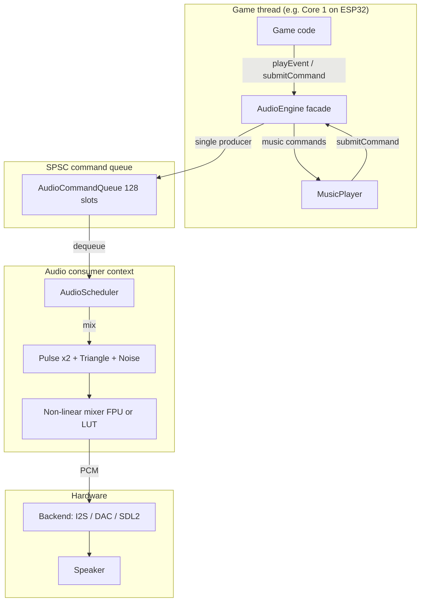

# Audio System

PixelRoot32 provides a **NES-like** audio subsystem: **four fixed channels** (two pulse, one triangle, one noise), **mono** 16-bit output, **event-driven** playback (`AudioEvent`), and **sample-accurate** timing decoupled from the game frame rate. There is **no DMC/sample channel** in the current engine.

For implementation details, see the engine source: [`ARCH_AUDIO_SUBSYSTEM.md`](https://github.com/PixelRoot32-Game-Engine/PixelRoot32-Game-Engine/blob/main/docs/architecture/ARCH_AUDIO_SUBSYSTEM.md) (authoritative).

## Architecture Overview



- **`AudioEngine`** forwards commands to the active **`AudioScheduler`** and delegates **`generateSamples`** to it; mixing and channel state live in the scheduler, not in the engine class itself.
- On **ESP32**, core affinity and task priority are applied when the **backend** creates its FreeRTOS task (`PlatformCapabilities`), not inside `ESP32AudioScheduler` construction arguments (those parameters are reserved for API stability).

## Key Features

| Feature | Description |
|--------|-------------|
| **4 channels** | 2× pulse (duty configurable), 1× triangle, 1× noise |
| **Sample-accurate** | Channel lifetime in samples; independent of FPS |
| **Schedulers** | `NativeAudioScheduler` (PC), `ESP32AudioScheduler` (firmware), `DefaultAudioScheduler` (tests / callback-driven) |
| **Command path** | Lock-free **SPSC** ring buffer, **128** entries; one producer / one consumer |
| **Mixer** | Soft saturation (FPU) or **LUT** (no-FPU, e.g. ESP32-C3) |

## Quick start: sound effects

Use **`AudioEngine::playEvent`** with an **`AudioEvent`** (`#include <audio/AudioEngine.h>`, `<audio/AudioTypes.h>`):

```cpp
#if PIXELROOT32_ENABLE_AUDIO
#include <audio/AudioEngine.h>
#include <audio/AudioTypes.h>

void playCoin(pr32::core::Engine& engine) {
    pr32::audio::AudioEvent evt{};
    evt.type = pr32::audio::WaveType::PULSE;
    evt.frequency = 1500.0f;
    evt.duration = 0.12f;
    evt.volume = 0.8f;
    evt.duty = 0.5f;
    engine.getAudioEngine().playEvent(evt);
}
#endif
```

### Wave types (`WaveType`)

| Type | Role |
|------|------|
| `PULSE` | Square wave; use **`duty`** (e.g. 0.125, 0.25, 0.5) |
| `TRIANGLE` | Triangle wave; **`duty`** unused |
| `NOISE` | See **Noise channel semantics** below |

### Noise channel semantics

- **`frequency`** on a **NOISE** event does **not** set musical pitch for firmware mixing on **ESP32**. It sets how often the **15-bit LFSR** advances (**noise clock**): period in samples is `sample_rate / max(frequency, 1 Hz)`. Lower values → coarser / more “hit-like”; higher values → denser noise.
- **Native (SDL2)** noise uses a different implementation (`rand()`-based in `NativeAudioScheduler`); timbre may differ from ESP32 for the same `AudioEvent`.
- **Tests / `DefaultAudioScheduler`** may advance the LFSR **every output sample** (full-rate noise).

### Master volume

```cpp
engine.getAudioEngine().setMasterVolume(0.75f);
float v = engine.getAudioEngine().getMasterVolume();
```

Per-channel volume is set per **`AudioEvent::volume`**; there are no separate `setChannelVolume` APIs in the core engine.

## Music (`MusicPlayer`)

Sequencing is **sample-accurate** in the scheduler. **`MusicPlayer`** only **enqueues** commands; see **[Music Player API](/api/audio/music-player)**.

```cpp
#include <audio/MusicPlayer.h>
#include <audio/AudioMusicTypes.h>

using namespace pixelroot32::audio;

static const MusicNote MELODY[] = {
    makeNote(INSTR_PULSE_LEAD, Note::C, 0.20f),
    makeNote(INSTR_PULSE_LEAD, Note::E, 0.20f),
    makeRest(0.10f),
};

static const MusicTrack GAME_MUSIC = {
    MELODY,
    sizeof(MELODY) / sizeof(MusicNote),
    true,              // loop
    WaveType::PULSE,
    0.5f               // duty for pulse tracks
};

void MyScene::init(pr32::core::Engine& engine) {
    engine.getMusicPlayer().play(GAME_MUSIC);
}
```

On **`NativeAudioScheduler`**, the music sequencer does not use the same **per-frame note cap** as ESP32/`DefaultAudioScheduler`; very large catch-up can mean more work in one audio step on PC.

## Command queue and thread safety

- Only **one thread** should call **`playEvent`**, **`setMasterVolume`**, **`MusicPlayer`**, and **`submitCommand`** (SPSC contract).
- If the queue is **full**, the newest command is **dropped**. On **ESP32**, drops are counted internally and a **throttled warning** may appear when **`PIXELROOT32_DEBUG_MODE`** is defined. Avoid enqueue storms (many events in one frame without consuming audio).

## Audio configuration

Backends are **concrete objects** passed by pointer on **`AudioConfig`**, not an enum:

```cpp
#include <audio/AudioConfig.h>
#include <drivers/esp32/ESP32_I2S_AudioBackend.h>

pr32::drivers::esp32::ESP32_I2S_AudioBackend audioBackend(26, 25, 22, 22050);
pr32::audio::AudioConfig audioConfig;
audioConfig.backend = &audioBackend;
audioConfig.sampleRate = 22050;

pr32::core::Engine engine(displayConfig, inputConfig, audioConfig);
```

See **[AudioEngine](/api/audio/audio-engine)** for **`AudioConfig`** fields and architecture links.

## Platform differences

| Platform | Mixer | Noise (typical) | Audio execution |
|----------|--------|-----------------|-----------------|
| **ESP32 (FPU)** | Float + soft clip | Clocked LFSR | Backend task; core from `PlatformCapabilities` |
| **ESP32-C3 (no FPU)** | LUT | Clocked LFSR | Same; integer LUT mix |
| **PC (native)** | Float + soft clip | `rand()` in `NativeAudioScheduler` | Dedicated thread + ring buffer |

## Best practices

- Keep SFX **`duration`** short when possible; only **four** logical channels exist, with **voice stealing** among channels of the same `WaveType`.
- Use **NOISE** `frequency` on ESP32 to shape **percussion vs hiss** (see above).
- Do **not** rely on multiple threads calling **`playEvent`** without a different queue design.
- Test on **real hardware**; buffer sizes and backend (I2S vs DAC) affect latency.

## Next steps

- **[Audio architecture](/architecture/audio-architecture)** — Longevity architecture narrative (synced from the engine repo where applicable)
- **[AudioEngine & types](/api/audio/audio-engine)** — Methods, `AudioEvent`, `AudioCommand`, `AudioConfig`
- **[AudioScheduler](/api/audio/audio-scheduler)** — Scheduler roles and wiring
- **[MusicPlayer](/api/audio/music-player)** — Tracks, presets, tempo
