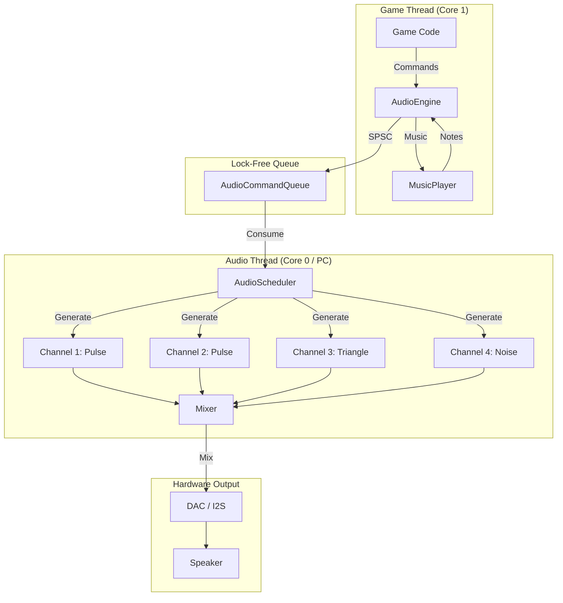

# Audio System

PixelRoot32 provides a complete NES-style audio subsystem with 4-channel synthesis (Pulse, Triangle, Noise, DMC). The audio architecture supports sample-accurate timing and multi-core execution on ESP32.

## Architecture Overview



## Key Features

| Feature | Description |
|---------|-------------|
| **4 Channels** | Pulse (x2), Triangle, Noise |
| **Sample-Accurate** | Timing independent of frame rate |
| **Multi-Core** | Audio on Core 0, Game on Core 1 (ESP32) |
| **Lock-Free** | SPSC queue for thread safety |
| **Mixer LUT** | Optimized for no-FPU targets |

## AudioEngine

The `AudioEngine` is the primary interface from game code:

```cpp
#include <AudioEngine.h>
#include <Engine.h>

using namespace pixelroot32;

#if PIXELROOT32_ENABLE_AUDIO
// Access through engine
audio::AudioEngine& audio = engine.getAudioEngine();

// Play sound effect
audio.playSFX(sound_jump);

// Configure channels
audio.setChannelVolume(0, 0.8f);  // Pulse 1 at 80%
audio.setChannelVolume(1, 0.6f);  // Pulse 2 at 60%
#endif
```

### Sound Effects

Define sound effects as `SFX` structures:

```cpp
#include <SFX.h>

using namespace pixelroot32::audio;

// Jump sound: Quick ascending pulse
const SFX sound_jump = {
    .channel = 0,           // Pulse channel 1
    .waveform = Waveform::PULSE_50,
    .frequency = 220.0f,    // Start frequency (Hz)
    .frequencySlide = 440.0f,  // End frequency (Hz)
    .attack = 5,            // Attack (ms)
    .decay = 50,            // Decay (ms)
    .sustain = 0.0f,        // Sustain level
    .release = 100,         // Release (ms)
    .volume = 0.7f
};

// Explosion: Noise with quick decay
const SFX sound_explosion = {
    .channel = 3,           // Noise channel
    .waveform = Waveform::NOISE_SHORT,
    .frequency = 100.0f,
    .attack = 0,
    .decay = 200,
    .sustain = 0.0f,
    .release = 50,
    .volume = 0.9f
};

// Powerup: Triangle with slow attack
const SFX sound_powerup = {
    .channel = 2,           // Triangle channel
    .waveform = Waveform::TRIANGLE,
    .frequency = 440.0f,
    .frequencySlide = 880.0f,
    .attack = 100,
    .decay = 200,
    .sustain = 0.5f,
    .release = 300,
    .volume = 0.6f
};

// Usage in game
void Player::jump() {
    velocity.y = -jumpForce;
    audio.playSFX(sound_jump);
}

void Enemy::explode() {
    audio.playSFX(sound_explosion);
    createExplosionParticles();
}
```

### Waveform Types

| Waveform | Channel | Description |
|----------|---------|-------------|
| `PULSE_12_5` | Pulse 1, 2 | 12.5% duty cycle (thin) |
| `PULSE_25` | Pulse 1, 2 | 25% duty cycle |
| `PULSE_50` | Pulse 1, 2 | 50% duty cycle (square) |
| `PULSE_75` | Pulse 1, 2 | 75% duty cycle |
| `TRIANGLE` | Triangle | Triangle wave |
| `NOISE_SHORT` | Noise | Short noise period |
| `NOISE_LONG` | Noise | Long noise period |

## MusicPlayer

Play sequenced music with the `MusicPlayer`:

```cpp
#include <MusicPlayer.h>

using namespace pixelroot32::audio;

// Define a musical note
struct Note {
    uint8_t channel;      // 0-3
    uint8_t note;         // MIDI note number (0-127)
    uint16_t duration;    // Duration in frames (at 60fps)
    uint8_t velocity;     // 0-127
};

// Simple melody
const Note melody[] = {
    {0, 60, 30, 100},   // C4, 0.5s
    {0, 64, 30, 100},   // E4, 0.5s
    {0, 67, 30, 100},   // G4, 0.5s
    {0, 72, 60, 100},   // C5, 1.0s
    {0, 0, 30, 0},      // Rest, 0.5s
    {1, 48, 120, 80},   // Bass C3, 2.0s
};

// Music track
const MusicTrack track = {
    .notes = melody,
    .noteCount = sizeof(melody) / sizeof(Note),
    .loopStart = 0,       // Loop from beginning
    .tempo = 120          // BPM
};

// Usage
MusicPlayer& player = engine.getMusicPlayer();

void startLevel() {
    player.play(&track);
    player.setVolume(0.7f);
}

void pauseGame() {
    player.pause();
}

void resumeGame() {
    player.resume();
}

void stopMusic() {
    player.stop();
}
```

### Music Sequencing

For complex compositions, use patterns:

```cpp
// Pattern-based music
struct Pattern {
    const Note* notes;
    uint8_t length;
};

const Pattern intro = { introNotes, 16 };
const Pattern verse = { verseNotes, 32 };
const Pattern chorus = { chorusNotes, 32 };

// Song structure
const Pattern* song[] = {
    &intro, &verse, &chorus, &verse, &chorus, &intro
};

// MusicPlayer advances through patterns
```

## Channel Details

### Pulse Channels (0, 1)

Square wave with variable duty cycle:

```cpp
// Configure pulse channel
audio.setChannelDuty(0, DutyCycle::PULSE_50);  // Square wave
audio.setChannelVolume(0, 0.8f);

// Frequency sweep (for effects)
audio.setChannelSweep(0, 10.0f);  // Hz per frame

// Vibrato
audio.setChannelVibrato(0, 5.0f, 4.0f);  // Rate (Hz), Depth (cents)
```

### Triangle Channel (2)

Low-frequency bass and sub-bass:

```cpp
// Triangle doesn't have volume control (on/off)
// Use for bass lines and drums

audio.playNote(2, Note::C3, 100);  // C3 for 100 frames
```

::: info NES-Authentic
Triangle channel on NES doesn't have volume control—it's either on or off. PixelRoot32 emulates this for authentic sound.
:::

### Noise Channel (3)

White noise for percussion and effects:

```cpp
// Snare drum: Short noise burst
audio.playNoise(NoiseMode::SHORT, 2000.0f, 10);  // freq, frames

// Hi-hat: Long noise
audio.playNoise(NoiseMode::LONG, 8000.0f, 5);

// Crash: Long noise with decay
audio.playNoise(NoiseMode::LONG, 4000.0f, 60);
```

## Audio Configuration

### Platform-Specific Backends

```cpp
// ESP32 with I2S (all variants)
AudioConfig config;
config.backend = AudioBackend::I2S;
config.sampleRate = 44100;
config.bufferSize = 256;

// ESP32 with DAC (classic ESP32 only)
config.backend = AudioBackend::DAC;
config.dacPin = 25;  // GPIO 25 or 26

// PC (SDL2)
config.backend = AudioBackend::SDL2;
```

### Mixer Configuration

```cpp
// Global settings
AudioEngine& audio = engine.getAudioEngine();

// Master volume
audio.setMasterVolume(0.8f);

// Channel volumes
audio.setChannelVolume(0, 1.0f);  // Lead
audio.setChannelVolume(1, 0.7f);  // Harmony
audio.setChannelVolume(2, 0.9f);  // Bass
audio.setChannelVolume(3, 0.6f);  // Drums
```

## Advanced Features

### Dynamic Music

Crossfade between tracks based on game state:

```cpp
class DynamicMusic {
    MusicPlayer layerCalm;
    MusicPlayer layerAction;
    float actionIntensity = 0.0f;
    
public:
    void update(float intensity) {
        actionIntensity = intensity;
        
        // Crossfade
        layerCalm.setVolume(1.0f - actionIntensity);
        layerAction.setVolume(actionIntensity);
    }
};

// Usage
music.update(playerHealth < 30 ? 1.0f : 0.0f);
```

### Procedural Sound

Generate effects at runtime:

```cpp
void playRandomExplosion() {
    SFX explosion = sound_explosion;
    
    // Randomize parameters
    explosion.frequency = 50.0f + random(100);
    explosion.decay = 150 + random(100);
    explosion.volume = 0.7f + random(30) / 100.0f;
    
    audio.playSFX(explosion);
}
```

### Audio Priority

Prevent sound spam:

```cpp
void playFootstep() {
    // Don't play if channel is busy
    if (!audio.isChannelActive(3)) {
        audio.playSFX(sound_footstep);
    }
}
```

## Platform Differences

### ESP32

- **Multi-core**: Audio on Core 0 via FreeRTOS task
- **Sample timing**: Accurate to ~23μs (44.1kHz)
- **Memory**: ~8KB for audio buffers

### PC (Native)

- **SDL2 Audio**: Callback-driven
- **Threading**: Background audio thread
- **Latency**: Platform-dependent (~10-50ms)

### ESP32-C3/S2/C6

- **No DAC**: I2S only
- **Fixed-point mixer**: LUT-based for performance
- **Reduced memory**: Smaller buffer sizes

## Best Practices

### Do

- ✅ Use appropriate waveforms for each sound type
- ✅ Keep SFX short (< 0.5s) for responsiveness
- ✅ Group music into patterns for memory efficiency
- ✅ Use priority system to prevent audio clutter
- ✅ Test on target hardware (latency differs)

### Don't

- ❌ Play too many sounds simultaneously (max 4)
- ❌ Block game thread waiting for audio
- ❌ Hardcode timing values—use tempo/BPM
- ❌ Ignore channel limitations

## Complete Example

```cpp
#include <Engine.h>
#include <Scene.h>
#include <AudioEngine.h>
#include <MusicPlayer.h>

using namespace pixelroot32;

// Sound effects
namespace SFX {
    const audio::SFX jump = {
        .channel = 0,
        .waveform = audio::Waveform::PULSE_50,
        .frequency = 220.0f,
        .frequencySlide = 440.0f,
        .attack = 5,
        .decay = 50,
        .sustain = 0.0f,
        .release = 100,
        .volume = 0.7f
    };
    
    const audio::SFX coin = {
        .channel = 0,
        .waveform = audio::Waveform::PULSE_25,
        .frequency = 987.0f,  // B5
        .frequencySlide = 1318.0f,  // E6
        .attack = 0,
        .decay = 100,
        .sustain = 0.0f,
        .release = 50,
        .volume = 0.5f
    };
}

// Background music notes
const audio::Note bgmNotes[] = {
    {0, 48, 30, 80},  // C3 bass
    {2, 60, 30, 100}, // C4 triangle
    {0, 48, 30, 80},
    {2, 64, 30, 100}, // E4
    {0, 48, 30, 80},
    {2, 67, 30, 100}, // G4
    {0, 48, 30, 80},
    {2, 72, 60, 100}, // C5
};

const audio::MusicTrack bgm = {
    .notes = bgmNotes,
    .noteCount = 8,
    .loopStart = 0,
    .tempo = 100
};

class GameScene : public core::Scene {
public:
    void init() override {
        // Start background music
        engine->getMusicPlayer().play(&bgm);
        engine->getMusicPlayer().setVolume(0.5f);
    }
    
    void update(unsigned long deltaTime) override {
        auto& input = engine->getInputManager();
        auto& audio = engine->getAudioEngine();
        
        if (input.isButtonPressed(ButtonName::A)) {
            audio.playSFX(SFX::jump);
            playerJump();
        }
        
        // Collect coins
        if (checkCoinCollection()) {
            audio.playSFX(SFX::coin);
        }
    }
};

void setup() {
    graphics::DisplayConfig display(240, 240);
    input::InputConfig input;
    audio::AudioConfig audio;
    
    audio.sampleRate = 44100;
    audio.bufferSize = 256;
    
    core::Engine engine(std::move(display), input, audio);
    
    GameScene scene;
    engine.setScene(&scene);
    
    engine.init();
    engine.run();
}
```

## Next Steps

- **[Audio Subsystem](/architecture/audio-architecture)** — Deep dive into audio architecture
- **[AudioEngine & data structures](/api/audio/audio-engine)** — Wave types, channels, and playback API
- **[Music Player](/api/audio/music-player)** — Music sequencing API
