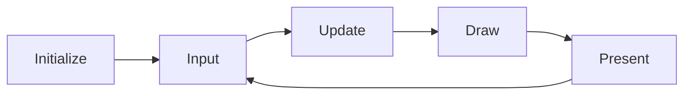

# Getting Started

**PixelRoot32** is a lightweight, modular 2D game engine written in **C++17**, designed primarily for **ESP32 microcontrollers**, with a native simulation layer for **PC (SDL2)** to enable rapid development without hardware.

## Overview

PixelRoot32 follows a **scene-based architecture inspired by Godot Engine**, making it intuitive for developers familiar with modern game development workflows.

**Key Features:**

- **Cross-Platform** — Develop on PC (Windows/Linux/macOS) and deploy on ESP32
- **Scene-Entity System** — Intuitive management of Scenes, Entities, and Actors
- **High Performance** — Optimized for ESP32 with DMA transfers and IRAM-cached rendering
- **Sprite System** — 1bpp/2bpp/4bpp sprites with multi-palette, flipping, rotation, and animation
- **Tilemap Support** — Optimized rendering with viewport culling, multi-palette, and tile animations
- **NES-Style Audio** — Built-in 4-channel audio subsystem (Pulse, Triangle, Noise)
- **AABB Physics** — Godot-style physics with Kinematic/Rigid actors and sensors
- **Lightweight UI** — Label, Button, Checkbox with automatic layouts
- **Modular Architecture** — Compile only needed subsystems via `PIXELROOT32_ENABLE_*` flags

## Prerequisites

Before you begin, ensure you have:

- **VS Code** with the **PlatformIO IDE** extension installed
- **ESP32 DevKit** (ESP32-S3, ESP32-C3, or classic ESP32) or a PC for simulation
- **USB cable** for programming
- For PC development: **SDL2** libraries (see [Platform Configuration](/guide/platform-config))

## Installation

### Option 1: Add to Existing Project (PlatformIO Registry)

Add the library to your `platformio.ini`:

```ini
lib_deps =
    gperez88/PixelRoot32-Game-Engine@^1.2.1
```

PlatformIO will automatically download and install the library during the next build.

### Option 2: Clone the Repository

For exploring examples and contributing:

```bash
git clone https://github.com/PixelRoot32-Game-Engine/PixelRoot32-Game-Engine.git
cd PixelRoot32-Game-Engine
```

### Open an Example Project

The engine includes several self-contained examples, each with its own `platformio.ini`:

| Example | Description |
|---------|-------------|
| `hello_world` | Minimal setup with basic scene |
| `snake` | Classic Snake game with audio |
| `flappy_bird` | Physics and input demo |
| `metroidvania` | Platformer with tilemaps |
| `physics` | AABB physics showcase |
| `animated_tilemap` | Tile animations and caching |
| `sprites` | Sprite rendering and animation |
| `camera` | Camera follow and scrolling |
| `tic_tac_toe` | UI layout system demo |

```bash
cd examples/hello_world
```

### 3. Configure PlatformIO

Open the example folder in VS Code (File → Open Folder) and select your environment:

| Environment | Target | Use Case |
|-------------|--------|----------|
| `esp32dev` | Generic ESP32 | Most ESP32 development boards |
| `esp32cyd` | Cheap Yellow Display | Popular CYD modules |
| `esp32c3` | ESP32-C3 | Cost-optimized variants |
| `native` | PC (SDL2) | Development without hardware |

::: warning Required Configuration

To compile PixelRoot32, you **must** configure C++17 and disable exceptions in `platformio.ini`:

```ini
build_unflags = -std=gnu++11
build_flags =
    -std=gnu++17
    -fno-exceptions
```

:::

## Creating Your First Project

### Project Structure

A minimal PixelRoot32 project contains:

```
my_game/
├── platformio.ini       # PlatformIO configuration
├── src/
│   └── main.cpp        # Your game code
└── lib/
    └── PixelRoot32-Game-Engine/  # Engine library
```

### Minimal Main File

```cpp
#include <Arduino.h>
#include <Engine.h>
#include <Scene.h>

using namespace pixelroot32;

// Your game scene
class GameScene : public core::Scene {
public:
    void init() override {
        // Called once when entering the scene
    }
    
    void update(unsigned long deltaTime) override {
        // Called every frame for game logic
        (void)deltaTime;  // Unused in this example
    }
    
    void draw(graphics::Renderer& renderer) override {
        // Called every frame for rendering
        renderer.drawText("Hello World!", 10, 10, graphics::Color::WHITE, 2);
    }
};

// Global engine and scene
core::Engine* engine;
GameScene scene;

void setup() {
    // Configure display (240x240 logical resolution)
    graphics::DisplayConfig displayConfig(240, 240);
    
    // Configure input buttons
    input::InputConfig inputConfig;
    inputConfig.addButton(input::ButtonName::A, 0);  // GPIO 0
    
    // Create engine
    engine = new core::Engine(std::move(displayConfig), inputConfig);
    
    // Set the initial scene
    engine->setScene(&scene);
    
    // Initialize and run
    engine->init();
    engine->run();  // Contains the infinite game loop
}

void loop() {
    // Empty - engine.run() never returns
}
```

## Building and Running

### For ESP32

1. **Select Environment**: Click the PlatformIO environment selector (bottom-left) and choose your board
2. **Build**: Click the checkmark icon or press `Ctrl+Alt+B`
3. **Upload**: Click the arrow icon or press `Ctrl+Alt+U`
4. **Monitor**: Click the plug icon to open serial monitor for debugging

### For PC (Native)

1. **Select Environment**: Choose `env:native`
2. **Build**: Build the project (automatically downloads SDL2 if needed)
3. **Run**: The executable runs directly on your PC

::: tip
Native development is ideal for rapid iteration. Test game logic and UI without flashing hardware.
:::

## Understanding the Game Loop

PixelRoot32 follows a classic game loop pattern:



| Phase | Description | Frequency |
|-------|-------------|-----------|
| **Input** | Poll buttons, touch, etc. | Every frame |
| **Update** | Game logic, physics, AI | Every frame |
| **Draw** | Render to framebuffer | Every frame |
| **Present** | Send to display (DMA) | Every frame |

## Best Practices

For optimal performance on ESP32:

1. **Use Fixed-Point Math** — Always use `Scalar` instead of `float`. Convert literals with `math::toScalar()`.
2. **Zero Allocation Policy** — Avoid `new`/`malloc` in the game loop. Use Object Pooling and `std::unique_ptr`.
3. **Organize by Render Layers** — Use `renderLayer` (0=Bg, 1=Game, 2=UI) to optimize draw order.
4. **Platform Memory Macros** — Use `PIXELROOT32_FLASH_ATTR` and `PIXELROOT32_READ_*_P` for cross-platform Flash/RAM access.
5. **Centralized Logging** — Use `log()` from `core/Log.h` instead of `Serial.print`.

::: tip
See the [Style & Best Practices Guide](https://github.com/PixelRoot32-Game-Engine/PixelRoot32-Game-Engine/blob/main/docs/STYLE_GUIDE.md) for detailed rules.
:::

## Next Steps

- **[Core Concepts](/guide/core-concepts)** — Learn about scenes, entities, and actors
- **[Rendering](/guide/rendering)** — Understand the graphics system
- **[Physics](/guide/physics)** — Add collision and movement
- **[Examples](/examples/basic-usage)** — Browse complete working examples

## Troubleshooting

### Known Issues

#### ESP32-S3 DMA Freeze (Arduino Core > 2.0.14)

**Problem**: DMA-based transfers may freeze after the first frame when using ESP32-S3 with Arduino Core versions newer than 2.0.14.

**Workaround**: Pin Arduino Core to 2.0.14 in `platformio.ini`:

```ini
[env:esp32s3]
platform_packages =
    framework-arduinoespressif32 @ https://github.com/espressif/arduino-esp32#2.0.14
```

> This is already configured in the `hello_world` example for ESP32-S3.

#### Framework Cache Corruption (`pins_arduino.h` not found)

**Problem**: Build fails with `pins_arduino.h: No such file or directory` after changing Arduino Core versions.

**Solution**:

1. Clean build cache: `pio run --target clean`
2. Remove corrupted package: `rmdir /s /q %USERPROFILE%\.platformio\packages\framework-arduinoespressif32`
3. Rebuild: `pio run` — PlatformIO will reinstall the framework.

### Build Errors

**Error**: `unknown type name 'std::optional'`

- **Solution**: Ensure C++17 is enabled in `platformio.ini`

**Error**: `undefined reference to 'SDL_Init'`

- **Solution**: For native builds, ensure SDL2 development libraries are installed

### Runtime Issues

**Issue**: Blank screen on ESP32

- Check display pins match your board configuration
- Verify `TFT_eSPI` setup for your specific display

**Issue**: Display freezes after the first frame on **ESP32-S3**, or build fails with **`pins_arduino.h` not found** after changing Arduino Core versions

- See [ESP32-S3 DMA and Arduino Core](/guide/platform-config#esp32-s3-dma-arduino-core) and [Framework cache and pins_arduino.h](/guide/platform-config#framework-cache-pins-arduino) on the [Platform Configuration](/guide/platform-config) page

**Issue**: Low FPS on ESP32

- Reduce logical resolution: `DisplayConfig(128, 128)`
- Prefer lower logical size and profile **draw** vs **present**; for static **4bpp** layers use `StaticTilemapLayerCache` (see Graphics API) and tune `PIXELROOT32_ENABLE_STATIC_TILEMAP_FB_CACHE` if you need to trade RAM for full redraws.
- Check SPI speed settings

## Platform-Specific Notes

### ESP32-S3

- Optimal performance with FPU support
- Use float-based `Scalar` for math
- Full audio capabilities
- DMA display output may require pinning Arduino Core 2.0.14; see [ESP32-S3 DMA and Arduino Core](/guide/platform-config#esp32-s3-dma-arduino-core)

### ESP32-C3 / ESP32-C6

- Fixed-point math automatically selected
- No hardware FPU (emulated in software)
- I2S audio only (no DAC)

### ESP32 (Classic)

- DAC audio available on GPIO 25/26
- Fixed-point math recommended
- Original ESP32 support

## Resources

### Documentation

- **[API Reference](/api/)** — Complete class and function documentation
- **[Architecture](/architecture/overview)** — System design and patterns
- **[Platform Configuration](/guide/platform-config)** — Board-specific setup

### External Links

- **[GitHub Repository](https://github.com/PixelRoot32-Game-Engine/PixelRoot32-Game-Engine)** — Source code and issues
- **[PlatformIO Registry](https://registry.platformio.org/libraries/gperez88/PixelRoot32-Game-Engine)** — Library releases
- **[Style Guide](https://github.com/PixelRoot32-Game-Engine/PixelRoot32-Game-Engine/blob/main/docs/STYLE_GUIDE.md)** — Coding standards and best practices

## Changelog

## 1.2.1  (Latest)

### 🏀 Physics

- **Fixed Timestep Scheduler**: New `PhysicsScheduler` with accumulator-based 60Hz simulation for stable physics across variable frame rates, especially on ESP32 under WiFi/BT interrupt load.
- **Scene Integration**: `Scene` now uses the scheduler instead of direct `CollisionSystem::update()` calls.
- **Physics Optimizations**: Added adaptive step limiting, velocity clamping, damping, and fast reciprocal square root optimizations.

### 🎮 Examples

- **Space Invaders**: Complete sample game with grid-based movement, alien formations, projectile pooling, bunker defenses, swept collision, procedural audio, and native/ESP32 support.
- **Brick Breaker**: New breakout-style sample with paddle/ball physics, destructible bricks, collision layers, particles, audio, starfield effects, and HUD.

### ⚡ Architecture & QA

- **Build Profiles**: Fixed timestep physics is now enabled by default across build profiles.
- **Docs & Tests**: Expanded documentation and added comprehensive unit tests for the scheduler and physics behavior.

### v1.2.0 

**Architecture**

- Physics conditionals refactored to preprocessor macros
- Namespace cleanup with aliases and selective `using`

**Graphics**

- ILI9341 display support
- Static tilemap layer cache for ESP32 fast-path rendering
- Tile animation fixes

**Math**

- Deterministic PRNG (Xorshift32) with thread-safe `Random` struct

**Input**

- Touch pipeline abstraction (XPT2046/GT911)
- ESP32 CYD gesture system with consume/propagate semantics

**UI**

- Function pointer callbacks replacing `std::function`
- Touch UI components: `UITouchButton`, `UITouchCheckbox`, `UITouchSlider`

::: tip Migration Guide
Upgrading from v1.1.0? See [MIGRATION_v1.2.0](https://github.com/PixelRoot32-Game-Engine/PixelRoot32-Game-Engine/blob/main/docs/MIGRATION_v1.2.0.md)
:::

**Full changelog:** [CHANGELOG.md](https://github.com/PixelRoot32-Game-Engine/PixelRoot32-Game-Engine/blob/main/CHANGELOG.md)
