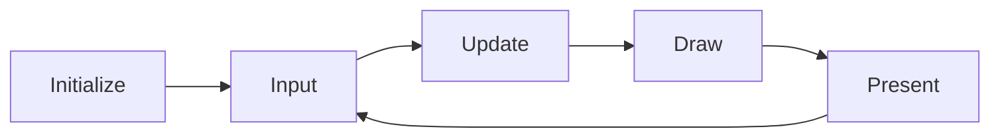

# Getting Started

PixelRoot32 is a lightweight, modular 2D game engine designed for ESP32 microcontrollers with PC simulation support. This guide will get you up and running with your first project.

## Prerequisites

Before you begin, ensure you have:

- **VS Code** with the **PlatformIO IDE** extension installed
- **ESP32 DevKit** (ESP32-S3, ESP32-C3, or classic ESP32) or a PC for simulation
- **USB cable** for programming
- For PC development: **SDL2** libraries (see [Platform Configuration](/guide/platform-config))

## Installation

### 1. Clone the Repository

```bash
git clone https://github.com/PixelRoot32-Game-Engine/PixelRoot32-Game-Engine.git
cd PixelRoot32-Game-Engine
```

### 2. Open an Example Project

The engine comes with several example projects, each self-contained with its own `platformio.ini`:

```bash
cd examples/hello_world
```

### 3. Configure PlatformIO

Open the example folder in VS Code (File → Open Folder) and select your environment:

| Environment | Target | Use Case |
|-------------|--------|----------|
| `esp32dev` | Generic ESP32 | Most ESP32 development boards |
| `esp32cyd` | Cheap Yellow Display | Popular CYD modules |
| `esp32c3` | ESP32-C3 | Cost-optimized variants |
| `native` | PC (SDL2) | Development without hardware |

::: warning Required Configuration

To compile PixelRoot32, you **must** configure C++17 and disable exceptions in `platformio.ini`:

```ini
build_unflags = -std=gnu++11
build_flags =
    -std=gnu++17
    -fno-exceptions
```

:::

## Creating Your First Project

### Project Structure

A minimal PixelRoot32 project contains:

```
my_game/
├── platformio.ini       # PlatformIO configuration
├── src/
│   └── main.cpp        # Your game code
└── lib/
    └── PixelRoot32-Game-Engine/  # Engine library
```

### Minimal Main File

```cpp
#include <Arduino.h>
#include <Engine.h>
#include <Scene.h>

using namespace pixelroot32;

// Your game scene
class GameScene : public core::Scene {
public:
    void init() override {
        // Called once when entering the scene
    }
    
    void update(unsigned long deltaTime) override {
        // Called every frame for game logic
        (void)deltaTime;  // Unused in this example
    }
    
    void draw(graphics::Renderer& renderer) override {
        // Called every frame for rendering
        renderer.drawText("Hello World!", 10, 10, graphics::Color::WHITE, 2);
    }
};

// Global engine and scene
core::Engine* engine;
GameScene scene;

void setup() {
    // Configure display (240x240 logical resolution)
    graphics::DisplayConfig displayConfig(240, 240);
    
    // Configure input buttons
    input::InputConfig inputConfig;
    inputConfig.addButton(input::ButtonName::A, 0);  // GPIO 0
    
    // Create engine
    engine = new core::Engine(std::move(displayConfig), inputConfig);
    
    // Set the initial scene
    engine->setScene(&scene);
    
    // Initialize and run
    engine->init();
    engine->run();  // Contains the infinite game loop
}

void loop() {
    // Empty - engine.run() never returns
}
```

## Building and Running

### For ESP32

1. **Select Environment**: Click the PlatformIO environment selector (bottom-left) and choose your board
2. **Build**: Click the checkmark icon or press `Ctrl+Alt+B`
3. **Upload**: Click the arrow icon or press `Ctrl+Alt+U`
4. **Monitor**: Click the plug icon to open serial monitor for debugging

### For PC (Native)

1. **Select Environment**: Choose `env:native`
2. **Build**: Build the project (automatically downloads SDL2 if needed)
3. **Run**: The executable runs directly on your PC

::: tip
Native development is ideal for rapid iteration. Test game logic and UI without flashing hardware.
:::

## Understanding the Game Loop

PixelRoot32 follows a classic game loop pattern:



| Phase | Description | Frequency |
|-------|-------------|-----------|
| **Input** | Poll buttons, touch, etc. | Every frame |
| **Update** | Game logic, physics, AI | Every frame |
| **Draw** | Render to framebuffer | Every frame |
| **Present** | Send to display (DMA) | Every frame |

## Next Steps

- **[Core Concepts](/guide/core-concepts)** — Learn about scenes, entities, and actors
- **[Rendering](/guide/rendering)** — Understand the graphics system
- **[Physics](/guide/physics)** — Add collision and movement
- **[Examples](/examples/basic-usage)** — Browse complete working examples

## Troubleshooting

### Build Errors

**Error**: `unknown type name 'std::optional'`
- **Solution**: Ensure C++17 is enabled in `platformio.ini`

**Error**: `undefined reference to 'SDL_Init'`
- **Solution**: For native builds, ensure SDL2 development libraries are installed

### Runtime Issues

**Issue**: Blank screen on ESP32
- Check display pins match your board configuration
- Verify `TFT_eSPI` setup for your specific display

**Issue**: Low FPS on ESP32
- Reduce logical resolution: `DisplayConfig(128, 128)`
- Enable tilemap optimization flags
- Check SPI speed settings

## Platform-Specific Notes

### ESP32-S3
- Optimal performance with FPU support
- Use float-based `Scalar` for math
- Full audio capabilities

### ESP32-C3 / ESP32-C6
- Fixed-point math automatically selected
- No hardware FPU (emulated in software)
- I2S audio only (no DAC)

### ESP32 (Classic)
- DAC audio available on GPIO 25/26
- Fixed-point math recommended
- Original ESP32 support
