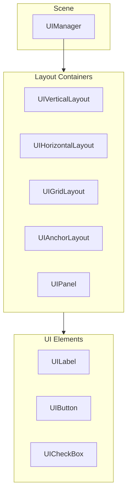

# UI System

PixelRoot32 provides a lightweight UI system with automatic layouts and touch support. Create menus, HUDs, and interactive interfaces with minimal code.

## Architecture



## Enabling UI

```cpp
// platformio.ini
build_flags =
    -DPIXELROOT32_ENABLE_UI_SYSTEM=1
```

```cpp
#include <Scene.h>

class MenuScene : public core::Scene {
public:
    void init() override {
        Scene::init();  // Required!
        initUI();
    }
    
    void initUI() override {
        auto& ui = getUIManager();
        
        // Create UI elements here
        auto* label = new graphics::ui::UILabel("Main Menu");
        ui.addElement(label);
    }
};
```

::: warning
Always call `Scene::init()` when overriding if UI is enabled.
:::

## UI Elements

### UILabel

```cpp
auto* label = new graphics::ui::UILabel("Hello World");
label->setPosition(80, 50);
label->setTextColor(graphics::Color::WHITE);
label->setTextSize(2);
ui.addElement(label);
```

### UIButton

```cpp
auto* button = new graphics::ui::UIButton("Start Game");
button->setPosition(80, 100);
button->setSize(80, 24);

// Click handler
button->onClick = [this]() {
    startGame();
};

ui.addElement(button);
```

### UICheckBox

```cpp
auto* checkbox = new graphics::ui::UICheckBox("Enable Sound");
checkbox->setPosition(80, 140);
checkbox->setChecked(true);

checkbox->onCheckChanged = [this](bool checked) {
    setSoundEnabled(checked);
};

ui.addElement(checkbox);
```

## Layout Containers

### UIVerticalLayout

Automatic vertical arrangement:

```cpp
auto* vlayout = new graphics::ui::UIVerticalLayout();
vlayout->setPosition(80, 60);
vlayout->setSpacing(10);  // 10px between elements

vlayout->addElement(new graphics::ui::UILabel("Option 1"));
vlayout->addElement(new graphics::ui::UILabel("Option 2"));
vlayout->addElement(new graphics::ui::UILabel("Option 3"));

ui.addElement(vlayout);
```

### UIHorizontalLayout

Horizontal arrangement:

```cpp
auto* hlayout = new graphics::ui::UIHorizontalLayout();
hlayout->setPosition(40, 200);
hlayout->setSpacing(20);

hlayout->addElement(new graphics::ui::UIButton("A"));
hlayout->addElement(new graphics::ui::UIButton("B"));
hlayout->addElement(new graphics::ui::UIButton("C"));

ui.addElement(hlayout);
```

### UIGridLayout

Grid arrangement:

```cpp
auto* grid = new graphics::ui::UIGridLayout();
grid->setPosition(40, 60);
grid->setColumns(3);
grid->setCellSize(60, 40);
grid->setSpacing(10, 10);

// Add 9 buttons in 3x3 grid
for (int i = 0; i < 9; ++i) {
    auto* btn = new graphics::ui::UIButton(std::to_string(i + 1));
    btn->onClick = [i]() { selectNumber(i + 1); };
    grid->addElement(btn);
}

ui.addElement(grid);
```

### UIAnchorLayout

Fixed-position elements (for HUD):

```cpp
auto* anchors = new graphics::ui::UIAnchorLayout();
anchors->setFixedPosition(true);  // Ignore camera offset

// Top-left: Score
auto* score = new graphics::ui::UILabel("Score: 0");
anchors->addElement(score, graphics::ui::Anchor::TopLeft, 
                    10, 10);  // x=10, y=10 offset

// Top-right: Health
auto* health = new graphics::ui::UILabel("HP: 100");
anchors->addElement(health, graphics::ui::Anchor::TopRight, 
                    -10, 10);  // -10 from right

// Bottom-center: Message
auto* message = new graphics::ui::UILabel("");
anchors->addElement(message, graphics::ui::Anchor::BottomCenter, 
                    0, -10);

ui.addElement(anchors);
```

### UIPanel

Container with background:

```cpp
auto* panel = new graphics::ui::UIPanel();
panel->setPosition(60, 80);
panel->setSize(120, 100);
panel->setBackgroundColor(graphics::Color::DARK_GRAY);
panel->setBorderColor(graphics::Color::WHITE);

// Add elements to panel
panel->addElement(new graphics::ui::UILabel("Settings"));
panel->addElement(new graphics::ui::UICheckBox("Option 1"));
panel->addElement(new graphics::ui::UICheckBox("Option 2"));

ui.addElement(panel);
```

## Complete Menu Example

```cpp
class MainMenuScene : public core::Scene {
    graphics::ui::UILabel* statusLabel;
    
public:
    void init() override {
        Scene::init();
        initUI();
    }
    
    void initUI() override {
        auto& ui = getUIManager();
        
        // Title
        auto* title = new graphics::ui::UILabel("PIXEL GAME");
        title->setPosition(60, 30);
        title->setTextSize(3);
        title->setTextColor(graphics::Color::YELLOW);
        ui.addElement(title);
        
        // Button container
        auto* vlayout = new graphics::ui::UIVerticalLayout();
        vlayout->setPosition(80, 80);
        vlayout->setSpacing(15);
        
        // Start button
        auto* startBtn = new graphics::ui::UIButton("Start Game");
        startBtn->setSize(80, 24);
        startBtn->onClick = [this]() {
            engine->setScene(new GameScene());
        };
        vlayout->addElement(startBtn);
        
        // Options button
        auto* optionsBtn = new graphics::ui::UIButton("Options");
        optionsBtn->setSize(80, 24);
        optionsBtn->onClick = [this]() {
            showOptions();
        };
        vlayout->addElement(optionsBtn);
        
        // Sound checkbox
        auto* soundCheck = new graphics::ui::UICheckBox("Sound");
        soundCheck->setChecked(true);
        soundCheck->onCheckChanged = [this](bool checked) {
            setSoundEnabled(checked);
        };
        vlayout->addElement(soundCheck);
        
        // Quit button
        auto* quitBtn = new graphics::ui::UIButton("Quit");
        quitBtn->setSize(80, 24);
        quitBtn->onClick = [this]() {
            quitGame();
        };
        vlayout->addElement(quitBtn);
        
        ui.addElement(vlayout);
        
        // Status bar at bottom
        statusLabel = new graphics::ui::UILabel("Ready");
        statusLabel->setPosition(10, 220);
        statusLabel->setTextColor(graphics::Color::GRAY);
        ui.addElement(statusLabel);
    }
    
    void setStatus(const std::string& text) {
        statusLabel->setText(text);
    }
    
private:
    void showOptions() {
        setStatus("Options not implemented");
    }
    
    void setSoundEnabled(bool enabled) {
        #if PIXELROOT32_ENABLE_AUDIO
        engine->getAudioEngine().setMasterVolume(enabled ? 0.8f : 0.0f);
        #endif
        setStatus(enabled ? "Sound ON" : "Sound OFF");
    }
    
    void quitGame() {
        // On ESP32, could go to deep sleep
        // On PC, exit application
        setStatus("Goodbye!");
    }
};
```

## HUD Example

```cpp
class GameHUD : public core::Scene {
    graphics::ui::UILabel* scoreLabel;
    graphics::ui::UILabel* healthLabel;
    graphics::ui::UILabel* ammoLabel;
    int score = 0;
    int health = 100;
    int ammo = 30;
    
public:
    void init() override {
        Scene::init();
        initUI();
    }
    
    void initUI() override {
        auto& ui = getUIManager();
        
        // Fixed position HUD (ignores camera)
        auto* hud = new graphics::ui::UIAnchorLayout();
        hud->setFixedPosition(true);
        
        // Score - Top Left
        scoreLabel = new graphics::ui::UILabel("Score: 0");
        scoreLabel->setTextColor(graphics::Color::YELLOW);
        hud->addElement(scoreLabel, graphics::ui::Anchor::TopLeft, 10, 10);
        
        // Health - Top Right
        healthLabel = new graphics::ui::UILabel("HP: 100");
        healthLabel->setTextColor(graphics::Color::GREEN);
        hud->addElement(healthLabel, graphics::ui::Anchor::TopRight, -10, 10);
        
        // Ammo - Bottom Right
        ammoLabel = new graphics::ui::UILabel("Ammo: 30");
        ammoLabel->setTextColor(graphics::Color::WHITE);
        hud->addElement(ammoLabel, graphics::ui::Anchor::BottomRight, -10, -10);
        
        ui.addElement(hud);
    }
    
    void addScore(int points) {
        score += points;
        scoreLabel->setText("Score: " + std::to_string(score));
    }
    
    void setHealth(int hp) {
        health = hp;
        healthLabel->setText("HP: " + std::to_string(health));
        
        // Change color based on health
        if (health > 60) {
            healthLabel->setTextColor(graphics::Color::GREEN);
        } else if (health > 30) {
            healthLabel->setTextColor(graphics::Color::YELLOW);
        } else {
            healthLabel->setTextColor(graphics::Color::RED);
        }
    }
    
    void setAmmo(int count) {
        ammo = count;
        ammoLabel->setText("Ammo: " + std::to_string(ammo));
        
        if (ammo < 5) {
            ammoLabel->setTextColor(graphics::Color::RED);
        } else {
            ammoLabel->setTextColor(graphics::Color::WHITE);
        }
    }
};
```

## Touch Integration

UI automatically handles touch events:

```cpp
void GameScene::processTouchEvents(input::TouchEvent* events, uint8_t count) {
    // UI processes first - marks consumed events
    Scene::processTouchEvents(events, count);
    
    // Unconsumed events go to game
    // (Handled by onUnconsumedTouchEvent)
}
```

Touch targets:
- Buttons trigger on release within bounds
- Checkboxes toggle on tap
- Layouts handle scrolling (if content overflows)

## Styling

```cpp
// Button styling
button->setBackgroundColor(graphics::Color::BLUE);
button->setTextColor(graphics::Color::WHITE);
button->setBorderColor(graphics::Color::WHITE);
button->setBorderWidth(2);

// Label styling
label->setTextSize(2);
label->setTextColor(graphics::Color::YELLOW);
```

## Performance Tips

1. **Minimize UI updates**: Only change text when needed
2. **Use fixed position for HUD**: Avoids camera transform cost
3. **Pool UI elements**: Reuse instead of recreate
4. **Limit nested layouts**: Each level adds overhead

## Best Practices

### Do

- ✅ Group related UI in containers
- ✅ Use anchor layouts for HUD elements
- ✅ Provide visual feedback (hover, pressed states)
- ✅ Handle different screen sizes with relative positioning

### Don't

- ❌ Update UI text every frame
- ❌ Create UI elements in update loop
- ❌ Mix game camera with UI camera without `fixedPosition`
- ❌ Forget to call `Scene::init()` when overriding

## Next Steps

- **[Input](/guide/input)** — Touch and button handling
- **[Examples/Hello World](/examples/hello-world)** — Complete UI example
