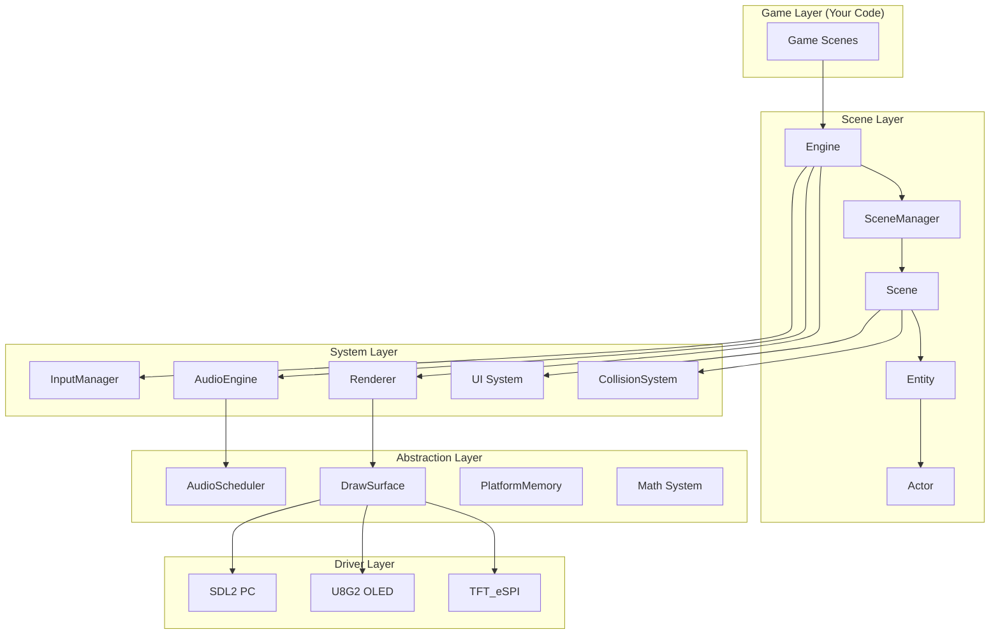

## Quick Example

Get a game running in minutes:

::: code-group

```cpp [main.cpp]
#include <Engine.h>
#include <Scene.h>

using namespace pixelroot32;

class MyScene : public core::Scene {
public:
    void init() override {
        // Initialize your game objects here
    }
    
    void update(unsigned long deltaTime) override {
        // Game logic runs here
    }
    
    void draw(graphics::Renderer& renderer) override {
        renderer.drawText("Hello PixelRoot32!", 10, 10, 
                         graphics::Color::WHITE, 2);
    }
};

void setup() {
    graphics::DisplayConfig config(240, 240);
    core::Engine engine(std::move(config));
    
    MyScene scene;
    engine.setScene(&scene);
    
    engine.init();
    engine.run();
}

void loop() {} // Engine.run() contains the game loop
```

:::

## Why PixelRoot32?

### Built for Embedded

PixelRoot32 is designed from the ground up for ESP32 microcontrollers. Every subsystem considers memory constraints, flash usage, and real-time performance:

- **Zero-allocation policy** during game loop
- **PROGMEM-aware** data structures for flash storage
- **DMA-accelerated** rendering pipeline
- **Fixed-point math** for FPU-less variants

### Production Ready

- ✅ Stable **v1.1.0** release ([migration notes](/guide/migrations/overview))
- ✅ Large automated test suite (Unity / PlatformIO, native + embedded targets)
- ✅ Active development and community
- ✅ MIT licensed

### Developer Experience

```cpp
// Physics with Godot-style API
auto* player = new KinematicActor(100, 100, 16, 16);
player->setCollisionLayer(DefaultLayers::kPlayer);
player->setCollisionMask(DefaultLayers::kEnvironment);

// Move and slide with collision response
auto collision = player->moveAndSlide(velocity, deltaTime);
if (collision.collides) {
    // Handle collision
}
```

## Architecture Overview



## Platform Support

| Platform | Status | Notes |
|----------|--------|-------|
| ESP32-S3 | ✅ Fully Supported | FPU, optimal performance |
| ESP32-C3 | ✅ Fully Supported | Fixed-point math |
| ESP32-C6 | ✅ Fully Supported | Fixed-point math |
| ESP32 (classic) | ✅ Supported | DAC audio available |
| PC (Windows/Linux/macOS) | ✅ SDL2 | Development & testing |

## Next Steps

- **[Getting Started](/guide/getting-started)** — Install and build your first project
- **[Core Concepts](/guide/core-concepts)** — Understand scenes, entities, and the game loop
- **[Architecture](/architecture/overview)** — Deep dive into the engine design
- **[API reference](/api/)** — Module and class index

---

<p align="center">
  Built with ❤️ for the retro-dev community
</p>
